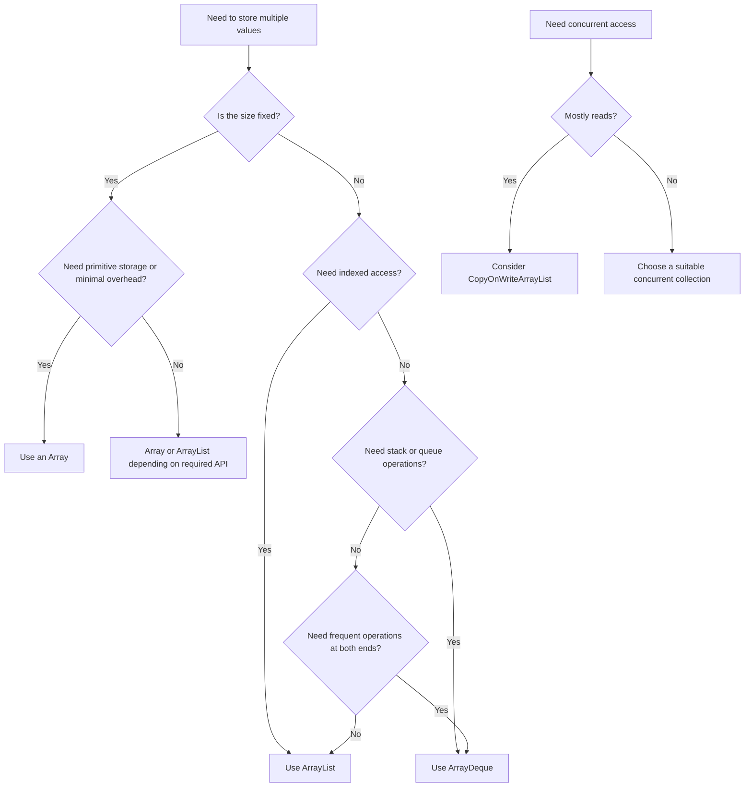

# Advanced Questions

## Question 1: Why are arrays often recommended from a performance perspective, and what are their disadvantages?

Arrays are often faster than general-purpose collections because they have a simple, contiguous structure and provide direct indexed access.

```java
int[] numbers = {10, 20, 30, 40};

int value = numbers[2]; // O(1)
```

### Performance advantages

- Accessing an element by index takes `O(1)` time.
- Primitive arrays store values directly without boxing.
- Arrays usually have lower memory overhead than collections.
- Their contiguous structure provides good CPU-cache locality.
- No dynamic-resizing logic is required.
- Iteration is generally efficient.

For example:

```java
int[] array = new int[1_000_000];
```

stores primitive `int` values directly. By comparison:

```java
List<Integer> list = new ArrayList<>();
```

stores `Integer` objects or references, which may introduce boxing and additional memory overhead.

### Disadvantages of arrays

1. **Fixed size**

   The length cannot be changed after creation.

   ```java
   int[] numbers = new int[5];
   ```

   To increase its capacity, a new array must be created and the existing elements copied.

2. **Size must be known or estimated**

   This can be difficult when the amount of data changes dynamically.

3. **Expensive insertion and deletion**

   Inserting or removing an element in the middle requires shifting other elements.

   ```text
   [10, 20, 30, 40]
           ↑ insert 25

   [10, 20, 25, 30, 40]
   ```

4. **Limited built-in operations**

   Arrays do not directly provide methods such as:
   - `add()`
   - `remove()`
   - `contains()`
   - `clear()`

5. **No generic type support**

   Arrays and generics follow different type-safety rules.

6. **Risk of invalid index access**

   ```java
   int[] numbers = new int[3];
   System.out.println(numbers[5]);
   ```

   This throws:

   ```text
   ArrayIndexOutOfBoundsException
   ```

### Interview conclusion

Use an array when:

- The size is known and fixed.
- Maximum performance is important.
- Primitive values need to be stored efficiently.
- Indexed access is the main operation.

Use a collection when:

- The size changes dynamically.
- Convenient insertion, deletion, searching, or sorting operations are required.
- The program benefits from collection abstractions such as `List`, `Set`, `Queue`, or `Map`.

---

## Question 2: What is the difference between arrays and collections in Java?

Here, **collections** refers to classes and interfaces in the Java Collections Framework, such as `List`, `Set`, `Queue`, `ArrayList`, and `HashSet`.

It should not be confused with the `java.util.Collections` utility class.

| Feature                     | Array                             | Collection                                                        |
| --------------------------- | --------------------------------- | ----------------------------------------------------------------- |
| Size                        | Fixed                             | Usually dynamically growable                                      |
| Stored values               | Primitives and object references  | Objects only                                                      |
| Type safety                 | Enforced by array type            | Enforced through generics                                         |
| Indexed access              | Directly supported                | Supported by `List` implementations                               |
| Built-in operations         | Limited                           | Rich APIs for adding, removing, searching, sorting, and filtering |
| Multidimensional structures | Directly supported                | Usually represented through nested collections                    |
| Performance                 | Usually lower overhead            | Some additional abstraction and memory overhead                   |
| Flexibility                 | Less flexible                     | More flexible                                                     |
| Data structures             | Basic indexed structure           | Lists, sets, queues, maps, deques and others                      |
| Generics                    | Arrays themselves are not generic | Collections support generics                                      |
| Size retrieval              | `array.length`                    | `collection.size()`                                               |

### Array example

```java
int[] numbers = {10, 20, 30};

System.out.println(numbers[1]); // 20
```

### Collection example

```java
List<Integer> numbers = new ArrayList<>();

numbers.add(10);
numbers.add(20);
numbers.add(30);

System.out.println(numbers.get(1)); // 20
```

### Can collections store heterogeneous objects?

A collection declared with a specific generic type stores compatible values:

```java
List<String> names = new ArrayList<>();
```

Only strings can be added.

A collection can technically store different object types when declared using `Object`:

```java
List<Object> values = new ArrayList<>();

values.add("Java");
values.add(100);
values.add(true);
```

However, heterogeneous collections normally reduce type safety and should be avoided unless the design genuinely requires them.

Therefore, the statement that collections are inherently heterogeneous or not type-safe is incorrect. Modern Java collections should normally use generics.

```java
List<String> languages = new ArrayList<>();
```

The Java Collections Framework includes element-based interfaces such as `List`, `Set`, and `Queue`, while `Map` remains separate because it represents key-value associations.

---

## Question 3: What is the difference between `ArrayList` and `Vector`?

Both `ArrayList` and `Vector` are resizable-array implementations that:

- Maintain insertion order
- Allow duplicate elements
- Allow `null`
- Provide indexed access
- Implement `List`
- Implement `RandomAccess`, `Cloneable`, and `Serializable`

However, their synchronization and intended usage differ.

| Feature            | `ArrayList`                     | `Vector`                                             |
| ------------------ | ------------------------------- | ---------------------------------------------------- |
| Internal structure | Resizable array                 | Resizable array                                      |
| Synchronization    | Not synchronized                | Methods are synchronized                             |
| Thread safety      | Not inherently thread-safe      | Individual operations are synchronized               |
| Performance        | Usually faster                  | Usually slower due to synchronization                |
| Status             | Preferred modern implementation | Legacy collection                                    |
| Growth behavior    | Grows automatically             | Can use capacity increment                           |
| Traversal          | `Iterator`, `ListIterator`      | `Iterator`, `ListIterator`, and legacy `Enumeration` |
| Introduced         | Java 1.2                        | Java 1.0                                             |
| Typical usage      | Normal list implementation      | Maintaining legacy code                              |

### `ArrayList` example

```java
List<String> languages = new ArrayList<>();

languages.add("Java");
languages.add("Go");
```

### `Vector` example

```java
Vector<String> languages = new Vector<>();

languages.add("Java");
languages.add("Go");
```

### Is `Vector` fully safe for compound operations?

Not necessarily.

Although individual methods are synchronized, a sequence of operations may still contain a race condition:

```java
if (!vector.isEmpty()) {
    String value = vector.get(0);
}
```

Another thread could modify the vector between `isEmpty()` and `get(0)` unless the complete operation is externally synchronized.

```java
synchronized (vector) {
    if (!vector.isEmpty()) {
        String value = vector.get(0);
    }
}
```

### Modern alternatives

For a synchronized list:

```java
List<String> list =
        Collections.synchronizedList(new ArrayList<>());
```

For read-heavy concurrent workloads:

```java
List<String> list = new CopyOnWriteArrayList<>();
```

`CopyOnWriteArrayList` is useful when reads greatly outnumber modifications. It is unsuitable for write-heavy workloads because each modification creates a new internal array.

### Interview conclusion

Use `ArrayList` as the normal default.

Avoid choosing `Vector` merely because synchronization is required. Select a concurrent collection based on the workload and required compound operations.

---

## Question 4: What is the difference between `ArrayList` and `LinkedList`?

`ArrayList` uses a resizable array, while `LinkedList` uses a doubly linked list.

| Feature                   | `ArrayList`      | `LinkedList`       |
| ------------------------- | ---------------- | ------------------ |
| Internal structure        | Resizable array  | Doubly linked list |
| Indexed access            | `O(1)`           | `O(n)`             |
| Iteration performance     | Usually faster   | Usually slower     |
| Memory overhead           | Lower            | Higher             |
| Cache locality            | Good             | Poor               |
| Add at end                | Amortized `O(1)` | `O(1)`             |
| Add at beginning          | `O(n)`           | `O(1)`             |
| Remove at beginning       | `O(n)`           | `O(1)`             |
| Insert by index           | `O(n)`           | `O(n)`             |
| Remove by index           | `O(n)`           | `O(n)`             |
| Implements `RandomAccess` | Yes              | No                 |
| Implements `Deque`        | No               | Yes                |
| Allows duplicates         | Yes              | Yes                |
| Allows `null`             | Yes              | Yes                |

### Why is indexed access slow in `LinkedList`?

To retrieve an element, the list must traverse its nodes.

```java
String value = linkedList.get(8_000);
```

This may require visiting thousands of nodes before reaching the requested element.

`ArrayList` directly calculates the element's array position:

```java
String value = arrayList.get(8_000);
```

Therefore, indexed access is `O(1)` for `ArrayList`.

### Is `LinkedList` always better for insertion and deletion?

No.

This is a common interview misconception.

Suppose an element must be inserted at index `5,000`:

```java
linkedList.add(5_000, value);
```

Although linking the new node is inexpensive, finding index `5,000` still requires traversal. Therefore, the total operation is `O(n)`.

`LinkedList` is most useful when:

- Operations frequently occur at the beginning or end.
- It is used through the `Deque` interface.
- The insertion position has already been reached using an iterator.

### Example using `ListIterator`

```java
ListIterator<String> iterator = linkedList.listIterator();

while (iterator.hasNext()) {
    if (iterator.next().equals("Java")) {
        iterator.add("Spring");
        break;
    }
}
```

Once the iterator is at the correct location, insertion can be performed without shifting an array.

### Memory consideration

Each `LinkedList` element requires a node containing:

- The element reference
- A reference to the previous node
- A reference to the next node

An `ArrayList` normally stores only element references in its backing array. As a result, it generally consumes less memory.

The advanced Collections material also emphasizes that data-structure choice should consider traversal, safe removal, fail-fast behavior, sorting requirements, generics, immutability, and concurrency—not only insertion complexity.

### Interview conclusion

Choose `ArrayList` when:

- Indexed access is frequent.
- Iteration performance matters.
- Memory usage matters.
- Most operations append to the end.
- The collection is used as a normal list.

Choose `LinkedList` when:

- Frequent operations occur at both ends.
- `Deque` behavior is needed.
- Elements are inserted or removed through an iterator at a known position.

For stack or queue behavior, `ArrayDeque` is usually preferred over both `LinkedList` and the legacy `Stack` class.

---

## Quick Selection Guide


