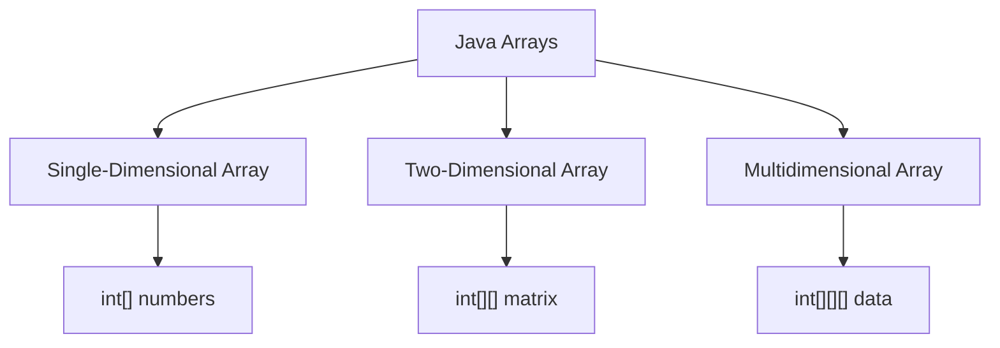

# Basic Questions — Arrays and Array-Based Collections

## Question 1: What is an array in Java?

An array is an object that stores a **fixed number of elements of the same type**.

The elements are stored using zero-based indexes:

```java
int[] numbers = {10, 20, 30};

System.out.println(numbers[0]); // 10
System.out.println(numbers[1]); // 20
```

### Key characteristics

- Its size is fixed when the array is created.
- It can store primitive values or object references.
- Elements are accessed using an index.
- Indexing starts at `0`.
- Invalid indexes cause an `ArrayIndexOutOfBoundsException`.
- Reference-type arrays can contain `null`.
- Primitive arrays receive default values such as `0`, `false`, or `'\u0000'`.

---

## Question 2: How do you declare and initialize an array in Java?

### Declaration

```java
int[] numbers;
String[] names;
```

The following syntax is also valid, but less commonly preferred:

```java
int numbers[];
```

### Initialization with a fixed size

```java
int[] numbers = new int[5];
```

This creates an array containing five integers, all initialized to `0`.

### Initialization with values

```java
int[] numbers = {10, 20, 30, 40};
String[] cars = {"Volvo", "BMW", "Ford", "Mazda"};
```

### Iterating with a traditional `for` loop

```java
for (int i = 0; i < numbers.length; i++) {
    System.out.println(numbers[i]);
}
```

### Iterating with an enhanced `for` loop

```java
for (int number : numbers) {
    System.out.println(number);
}
```

Use a traditional `for` loop when the index is required. Use an enhanced `for` loop when only the values are needed.

---

## Question 3: How do you find the length of an array?

Java arrays provide a `length` field:

```java
int[] numbers = new int[5];

System.out.println(numbers.length); // 5
```

Notice that `length` is a field, not a method:

```java
numbers.length;   // Correct
numbers.length(); // Incorrect
```

An array's length cannot be changed after the array has been created.

Although an array length is represented by an `int`, the actual maximum array size depends on factors such as:

- Available heap memory
- JVM implementation
- Element type
- Object and array header overhead

Therefore, an application should not assume that it can create an array with `Integer.MAX_VALUE` elements.

---

## Question 4: What are the types of arrays in Java?

Java commonly uses the following array structures:

1. Single-dimensional arrays
2. Two-dimensional arrays
3. Multidimensional arrays



### Single-dimensional array

```java
int[] numbers = {10, 20, 30};
```

### Two-dimensional array

```java
int[][] matrix = {
    {1, 2},
    {3, 4}
};
```

### Three-dimensional array

```java
int[][][] data = new int[2][3][4];
```

Java implements multidimensional arrays as **arrays of arrays**. Therefore, rows can have different lengths.

```java
int[][] irregular = {
    {1, 2},
    {3, 4, 5},
    {6}
};
```

This is called a **jagged array**.

---

## Question 5: What are the advantages and limitations of arrays?

### Advantages

- Fast indexed access: `O(1)`
- Can store primitive values directly
- Lower overhead than many collection classes
- Useful when the required size is known
- Supports multidimensional data structures

### Limitations

- The size is fixed after creation.
- Inserting or removing elements may require shifting other elements.
- Arrays do not provide high-level methods such as `add()`, `remove()`, or `contains()`.
- The required size often needs to be estimated in advance.
- Arrays do not work directly with the Java Collections Framework.

When the number of elements changes frequently, an `ArrayList` is often more convenient.

---

## Question 6: What is an `ArrayList` in Java?

`ArrayList` is a resizable-array implementation of the `List` interface.

It is available in the `java.util` package:

```java
import java.util.ArrayList;
```

Example:

```java
ArrayList<String> languages = new ArrayList<>();

languages.add("Java");
languages.add("Go");
languages.add("Python");
```

Unlike an array, an `ArrayList` can grow and shrink dynamically.

Internally, it maintains an array. When the internal array becomes full, the `ArrayList` creates a larger array and copies the existing elements into it.

### Important characteristics

- Maintains insertion order
- Allows duplicate elements
- Allows `null` values
- Provides fast indexed access
- Automatically resizes
- Stores objects rather than primitive values directly
- Is not thread-safe

Primitive values can still be used through wrapper classes and autoboxing:

```java
ArrayList<Integer> numbers = new ArrayList<>();

numbers.add(10); // int is autoboxed to Integer
```

---

## Question 7: How do you create and manipulate an `ArrayList`?

```java
import java.util.ArrayList;
import java.util.List;

public class Main {
    public static void main(String[] args) {
        List<String> languages = new ArrayList<>();

        languages.add("Java");
        languages.add("Python");
        languages.add("Go");

        System.out.println(languages.get(0)); // Java

        languages.set(1, "JavaScript");
        languages.remove("Go");

        System.out.println(languages.size());       // 2
        System.out.println(languages.contains("Java")); // true
        System.out.println(languages.isEmpty());   // false
    }
}
```

### Common methods

| Method                | Purpose                            |
| --------------------- | ---------------------------------- |
| `add(element)`        | Adds an element                    |
| `add(index, element)` | Inserts an element at an index     |
| `get(index)`          | Retrieves an element               |
| `set(index, element)` | Replaces an element                |
| `remove(index)`       | Removes an element by index        |
| `remove(object)`      | Removes the first matching element |
| `contains(object)`    | Checks whether an element exists   |
| `size()`              | Returns the number of elements     |
| `isEmpty()`           | Checks whether the list is empty   |
| `clear()`             | Removes all elements               |

---

## Question 8: What is the difference between an array and an `ArrayList`?

| Feature                    | Array                       | `ArrayList`                           |
| -------------------------- | --------------------------- | ------------------------------------- |
| Size                       | Fixed                       | Dynamically resizable                 |
| Stores primitives          | Yes                         | No, uses wrapper classes              |
| Stores objects             | Yes                         | Yes                                   |
| Access syntax              | `array[index]`              | `list.get(index)`                     |
| Update syntax              | `array[index] = value`      | `list.set(index, value)`              |
| Length or size             | `array.length`              | `list.size()`                         |
| Generics                   | No                          | Yes                                   |
| Add/remove methods         | No                          | Yes                                   |
| Null values                | Allowed in reference arrays | Allowed                               |
| Multidimensional structure | Directly supported          | Can use nested lists                  |
| Performance                | Usually lower overhead      | More flexible, with resizing overhead |

Example of a nested `ArrayList`:

```java
List<List<Integer>> matrix = new ArrayList<>();

matrix.add(new ArrayList<>(List.of(1, 2)));
matrix.add(new ArrayList<>(List.of(3, 4)));
```

Therefore, it is incorrect to say that an `ArrayList` can only represent single-dimensional data.

---

## Question 9: What is the purpose of the `toArray()` method?

The `toArray()` method converts a collection into an array.

### Returning an `Object[]`

```java
List<String> names = List.of("Alice", "Bob");

Object[] array = names.toArray();
```

### Returning a typed array

```java
List<String> names = List.of("Alice", "Bob");

String[] array = names.toArray(new String[0]);
```

Complete example:

```java
import java.util.ArrayList;
import java.util.List;

public class Main {
    public static void main(String[] args) {
        List<String> words = new ArrayList<>();

        words.add("Hello");
        words.add("World");

        String[] array = words.toArray(new String[0]);

        for (String word : array) {
            System.out.println(word);
        }
    }
}
```

Output:

```text
Hello
World
```

The method name is `toArray()`, not `ToArray()` because Java method names normally use lower camel case.

---

## Question 10: Differentiate between `ArrayList` and `LinkedList`.

| Feature                    | `ArrayList`                       | `LinkedList`                 |
| -------------------------- | --------------------------------- | ---------------------------- |
| Internal structure         | Resizable array                   | Doubly linked list           |
| Indexed access             | `O(1)`                            | `O(n)`                       |
| Append at end              | Amortized `O(1)`                  | `O(1)`                       |
| Insert/remove at beginning | `O(n)`                            | `O(1)`                       |
| Insert/remove by index     | `O(n)`                            | `O(n)` due to traversal      |
| Memory usage               | Lower                             | Higher because of node links |
| Cache locality             | Better                            | Poorer                       |
| Implements                 | `List`, `RandomAccess`            | `List`, `Deque`              |
| Best use case              | Frequent reads and indexed access | Frequent deque operations    |

A common oversimplification is that `LinkedList` is always better for insertions and deletions. Finding the required position still takes `O(n)` when an index is used.

In most application code, `ArrayList` should be the default choice because it:

- Uses less memory
- Provides fast indexed access
- Has better CPU-cache locality
- Often performs better during iteration

Use `LinkedList` mainly when deque operations at both ends are required. Even then, `ArrayDeque` is often a better choice.

---

## Question 11: Why is `ArrayDeque` often preferred over `Stack`?

`Stack` is a legacy class that extends `Vector`. Its methods are synchronized, which adds overhead when thread safety is not required.

`ArrayDeque` is generally preferred for implementing stacks and queues.

### Using `ArrayDeque` as a stack

```java
import java.util.ArrayDeque;
import java.util.Deque;

public class Main {
    public static void main(String[] args) {
        Deque<String> stack = new ArrayDeque<>();

        stack.push("A");
        stack.push("B");
        stack.push("C");

        System.out.println(stack.peek()); // C
        System.out.println(stack.pop());  // C
    }
}
```

### Comparison

| Feature                   | `ArrayDeque`             | `Stack`              |
| ------------------------- | ------------------------ | -------------------- |
| Status                    | Modern collection        | Legacy collection    |
| Structure                 | Resizable circular array | Extends `Vector`     |
| Synchronization           | Not synchronized         | Synchronized         |
| Typical performance       | Faster                   | Usually slower       |
| Supports stack operations | Yes                      | Yes                  |
| Supports queue operations | Yes                      | No                   |
| Allows `null`             | No                       | Yes, but discouraged |

Use the interface type when declaring it:

```java
Deque<String> stack = new ArrayDeque<>();
```

For thread-safe concurrent deque operations, consider classes such as `ConcurrentLinkedDeque` or `LinkedBlockingDeque` instead of `Stack`.
