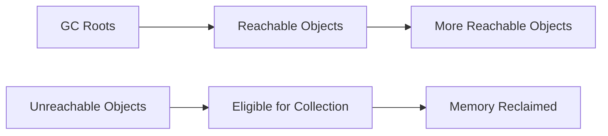

# Core Java and Language Features — Interview Questions

## 1. What are the new features in Java 17?

A strong interview answer should distinguish features **introduced in Java 17** from features that were introduced earlier but are commonly used in Java 17 projects.

### Major features introduced or finalized in Java 17

#### Sealed classes

Sealed classes and interfaces restrict which types may extend or implement them.

```java
public sealed interface PaymentResult
        permits PaymentSuccess, PaymentFailure {
}

public final class PaymentSuccess
        implements PaymentResult {
}

public final class PaymentFailure
        implements PaymentResult {
}
```

A permitted subtype must be declared as:

- `final`
- `sealed`
- `non-sealed`

Sealed classes became a permanent language feature in Java 17. ([OpenJDK][1])

#### Pattern matching for `switch` — preview

Java 17 introduced pattern matching for `switch` as a preview feature:

```java
static String describe(Object value) {
    return switch (value) {
        case Integer number ->
                "Integer: " + number;
        case String text ->
                "String: " + text;
        default ->
                "Unknown";
    };
}
```

Because it was a preview feature in Java 17, compilation required preview flags. It became permanent in a later Java release. ([OpenJDK][2])

### Other important Java 17 platform changes

Java 17 also included:

- Enhanced pseudo-random number generators
- Strong encapsulation of JDK internals
- Context-specific deserialization filters
- Always-strict floating-point semantics
- macOS/AArch64 support
- Deprecation of the Security Manager for removal
- Removal of RMI Activation
- Incubator versions of the Vector API and Foreign Function and Memory API ([OpenJDK][1])

### Features available in Java 17 but introduced earlier

These are often called “Java 17 features” in interviews, although they were finalized before Java 17:

| Feature                                  | Finalized in |
| ---------------------------------------- | -----------: |
| Records                                  |      Java 16 |
| Pattern matching for `instanceof`        |      Java 16 |
| Text blocks                              |      Java 15 |
| Switch expressions                       |      Java 14 |
| Local-variable type inference with `var` |      Java 10 |

Records were finalized in Java 16, not Java 17. ([OpenJDK][3])

### Interview-ready answer

> Java 17’s major language feature was sealed classes. It also introduced pattern matching for `switch` as a preview. Other platform changes included stronger encapsulation of JDK internals, enhanced random-number-generator APIs, deserialization filters, and macOS/AArch64 support. Records, text blocks, switch expressions, and `var` are available in Java 17 but were introduced in earlier releases.

---

## 2. What is the `var` keyword? Can it be used as a generic type?

`var` enables **local-variable type inference**. The compiler determines the static type from the initializer.

```java
var name = "Alice";                // String
var count = 10;                    // int
var users = new ArrayList<User>(); // ArrayList<User>
```

Java remains statically typed. `var` does not mean the variable can change type:

```java
var value = "Java";

// value = 100; // Compilation error
```

`var` is technically a reserved type name rather than a general-purpose keyword. It is restricted to local variables with initializers and certain loop variables. ([OpenJDK][3])

### Can `var` represent a generic type?

It can **infer** a parameterized type:

```java
var names = new ArrayList<String>();
```

The inferred type is:

```java
ArrayList<String>
```

But `var` cannot itself be used as a generic type argument:

```java
// List<var> values; // Invalid
// var<String> value; // Invalid
```

### Where can `var` be used?

```java
var user = new User();

for (var order : orders) {
    System.out.println(order);
}

for (var index = 0; index < 10; index++) {
    System.out.println(index);
}
```

### Where can it not be used?

```java
class UserService {

    // private var repository;        // Invalid field
    // public var findUser() { }      // Invalid return type
    // void save(var user) { }        // Invalid parameter
}
```

It also requires an initializer:

```java
// var value;        // Invalid
// var value = null; // Invalid
```

### Interview-ready answer

> `var` performs compile-time local-variable type inference. It does not make Java dynamically typed. It can infer a generic type from an initializer such as `new ArrayList<String>()`, but it cannot be used as a type argument like `List<var>`. It is restricted to local variables and loop variables with inferable initializers.

---

## 3. What is an effectively final variable?

An effectively final variable is a local variable or parameter that is not declared with `final` but is assigned only once.

```java
String prefix = "ORDER-";

orders.forEach(order ->
        System.out.println(prefix + order.id())
);
```

`prefix` is effectively final because it is never reassigned.

This would fail:

```java
String prefix = "ORDER-";
prefix = "NEW-";

orders.forEach(order ->
        System.out.println(prefix + order.id())
);
```

Variables captured by lambdas, local classes, or anonymous classes must be final or effectively final. The Java Language Specification defines an effectively final variable as one where adding `final` would not create a compilation error. ([Oracle Documentation][4])

### Effectively final reference vs immutable object

The referenced object may still be mutable:

```java
List<String> names = new ArrayList<>();

names.add("Alice");
names.add("Bob");
```

`names` may remain effectively final because the reference is not reassigned, even though the list itself changes.

```java
// names = new ArrayList<>(); // Reassignment breaks effective finality
```

### Interview-ready answer

> An effectively final variable is not explicitly marked `final`, but it is assigned only once. Such variables can be captured by lambdas and inner classes. Effective finality applies to the variable reference, not necessarily to the mutability of the referenced object.

---

## 4. What is a record, and how do you store query results in records?

A record is a concise data-carrier class.

```java
public record UserRow(
        long id,
        String name,
        String email
) {
}
```

The compiler provides:

- Private final component fields
- A canonical constructor
- Accessor methods
- `equals()`
- `hashCode()`
- `toString()`

Records were finalized in Java 16 and are fully available in Java 17. They are intended to model transparent carriers for data. ([OpenJDK][5])

### Accessing record data

Record accessors do not use JavaBean-style `get` prefixes:

```java
UserRow user =
        new UserRow(
                1L,
                "Alice",
                "alice@example.com"
        );

System.out.println(user.id());
System.out.println(user.name());
```

### Mapping database query results

One record instance can represent one database row:

```java
public record UserRow(
        long id,
        String name,
        String email
) {
}
```

Multiple query rows are stored in a list:

```java
List<UserRow> users = jdbcTemplate.query(
        """
        SELECT id, name, email
        FROM users
        ORDER BY id
        """,
        (resultSet, rowNumber) ->
                new UserRow(
                        resultSet.getLong("id"),
                        resultSet.getString("name"),
                        resultSet.getString("email")
                )
);
```

### Fetching the first record

```java
Optional<UserRow> firstUser =
        users.stream().findFirst();
```

Usage:

```java
UserRow user = firstUser.orElseThrow(
        () -> new UserNotFoundException(
                "No users found"
        )
);
```

Or:

```java
users.stream()
        .findFirst()
        .ifPresent(System.out::println);
```

When only one row is required, it is usually more efficient to limit the query at the database or repository level instead of loading every row:

```sql
SELECT id, name, email
FROM users
ORDER BY id
FETCH FIRST 1 ROW ONLY
```

The exact limiting syntax depends on the database.

### Record immutability is shallow

```java
public record Team(List<String> members) {
}
```

The component reference cannot be reassigned, but the supplied list may still be mutable.

Use a defensive copy:

```java
public record Team(List<String> members) {

    public Team {
        members = List.copyOf(members);
    }
}
```

### Interview-ready answer

> A record is a concise data-carrier class that automatically provides component fields, accessors, construction, equality, hashing, and string representation. For query results, I map each database row to one record and store multiple records in a `List<RecordType>`. I can retrieve the first with `stream().findFirst()`, although I prefer limiting the database query when only one row is required.

---

## 5. What is the `Optional` class?

`Optional<T>` represents a value that may or may not be present.

```java
Optional<User> user =
        userRepository.findById(userId);
```

It makes absence explicit instead of returning `null`. Oracle describes it as a value-based container that may contain a non-null value. ([Oracle Documentation][6])

### Creating optionals

```java
Optional<String> empty =
        Optional.empty();

Optional<String> present =
        Optional.of("Java");

Optional<String> nullable =
        Optional.ofNullable(possiblyNullValue);
```

`Optional.of(null)` throws `NullPointerException`.

### Common operations

```java
User user = optionalUser.orElseThrow(
        () -> new UserNotFoundException(userId)
);
```

```java
String name = optionalUser
        .map(User::name)
        .orElse("Unknown");
```

```java
optionalUser.ifPresent(
        user -> notificationService.notify(user)
);
```

### `orElse()` vs `orElseGet()`

`orElse()` evaluates its argument immediately:

```java
User user =
        optionalUser.orElse(createDefaultUser());
```

`orElseGet()` evaluates lazily:

```java
User user =
        optionalUser.orElseGet(
                this::createDefaultUser
        );
```

Use `orElseGet()` when producing the fallback is expensive.

### Recommended use

Good use:

```java
Optional<User> findById(long id);
```

Usually avoid using `Optional` as:

- A method parameter
- An entity field
- A DTO field
- A collection element
- A replacement for every null check

Collections should normally return an empty collection rather than `Optional<List<T>>`.

### Interview-ready answer

> `Optional` is a container representing the presence or absence of a non-null value. It is mainly useful as a return type when absence is valid. Methods such as `map`, `flatMap`, `orElseGet`, and `orElseThrow` allow callers to handle absence explicitly.

---

## 6. What is a checked exception? What are its advantages and disadvantages?

A checked exception is an `Exception` subtype that is not a subtype of `RuntimeException`.

Examples:

```java
IOException
SQLException
ClassNotFoundException
InterruptedException
```

The compiler enforces the catch-or-declare rule:

```java
String readFile(Path path) throws IOException {
    return Files.readString(path);
}
```

The caller must catch it:

```java
try {
    String content = readFile(path);
} catch (IOException exception) {
    handleFileFailure(exception);
}
```

or declare it:

```java
void loadConfiguration() throws IOException {
    readFile(configurationPath);
}
```

Checked exceptions still occur at runtime. The compiler only verifies that the code acknowledges them. ([Oracle Documentation][7])

### Advantages

- Makes expected failure modes visible in method signatures
- Forces callers to acknowledge certain failures
- Can be useful when callers can recover meaningfully
- Documents failure behavior as part of an API contract

### Disadvantages

- Can introduce repetitive `throws` declarations
- May leak low-level implementation details across layers
- Can lead to broad, meaningless catch blocks
- Makes lambda and stream code more difficult
- Callers may wrap exceptions only to satisfy the compiler
- Changing exception types may affect many method signatures

### Practical rule

Use a checked exception when:

- Recovery is realistic
- The failure is part of the API contract
- Every caller should explicitly consider it

Use an unchecked exception when:

- The caller violated a contract
- The application entered an invalid state
- A domain exception should propagate to a centralized boundary
- Intermediate layers cannot meaningfully recover

### Interview-ready answer

> A checked exception must be caught or declared. Its advantage is that recoverable failures become explicit in the API contract. Its disadvantage is additional boilerplate and coupling through multiple layers. I use checked exceptions when callers can reasonably recover and unchecked exceptions for invalid state, invalid arguments, and domain failures handled at an application boundary.

---

## 7. What is exception handling, and what is Controller Advice?

Exception handling is Java’s mechanism for detecting, propagating, handling, and translating abnormal runtime conditions.

```java
try {
    paymentService.process(request);
} catch (PaymentRejectedException exception) {
    handleRejection(exception);
} finally {
    releaseResources();
}
```

Main constructs include:

- `try`
- `catch`
- `finally`
- `throw`
- `throws`
- Try-with-resources

### `@ControllerAdvice`

The correct Spring term is **Controller Advice**, represented by:

```java
@ControllerAdvice
```

For REST APIs, use:

```java
@RestControllerAdvice
```

`@RestControllerAdvice` combines `@ControllerAdvice` and `@ResponseBody`, so handler return values are written to the HTTP response body. Spring applies advice globally by default, although it can be narrowed to selected controllers. ([Home][8])

### Example

```java
@RestControllerAdvice
public class GlobalExceptionHandler {

    @ExceptionHandler(UserNotFoundException.class)
    public ResponseEntity<ApiError> handleNotFound(
            UserNotFoundException exception,
            HttpServletRequest request
    ) {
        ApiError error = new ApiError(
                "USER_NOT_FOUND",
                exception.getMessage(),
                request.getRequestURI()
        );

        return ResponseEntity
                .status(HttpStatus.NOT_FOUND)
                .body(error);
    }

    @ExceptionHandler(Exception.class)
    public ResponseEntity<ApiError> handleUnexpected(
            Exception exception,
            HttpServletRequest request
    ) {
        ApiError error = new ApiError(
                "INTERNAL_SERVER_ERROR",
                "An unexpected error occurred",
                request.getRequestURI()
        );

        return ResponseEntity
                .status(HttpStatus.INTERNAL_SERVER_ERROR)
                .body(error);
    }
}
```

Spring also provides `ResponseEntityExceptionHandler` as a convenient base class for handling standard Spring MVC exceptions. ([Home][9])

### Benefits

- Thin controllers
- Consistent error response format
- Centralized HTTP-status mapping
- Safer client-facing error messages
- Centralized logging and correlation IDs
- Less repetitive `try-catch` code

### Interview-ready answer

> Exception handling separates normal logic from failure handling. In Spring, `@ControllerAdvice` centralizes exception handling across controllers, while `@RestControllerAdvice` also writes the returned error object into the response body. I use specific handlers for domain and validation errors and a final generic handler for unexpected failures.

---

## 8. Reverse a string without using predefined reverse methods

This usually means reversing without using:

```java
StringBuilder.reverse()
Collections.reverse()
```

### Basic implementation

```java
public static String reverse(String value) {
    if (value == null) {
        return null;
    }

    char[] reversed = new char[value.length()];

    for (
            int source = value.length() - 1,
            target = 0;
            source >= 0;
            source--, target++
    ) {
        reversed[target] = value.charAt(source);
    }

    return new String(reversed);
}
```

Example:

```java
System.out.println(reverse("Java"));
// avaJ
```

### In-place two-pointer algorithm

```java
public static String reverse(String value) {
    if (value == null) {
        return null;
    }

    char[] characters = value.toCharArray();

    int left = 0;
    int right = characters.length - 1;

    while (left < right) {
        char temporary = characters[left];
        characters[left] = characters[right];
        characters[right] = temporary;

        left++;
        right--;
    }

    return new String(characters);
}
```

Complexity:

| Measurement      | Complexity |
| ---------------- | ---------: |
| Time             |     `O(n)` |
| Additional space |     `O(n)` |

### Unicode limitation

This reverses UTF-16 `char` values and may split surrogate pairs such as some emoji. A production-quality Unicode reversal may need to operate on code points or grapheme clusters rather than individual `char` values.

### Interview-ready answer

> I copy the characters into an array and swap elements from both ends using two pointers. The algorithm takes `O(n)` time and `O(n)` space because Java strings are immutable.

---

## 9. Can `HashMap` keys be mutable?

Technically, yes. However, a key should not be mutated in a way that changes its `equals()` or `hashCode()` result after insertion.

`HashMap` uses the key’s hash code to select a bucket and uses equality to identify the matching key. ([Oracle Documentation][10])

### Problem example

```java
public final class UserKey {

    private String username;

    public UserKey(String username) {
        this.username = username;
    }

    public void setUsername(String username) {
        this.username = username;
    }

    @Override
    public boolean equals(Object object) {
        if (this == object) {
            return true;
        }

        if (!(object instanceof UserKey other)) {
            return false;
        }

        return Objects.equals(
                username,
                other.username
        );
    }

    @Override
    public int hashCode() {
        return Objects.hash(username);
    }
}
```

```java
UserKey key = new UserKey("alice");

Map<UserKey, String> map =
        new HashMap<>();

map.put(key, "Account data");

key.setUsername("bob");

System.out.println(map.get(key));
// May return null
```

The entry may remain in the bucket selected using the old hash code, while lookup uses the new hash code.

### Safe solution

Use immutable keys:

```java
public record UserKey(String username) {
}
```

```java
Map<UserKey, String> map =
        new HashMap<>();
```

Mutating a field that is not involved in `equals()` or `hashCode()` does not directly break the bucket lookup, but immutable keys remain the safest design.

### Interview-ready answer

> A mutable object can technically be a `HashMap` key, but fields used by `equals()` and `hashCode()` must not change while the key is in the map. Otherwise, the map may no longer find or remove the entry. I therefore prefer immutable key types such as strings, immutable value objects, or records.

---

# Core Java, JVM, and Concurrency

## 10. What is the difference between the `final` keyword and a final variable?

`final` is a Java modifier. A **final variable** is one specific use of that modifier.

### Final variable

A final variable can be assigned only once:

```java
final int maximumRetries = 3;

// maximumRetries = 5; // Compilation error
```

### Final reference

```java
final List<String> names =
        new ArrayList<>();

names.add("Alice"); // Allowed

// names = new ArrayList<>(); // Not allowed
```

The reference cannot be reassigned, but the object may still be mutable.

### Final method

```java
public final void validate() {
}
```

A final method cannot be overridden.

### Final class

```java
public final class SecurityToken {
}
```

A final class cannot be extended.

### Blank final variable

A final field may be initialized in the constructor:

```java
public final class User {

    private final long id;

    public User(long id) {
        this.id = id;
    }
}
```

### Interview-ready answer

> `final` is a modifier applicable to variables, methods, and classes. A final variable can be assigned once, a final method cannot be overridden, and a final class cannot be extended. A final object reference does not make the referenced object immutable.

---

## 11. What is garbage collection in Java?

Garbage collection automatically reclaims heap memory occupied by objects that are no longer reachable from GC roots.

Common GC roots include:

- Active thread stacks
- Static fields
- JNI references
- JVM internal references

```java
User user = new User();
user = null;
```

The original object may become eligible for garbage collection if no other reachable reference points to it.

Garbage collection is based on reachability, not merely on whether one particular variable becomes `null`. Oracle’s memory troubleshooting guidance distinguishes normal memory use from objects unintentionally retained by reachable references. ([Oracle Documentation][11])

### Simplified process



The collector may:

1. Trace reachable objects.
2. Identify unreachable objects.
3. Reclaim their memory.
4. Relocate or compact surviving objects.
5. Perform work concurrently or during pauses, depending on the collector.

Garbage collection manages memory, not arbitrary resources such as files, sockets, and database connections. Use try-with-resources for those.

### Interview-ready answer

> Garbage collection identifies heap objects that are no longer reachable from GC roots and reclaims their memory. Different collectors optimize for throughput, latency, and memory overhead. GC handles Java memory, but resources such as files and connections require explicit cleanup.

---

## 12. How do you debug and fix `OutOfMemoryError`?

Start with the exact error message because different messages point to different memory areas.

Examples:

```text
OutOfMemoryError: Java heap space
OutOfMemoryError: Metaspace
OutOfMemoryError: Direct buffer memory
OutOfMemoryError: unable to create native thread
GC overhead limit exceeded
```

Oracle recommends identifying whether the problem is in the Java heap or native memory before selecting diagnostic steps. ([Oracle Documentation][11])

### Step 1: Capture diagnostics

Useful JVM options:

```bash
-XX:+HeapDumpOnOutOfMemoryError
-XX:HeapDumpPath=/var/log/application/heapdump.hprof
```

Useful commands:

```bash
jcmd <pid> GC.heap_info
jcmd <pid> GC.class_histogram
jcmd <pid> VM.native_memory summary
jcmd <pid> Thread.print
```

### Step 2: Analyze the heap dump

Tools include:

- Eclipse Memory Analyzer
- Java Flight Recorder
- JDK Mission Control
- VisualVM
- Commercial profilers

Inspect:

- Dominator tree
- Retained size
- Paths to GC roots
- Growing collections
- Static references
- Thread-local values
- Class-loader retention
- Duplicate objects

### Step 3: Identify the retention path

Example:

```text
Static field
  → cache
    → HashMap
      → entry
        → large response graph
```

### Step 4: Fix the actual cause

Possible fixes:

- Bound caches and queues
- Add eviction policies
- Remove listeners
- Clear `ThreadLocal` values
- Stream files instead of loading them entirely
- Fix class-loader leaks
- Reduce retained session data
- Close native resources
- Correct excessive thread creation
- Increase heap only when the application legitimately needs it

### Important principle

Do not immediately increase `-Xmx`. A larger heap may only delay failure and increase collection cost when the real issue is an unbounded data structure or memory leak.

### Interview-ready answer

> I first inspect the exact `OutOfMemoryError` type, enable heap dumps and GC logs, and collect JFR or class-histogram data. I analyze retained objects and paths to GC roots, correlate growth with application behavior, fix the retaining reference or unbounded resource, and only then adjust memory sizing if the live data set genuinely requires it.

---

## 13. What are atomic variables?

Atomic variables provide thread-safe, lock-free-style operations on individual values.

Common classes include:

```java
AtomicInteger
AtomicLong
AtomicBoolean
AtomicReference<T>
AtomicStampedReference<T>
LongAdder
LongAccumulator
```

The `java.util.concurrent.atomic` package supports atomic read-modify-write operations for single variables. ([Oracle Documentation][12])

### Example

```java
AtomicInteger counter =
        new AtomicInteger();

counter.incrementAndGet();
counter.addAndGet(5);

int current = counter.get();
```

### Compare-and-set

```java
boolean updated =
        counter.compareAndSet(
                5,
                10
        );
```

Conceptually:

```text
If current value equals expected value:
    replace it with new value
otherwise:
    report failure
```

### Atomic does not mean every workflow is atomic

```java
if (balance.get() >= amount) {
    balance.addAndGet(-amount);
}
```

The check and update are separate operations. Another thread may change the balance between them.

Use a CAS loop, lock, or synchronized domain operation when protecting a multi-step invariant.

### `AtomicLong` vs `LongAdder`

- `AtomicLong` gives a precise atomic value at every operation.
- `LongAdder` can scale better under heavy contention for statistics and counters.
- A `LongAdder.sum()` result is not a transactional snapshot during concurrent updates.

### Interview-ready answer

> Atomic variables provide atomic single-variable operations such as increment, update, and compare-and-set without using an explicit lock. They are useful for counters, flags, and references, but they do not automatically make multi-variable or multi-step business operations atomic.

---

## 14. What is the `volatile` keyword?

`volatile` tells the JVM that reads and writes of a field require specific visibility and ordering guarantees between threads.

```java
public final class Worker {

    private volatile boolean running = true;

    public void run() {
        while (running) {
            performWork();
        }
    }

    public void stop() {
        running = false;
    }
}
```

A write to a volatile variable happens-before a later read of that variable. The Java Memory Model defines these synchronization and visibility relationships. ([Oracle Documentation][13])

### What `volatile` provides

- Visibility of writes between threads
- Ordering guarantees around volatile accesses
- Atomic reads and writes for the volatile field itself

### What it does not provide

It does not make compound operations atomic:

```java
private volatile int count;

count++;
```

`count++` consists of:

1. Read
2. Increment
3. Write

Multiple threads can lose updates.

Use:

```java
AtomicInteger count =
        new AtomicInteger();

count.incrementAndGet();
```

### Good use cases

- Shutdown flags
- Configuration snapshots
- Published immutable references
- Simple state indicators
- Double-checked locking with correct implementation

### Interview-ready answer

> `volatile` provides visibility and ordering guarantees for a shared field. A write becomes visible to subsequent volatile reads, but volatile does not provide mutual exclusion or make compound operations such as `count++` atomic.

---

## 15. What is the difference between `volatile` and `synchronized`?

| Feature                      | `volatile`                    | `synchronized`                   |
| ---------------------------- | ----------------------------- | -------------------------------- |
| Visibility                   | Yes                           | Yes                              |
| Ordering                     | Yes                           | Yes                              |
| Mutual exclusion             | No                            | Yes                              |
| Protects multiple statements | No                            | Yes                              |
| Compound-operation atomicity | No                            | Yes, within the critical section |
| Lock contention              | No monitor acquisition        | May block on a monitor           |
| Typical use                  | Flags and immutable snapshots | Shared mutable invariants        |

### `volatile` example

```java
private volatile boolean shutdownRequested;
```

Suitable when one thread writes a flag and others read it.

### `synchronized` example

```java
public synchronized void withdraw(
        BigDecimal amount
) {
    if (amount.compareTo(balance) > 0) {
        throw new InsufficientFundsException();
    }

    balance = balance.subtract(amount);
}
```

The balance check and update must execute atomically as one critical section.

Both constructs establish Java Memory Model synchronization relationships, but only `synchronized` provides monitor-based mutual exclusion. ([Oracle Documentation][13])

### Interview-ready answer

> `volatile` provides visibility and ordering for one shared field but does not lock or protect compound operations. `synchronized` provides both visibility and mutual exclusion, making it suitable for multi-step invariants and shared mutable state.

---

## 16. How do you avoid performance problems caused by synchronization?

### Keep critical sections small

Avoid locking unrelated work:

```java
public void process(Order order) {
    ValidationResult result = validate(order);

    synchronized (lock) {
        updateSharedState(result);
    }

    publishEvent(result);
}
```

Do not perform slow I/O while holding a lock:

```java
synchronized (lock) {
    externalPaymentGateway.call(); // Avoid
}
```

### Prefer thread confinement

Use local variables and avoid sharing mutable objects:

```java
public String format(Order order) {
    StringBuilder builder =
            new StringBuilder();

    return builder
            .append(order.id())
            .append(':')
            .append(order.status())
            .toString();
}
```

### Use higher-level concurrency utilities

Depending on the requirement:

```java
ConcurrentHashMap
BlockingQueue
AtomicInteger
LongAdder
Semaphore
CountDownLatch
CompletableFuture
ReadWriteLock
StampedLock
```

### Other techniques

- Use immutable objects
- Partition state to reduce contention
- Apply lock striping
- Avoid unnecessary nested locking
- Acquire multiple locks in a consistent order
- Use read-write locks only when profiling justifies them
- Replace check-then-act code with atomic collection operations
- Measure using JFR, thread dumps, and profilers
- Avoid premature lock-free implementations

Example:

```java
map.computeIfAbsent(
        key,
        ignored -> createValue()
);
```

is better than:

```java
if (!map.containsKey(key)) {
    map.put(key, createValue());
}
```

### Interview-ready answer

> I minimize the locked region, avoid blocking I/O while holding locks, use immutable or thread-confined state where possible, and use atomic variables or concurrent collections for suitable operations. I also partition highly contended state and confirm contention through profiling rather than optimizing blindly.

---

## 17. What is a `BlockingQueue`, and where is it used?

A `BlockingQueue` is a thread-safe queue that supports operations that wait when:

- The queue is empty during retrieval
- The queue is full during insertion

It is designed for producer-consumer workflows. ([Oracle Documentation][14])

### Producer-consumer example

```java
BlockingQueue<Job> queue =
        new ArrayBlockingQueue<>(100);

Runnable producer = () -> {
    try {
        queue.put(createJob());
    } catch (InterruptedException exception) {
        Thread.currentThread().interrupt();
    }
};

Runnable consumer = () -> {
    try {
        Job job = queue.take();
        process(job);
    } catch (InterruptedException exception) {
        Thread.currentThread().interrupt();
    }
};
```

### Main method groups

| Behavior         | Insert           | Remove          |
| ---------------- | ---------------- | --------------- |
| Throws exception | `add()`          | `remove()`      |
| Special value    | `offer()`        | `poll()`        |
| Blocks           | `put()`          | `take()`        |
| Timed wait       | `offer(timeout)` | `poll(timeout)` |

### Common implementations

| Implementation          | Characteristics                          |
| ----------------------- | ---------------------------------------- |
| `ArrayBlockingQueue`    | Bounded array-based queue                |
| `LinkedBlockingQueue`   | Optionally bounded linked queue          |
| `PriorityBlockingQueue` | Priority ordering, normally unbounded    |
| `DelayQueue`            | Elements available after a delay         |
| `SynchronousQueue`      | Direct handoff with no internal capacity |

### Production use cases

- Worker task queues
- Message-processing pipelines
- Batch-processing stages
- Log event buffering
- File-processing systems
- Backpressure between producers and consumers
- Connection or object pools

A bounded queue is often preferable because it prevents producers from consuming unlimited memory.

### Interview-ready answer

> A `BlockingQueue` is a thread-safe producer-consumer queue whose insertion or retrieval operations can wait for capacity or data. I use bounded blocking queues between processing stages to provide coordination and backpressure.

---

## 18. What changes would you make when migrating from Java 7 to Java 8?

A migration answer should include both language adoption and compatibility work.

### Language and API changes

Java 8 introduced or expanded:

- Lambda expressions
- Functional interfaces
- Method references
- Stream API
- Default and static interface methods
- `Optional`
- `java.time`
- `CompletableFuture`
- New collection and map operations
- Base64 API

Oracle’s Java 8 upgrade material highlights lambdas, functional interfaces, streams, default methods, and the Date-Time API as core migration topics. ([Oracle Documentation][15])

### Example: anonymous class to lambda

Java 7:

```java
Collections.sort(
        users,
        new Comparator<User>() {
            @Override
            public int compare(
                    User first,
                    User second
            ) {
                return first.getName()
                        .compareTo(
                                second.getName()
                        );
            }
        }
);
```

Java 8:

```java
users.sort(
        Comparator.comparing(
                User::getName
        )
);
```

### Date and time migration

Replace:

```java
Date
Calendar
SimpleDateFormat
```

with appropriate immutable types:

```java
Instant
LocalDate
LocalDateTime
ZonedDateTime
DateTimeFormatter
```

### Build and runtime work

- Set compiler source and target to Java 8.
- Update Maven or Gradle plugins.
- Upgrade incompatible libraries.
- Review application-server support.
- Remove obsolete JVM flags.
- Update CI and deployment images.
- Run regression and performance tests.
- Check default-method conflicts in interfaces.
- Review reflection and bytecode-generation libraries.
- Validate serialization compatibility.

### Memory configuration

Java 8 removed PermGen in HotSpot and introduced Metaspace for class metadata, so PermGen-specific JVM options had to be reviewed.

### Streams caution

Do not mechanically replace every loop with a stream. Preserve loops where control flow, debugging, or performance is clearer.

### Interview-ready answer

> During a Java 7-to-8 migration, I update the build and dependencies first, then adopt lambdas, method references, streams, functional interfaces, `Optional`, `CompletableFuture`, and `java.time` where they improve clarity. I review JVM options such as PermGen settings, test framework and server compatibility, and run regression and performance tests rather than treating the migration as only a syntax change.

---

## 19. What are the different ways to ensure thread safety?

Thread safety can be achieved through several strategies.

### 1. Immutability

```java
public record Configuration(
        String endpoint,
        Duration timeout
) {
}
```

Immutable state cannot be concurrently modified.

### 2. Thread confinement

Keep mutable data local to one thread:

```java
public String buildMessage() {
    StringBuilder builder =
            new StringBuilder();

    return builder.append("message")
                  .toString();
}
```

### 3. Synchronization

```java
public synchronized void increment() {
    count++;
}
```

### 4. Explicit locks

```java
lock.lock();

try {
    updateState();
} finally {
    lock.unlock();
}
```

### 5. Volatile fields

Suitable for visibility of simple shared state:

```java
private volatile boolean running;
```

### 6. Atomic variables

```java
AtomicInteger counter =
        new AtomicInteger();
```

### 7. Concurrent collections

```java
ConcurrentMap<String, User> users =
        new ConcurrentHashMap<>();
```

### 8. Message passing

```java
BlockingQueue<Event> events =
        new ArrayBlockingQueue<>(100);
```

### 9. Safe publication

Publish objects through:

- Static initialization
- `volatile`
- Synchronization
- Locks
- Concurrent collections

### 10. `ThreadLocal`

Use per-thread state when appropriate, with careful cleanup.

The Java Memory Model defines the visibility and ordering guarantees provided by volatile operations, locks, thread start, thread join, and related synchronization actions. ([Oracle Documentation][13])

### Interview-ready answer

> I first try to avoid shared mutable state through immutability and thread confinement. When sharing is required, I use synchronized blocks, locks, volatile fields, atomic variables, concurrent collections, blocking queues, and safe-publication mechanisms according to the required invariant.

---

## 20. What is `ThreadLocal`, and where is it used?

`ThreadLocal<T>` provides each thread with an independently initialized value associated with the same `ThreadLocal` instance. ([Oracle Documentation][16])

```java
private static final ThreadLocal<RequestContext>
        CONTEXT = new ThreadLocal<>();
```

Each thread sees its own value:

```java
CONTEXT.set(
        new RequestContext(requestId)
);

RequestContext context =
        CONTEXT.get();
```

### Correct cleanup

```java
public void process(Request request) {
    try {
        CONTEXT.set(
                createContext(request)
        );

        handle(request);
    } finally {
        CONTEXT.remove();
    }
}
```

Cleanup is critical when using thread pools because worker threads are reused. Failing to call `remove()` may retain stale values and create memory or data-leak problems.

### Common use cases

- Request correlation context
- Per-thread transaction context
- Security context
- Legacy non-thread-safe utilities
- Framework infrastructure
- Per-thread reusable buffers, when carefully managed

### Problems and limitations

- Hidden dependencies
- Difficult testing
- Memory leaks in thread pools
- Stale context across requests
- Context not automatically propagated to another executor thread
- Inappropriate use as a substitute for method parameters

### `ThreadLocal` with executors

This context:

```java
CONTEXT.set(context);
executor.submit(task);
```

is not automatically guaranteed to appear in the executor’s worker thread because it is a different thread.

Explicit context propagation may be needed.

### Interview-ready answer

> `ThreadLocal` associates a separate value with each thread. It is useful for infrastructure context such as request IDs or transactions, but it creates hidden state and must be removed in a `finally` block when thread pools are involved. It should not replace normal parameter passing.

---

# Recommended Repository Placement

```text
java/
├── 01-core-java/
│   ├── language-features/
│   │   ├── java-17.md
│   │   ├── var.md
│   │   ├── effective-final.md
│   │   └── records.md
│   ├── optional/
│   │   └── README.md
│   ├── exceptions/
│   │   └── advanced-questions.md
│   └── strings/
│       └── coding-questions.md
├── 02-collections/
│   └── hashmap/
│       └── mutable-keys.md
├── 04-concurrency/
│   ├── atomic-variables.md
│   ├── volatile-vs-synchronized.md
│   ├── blocking-queue.md
│   ├── thread-safety.md
│   └── thread-local.md
├── 05-jvm/
│   ├── garbage-collection.md
│   └── out-of-memory-error.md
└── 06-spring/
    └── exception-handling.md
```

[1]: https://openjdk.org/projects/jdk/17/?utm_source=chatgpt.com "JDK 17"
[2]: https://openjdk.org/jeps/406?utm_source=chatgpt.com "JEP 406: Pattern Matching for switch (Preview)"
[3]: https://openjdk.org/jeps/286 "JEP 286: Local-Variable Type Inference"
[4]: https://docs.oracle.com/javase/specs/jls/se17/html/jls-4.html?utm_source=chatgpt.com "Chapter 4. Types, Values, and Variables"
[5]: https://openjdk.org/jeps/395 "JEP 395: Records"
[6]: https://docs.oracle.com/en/java/javase/17/docs/api/java.base/java/util/Optional.html "Optional (Java SE 17 & JDK 17)"
[7]: https://docs.oracle.com/javase/specs/jls/se17/html/jls-11.html "Chapter 11. Exceptions"
[8]: https://docs.spring.io/spring-framework/reference/web/webflux/controller/ann-advice.html?utm_source=chatgpt.com "Controller Advice :: Spring Framework"
[9]: https://docs.spring.io/spring-framework/reference/web/webmvc/mvc-ann-rest-exceptions.html?utm_source=chatgpt.com "Error Responses"
[10]: https://docs.oracle.com/en/java/javase/17/docs/api/java.base/java/util/HashMap.html "HashMap (Java SE 17 & JDK 17)"
[11]: https://docs.oracle.com/en/java/javase/17/troubleshoot/troubleshooting-memory-leaks.html "Troubleshoot Memory Leaks"
[12]: https://docs.oracle.com/en/java/javase/17/docs/api/java.base/java/util/concurrent/atomic/package-summary.html "java.util.concurrent.atomic (Java SE 17 & JDK 17)"
[13]: https://docs.oracle.com/javase/specs/jls/se17/html/jls-17.html "Chapter 17. Threads and Locks"
[14]: https://docs.oracle.com/en/java/javase/17/docs/api/java.base/java/util/concurrent/BlockingQueue.html "BlockingQueue (Java SE 17 & JDK 17)"
[15]: https://docs.oracle.com/javase/8/docs/technotes/guides/language/lambda_api_jdk8.html?utm_source=chatgpt.com "New and Enhanced APIs That Take Advantage of Lambda ..."
[16]: https://docs.oracle.com/en/java/javase/17/docs/api/java.base/java/lang/ThreadLocal.html "ThreadLocal (Java SE 17 & JDK 17)"
