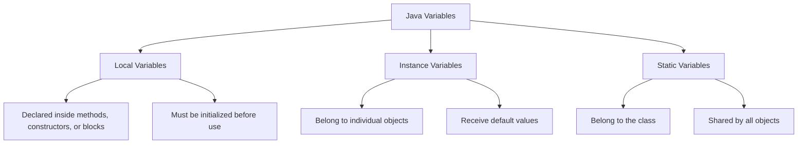
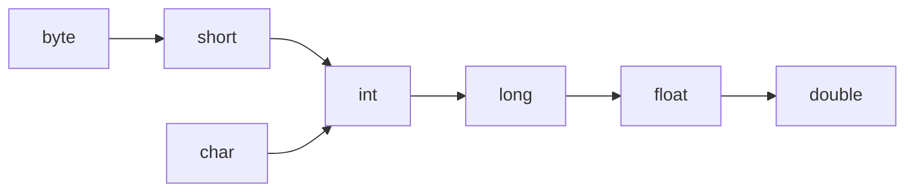

# Basic Questions — Java Variables, Modifiers, and Type Casting

## Question 1: What are static variables and static methods?

The `static` keyword makes a member belong to the **class itself**, rather than to individual objects.

### Static variable

A static variable has one shared copy for the entire class.

```java
class Employee {
    static int employeeCount = 0;

    Employee() {
        employeeCount++;
    }
}
```

```java
public class Main {
    public static void main(String[] args) {
        new Employee();
        new Employee();

        System.out.println(Employee.employeeCount); // 2
    }
}
```

Both objects update the same `employeeCount` variable.

### Static method

A static method can be called using the class name without creating an object.

```java
class Calculator {

    static int add(int first, int second) {
        return first + second;
    }
}
```

```java
int result = Calculator.add(10, 20);

System.out.println(result); // 30
```

### Important rules

- Static methods can directly access only static members.
- Static methods do not have a `this` reference.
- Static methods are resolved using the reference type and are not overridden in the same way as instance methods.
- Static members are usually accessed through the class name.

```java
ClassName.staticMember;
```

---

## Question 2: What is the purpose of the `static` keyword?

The `static` keyword represents class-level data or behavior.

It can be applied to:

- Variables
- Methods
- Initialization blocks
- Nested classes

### Static variable

Used when all objects should share the same value.

```java
class Configuration {
    static String applicationName = "Order Service";
}
```

### Static method

Used for behavior that does not depend on object state.

```java
class NumberUtils {

    static boolean isEven(int number) {
        return number % 2 == 0;
    }
}
```

### Static block

Executed when the class is initialized.

```java
class DatabaseConfig {

    static {
        System.out.println("Loading database configuration...");
    }
}
```

### Static nested class

A static nested class does not require an instance of the enclosing class.

```java
class Outer {

    static class Nested {
        void display() {
            System.out.println("Static nested class");
        }
    }
}
```

```java
Outer.Nested nested = new Outer.Nested();
nested.display();
```

The primary purpose of `static` is not simply memory management. It is used to model members that logically belong to the class rather than to an individual object.

---

## Question 3: What is the purpose of the `final` keyword?

The `final` keyword prevents certain kinds of modification.

It can be applied to:

- Variables
- Methods
- Classes
- Method parameters

### Final variable

A final variable can be assigned only once.

```java
final double PI = 3.14159;
```

This is invalid:

```java
PI = 3.14; // Compilation error
```

A final reference cannot point to another object, but the referenced object may still be mutable.

```java
final List<String> names = new ArrayList<>();

names.add("Alice");          // Allowed
names.add("Bob");            // Allowed
// names = new ArrayList<>(); // Not allowed
```

### Final method

A final method cannot be overridden by a subclass.

```java
class Parent {

    final void display() {
        System.out.println("Parent implementation");
    }
}
```

### Final class

A final class cannot be extended.

```java
final class SecurityToken {
}
```

```java
// Compilation error
class CustomToken extends SecurityToken {
}
```

Examples of final classes include `String`, `Integer`, and other wrapper classes.

---

## Question 4: What are the different types of variables in Java?

Java variables are commonly classified into three categories:

1. Local variables
2. Instance variables
3. Static variables



### Local variable

A local variable is declared inside a method, constructor, or block.

```java
void calculate() {
    int total = 100;
    System.out.println(total);
}
```

Characteristics:

- Accessible only within its scope
- Created when execution enters the block
- Must be initialized before use
- Does not receive a default value

### Instance variable

An instance variable belongs to an object.

```java
class Employee {
    private String name;
    private int age;
}
```

Each object has its own copy:

```java
Employee first = new Employee();
Employee second = new Employee();
```

### Static variable

A static variable belongs to the class and is shared by all instances.

```java
class Employee {
    static String company = "ABC Technologies";
}
```

### Complete example

```java
public class Counter {

    private int instanceCount;       // Instance variable
    private static int totalCount;   // Static variable

    public void increment() {
        int incrementValue = 1;      // Local variable

        instanceCount += incrementValue;
        totalCount += incrementValue;
    }
}
```

---

## Question 5: How do you declare and initialize variables in Java?

### Declaration

Declaration specifies the variable's type and name.

```java
int age;
double salary;
boolean active;
String name;
```

### Initialization

Initialization assigns the first value.

```java
age = 25;
salary = 75_000.00;
active = true;
name = "Alice";
```

### Declaration and initialization together

```java
int age = 25;
float rating = 4.5f;
char grade = 'A';
boolean active = true;
String message = "Hello";
```

### Multiple variables of the same type

```java
int width = 10;
int height = 20;
```

The following is also legal:

```java
int width = 10, height = 20;
```

However, separate declarations are often easier to read.

### Type inference for local variables

From Java 10 onward, `var` can be used for local variables when the compiler can infer the type.

```java
var language = "Java";   // Inferred as String
var version = 21;        // Inferred as int
```

`var` cannot be used for fields, method parameters, or uninitialized variables.

---

## Question 6: What is the purpose of the `transient` keyword?

The `transient` keyword excludes an instance field from Java's default serialization process.

```java
import java.io.Serializable;

class User implements Serializable {

    private static final long serialVersionUID = 1L;

    private String username;
    private transient String password;

    User(String username, String password) {
        this.username = username;
        this.password = password;
    }
}
```

When the object is serialized:

- `username` is written to the serialized form.
- `password` is excluded.

After deserialization, a transient field receives its default value:

| Field type       | Default value |
| ---------------- | ------------: |
| Object reference |        `null` |
| `int`            |           `0` |
| `boolean`        |       `false` |
| `double`         |         `0.0` |

### Example

```java
import java.io.*;

public class TransientDemo {

    public static void main(String[] args)
            throws IOException, ClassNotFoundException {

        User original = new User("alice", "secret123");

        try (ObjectOutputStream output =
                     new ObjectOutputStream(
                             new FileOutputStream("user.ser"))) {

            output.writeObject(original);
        }

        User restored;

        try (ObjectInputStream input =
                     new ObjectInputStream(
                             new FileInputStream("user.ser"))) {

            restored = (User) input.readObject();
        }

        System.out.println(restored);
    }
}
```

```java
class User implements Serializable {

    private static final long serialVersionUID = 1L;

    private String username;
    private transient String password;

    User(String username, String password) {
        this.username = username;
        this.password = password;
    }

    @Override
    public String toString() {
        return "User{" +
                "username='" + username + '\'' +
                ", password='" + password + '\'' +
                '}';
    }
}
```

Possible output:

```text
User{username='alice', password='null'}
```

### Important notes

- `transient` applies to fields, not methods or classes.
- Static fields are not part of an object's serialized state, so they are not serialized even without `transient`.
- Marking a password as transient prevents default serialization, but it does not automatically make every other storage or logging mechanism secure.

---

## Question 7: What is the purpose of the `synchronized` keyword?

The `synchronized` keyword controls access to shared mutable data in multithreaded programs.

It provides:

- Mutual exclusion
- Memory visibility
- Atomic execution of the synchronized section

Only one thread at a time can execute code protected by the same monitor lock.

### Synchronized instance method

```java
class BankAccount {

    private int balance = 1_000;

    public synchronized void withdraw(int amount) {
        if (balance >= amount) {
            balance -= amount;
        }
    }
}
```

The lock is acquired on the current object, represented by `this`.

### Synchronized block

```java
class BankAccount {

    private final Object lock = new Object();
    private int balance = 1_000;

    public void withdraw(int amount) {
        synchronized (lock) {
            if (balance >= amount) {
                balance -= amount;
            }
        }
    }
}
```

A synchronized block is useful when only part of a method needs protection.

### Static synchronized method

```java
class IdGenerator {

    private static int nextId;

    public static synchronized int generate() {
        return ++nextId;
    }
}
```

A static synchronized method locks the class object:

```java
IdGenerator.class
```

### Important distinction

`synchronized` does not mean that only one thread can execute the entire class. It means only one thread can hold a particular object's monitor lock at a time.

Different objects have different locks:

```java
BankAccount first = new BankAccount();
BankAccount second = new BankAccount();
```

One thread can synchronize on `first` while another synchronizes on `second`.

---

## Question 8: What is the purpose of the `volatile` keyword?

The `volatile` keyword ensures that updates to a variable made by one thread become visible to other threads.

```java
class Worker implements Runnable {

    private volatile boolean running = true;

    @Override
    public void run() {
        while (running) {
            // Perform work
        }

        System.out.println("Worker stopped");
    }

    public void stop() {
        running = false;
    }
}
```

```java
public class Main {

    public static void main(String[] args)
            throws InterruptedException {

        Worker worker = new Worker();
        Thread thread = new Thread(worker);

        thread.start();

        Thread.sleep(1_000);
        worker.stop();

        thread.join();
    }
}
```

Without appropriate visibility guarantees, the worker thread may continue reading a previously cached value.

### What `volatile` guarantees

- Visibility of the latest written value
- Ordering restrictions around volatile reads and writes

### What `volatile` does not guarantee

It does not make compound operations atomic.

```java
private volatile int count = 0;

count++; // Not atomic
```

`count++` involves multiple steps:

1. Read the value
2. Add one
3. Write the result

Multiple threads can interfere with one another.

For an atomic counter, use:

```java
private final AtomicInteger count = new AtomicInteger();

count.incrementAndGet();
```

Use `volatile` for simple state flags or safely published references. Use synchronization, locks, or atomic classes when multiple operations must be treated as one indivisible action.

---

## Question 9: What is type casting in Java?

Type casting is the conversion of a value or reference from one type to another.

Java has two main forms:

1. Primitive type casting
2. Reference type casting

---

### Primitive widening conversion

Widening converts a smaller-range primitive type to a larger compatible type.

```java
int number = 100;
long result = number;
```

It is normally performed automatically.



Example:

```java
int value = 25;
double converted = value;

System.out.println(converted); // 25.0
```

Widening does not always mean that every value is represented with perfect precision. For example, converting a large `long` to `float` may lose precision.

---

### Primitive narrowing conversion

Narrowing converts a larger-range type to a smaller type.

It requires an explicit cast:

```java
double price = 99.95;
int rounded = (int) price;

System.out.println(rounded); // 99
```

Information may be lost.

```java
int number = 130;
byte converted = (byte) number;

System.out.println(converted); // -126
```

---

### Reference upcasting

Upcasting converts a subclass reference to a superclass or interface reference.

```java
class Animal {
}

class Dog extends Animal {
}

Dog dog = new Dog();
Animal animal = dog;
```

Upcasting is implicit and safe.

---

### Reference downcasting

Downcasting converts a superclass reference back to a subclass type.

```java
Animal animal = new Dog();
Dog dog = (Dog) animal;
```

An invalid downcast throws `ClassCastException`.

```java
Animal animal = new Animal();
Dog dog = (Dog) animal; // Runtime exception
```

Use pattern matching with `instanceof` when appropriate:

```java
if (animal instanceof Dog dog) {
    System.out.println("The animal is a dog");
}
```

Primitive widening/narrowing and reference upcasting/downcasting are related conversion concepts, but they should not be treated as exactly the same operation.

---

## Question 10: What is an identifier in Java?

An identifier is the name assigned to a Java program element.

Identifiers are used to name:

- Classes
- Interfaces
- Variables
- Methods
- Packages
- Labels
- Enum constants

```java
class CustomerService {

    private String customerName;

    void registerCustomer() {
        int customerCount = 1;
    }
}
```

Identifiers in this example include:

- `CustomerService`
- `customerName`
- `registerCustomer`
- `customerCount`

### Identifier rules

An identifier:

- May contain letters, digits, `_`, and `$`
- Cannot begin with a digit
- Cannot be a Java keyword
- Is case-sensitive
- Cannot contain spaces
- May use Unicode letters

Valid identifiers:

```java
customerName
_count
total2
MAX_VALUE
```

Invalid identifiers:

```java
2count          // Starts with a digit
customer-name   // Contains a hyphen
class           // Java keyword
customer name   // Contains a space
```

Although `$` is allowed, it is generally avoided in normal application code because generated Java code often uses it.
