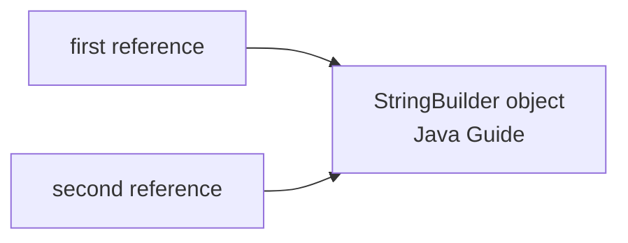
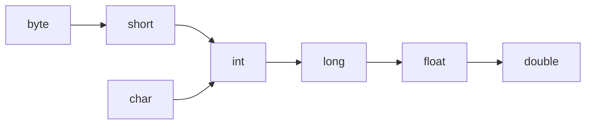
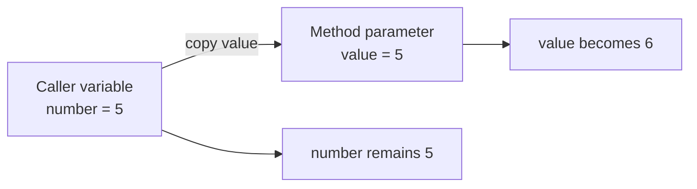
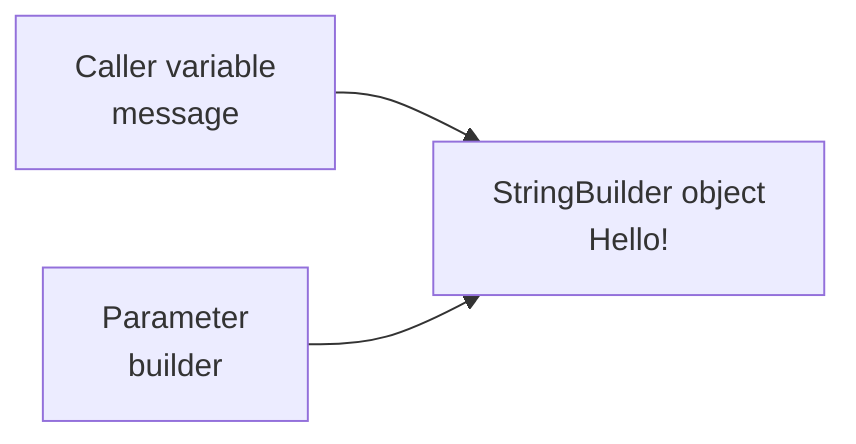
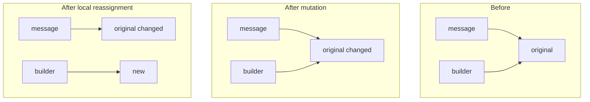

# Java Data Types, Type Casting, and Parameter Passing

## 1. Overview

Java data types are divided into two categories:

1. **Primitive types**
2. **Reference types**

Java also supports type conversion through **casting** and passes every method argument using **pass-by-value**.

---

## 2. Primitive Types

Java provides eight primitive types:

| Type      |                 Typical size | Example                             | Default field value |
| --------- | ---------------------------: | ----------------------------------- | ------------------- |
| `byte`    |                        8-bit | `byte age = 25;`                    | `0`                 |
| `short`   |                       16-bit | `short year = 2026;`                | `0`                 |
| `int`     |                       32-bit | `int count = 100;`                  | `0`                 |
| `long`    |                       64-bit | `long population = 8_000_000_000L;` | `0L`                |
| `float`   |                       32-bit | `float rating = 4.5f;`              | `0.0f`              |
| `double`  |                       64-bit | `double price = 99.99;`             | `0.0d`              |
| `char`    |                       16-bit | `char grade = 'A';`                 | `'\u0000'`          |
| `boolean` | JVM-dependent representation | `boolean active = true;`            | `false`             |

Primitive variables hold their values directly.

```java
int count = 10;
boolean completed = false;
```

> Local variables do not receive default values. They must be initialized before use.

---

## 3. Reference Types

Reference types include:

- Classes
- Interfaces
- Arrays
- Enums
- Records
- Strings

A reference variable stores a reference value that identifies an object, rather than storing the complete object directly.

```java
String name = "Alice";
int[] numbers = {10, 20, 30};
Customer customer = new Customer();
```

Multiple reference variables may refer to the same object:

```java
StringBuilder first = new StringBuilder("Java");
StringBuilder second = first;

second.append(" Guide");

System.out.println(first); // Java Guide
```

Both variables refer to the same `StringBuilder`, so a mutation through one reference is visible through the other.



---

## 4. Primitive Types vs Reference Types

| Feature             | Primitive type             | Reference type                         |
| ------------------- | -------------------------- | -------------------------------------- |
| Stores              | The actual value           | A reference to an object               |
| Can be `null`       | No                         | Yes                                    |
| Has methods         | No                         | The referenced object can have methods |
| Supports identity   | No                         | Yes                                    |
| Examples            | `int`, `double`, `boolean` | `String`, arrays, custom classes       |
| Generics support    | Not directly               | Yes                                    |
| Default field value | Type-specific value        | `null`                                 |

Reference types are not automatically mutable. For example, `String` and wrapper classes are immutable reference types.

---

# Type Casting

## 5. What is Type Casting?

Type casting converts a value or reference from one type to another compatible type.

Java supports:

1. Primitive casting
2. Reference casting

---

## 6. Primitive Widening Conversion

Widening converts a smaller primitive type into a type with a wider range.

It is usually performed automatically.

```java
int count = 100;
long total = count;
double result = total;
```

Common widening paths include:



Example:

```java
int number = 25;
double converted = number;

System.out.println(converted); // 25.0
```

Widening is generally safe from range overflow, but precision can still be lost in conversions such as `long` to `float`.

```java
long value = 9_007_199_254_740_993L;
float converted = value;

System.out.println(converted); // Approximate value
```

---

## 7. Primitive Narrowing Conversion

Narrowing converts a larger primitive type into a smaller type.

It requires an explicit cast:

```java
double price = 99.95;
int wholePrice = (int) price;

System.out.println(wholePrice); // 99
```

The fractional part is discarded; it is not rounded.

Narrowing may also cause overflow:

```java
int number = 130;
byte converted = (byte) number;

System.out.println(converted); // -126
```

This happens because `130` is outside the `byte` range of `-128` to `127`.

---

## 8. Reference Upcasting

Upcasting converts a subclass reference to a superclass or interface reference.

```java
class Animal {
    void move() {
        System.out.println("Animal moves");
    }
}

class Dog extends Animal {
    void bark() {
        System.out.println("Dog barks");
    }
}
```

```java
Dog dog = new Dog();
Animal animal = dog;
```

Upcasting is:

- Implicit
- Safe
- Commonly used to achieve runtime polymorphism

```java
Animal animal = new Dog();
animal.move();
```

The reference type determines which members are accessible at compile time, while the actual object type determines which overridden method executes at runtime.

---

## 9. Reference Downcasting

Downcasting converts a superclass reference back to a subclass type.

```java
Animal animal = new Dog();
Dog dog = (Dog) animal;

dog.bark();
```

Downcasting requires an explicit cast and may fail at runtime:

```java
Animal animal = new Animal();
Dog dog = (Dog) animal; // ClassCastException
```

Use `instanceof` when the runtime type is uncertain:

```java
if (animal instanceof Dog dog) {
    dog.bark();
}
```

Pattern matching avoids writing a separate explicit cast.

---

## 10. Boxing and Unboxing

Generics and collections cannot directly use primitive types.

Java uses wrapper classes:

| Primitive | Wrapper     |
| --------- | ----------- |
| `byte`    | `Byte`      |
| `short`   | `Short`     |
| `int`     | `Integer`   |
| `long`    | `Long`      |
| `float`   | `Float`     |
| `double`  | `Double`    |
| `char`    | `Character` |
| `boolean` | `Boolean`   |

### Autoboxing

Conversion from a primitive to its wrapper type:

```java
Integer number = 10;
```

Conceptually:

```java
Integer number = Integer.valueOf(10);
```

### Unboxing

Conversion from a wrapper to its primitive type:

```java
Integer number = 10;
int value = number;
```

Be careful when unboxing `null`:

```java
Integer number = null;
int value = number; // NullPointerException
```

Boxing can also add allocation, memory, and garbage-collection overhead in performance-sensitive code.

---

# Parameter Passing

## 11. Is Java Pass-by-Value or Pass-by-Reference?

Java is **always pass-by-value**.

The value stored in the argument variable is copied into the method parameter.

- For a primitive, the primitive value is copied.
- For an object, the reference value is copied.

Java does not pass the caller's variable itself into the method.

---

## 12. Passing Primitive Values

```java
static void increment(int value) {
    value++;
}
```

```java
int number = 5;

increment(number);

System.out.println(number); // 5
```

The method receives its own copy of `number`.



Changing the parameter does not modify the caller's variable.

---

## 13. Passing Object References

When an object is passed, Java copies the reference value.

```java
static void appendText(StringBuilder builder) {
    builder.append("!");
}
```

```java
StringBuilder message = new StringBuilder("Hello");

appendText(message);

System.out.println(message); // Hello!
```

The caller's variable and the method parameter contain separate copies of the same reference. Both references identify the same object.



Mutating that shared object is therefore visible to the caller.

---

## 14. Mutation vs Reassignment

Consider the following method:

```java
static void modify(StringBuilder builder) {
    builder.append(" changed");
    builder = new StringBuilder("new");
}
```

Calling it:

```java
StringBuilder message = new StringBuilder("original");

modify(message);

System.out.println(message); // original changed
```

Two different operations occur:

### Mutation

```java
builder.append(" changed");
```

This changes the object referenced by both `message` and `builder`, so the caller sees the result.

### Reassignment

```java
builder = new StringBuilder("new");
```

This changes only the method's local parameter. The caller's `message` variable still refers to the original object.



---

## 15. Complete Example

```java
public class PassByValueDemo {

    static void increment(int value) {
        value++;
    }

    static void mutate(StringBuilder builder) {
        builder.append("!");
    }

    static void reassign(StringBuilder builder) {
        builder = new StringBuilder("reassigned");
    }

    public static void main(String[] args) {
        int number = 5;

        increment(number);
        System.out.println(number); // 5

        StringBuilder message = new StringBuilder("Hello");

        mutate(message);
        System.out.println(message); // Hello!

        reassign(message);
        System.out.println(message); // Hello!
    }
}
```

---

## 16. Can a Method Change the Caller’s Reference Variable?

A method cannot directly reassign the caller's variable through an ordinary parameter.

Return the new value instead:

```java
static StringBuilder replace(StringBuilder current) {
    return new StringBuilder("replacement");
}
```

```java
StringBuilder message = new StringBuilder("original");
message = replace(message);

System.out.println(message); // replacement
```

This is clearer than using mutable containers such as a one-element array merely to simulate pass-by-reference.

---

## 17. `==` vs `equals()`

### With primitive values

`==` compares actual primitive values:

```java
int first = 10;
int second = 10;

System.out.println(first == second); // true
```

### With object references

`==` compares whether two references identify the same object:

```java
StringBuilder first = new StringBuilder("Java");
StringBuilder second = new StringBuilder("Java");

System.out.println(first == second); // false
```

`equals()` compares logical equality when the class overrides it appropriately:

```java
String first = new String("Java");
String second = new String("Java");

System.out.println(first == second);      // false
System.out.println(first.equals(second)); // true
```

By default, `Object.equals()` behaves like identity comparison. Classes such as `String`, wrapper classes, records, and many collection classes override it to provide content-based equality.

---

## 18. Production Use Case

Consider a service method that receives a DTO:

```java
void enrichOrder(OrderRequest request) {
    request.setSource("MOBILE");
}
```

This mutation affects the same DTO visible to the caller.

However:

```java
void replaceOrder(OrderRequest request) {
    request = new OrderRequest();
}
```

This reassignment does not replace the caller's object.

A clearer design may return the result:

```java
OrderRequest enrichOrder(OrderRequest request) {
    request.setSource("MOBILE");
    return request;
}
```

For immutable request objects:

```java
OrderRequest enrichOrder(OrderRequest request) {
    return request.withSource("MOBILE");
}
```

Understanding this distinction prevents subtle bugs during service-layer refactoring, DTO transformation, and collection processing.

---

## 19. Common Mistakes

### Mistake 1: Saying Java passes objects by reference

Incorrect:

> Java passes objects by reference.

Correct:

> Java passes a copy of the object's reference by value.

---

### Mistake 2: Expecting parameter reassignment to affect the caller

```java
static void clear(User user) {
    user = null;
}
```

```java
User currentUser = new User();
clear(currentUser);

System.out.println(currentUser); // Still refers to the User
```

---

### Mistake 3: Assuming reference types are always mutable

`String`, `Integer`, `LocalDate`, and records designed with immutable fields are reference types but are commonly immutable.

---

### Mistake 4: Assuming all primitives are always stored on the stack

Storage location is an implementation concern and depends on context and JVM optimization.

For example:

- A primitive local variable may be held in a stack frame or CPU register.
- A primitive field is part of its containing object.
- JIT escape analysis may eliminate or relocate allocations.

The key language-level distinction is that primitive variables represent primitive values, while reference variables represent references.

---

### Mistake 5: Confusing widening with guaranteed precision

```java
long large = 9_007_199_254_740_993L;
double converted = large;
```

The range is supported, but exact precision may be lost.

---

### Mistake 6: Unboxing a nullable wrapper

```java
Integer value = null;
int number = value; // NullPointerException
```

---

## 20. Trade-offs

| Primitive types                      | Reference types                                      |
| ------------------------------------ | ---------------------------------------------------- |
| Usually lower overhead               | Can model complex structures                         |
| Cannot be `null`                     | Can represent absence with `null`                    |
| No object identity                   | Support object identity                              |
| Cannot be generic type arguments     | Work with generics                                   |
| Limited to built-in value categories | Support fields, methods, inheritance, and interfaces |
| Avoid boxing overhead                | Can introduce allocation and GC overhead             |
| Naturally copied as values           | Copied references may expose shared mutable state    |

---

# Interview Questions

## Question 1: Is Java pass-by-value or pass-by-reference?

Java is always pass-by-value. When an object is passed, Java copies the reference value rather than copying the complete object.

---

## Question 2: What gets copied when an object is passed to a method?

The reference value stored in the caller's variable is copied into the parameter. The two reference variables are independent, but initially refer to the same object.

---

## Question 3: Why is object mutation visible to the caller?

The caller's reference and parameter reference identify the same object. Mutating that shared object is visible through both references.

---

## Question 4: Why is parameter reassignment not visible to the caller?

The parameter is a separate local variable containing a copied reference. Reassigning it changes only that local variable.

---

## Question 5: What is the difference between `==` and `equals()`?

For objects, `==` compares reference identity. `equals()` compares logical equality when the class provides a content-based implementation.

---

## Question 6: What is the difference between widening and narrowing?

Widening converts to a broader compatible primitive type and is usually implicit. Narrowing converts to a smaller type, requires an explicit cast, and may lose data.

---

## Question 7: What is the difference between upcasting and downcasting?

Upcasting converts a subclass reference into a superclass or interface reference and is implicit. Downcasting converts it back to a subtype, requires an explicit cast, and may throw `ClassCastException`.

---

## Question 8: Can Java pass a primitive by reference?

No. Java does not provide pass-by-reference parameters. A method can return the updated value or modify an explicitly shared mutable object.

---

# Short Interview Answer

> Java is always pass-by-value. When a primitive is passed, its value is copied. When an object is passed, the reference value is copied, so the caller and method initially refer to the same object. Mutating that object is visible to the caller, but reassigning the method parameter changes only the local copy of the reference.

---

## Related Topics

- [Strings](strings.md)
- [Arrays](arrays/README.md)
- [Wrapper Classes](wrapper-classes.md)
- [`equals()` and `hashCode()`](../02-collections/hashmap-internals.md)
- [Immutability](immutability.md)
- [Object-Oriented Programming](oop/README.md)
