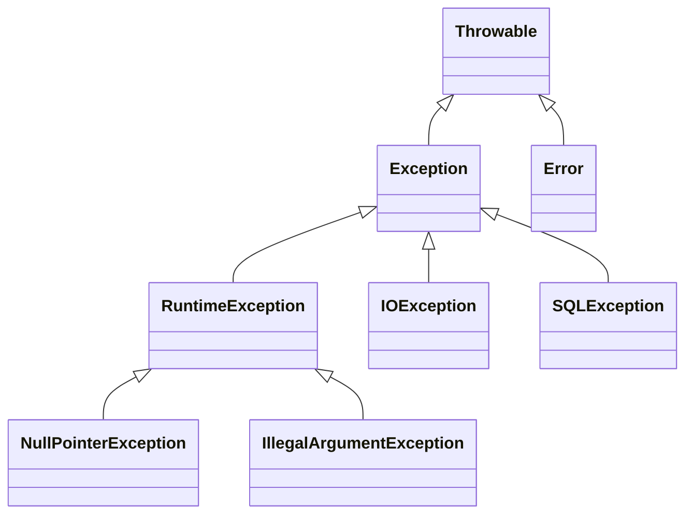

# Advanced Questions — Java Exceptions and JVM Errors

## Question 1: What is the difference between `final`, `finally`, and `finalize()`?

These three terms are unrelated despite their similar names.

| Term         | Type                       | Purpose                                            |
| ------------ | -------------------------- | -------------------------------------------------- |
| `final`      | Keyword/modifier           | Restricts reassignment, overriding, or inheritance |
| `finally`    | Exception-handling block   | Runs cleanup code when a `try` statement exits     |
| `finalize()` | Deprecated `Object` method | Historical GC-related cleanup mechanism            |

---

### `final`

The effect of `final` depends on where it is applied.

#### Final variable

A final variable can be assigned only once.

```java
final int maximumRetries = 3;

// maximumRetries = 5; // Compilation error
```

For an object reference, `final` prevents reference reassignment, but it does not automatically make the object immutable.

```java
final List<String> names = new ArrayList<>();

names.add("Alice"); // Allowed: the object is modified

// names = new ArrayList<>(); // Not allowed
```

#### Final method

A final method cannot be overridden by a subclass.

```java
class PaymentService {

    public final void validatePayment() {
        System.out.println("Validating payment");
    }
}
```

#### Final class

A final class cannot be extended.

```java
final class SecurityToken {
}

// class CustomToken extends SecurityToken { } // Compilation error
```

The Java language uses `final` to restrict overriding and inheritance; it does not mean that every object referenced by a final variable is immutable. ([Oracle Documentation][1])

---

### `finally`

A `finally` block is associated with `try` and normally runs whether the operation:

- Completes successfully
- Throws an exception
- Returns from `try` or `catch`
- Executes `break` or `continue`

```java
try {
    processFile();
} catch (IOException exception) {
    log.error("File processing failed", exception);
} finally {
    releaseResources();
}
```

A `finally` block is commonly used for cleanup, although try-with-resources is preferred for `AutoCloseable` resources. It should not be described as executing in absolutely every possible situation because forced JVM or operating-system termination can prevent it from running. ([Oracle Documentation][2])

Avoid returning from a `finally` block:

```java
public int calculate() {
    try {
        return 10;
    } finally {
        return 20; // Overrides the earlier result
    }
}
```

Such code can hide return values and suppress exceptions.

---

### `finalize()`

`finalize()` was historically intended to let an object perform cleanup before memory reclamation. However:

- Its execution time is unpredictable.
- Execution is not guaranteed before process termination.
- It can delay garbage collection.
- It can cause performance, security, reliability, and resource-leak problems.

Finalization is deprecated for removal, and OpenJDK recommends migrating to explicit resource-management mechanisms such as try-with-resources. ([OpenJDK][3])

Do not write new code like this:

```java
@Override
protected void finalize() throws Throwable {
    closeNativeResource();
}
```

Prefer:

```java
public final class Resource implements AutoCloseable {

    @Override
    public void close() {
        // Release resource deterministically
    }
}
```

```java
try (Resource resource = new Resource()) {
    // Use resource
}
```

### Interview-ready answer

> `final` is a modifier that restricts variable reassignment, method overriding, or class inheritance. `finally` is a block used for cleanup after a `try` statement. `finalize()` is an obsolete, deprecated GC-related method whose execution is unreliable and should be replaced with explicit cleanup or try-with-resources.

---

## Question 2: What is the difference between checked and unchecked exceptions?

Both checked and unchecked exceptions are thrown **at runtime**.

The difference is not when they occur. The difference is whether the Java compiler enforces the **catch-or-declare requirement**. Checked exceptions must be caught or declared with `throws`; unchecked exceptions do not have that compiler requirement. ([Oracle Documentation][4])

| Feature                 | Checked exception                                       | Unchecked exception                                                          |
| ----------------------- | ------------------------------------------------------- | ---------------------------------------------------------------------------- |
| Compiler requirement    | Must be caught or declared                              | Need not be caught or declared                                               |
| Hierarchy               | Subclasses of `Exception`, excluding `RuntimeException` | `RuntimeException` and its subclasses                                        |
| Typical cause           | External or potentially recoverable condition           | Invalid input, invalid state, or programming defect                          |
| Examples                | `IOException`, `SQLException`, `FileNotFoundException`  | `NullPointerException`, `IllegalArgumentException`, `NoSuchElementException` |
| Declared using `throws` | Common                                                  | Optional                                                                     |
| Recovery expected       | Often possible                                          | Usually fix the underlying defect or invalid call                            |

### Checked exception example

```java
public String readFile(Path path) throws IOException {
    return Files.readString(path);
}
```

The caller must catch or propagate it:

```java
try {
    String content = readFile(Path.of("data.txt"));
} catch (IOException exception) {
    System.err.println("Could not read the file");
}
```

### Unchecked exception example

```java
public void registerUser(String username) {
    if (username == null || username.isBlank()) {
        throw new IllegalArgumentException(
                "Username must not be blank"
        );
    }
}
```

### Important corrections

#### Incorrect

> Checked exceptions occur at compile time.

#### Correct

> Checked exceptions occur at runtime, but the compiler verifies that the program catches or declares them.

#### Incorrect

> Unchecked exceptions are not part of the `Exception` hierarchy.

#### Correct

`RuntimeException` extends `Exception`, so unchecked runtime exceptions are part of the `Exception` hierarchy. Separately, `Error` and its subclasses are also classified as unchecked `Throwable` types. ([Oracle Documentation][5])

### Exception hierarchy



### Interview-ready answer

> Checked exceptions are subclasses of `Exception` other than `RuntimeException`, and the compiler requires them to be caught or declared. Unchecked exceptions inherit from `RuntimeException` and have no catch-or-declare requirement. Both are thrown at runtime.

---

## Question 3: What causes `OutOfMemoryError`?

`OutOfMemoryError` is thrown when the JVM cannot satisfy a memory allocation and cannot make sufficient memory available. It extends `VirtualMachineError`, which is part of the `Error` hierarchy. ([Oracle Documentation][6])

It does not always mean that the Java heap alone is full.

### Common causes

#### 1. Java heap exhaustion

Example message:

```text
java.lang.OutOfMemoryError: Java heap space
```

Possible causes include:

- An actual memory leak
- An undersized heap
- Loading too much data at once
- Unbounded caches
- Collections that grow indefinitely
- Retaining references after objects are no longer needed
- Creating very large object graphs

A heap-space error can result either from inadequate configuration or from objects being unintentionally retained and therefore unavailable for garbage collection. ([Oracle Documentation][7])

Example of an unbounded collection:

```java
List<byte[]> data = new ArrayList<>();

while (true) {
    data.add(new byte[1_000_000]);
}
```

Because the list retains every array, garbage collection cannot reclaim them.

---

#### 2. Excessive garbage-collection overhead

Example message:

```text
java.lang.OutOfMemoryError: GC overhead limit exceeded
```

This means the JVM is spending most of its time performing garbage collection while recovering very little memory. It often occurs when the live object set almost fills the heap. ([Oracle Documentation][7])

---

#### 3. Metaspace exhaustion

Example message:

```text
java.lang.OutOfMemoryError: Metaspace
```

Metaspace contains class metadata. It may be exhausted because of:

- Loading an extremely large number of classes
- Repeated dynamic class generation
- A class-loader leak
- A restrictive `MaxMetaspaceSize` setting

Oracle’s troubleshooting guide identifies class-metadata exhaustion and class-loader retention as common Metaspace-related causes. ([Oracle Documentation][7])

---

#### 4. Native memory exhaustion

The JVM also consumes native memory for purposes such as:

- Thread stacks
- JVM internal structures
- Native libraries
- Class metadata
- Direct buffers

A process may therefore receive `OutOfMemoryError` even when the Java heap itself still has free space. Oracle recommends first determining whether the exhausted area is the Java heap or native memory. ([Oracle Documentation][7])

---

#### 5. An array larger than the JVM limit

Example:

```text
java.lang.OutOfMemoryError:
Requested array size exceeds VM limit
```

This occurs when an application attempts to allocate an array beyond the JVM implementation’s supported array size, independently of ordinary heap sizing. ([Oracle Documentation][7])

---

### Production investigation approach

Do not immediately increase `-Xmx` without identifying the cause.

A practical investigation sequence is:

1. Read the complete `OutOfMemoryError` message.
2. Determine which memory area was exhausted.
3. Capture a heap dump when possible.
4. Examine GC logs and memory trends.
5. Compare retained objects and dominator trees.
6. Investigate unbounded caches, queues, collections, and static references.
7. Check class loaders when Metaspace grows continuously.
8. Review thread counts and native-memory usage.
9. Reproduce under a stable workload.
10. Increase memory only when the application genuinely requires more capacity.

Oracle recommends monitoring the live set after full garbage collections. A live set that continues growing under a stable load can indicate a leak; JConsole, JDK Mission Control, Java Flight Recorder data, and GC logs can help with this diagnosis. ([Oracle Documentation][7])

### Useful JVM option

```bash
-XX:+HeapDumpOnOutOfMemoryError
```

A typical production configuration might include:

```bash
java \
  -Xms1g \
  -Xmx1g \
  -XX:+HeapDumpOnOutOfMemoryError \
  -XX:HeapDumpPath=/var/log/app/heapdump.hprof \
  -jar application.jar
```

### Should `OutOfMemoryError` be caught?

Generally, application code should not attempt normal recovery from it. The process may be in an unstable state and may lack enough memory even to execute recovery logic reliably. `Error` represents serious conditions that reasonable application code usually should not catch. ([Oracle Documentation][8])

A top-level infrastructure boundary may attempt minimal emergency actions such as:

- Recording a health failure
- Stopping incoming traffic
- Triggering controlled termination
- Allowing a supervisor, container, or orchestrator to restart the process

It should not simply catch the error and continue normal processing.

### Interview-ready answer

> `OutOfMemoryError` occurs when the JVM cannot satisfy a memory allocation. Causes include heap exhaustion, memory leaks, undersized memory pools, Metaspace exhaustion, excessive GC overhead, native-memory exhaustion, class-loader leaks, excessive threads, or attempting an array beyond the JVM limit. I would inspect the exact error message, capture memory diagnostics, analyze retained objects and GC behavior, fix the retention or sizing problem, and avoid treating a larger heap as the automatic solution.

---

## Question 4: What is the difference between `Exception` and `Error`?

Both `Exception` and `Error` extend `Throwable`, but they represent different categories of failures. Java describes exceptions as conditions an application might reasonably catch, while errors indicate serious problems that an application generally should not try to catch. ([Oracle Documentation][9])

| Feature           | `Exception`                                               | `Error`                                                  |
| ----------------- | --------------------------------------------------------- | -------------------------------------------------------- |
| Parent            | `Throwable`                                               | `Throwable`                                              |
| Intended handling | Often handled by application logic                        | Usually not handled for normal recovery                  |
| Typical cause     | Invalid input, external failure, or recoverable condition | JVM, class-linkage, stack, or resource failure           |
| Checked forms     | Yes                                                       | No                                                       |
| Unchecked forms   | Yes: `RuntimeException`                                   | All errors are unchecked                                 |
| Examples          | `IOException`, `SQLException`, `IllegalArgumentException` | `OutOfMemoryError`, `StackOverflowError`, `LinkageError` |

### Exception example

```java
try {
    Files.readString(Path.of("config.txt"));
} catch (IOException exception) {
    loadDefaultConfiguration();
}
```

The program may have a meaningful recovery strategy.

### Error example

```java
public static void recursiveCall() {
    recursiveCall();
}
```

This eventually produces:

```text
java.lang.StackOverflowError
```

Normal application logic should fix the recursion defect rather than use `catch (StackOverflowError)` as its control flow.

### Important corrections

#### Incorrect

> Exceptions are caused by syntax errors.

Syntax errors are compiler errors. They prevent successful compilation and do not produce runtime exception objects.

Exceptions occur during program execution.

#### Incorrect

> Every exception can be solved programmatically.

Some exceptions can be recovered from, while others indicate bugs or invalid application state. For example, a missing optional file may have a fallback, but a `NullPointerException` usually indicates code that should be corrected.

#### Incorrect

> Every error is only caused by insufficient system resources.

Some errors relate to resource exhaustion, such as `OutOfMemoryError`, while others result from JVM or class-linkage problems, such as:

- `NoClassDefFoundError`
- `UnsupportedClassVersionError`
- `LinkageError`
- `AssertionError`

The Java hierarchy contains multiple `Error` categories beyond resource exhaustion. ([Oracle Documentation][5])

---

## Graceful vs Abnormal Termination

### Graceful termination

The program handles shutdown in a controlled manner:

- Stops accepting new work
- Completes or cancels active work
- Closes resources
- Flushes buffers
- Records useful diagnostics
- Exits with an appropriate status

```java
try {
    application.run();
} catch (ConfigurationException exception) {
    log.error("Invalid configuration", exception);
} finally {
    application.shutdown();
}
```

### Abnormal termination

The program terminates unexpectedly because of an unhandled exception, fatal error, process kill, JVM crash, or system failure.

```java
public static void main(String[] args) {
    System.out.println(10 / 0);
}
```

This produces an unhandled `ArithmeticException` and ends the main thread abnormally.

The original definitions should not use the same wording for graceful and abnormal termination.

### Interview-ready answer

> `Exception` represents conditions an application may be able to catch, report, recover from, or translate. `Error` represents serious JVM or runtime problems that application code normally should not catch for recovery. Both extend `Throwable`, but errors are always unchecked, while exceptions may be checked or unchecked.

---

# Repository Cleanup

Questions 1 and 5 are duplicates and should be merged into a single question:

```text
What is the difference between final, finally, and finalize()?
```

Use the correct method name:

```java
finalize()
```

Not:

```text
finalized method
```

Recommended advanced-question structure:

```text
advanced-questions.md
├── final-vs-finally-vs-finalize
├── checked-vs-unchecked-exceptions
├── out-of-memory-error
└── exception-vs-error
```

[1]: https://docs.oracle.com/javase/tutorial/java/IandI/final.html?utm_source=chatgpt.com "Writing Final Classes and Methods (The Java™ Tutorials ..."
[2]: https://docs.oracle.com/javase/tutorial/essential/exceptions/finally.html?utm_source=chatgpt.com "The finally Block - Java™ Tutorials"
[3]: https://openjdk.org/jeps/421 "JEP 421: Deprecate Finalization for Removal"

[4]: https://docs.oracle.com/javase/tutorial/essential/exceptions/catchOrDeclare.html "The Catch or Specify Requirement (The Java™ Tutorials >  
 Essential Java Classes > Exceptions)
"
[5]: https://docs.oracle.com/en/java/javase/25/docs/api/java.base/java/lang/package-tree.html?utm_source=chatgpt.com "java.lang Class Hierarchy (Java SE 25 & JDK 25)"
[6]: https://docs.oracle.com/en/java/javase/25/docs/api/java.base/java/lang/OutOfMemoryError.html "OutOfMemoryError (Java SE 25 & JDK 25)"
[7]: https://docs.oracle.com/en/java/javase/25/troubleshoot/troubleshooting-memory-leaks.html "Troubleshoot Memory Leaks"
[8]: https://docs.oracle.com/en/java/javase/26/docs/api/java.base/java/lang/package-summary.html "java.lang (Java SE 26 & JDK 26)"
[9]: https://docs.oracle.com/en/java/javase/26/docs/api//java.base/java/lang/Throwable.html?utm_source=chatgpt.com "Throwable (Java SE 26 & JDK 26)"
