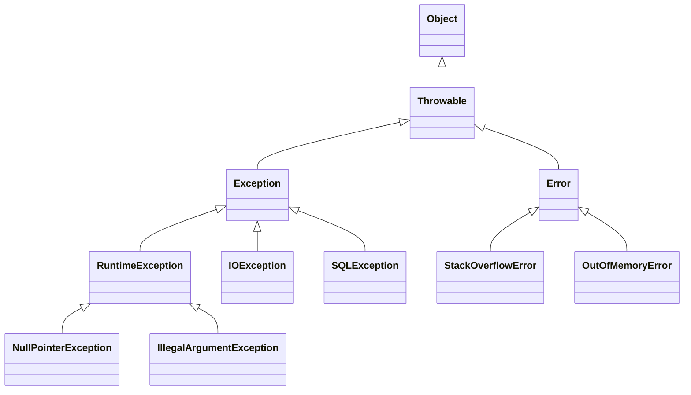
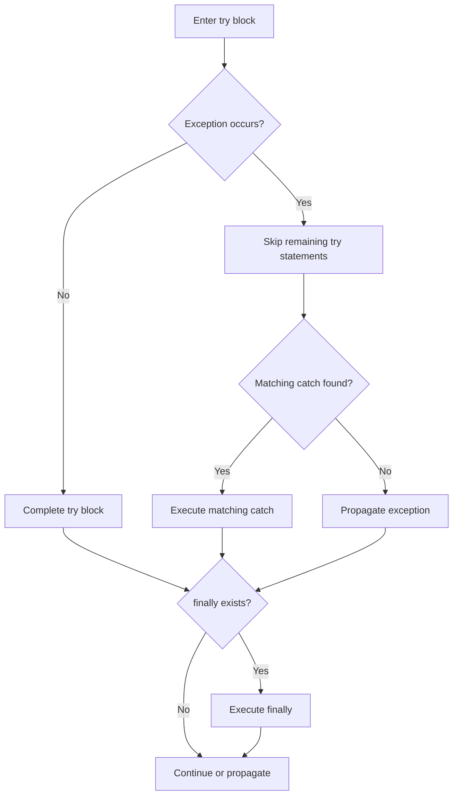
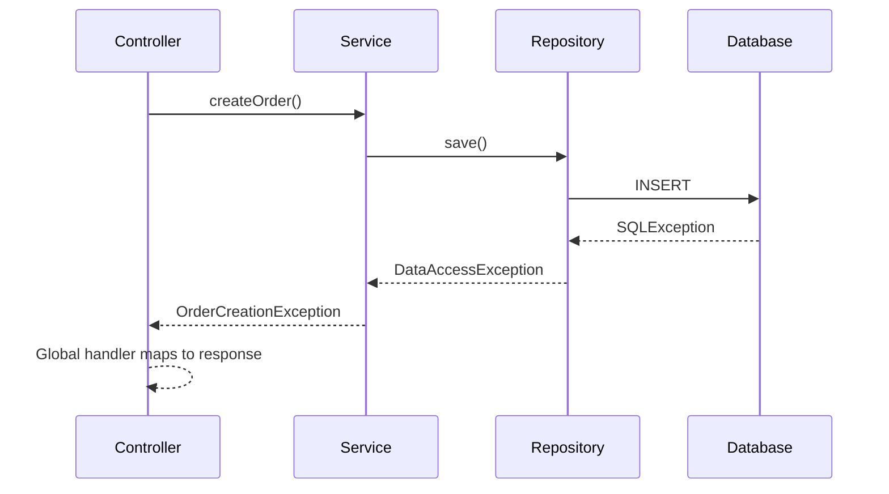

# Basic Questions — Java Exception Handling

## Question 1: What is exception handling in Java?

Exception handling is the mechanism Java uses to detect, propagate, and respond to abnormal conditions that occur during program execution.

It allows an application to:

- Prevent unexpected termination
- Recover from recoverable failures
- Provide meaningful error messages
- Release resources correctly
- Separate normal business logic from error-handling logic

Java mainly uses these constructs:

| Construct            | Purpose                                         |
| -------------------- | ----------------------------------------------- |
| `try`                | Contains code that may fail                     |
| `catch`              | Handles a matching exception                    |
| `finally`            | Executes cleanup code after `try`/`catch`       |
| `throw`              | Explicitly throws an exception object           |
| `throws`             | Declares that a method may propagate exceptions |
| `try-with-resources` | Automatically closes resources                  |

Oracle’s exception-handling model includes `try`, `catch`, `finally`, exception propagation, and the `throw` statement. ([Oracle Documentation][1])

### Basic example

```java
public class DivisionExample {

    public static int divide(int first, int second) {
        if (second == 0) {
            throw new IllegalArgumentException(
                    "The divisor cannot be zero"
            );
        }

        return first / second;
    }

    public static void main(String[] args) {
        try {
            int result = divide(10, 0);
            System.out.println(result);
        } catch (IllegalArgumentException exception) {
            System.out.println(
                    "Invalid input: " + exception.getMessage()
            );
        }
    }
}
```

---

## Question 2: What is an exception?

An exception is an object that represents an abnormal condition encountered while a program is running.

Examples include:

- Attempting to read a missing file
- Accessing an invalid array index
- Dereferencing `null`
- Parsing invalid input
- Dividing an integer by zero
- Violating a business rule

Exceptions interrupt the normal flow of execution. The JVM searches for a compatible exception handler; if none is found, the exception reaches the thread’s uncaught-exception handler and the thread terminates.

### Exception hierarchy



### `Exception` vs `Error`

| `Exception`                                     | `Error`                                            |
| ----------------------------------------------- | -------------------------------------------------- |
| Represents conditions an application may handle | Represents serious JVM or runtime failures         |
| Examples: `IOException`, `SQLException`         | Examples: `OutOfMemoryError`, `StackOverflowError` |
| Often caught at an appropriate boundary         | Usually should not be caught for normal recovery   |
| Subclass of `Throwable`                         | Subclass of `Throwable`                            |

An `Error` is not an `Exception`, although both inherit from `Throwable`.

---

## Question 3: What are checked and unchecked exceptions?

Java exceptions are commonly classified as:

1. Checked exceptions
2. Unchecked exceptions

### Checked exceptions

Checked exceptions are subclasses of `Exception` that do **not** inherit from `RuntimeException`.

The compiler requires a method to either:

- Catch the checked exception, or
- Declare it using `throws`

Oracle refers to this requirement as the **catch-or-specify requirement**. ([Oracle Documentation][2])

Examples:

```java
IOException
FileNotFoundException
SQLException
ClassNotFoundException
InterruptedException
```

Example:

```java
import java.io.IOException;
import java.nio.file.Files;
import java.nio.file.Path;

public class FileService {

    public String readFile(Path path) throws IOException {
        return Files.readString(path);
    }
}
```

The caller must catch or propagate `IOException`:

```java
try {
    String content = new FileService()
            .readFile(Path.of("data.txt"));

    System.out.println(content);
} catch (IOException exception) {
    System.err.println(
            "Could not read the file: " + exception.getMessage()
    );
}
```

---

### Unchecked exceptions

Unchecked exceptions inherit from `RuntimeException`.

The compiler does not require callers to catch or declare them.

Examples:

```java
NullPointerException
IllegalArgumentException
ArithmeticException
IndexOutOfBoundsException
ClassCastException
IllegalStateException
```

Example:

```java
public void registerUser(String username) {
    if (username == null || username.isBlank()) {
        throw new IllegalArgumentException(
                "Username must not be blank"
        );
    }
}
```

### Comparison

| Feature              | Checked exception                         | Unchecked exception                                |
| -------------------- | ----------------------------------------- | -------------------------------------------------- |
| Base type            | `Exception`, excluding `RuntimeException` | `RuntimeException`                                 |
| Compiler enforcement | Must be caught or declared                | No catch-or-declare requirement                    |
| Typical meaning      | Recoverable external condition            | Programming or contract violation                  |
| Examples             | `IOException`, `SQLException`             | `NullPointerException`, `IllegalArgumentException` |
| Appropriate use      | Caller can reasonably recover             | Invalid state, input, or programming error         |

Checked exceptions are not “detected at compile time.” The compiler only verifies that they are handled or declared; the actual exception still occurs at runtime.

---

## Question 4: What is the difference between `throw` and `throws`?

| `throw`                               | `throws`                                           |
| ------------------------------------- | -------------------------------------------------- |
| Explicitly throws an exception object | Declares possible exceptions in a method signature |
| Used inside a method or block         | Used after the method parameter list               |
| Followed by an exception object       | Followed by exception class names                  |
| Throws one object at a time           | Can declare multiple exception types               |
| Transfers control immediately         | Does not itself throw anything                     |

### Using `throw`

```java
public void setAge(int age) {
    if (age < 0) {
        throw new IllegalArgumentException(
                "Age cannot be negative"
        );
    }
}
```

Syntax:

```java
throw new ExceptionType("Message");
```

Both checked and unchecked exceptions can be thrown explicitly.

---

### Using `throws`

```java
import java.io.IOException;
import java.nio.file.Files;
import java.nio.file.Path;

public String loadConfiguration(Path path)
        throws IOException {

    return Files.readString(path);
}
```

Multiple exceptions can be declared:

```java
public void process()
        throws IOException, InterruptedException {
    // Processing logic
}
```

The `throws` clause documents and propagates possible exceptions; it does not handle them.

---

## Question 5: What is a `try` block?

A `try` block contains code that may throw an exception.

```java
try {
    int result = 10 / divisor;
    System.out.println(result);
}
```

A `try` block must be followed by at least one of these:

- A `catch` block
- A `finally` block

Examples:

```java
try {
    // Risky operation
} catch (RuntimeException exception) {
    // Handle the exception
}
```

```java
try {
    // Risky operation
} finally {
    // Cleanup
}
```

It is incorrect to say that a `try` block must always have a `catch` block.

### Execution behavior

When an exception occurs inside `try`:

1. Remaining statements in that `try` block are skipped.
2. Java searches the associated `catch` blocks in order.
3. The first compatible handler executes.
4. The `finally` block normally executes afterward.
5. Execution continues after the structure unless the exception remains unhandled.



---

## Question 6: What is a `catch` block?

A `catch` block handles exceptions compatible with its declared parameter type.

```java
try {
    int number = Integer.parseInt(input);
    System.out.println(number);
} catch (NumberFormatException exception) {
    System.out.println("Input must be a valid integer");
}
```

The exception type does not have to be an exact match. A handler can catch a superclass of the thrown exception:

```java
try {
    // Operation
} catch (RuntimeException exception) {
    // Handles RuntimeException and its subclasses
}
```

### Multiple `catch` blocks

```java
try {
    processFile();
} catch (FileNotFoundException exception) {
    System.err.println("File does not exist");
} catch (IOException exception) {
    System.err.println("File operation failed");
}
```

More specific exception types must appear before broader types.

Incorrect:

```java
try {
    processFile();
} catch (IOException exception) {
    // Broad handler
} catch (FileNotFoundException exception) {
    // Unreachable: FileNotFoundException extends IOException
}
```

### Multi-catch

When several exceptions require the same handling:

```java
try {
    processRequest();
} catch (IOException | SQLException exception) {
    logFailure(exception);
}
```

---

## Question 7: How do you obtain exception details?

Every exception inherits useful methods from `Throwable`.

### `getMessage()`

Returns the exception’s detail message:

```java
System.err.println(exception.getMessage());
```

Example output:

```text
The divisor cannot be zero
```

### `toString()`

Returns the exception class and message:

```java
System.err.println(exception);
```

Example:

```text
java.lang.IllegalArgumentException: The divisor cannot be zero
```

### `printStackTrace()`

Prints the exception type, message, and stack trace:

```java
exception.printStackTrace();
```

This is useful during development, but production applications should normally use a logging framework:

```java
log.error(
        "Failed to process order {}",
        orderId,
        exception
);
```

Do not log only the message when the stack trace is needed:

```java
// Loses stack-trace information
log.error(exception.getMessage());
```

---

## Question 8: What is a `finally` block?

A `finally` block contains code that should run after a `try` block completes, whether the operation succeeds or fails.

```java
try {
    performOperation();
} catch (RuntimeException exception) {
    handleFailure(exception);
} finally {
    releaseResources();
}
```

A `finally` block normally executes when control leaves `try` or `catch`, including through `return`, `break`, or `continue`. ([Oracle Documentation][3])

### Important qualification

It is inaccurate to say that `finally` executes in absolutely every situation. It may not execute when, for example:

- `Runtime.getRuntime().halt()` is called
- The JVM process crashes
- The operating system forcibly terminates the process
- The machine loses power

### Avoid returning from `finally`

```java
public int calculate() {
    try {
        return 10;
    } finally {
        return 20; // Hides the original return value
    }
}
```

This returns `20` and can also suppress exceptions. Returning from `finally` should be avoided.

---

## Question 9: What is try-with-resources?

Try-with-resources automatically closes resources that implement `AutoCloseable`.

Common resources include:

- Files
- Streams
- Readers and writers
- JDBC connections
- JDBC statements
- JDBC result sets
- Sockets

```java
import java.io.BufferedReader;
import java.io.IOException;
import java.nio.file.Files;
import java.nio.file.Path;

public class FileReaderService {

    public void printFile(Path path) throws IOException {
        try (BufferedReader reader =
                     Files.newBufferedReader(path)) {

            String line;

            while ((line = reader.readLine()) != null) {
                System.out.println(line);
            }
        }
    }
}
```

The resource is closed automatically when the block finishes, including when an exception occurs. Any `AutoCloseable` implementation can be used. ([Oracle Documentation][4])

### Multiple resources

```java
try (
        InputStream input = Files.newInputStream(source);
        OutputStream output = Files.newOutputStream(target)
) {
    input.transferTo(output);
}
```

Resources are closed in the reverse order in which they were declared.

---

## Question 10: Why prefer try-with-resources over a manual `finally` block?

Try-with-resources is generally preferred because it:

- Produces less boilerplate
- Closes resources automatically
- Handles partially initialized resources safely
- Closes multiple resources in reverse order
- Preserves the primary exception
- Records close failures as suppressed exceptions
- Reduces the risk of resource leaks

### Manual approach

```java
BufferedReader reader = null;

try {
    reader = Files.newBufferedReader(path);
    return reader.readLine();
} finally {
    if (reader != null) {
        reader.close();
    }
}
```

This becomes complicated when both the main operation and `close()` throw exceptions.

### Try-with-resources approach

```java
try (BufferedReader reader =
             Files.newBufferedReader(path)) {

    return reader.readLine();
}
```

### Suppressed exceptions

If the operation throws one exception and resource closing throws another, the operation’s exception remains primary:

```java
catch (IOException exception) {
    for (Throwable suppressed :
            exception.getSuppressed()) {

        System.err.println(
                "Suppressed: " + suppressed
        );
    }
}
```

---

## Question 11: What is the difference between `final`, `finally`, and `finalize()`?

| Term         | Type              | Purpose                                            |
| ------------ | ----------------- | -------------------------------------------------- |
| `final`      | Keyword           | Restricts reassignment, overriding, or inheritance |
| `finally`    | Block             | Runs cleanup logic after `try`/`catch`             |
| `finalize()` | Deprecated method | Formerly allowed GC-related cleanup                |

### `final`

```java
final int maximumRetries = 3;
```

A final method cannot be overridden:

```java
class Parent {
    public final void execute() {
    }
}
```

A final class cannot be extended:

```java
final class ImmutableToken {
}
```

---

### `finally`

```java
try {
    performOperation();
} finally {
    cleanup();
}
```

---

### `finalize()`

`Object.finalize()` was historically invoked before an object was reclaimed, but its execution was never reliable or timely enough for normal resource management.

It has been deprecated since Java 9 and deprecated for removal as part of the finalization deprecation work. Current Java documentation warns that finalization can cause security, performance, and reliability problems. ([Oracle Documentation][5])

Do not write new code using:

```java
@Override
protected void finalize() throws Throwable {
    // Do not use for cleanup
}
```

Use these alternatives:

- `try-with-resources`
- `AutoCloseable`
- Explicit `close()`
- `Cleaner` only for specialized safety-net cleanup
- `PhantomReference` for advanced reference processing

---

## Question 12: What is a custom exception?

A custom exception represents a failure specific to the application’s domain.

Example:

```java
public class InsufficientBalanceException
        extends RuntimeException {

    public InsufficientBalanceException(
            String message
    ) {
        super(message);
    }
}
```

Usage:

```java
public class BankAccount {

    private long balance;

    public void withdraw(long amount) {
        if (amount > balance) {
            throw new InsufficientBalanceException(
                    "Insufficient account balance"
            );
        }

        balance -= amount;
    }
}
```

### Checked custom exception

Extend `Exception`:

```java
public class PaymentGatewayException
        extends Exception {

    public PaymentGatewayException(
            String message,
            Throwable cause
    ) {
        super(message, cause);
    }
}
```

### Unchecked custom exception

Extend `RuntimeException`:

```java
public class InvalidOrderStateException
        extends RuntimeException {

    public InvalidOrderStateException(
            String message
    ) {
        super(message);
    }
}
```

Choose a checked exception when the caller can reasonably recover and should be forced to address the condition. Choose an unchecked exception for invalid inputs, broken contracts, or invalid application state.

---

## Question 13: What causes `StackOverflowError`?

`StackOverflowError` usually occurs when a thread exhausts its stack space.

The most common cause is infinite recursion:

```java
public class RecursionExample {

    public static void recurse() {
        recurse();
    }

    public static void main(String[] args) {
        recurse();
    }
}
```

Another cause is recursion that is valid but excessively deep:

```java
public int calculate(int value) {
    if (value == 0) {
        return 0;
    }

    return value + calculate(value - 1);
}
```

Possible causes include:

- Missing recursion base case
- Base case that is never reached
- Very deep object-graph traversal
- Circular recursive method calls
- Excessively large stack frames
- A thread stack configured too small

### Mutual recursion example

```java
void methodA() {
    methodB();
}

void methodB() {
    methodA();
}
```

### How to fix it

- Add or correct the recursion termination condition.
- Replace deep recursion with iteration.
- Use an explicit stack data structure.
- Detect cycles while traversing graphs.
- Reduce data stored in each stack frame.
- Increase thread stack size only after fixing design problems.

`StackOverflowError` is an `Error`, not an `Exception`. Catching it is generally not a safe recovery strategy because the thread has almost no remaining stack space.

---

## Question 14: How do you handle exceptions globally in a Spring application?

In Spring MVC, exceptions can be handled globally using:

- `@ControllerAdvice`
- `@RestControllerAdvice`
- `@ExceptionHandler`
- `ResponseEntityExceptionHandler`

An `@ExceptionHandler` inside `@ControllerAdvice` or `@RestControllerAdvice` can handle exceptions raised by controllers across the application. ([Home][6])

### Custom exception

```java
public class CustomerNotFoundException
        extends RuntimeException {

    public CustomerNotFoundException(long customerId) {
        super("Customer not found: " + customerId);
    }
}
```

### Error response

```java
import java.time.Instant;

public record ApiError(
        Instant timestamp,
        int status,
        String code,
        String message
) {
}
```

### Global handler

```java
import java.time.Instant;

import org.springframework.http.HttpStatus;
import org.springframework.http.ResponseEntity;
import org.springframework.web.bind.MethodArgumentNotValidException;
import org.springframework.web.bind.annotation.ExceptionHandler;
import org.springframework.web.bind.annotation.RestControllerAdvice;

@RestControllerAdvice
public class GlobalExceptionHandler {

    @ExceptionHandler(CustomerNotFoundException.class)
    public ResponseEntity<ApiError> handleCustomerNotFound(
            CustomerNotFoundException exception
    ) {
        ApiError error = new ApiError(
                Instant.now(),
                HttpStatus.NOT_FOUND.value(),
                "CUSTOMER_NOT_FOUND",
                exception.getMessage()
        );

        return ResponseEntity
                .status(HttpStatus.NOT_FOUND)
                .body(error);
    }

    @ExceptionHandler(MethodArgumentNotValidException.class)
    public ResponseEntity<ApiError> handleValidation(
            MethodArgumentNotValidException exception
    ) {
        ApiError error = new ApiError(
                Instant.now(),
                HttpStatus.BAD_REQUEST.value(),
                "VALIDATION_FAILED",
                "Request validation failed"
        );

        return ResponseEntity
                .badRequest()
                .body(error);
    }

    @ExceptionHandler(Exception.class)
    public ResponseEntity<ApiError> handleUnexpected(
            Exception exception
    ) {
        ApiError error = new ApiError(
                Instant.now(),
                HttpStatus.INTERNAL_SERVER_ERROR.value(),
                "INTERNAL_ERROR",
                "An unexpected error occurred"
        );

        return ResponseEntity
                .status(HttpStatus.INTERNAL_SERVER_ERROR)
                .body(error);
    }
}
```

Spring also provides `ResponseEntityExceptionHandler` as a convenient base class for handling standard Spring MVC exceptions and producing structured error responses. ([Home][7])

### Production practices

- Return stable machine-readable error codes.
- Do not expose stack traces or internal implementation details.
- Log unexpected exceptions with correlation identifiers.
- Map business exceptions to suitable HTTP status codes.
- Keep validation errors distinguishable from server failures.
- Avoid catching every exception inside each controller.
- Do not return HTTP `200 OK` for failed requests.
- Preserve the original exception when wrapping it.

---

# Exception Propagation

When a method does not handle an exception, it propagates to its caller.



Example:

```java
public void methodOne() throws IOException {
    methodTwo();
}

private void methodTwo() throws IOException {
    methodThree();
}

private void methodThree() throws IOException {
    throw new IOException("File processing failed");
}
```

The exception travels up the call stack until:

- A matching handler catches it, or
- It reaches the top of the thread and remains uncaught

---

# Exception-Wrapping Best Practice

When converting a low-level exception into a domain exception, preserve the original cause:

```java
public Order loadOrder(long orderId) {
    try {
        return repository.findById(orderId);
    } catch (SQLException exception) {
        throw new OrderPersistenceException(
                "Failed to load order " + orderId,
                exception
        );
    }
}
```

Custom exception:

```java
public class OrderPersistenceException
        extends RuntimeException {

    public OrderPersistenceException(
            String message,
            Throwable cause
    ) {
        super(message, cause);
    }
}
```

Incorrect:

```java
catch (SQLException exception) {
    throw new OrderPersistenceException(
            "Failed to load order"
    ); // Original cause is lost
}
```

---

# Common Mistakes

## 1. Catching `Exception` everywhere

```java
try {
    process();
} catch (Exception exception) {
    // Too broad and possibly hides bugs
}
```

Catch the most specific exception that can be handled meaningfully.

---

## 2. Empty catch blocks

```java
try {
    process();
} catch (IOException exception) {
    // Exception silently ignored
}
```

This hides failures and makes production debugging difficult.

---

## 3. Logging and rethrowing at every layer

```java
catch (IOException exception) {
    log.error("Failed", exception);
    throw exception;
}
```

If every layer does this, the same failure appears repeatedly in logs. Log where the exception is finally handled or where meaningful context is added.

---

## 4. Using exceptions for normal control flow

```java
try {
    return list.get(index);
} catch (IndexOutOfBoundsException exception) {
    return null;
}
```

Prefer explicit validation:

```java
if (index < 0 || index >= list.size()) {
    return null;
}

return list.get(index);
```

---

## 5. Catching `Throwable`

```java
catch (Throwable throwable) {
}
```

This also catches serious errors such as `OutOfMemoryError` and `StackOverflowError`. Application code should rarely catch `Throwable`.

---

## 6. Throwing generic exceptions

Avoid:

```java
throw new Exception("Order failed");
```

Prefer meaningful types:

```java
throw new InvalidOrderStateException(
        "Confirmed orders cannot be cancelled"
);
```

---

## 7. Exposing internal exception messages through APIs

Avoid:

```java
return exception.getMessage();
```

Database, filesystem, or security information may be exposed. Return a controlled client-facing message and log technical details internally.

---

# Repository Cleanup

The original content should be consolidated as follows:

| Original questions         | Consolidated section                        |
| -------------------------- | ------------------------------------------- |
| Questions 1, 5, and 14     | Exception handling and exception definition |
| Questions 2, 6, 18, and 19 | `throw` vs `throws`                         |
| Questions 3 and 9          | Checked vs unchecked exceptions             |
| Questions 7, 8, and 10     | Try-with-resources                          |
| Questions 15, 16, and 17   | `try`, `catch`, and `finally`               |
| Question 4                 | `final`, `finally`, and `finalize()`        |
| Question 12                | `StackOverflowError`                        |
| Question 13                | Global Spring exception handling            |

Move this unrelated question to the Collections/Map topic:

```text
What is the purpose of HashMap.entrySet()?
```

It does not belong in the exception-handling file.

---

# Short Interview Answers

## What is exception handling?

> Exception handling is Java’s mechanism for responding to abnormal runtime conditions using `try`, `catch`, `finally`, `throw`, `throws`, and try-with-resources. It allows failures to be handled or propagated while ensuring resources are released correctly.

## Checked vs unchecked exceptions

> Checked exceptions must be caught or declared by the compiler and usually represent recoverable external failures, such as `IOException`. Unchecked exceptions inherit from `RuntimeException` and usually represent invalid inputs, invalid state, or programming defects.

## `throw` vs `throws`

> `throw` explicitly throws an exception object from code, while `throws` declares in a method signature that an exception may propagate to the caller.

## Why use try-with-resources?

> Try-with-resources automatically closes `AutoCloseable` resources, reduces boilerplate, prevents resource leaks, and correctly preserves suppressed exceptions.

## `final`, `finally`, and `finalize()`

> `final` restricts modification, overriding, or inheritance; `finally` provides post-try cleanup; and `finalize()` is a deprecated cleanup mechanism that should not be used.

[1]: https://docs.oracle.com/javase/tutorial/essential/exceptions/index.html?utm_source=chatgpt.com "Lesson: Exceptions (The Java™ Tutorials > Essential ..."
[2]: https://docs.oracle.com/javase/tutorial/essential/exceptions/catchOrDeclare.html?utm_source=chatgpt.com "The Catch or Specify Requirement (The Java™ Tutorials > ..."
[3]: https://docs.oracle.com/javase/tutorial/essential/exceptions/finally.html?utm_source=chatgpt.com "The finally Block - Java™ Tutorials"
[4]: https://docs.oracle.com/javase/tutorial/essential/exceptions/tryResourceClose.html?utm_source=chatgpt.com "The try-with-resources Statement (The Java™ Tutorials ..."
[5]: https://docs.oracle.com/en/java/javase/22/docs/api/java.base/java/lang/Object.html?utm_source=chatgpt.com "Object (Java SE 22 & JDK 22)"
[6]: https://docs.spring.io/spring-framework/reference/web/webmvc/mvc-controller/ann-advice.html?utm_source=chatgpt.com "Controller Advice :: Spring Framework"
[7]: https://docs.spring.io/spring-framework/reference/web/webmvc/mvc-ann-rest-exceptions.html?utm_source=chatgpt.com "Error Responses"
