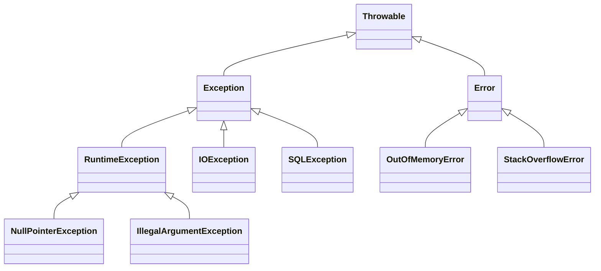
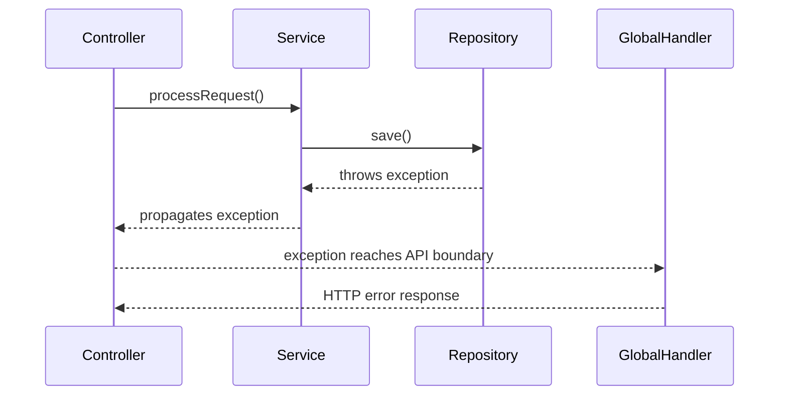
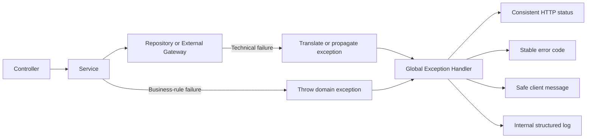

# Exception Handling in Java

## 1. Definition

Exception handling is Java’s mechanism for reporting, propagating, and responding to abnormal conditions during program execution.

Java exceptions are commonly divided into two categories:

### Checked exceptions

Checked exceptions are subclasses of `Exception` other than `RuntimeException`.

Examples:

```java
IOException
SQLException
ClassNotFoundException
InterruptedException
```

The compiler enforces the **catch-or-declare rule**:

```java
String readFile(Path path) throws IOException {
    return Files.readString(path);
}
```

The caller must either catch the exception:

```java
try {
    String content = readFile(Path.of("config.txt"));
} catch (IOException exception) {
    System.err.println("Unable to read configuration");
}
```

or propagate it:

```java
void loadConfiguration() throws IOException {
    String content = readFile(Path.of("config.txt"));
}
```

Checked exceptions do not occur at compile time. They occur at runtime, but the compiler verifies that they are caught or declared.

### Unchecked exceptions

Unchecked exceptions inherit from `RuntimeException`.

Examples:

```java
NullPointerException
IllegalArgumentException
IllegalStateException
IndexOutOfBoundsException
```

The compiler does not require them to be caught or declared:

```java
void registerUser(String username) {
    if (username == null || username.isBlank()) {
        throw new IllegalArgumentException(
                "Username must not be blank"
        );
    }
}
```

---

## 2. Why Exception Handling Exists

Exception handling separates normal application logic from failure-handling logic.

It allows applications to:

- Report meaningful failures
- Recover from expected external problems
- Propagate failures to the correct architectural layer
- Translate technical failures into domain-specific failures
- Release files, streams, sockets, and database resources
- Return consistent error responses from APIs
- Preserve the original cause and stack trace for debugging

Without exception handling, methods would need to return special values such as `null`, `-1`, or `false` for every possible failure.

```java
User findUser(long id);
```

A clearer failure model is:

```java
User findUser(long id) {
    return repository.findById(id)
            .orElseThrow(() ->
                    new UserNotFoundException(id)
            );
}
```

---

## 3. Exception Hierarchy



`Throwable` is the root type for both exceptions and errors.

Application code normally handles appropriate `Exception` types. Serious JVM failures such as `OutOfMemoryError` and `StackOverflowError` are generally not caught for normal recovery.

---

## 4. Checked vs Unchecked Exceptions

| Feature              | Checked exception                          | Unchecked exception                                                             |
| -------------------- | ------------------------------------------ | ------------------------------------------------------------------------------- |
| Hierarchy            | `Exception`, excluding `RuntimeException`  | `RuntimeException` subclasses                                                   |
| Compiler enforcement | Must be caught or declared                 | No catch-or-declare requirement                                                 |
| Typical use          | External failures callers may recover from | Invalid arguments, invalid state, programming defects, business-rule violations |
| Method signature     | Often appears in `throws`                  | Usually omitted                                                                 |
| Examples             | `IOException`, `SQLException`              | `IllegalArgumentException`, `NullPointerException`                              |
| Main advantage       | Makes failure handling explicit            | Keeps method signatures cleaner                                                 |
| Main disadvantage    | Can create repetitive propagation code     | Failures may be ignored until runtime                                           |

Checked does not automatically mean recoverable, and unchecked does not automatically mean unrecoverable. The choice should depend on the API contract and whether callers can meaningfully respond.

---

## 5. Exception Propagation

If a method does not catch an exception, it propagates to its caller.

```java
void controllerMethod() {
    serviceMethod();
}

void serviceMethod() {
    repositoryMethod();
}

void repositoryMethod() {
    throw new IllegalStateException("Database state is invalid");
}
```

Java moves upward through the call stack until it finds a compatible handler.



If no handler is found, the exception reaches the thread’s uncaught-exception handler and the thread terminates.

---

## 6. Creating Custom Exceptions

A custom exception communicates a failure using application-specific terminology.

```java
public class InsufficientFundsException
        extends RuntimeException {

    public InsufficientFundsException(String message) {
        super(message);
    }
}
```

Usage:

```java
import java.math.BigDecimal;

public class BankAccount {

    private BigDecimal balance;

    public BankAccount(BigDecimal balance) {
        this.balance = balance;
    }

    public void withdraw(BigDecimal amount) {
        if (amount == null ||
                amount.compareTo(BigDecimal.ZERO) <= 0) {

            throw new IllegalArgumentException(
                    "Withdrawal amount must be positive"
            );
        }

        if (amount.compareTo(balance) > 0) {
            throw new InsufficientFundsException(
                    "Available balance is insufficient"
            );
        }

        balance = balance.subtract(amount);
    }
}
```

This design distinguishes two failures:

- `IllegalArgumentException`: the caller supplied an invalid amount.
- `InsufficientFundsException`: the request is valid but violates a business rule.

---

## 7. Why Backend Services Often Use Unchecked Business Exceptions

Unchecked custom exceptions are commonly used for business-rule violations in layered backend applications.

```java
public Order cancelOrder(long orderId) {
    Order order = repository.findById(orderId)
            .orElseThrow(() ->
                    new OrderNotFoundException(orderId)
            );

    if (order.isShipped()) {
        throw new InvalidOrderStateException(
                "A shipped order cannot be cancelled"
        );
    }

    order.cancel();
    return repository.save(order);
}
```

Using checked exceptions for every business rule could force implementation details through all layers:

```java
Order cancelOrder(long id)
        throws OrderNotFoundException,
               InvalidOrderStateException,
               PersistenceException;
```

Unchecked domain exceptions keep service interfaces cleaner and can be translated at the application boundary.

However, unchecked exceptions should not be used merely to avoid thinking about failure handling. They still require clear documentation, testing, logging, and API mapping.

---

## 8. Preserving the Original Cause

When translating a low-level exception, retain the original exception as the cause.

```java
public Order loadOrder(long orderId) {
    try {
        return repository.findOrder(orderId);
    } catch (SQLException exception) {
        throw new OrderPersistenceException(
                "Failed to load order " + orderId,
                exception
        );
    }
}
```

Custom exception:

```java
public class OrderPersistenceException
        extends RuntimeException {

    public OrderPersistenceException(
            String message,
            Throwable cause
    ) {
        super(message, cause);
    }
}
```

Avoid losing the original cause:

```java
catch (SQLException exception) {
    throw new OrderPersistenceException(
            "Failed to load order"
    );
}
```

Without the cause, important stack-trace and database diagnostic information is lost.

---

# Global Exception Handling in Spring

## 9. Why Use Global Exception Handling?

A Spring REST application should generally avoid repeating `try-catch` blocks in every controller.

Instead of this:

```java
@PostMapping("/withdrawals")
ResponseEntity<?> withdraw(
        @RequestBody WithdrawalRequest request
) {
    try {
        accountService.withdraw(request.amount());
        return ResponseEntity.ok().build();
    } catch (InsufficientFundsException exception) {
        return ResponseEntity
                .status(HttpStatus.CONFLICT)
                .body(exception.getMessage());
    }
}
```

Let the controller focus on request handling:

```java
@PostMapping("/withdrawals")
ResponseEntity<Void> withdraw(
        @RequestBody WithdrawalRequest request
) {
    accountService.withdraw(request.amount());
    return ResponseEntity.noContent().build();
}
```

A global handler performs the exception-to-HTTP mapping.

---

## 10. Error Response Model

```java
import java.time.Instant;

public record ApiError(
        Instant timestamp,
        int status,
        String code,
        String message,
        String path
) {
}
```

Stable error codes are useful because clients should not depend only on human-readable messages.

Example:

```json
{
  "timestamp": "2026-07-21T14:30:00Z",
  "status": 409,
  "code": "INSUFFICIENT_FUNDS",
  "message": "Available balance is insufficient",
  "path": "/api/accounts/10/withdrawals"
}
```

---

## 11. Global Exception Handler

```java
import jakarta.servlet.http.HttpServletRequest;
import java.time.Instant;

import org.springframework.http.HttpStatus;
import org.springframework.http.ResponseEntity;
import org.springframework.web.bind.annotation.ExceptionHandler;
import org.springframework.web.bind.annotation.RestControllerAdvice;

@RestControllerAdvice
public class GlobalExceptionHandler {

    @ExceptionHandler(InsufficientFundsException.class)
    public ResponseEntity<ApiError> handleInsufficientFunds(
            InsufficientFundsException exception,
            HttpServletRequest request
    ) {
        ApiError error = new ApiError(
                Instant.now(),
                HttpStatus.CONFLICT.value(),
                "INSUFFICIENT_FUNDS",
                exception.getMessage(),
                request.getRequestURI()
        );

        return ResponseEntity
                .status(HttpStatus.CONFLICT)
                .body(error);
    }

    @ExceptionHandler(IllegalArgumentException.class)
    public ResponseEntity<ApiError> handleInvalidArgument(
            IllegalArgumentException exception,
            HttpServletRequest request
    ) {
        ApiError error = new ApiError(
                Instant.now(),
                HttpStatus.BAD_REQUEST.value(),
                "INVALID_ARGUMENT",
                exception.getMessage(),
                request.getRequestURI()
        );

        return ResponseEntity
                .badRequest()
                .body(error);
    }

    @ExceptionHandler(Exception.class)
    public ResponseEntity<ApiError> handleUnexpectedException(
            Exception exception,
            HttpServletRequest request
    ) {
        ApiError error = new ApiError(
                Instant.now(),
                HttpStatus.INTERNAL_SERVER_ERROR.value(),
                "INTERNAL_SERVER_ERROR",
                "An unexpected error occurred",
                request.getRequestURI()
        );

        return ResponseEntity
                .status(HttpStatus.INTERNAL_SERVER_ERROR)
                .body(error);
    }
}
```

The broad `Exception` handler should act as the final safety net, not replace specific handlers.

Unexpected exceptions should be logged with their complete stack traces, while internal details should not be returned to clients.

---

## 12. Typical Exception-to-HTTP Mapping

| Exception or failure                 |        Possible HTTP status |
| ------------------------------------ | --------------------------: |
| Invalid request field                |           `400 Bad Request` |
| Authentication missing or invalid    |          `401 Unauthorized` |
| Authenticated but not permitted      |             `403 Forbidden` |
| Resource does not exist              |             `404 Not Found` |
| Duplicate resource                   |              `409 Conflict` |
| Invalid resource state               |              `409 Conflict` |
| Valid request violates a domain rule |              `409` or `422` |
| Rate limit exceeded                  |     `429 Too Many Requests` |
| Unexpected server failure            | `500 Internal Server Error` |
| Downstream service unavailable       |              `502` or `503` |
| Downstream timeout                   |       `504 Gateway Timeout` |

The exact status should follow the API contract consistently.

---

# Resource Management

## 13. What Does Try-With-Resources Do?

Try-with-resources automatically closes objects that implement `AutoCloseable`.

```java
try (BufferedReader reader =
             Files.newBufferedReader(Path.of("data.txt"))) {

    String line;

    while ((line = reader.readLine()) != null) {
        System.out.println(line);
    }
}
```

The compiler effectively generates cleanup logic that closes the resource when the block exits.

It works when:

- The operation completes successfully
- The operation throws an exception
- The method returns from inside the block

Multiple resources can be declared:

```java
try (
        InputStream input =
                Files.newInputStream(source);
        OutputStream output =
                Files.newOutputStream(destination)
) {
    input.transferTo(output);
}
```

They are closed in reverse declaration order:

```text
output closes first
input closes second
```

---

## 14. Suppressed Exceptions

Suppose the main operation throws an exception and `close()` also throws an exception.

Try-with-resources keeps the operation exception as the primary exception and attaches the close failure as a suppressed exception.

```java
catch (IOException exception) {
    System.err.println(
            "Primary: " + exception.getMessage()
    );

    for (Throwable suppressed :
            exception.getSuppressed()) {

        System.err.println(
                "Suppressed: " + suppressed.getMessage()
        );
    }
}
```

This behavior is safer than many manually written `finally` blocks, where a close exception can hide the original failure.

---

# Production Use Case

## 15. Consistent REST API Failure Handling

Consider a payment API with these possible failures:

- Payment does not exist
- Payment has already been completed
- Insufficient funds
- Request validation failure
- Payment gateway unavailable
- Unexpected persistence failure

A strong design separates responsibilities:



This provides:

- Thin controllers
- Centralized status mapping
- Consistent response bodies
- Better logging and observability
- Reusable domain exceptions
- Reduced duplicate error-handling code

---

# Common Mistakes

## 16. Catching `Exception` Too Early

```java
try {
    processPayment();
} catch (Exception exception) {
    return false;
}
```

This hides:

- The actual failure type
- The stack trace
- Whether retry is appropriate
- Whether the error is a client or server problem

Catch an exception only where the application can meaningfully:

- Recover
- Add context
- Translate it
- Retry safely
- Map it to an external response

---

## 17. Swallowing Exceptions

```java
try {
    repository.save(order);
} catch (SQLException exception) {
    // Ignored
}
```

The caller may incorrectly believe the operation succeeded.

At minimum, propagate, translate, or log the failure appropriately.

---

## 18. Using Exceptions for Normal Control Flow

Avoid:

```java
try {
    return users.get(index);
} catch (IndexOutOfBoundsException exception) {
    return null;
}
```

Prefer:

```java
if (index < 0 || index >= users.size()) {
    return null;
}

return users.get(index);
```

Exceptions capture stack-trace information and make expected logic harder to understand.

---

## 19. Logging and Rethrowing at Every Layer

```java
catch (SQLException exception) {
    log.error("Database operation failed", exception);
    throw exception;
}
```

If every layer logs the same exception, one failure produces multiple nearly identical log entries.

Prefer to:

- Add context when translating
- Preserve the cause
- Log once at the appropriate handling boundary

---

## 20. Exposing Internal Exception Messages

Avoid returning this directly:

```java
return exception.getMessage();
```

It might reveal:

- SQL statements
- Database schema names
- File paths
- Internal hostnames
- Security implementation details

Return a controlled client message and retain technical details in internal logs.

---

## 21. Forgetting Try-With-Resources

Incorrect resource handling can leak:

- File descriptors
- Database connections
- Sockets
- Streams
- Operating-system handles

Prefer:

```java
try (Connection connection =
             dataSource.getConnection()) {

    // Database operation
}
```

---

## 22. Catching `Throwable`

```java
catch (Throwable throwable) {
    // Dangerous
}
```

This also catches serious errors such as:

- `OutOfMemoryError`
- `StackOverflowError`
- `LinkageError`

Normal application code should generally catch appropriate `Exception` types instead.

---

## 23. Returning `200 OK` for Failures

Avoid:

```json
{
  "success": false,
  "error": "Order not found"
}
```

with HTTP `200 OK`.

Use the correct HTTP status:

```http
HTTP/1.1 404 Not Found
```

and a structured response body.

---

# Trade-offs

## 24. Checked vs Unchecked

| Checked exceptions                        | Unchecked exceptions                            |
| ----------------------------------------- | ----------------------------------------------- |
| Compiler forces catch or declaration      | No compiler enforcement                         |
| Makes recoverable failures explicit       | Keeps method signatures cleaner                 |
| Useful for some external I/O contracts    | Useful for invalid state and business rules     |
| Can document failure behavior clearly     | Easier to propagate through application layers  |
| May create repetitive `throws` clauses    | Can be ignored until runtime                    |
| Can leak low-level details through layers | Requires documentation and disciplined handling |

---

## 25. Choosing Between Them

Consider a checked exception when:

- The caller can reasonably recover.
- Recovery is part of the method contract.
- You want every caller to explicitly acknowledge the failure.
- The API is low-level and directly models an external operation.

Consider an unchecked exception when:

- The caller violated a method contract.
- The application is in an invalid state.
- The failure represents a domain-rule violation.
- The exception should propagate to a centralized boundary.
- Forcing every intermediate layer to declare it adds no value.

Do not convert every checked exception into an unchecked exception without context. Translate it at an architectural boundary where the new exception communicates more useful meaning.

---

# Interview Questions

## Question 1: What is the difference between checked and unchecked exceptions?

Checked exceptions must be caught or declared because the compiler enforces the catch-or-declare rule. Unchecked exceptions extend `RuntimeException` and do not have that compiler requirement.

---

## Question 2: When would you create a custom checked exception?

Use one when callers can reasonably recover and the recovery requirement should be part of the API contract.

---

## Question 3: Why are business exceptions often unchecked?

They can propagate through service layers without repetitive `throws` declarations and be handled centrally at the application boundary.

---

## Question 4: What does try-with-resources do?

It automatically closes `AutoCloseable` resources, closes multiple resources in reverse order, and preserves close failures as suppressed exceptions.

---

## Question 5: What is the difference between `throw` and `throws`?

`throw` explicitly throws an exception object:

```java
throw new IllegalArgumentException("Invalid amount");
```

`throws` declares that a method may propagate an exception:

```java
String readFile(Path path) throws IOException {
    return Files.readString(path);
}
```

---

## Question 6: How would you design global exception handling for a REST API?

Use `@RestControllerAdvice` with specific `@ExceptionHandler` methods. Map domain and validation exceptions to consistent HTTP statuses and error codes, return safe client-facing messages, and log unexpected failures with correlation information.

---

## Question 7: Should every exception be logged where it is caught?

No. Log exceptions at the layer where they are finally handled or where meaningful context is added. Logging and rethrowing at every layer creates duplicate logs.

---

## Question 8: Why should the original cause be preserved?

It retains the original stack trace and technical details needed to diagnose the root failure.

```java
throw new PaymentException(
        "Payment processing failed",
        originalException
);
```

---

# Short Interview Answer

> Java has checked and unchecked exceptions. Checked exceptions are compiler-enforced through the catch-or-declare rule and are useful when the caller can reasonably recover. Unchecked exceptions extend `RuntimeException` and are commonly used for invalid inputs, invalid state, and business-rule violations. In backend services, I generally propagate meaningful domain exceptions and map them centrally using `@RestControllerAdvice`, producing consistent HTTP statuses and error responses while preserving and logging the original cause.

---

## Related Topics

- [REST API Development](../06-spring/rest-api.md)
- [Spring Boot Exception Handling](../06-spring/exception-handling.md)
- [Validation](../06-spring/validation.md)
- [Logging and Observability](../08-observability/logging.md)
- [Java I/O](io.md)
- [Resource Management](resource-management.md)
