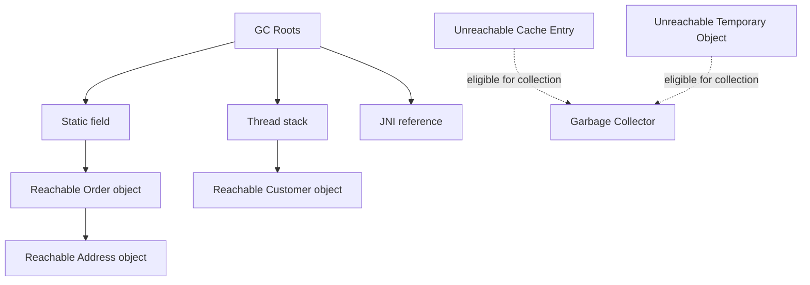
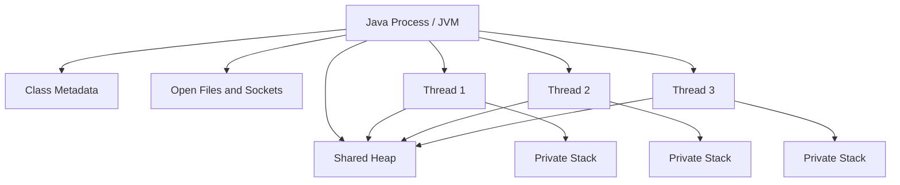
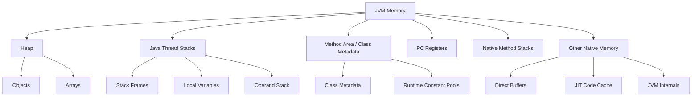
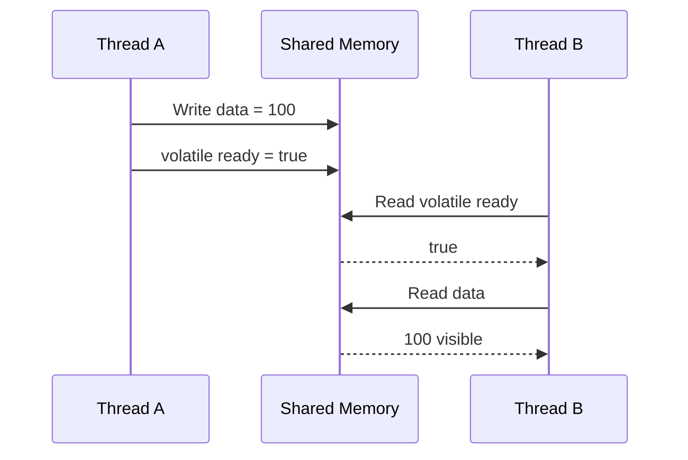
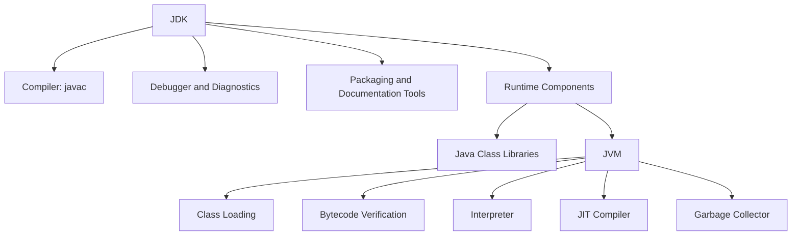

# Advanced Questions — JVM Memory, Garbage Collection, Threads, and Comparison

## Question 1: What is garbage collection in Java, and how does it work?

Garbage collection is the JVM’s automatic memory-reclamation mechanism. It identifies heap objects that are no longer **reachable** by the running application and reclaims their memory.

An object is not collected merely because a variable is set to `null`. It becomes eligible for collection only when no live path from a **GC root** can reach it.

Common GC roots include:

- Active thread stack variables
- Static fields
- JNI references
- JVM internal references
- Active synchronization monitors



### Example

```java
Customer customer = new Customer();
customer = null;
```

The original `Customer` object may become eligible for garbage collection, provided no other reference points to it.

### Simplified garbage-collection process

1. **Allocation**
   New objects are generally allocated on the heap.

2. **Reachability analysis**
   The collector starts from GC roots and traces reachable objects.

3. **Identification**
   Objects not reachable from any GC root are considered garbage.

4. **Reclamation**
   The JVM reclaims their memory.

5. **Compaction or relocation**
   Some collectors move surviving objects to reduce fragmentation.

### Generational collection

Most applications create many short-lived objects, so JVM collectors commonly use generational techniques.

```text
New object
    ↓
Young generation
    ↓ survives collections
Old generation
```

- **Young collection:** Primarily processes recently created objects.
- **Old-generation collection:** Processes longer-lived objects.
- **Full collection:** May process most or all heap regions and can be expensive.

The exact memory organization depends on the selected collector.

### Common collectors

Depending on the JVM and application requirements, collectors may include:

- Serial GC
- Parallel GC
- G1 GC
- ZGC
- Shenandoah GC

Collectors have different trade-offs among:

- Throughput
- Pause time
- Memory overhead
- CPU usage
- Heap size
- Application latency

### Important points

- Garbage collection manages memory, not arbitrary resources.
- It does not close database connections, files, sockets, or streams reliably.
- `System.gc()` only requests collection; it does not guarantee immediate execution.
- Object reclamation time is nondeterministic.
- `finalize()` must not be used for cleanup.

Use try-with-resources for external resources:

```java
try (Connection connection = dataSource.getConnection()) {
    // Use connection
}
```

### Interview-ready answer

> Garbage collection automatically reclaims heap memory occupied by objects that are no longer reachable from GC roots. The JVM performs reachability analysis, identifies unreachable objects, reclaims their memory, and may compact or relocate surviving objects. Modern collectors use techniques such as generational collection and concurrent processing to balance throughput and pause time.

---

## Question 2: What is the difference between `Comparable` and `Comparator`, and when do you use each?

Both interfaces define object ordering, but they place the comparison logic in different locations.

| `Comparable<T>`                         | `Comparator<T>`                      |
| --------------------------------------- | ------------------------------------ |
| Defines a class’s natural ordering      | Defines an external/custom ordering  |
| Implemented by the class being compared | Implemented separately               |
| Method: `compareTo(T other)`            | Method: `compare(T first, T second)` |
| Located in `java.lang`                  | Located in `java.util`               |
| Usually one natural order               | Supports multiple alternative orders |
| Modifies or controls the domain class   | Can sort classes you cannot modify   |

---

### Using `Comparable`

```java
public final class Employee
        implements Comparable<Employee> {

    private final long id;
    private final String name;

    public Employee(long id, String name) {
        this.id = id;
        this.name = name;
    }

    @Override
    public int compareTo(Employee other) {
        return Long.compare(this.id, other.id);
    }
}
```

Usage:

```java
List<Employee> employees = new ArrayList<>();

employees.add(new Employee(3, "Carol"));
employees.add(new Employee(1, "Alice"));
employees.add(new Employee(2, "Bob"));

Collections.sort(employees);
```

Here, employee ID represents the natural ordering.

---

### Using `Comparator`

```java
Comparator<Employee> byName =
        Comparator.comparing(Employee::getName);

employees.sort(byName);
```

Multiple criteria:

```java
Comparator<Employee> byDepartmentThenName =
        Comparator.comparing(Employee::getDepartment)
                  .thenComparing(Employee::getName);
```

Descending order:

```java
employees.sort(
        Comparator.comparing(Employee::getSalary)
                  .reversed()
);
```

Null handling:

```java
Comparator<Employee> comparator =
        Comparator.comparing(
                Employee::getName,
                Comparator.nullsLast(
                        String.CASE_INSENSITIVE_ORDER
                )
        );
```

### When should each be used?

Use `Comparable` when:

- The class has one clear natural ordering.
- That ordering is fundamental to the class.
- You control the class implementation.

Examples:

- Dates ordered chronologically
- Numbers ordered numerically
- Version objects ordered by version number

Use `Comparator` when:

- Multiple sorting strategies are required.
- You cannot modify the target class.
- Sorting depends on context.
- The desired order is not the natural order.

### Avoid subtraction in comparisons

Incorrect:

```java
return first.age - second.age;
```

This may overflow.

Correct:

```java
return Integer.compare(first.age, second.age);
```

### Consistency with `equals()`

Sorted sets and maps use comparison results to determine uniqueness.

```java
comparisonResult == 0
```

If `compareTo()` returns `0` for objects that are not equal according to `equals()`, collections such as `TreeSet` may behave unexpectedly.

### Interview-ready answer

> `Comparable` defines the natural ordering inside the class using `compareTo()`. `Comparator` defines external or alternative orderings using `compare()`. I use `Comparable` when a domain type has one obvious natural order and `Comparator` when I need multiple sorting strategies or cannot modify the class.

---

## Question 3: What is the difference between a process and a thread?

A process is an independently executing program with its own address space. A thread is a unit of execution inside a process.

| Feature            | Process                              | Thread                                          |
| ------------------ | ------------------------------------ | ----------------------------------------------- |
| Memory             | Separate virtual address space       | Shares process memory                           |
| Heap               | Has its own heap                     | Shares the process heap                         |
| Stack              | Contains one or more thread stacks   | Each thread has its own stack                   |
| Creation cost      | Relatively expensive                 | Generally less expensive                        |
| Communication      | IPC, sockets, pipes or shared memory | Shared objects and concurrent utilities         |
| Failure isolation  | Better isolation                     | A serious thread failure can affect the process |
| Context switching  | Usually more expensive               | Usually less expensive                          |
| Resource ownership | Owns process-level resources         | Uses resources owned by the process             |
| Security boundary  | Stronger                             | Threads share the same security context         |



### Process example

Running two Java applications usually creates two JVM processes:

```bash
java OrderService
java PaymentService
```

Each process normally has its own:

- JVM instance
- Heap
- Class metadata
- Garbage collector
- Operating-system resources

### Thread example

```java
Thread first = new Thread(() ->
        processOrders()
);

Thread second = new Thread(() ->
        sendNotifications()
);

first.start();
second.start();
```

Both threads run inside the same JVM process and can access shared objects.

### Communication differences

Processes communicate through mechanisms such as:

- HTTP
- TCP sockets
- Pipes
- Message queues
- Shared memory
- Files

Threads communicate through shared memory and coordination tools such as:

- `synchronized`
- Locks
- Atomic variables
- Concurrent collections
- `BlockingQueue`
- `CompletableFuture`

### Interview-ready answer

> A process is an independently executing program with its own address space and resources. A thread is a lightweight execution path within a process. Threads share the process heap and resources but have separate stacks and program counters. Thread communication is faster through shared memory, but it requires synchronization to prevent race conditions.

---

## Question 4: How does Java manage memory?

Java uses a combination of:

- Automatic heap management
- Per-thread stack management
- Class metadata storage
- Native memory
- Garbage collection
- JIT compiler optimizations

### Main JVM memory areas



### Heap

The heap stores most objects and arrays.

```java
Order order = new Order();
```

The object is generally allocated on the heap, while the reference may exist in a local variable or object field.

### Thread stacks

Each thread has its own stack containing method frames.

A frame may contain:

- Local variables
- Operand stack
- Return information
- Method execution state

Deep or infinite recursion can exhaust the stack:

```java
void recurse() {
    recurse();
}
```

Result:

```text
StackOverflowError
```

### Class metadata

Class definitions and related metadata are stored in JVM-managed memory. In HotSpot JVM terminology, class metadata is commonly associated with Metaspace.

Excessive dynamic class loading or class-loader leaks can cause:

```text
OutOfMemoryError: Metaspace
```

### Native memory

The JVM also uses memory outside the Java heap for:

- Thread stacks
- Direct byte buffers
- Native libraries
- JIT-compiled machine code
- Garbage-collector structures
- JVM internals

Therefore, increasing `-Xmx` does not solve every memory problem.

### Automatic memory management

The JVM:

1. Allocates objects.
2. Tracks reachability.
3. Reclaims unreachable heap objects.
4. May relocate surviving objects.
5. Expands or contracts memory regions within configured limits.
6. Optimizes allocation through thread-local buffers and JIT techniques.

### Important correction

It is incomplete to say:

> Objects are deallocated when they are no longer referenced.

More accurately:

> Objects become eligible for collection when they are no longer reachable from any GC root.

An object can still be referenced but no longer useful, creating a logical memory leak.

---

## Question 5: What is the Java Memory Model?

The Java Memory Model defines the legal interactions between threads and shared memory.

It specifies rules for:

- Visibility
- Ordering
- Atomicity
- Synchronization
- Data races
- Safe publication
- Happens-before relationships

The JMM is not the same as JVM memory areas such as heap, stack and Metaspace.

---

### Visibility problem

```java
class Worker {

    private boolean running = true;

    void run() {
        while (running) {
            // Work
        }
    }

    void stop() {
        running = false;
    }
}
```

Without synchronization, the running thread is not guaranteed to observe the updated value promptly.

Using `volatile`:

```java
private volatile boolean running = true;
```

A volatile write happens-before a subsequent volatile read of the same variable.

---

### Happens-before relationships

Important examples include:

- Unlocking a monitor happens-before a later lock of the same monitor.
- Writing a volatile variable happens-before a later read of that variable.
- Calling `Thread.start()` happens-before actions in the started thread.
- Actions in a thread happen-before another thread successfully returns from `join()`.
- Completing object construction correctly is necessary for safe publication.



### Atomicity

Some operations are individually atomic, but compound operations generally are not.

```java
count++;
```

This involves:

1. Read
2. Increment
3. Write

Use:

```java
AtomicInteger count = new AtomicInteger();
count.incrementAndGet();
```

or synchronization when a larger invariant must be protected.

### Data race

A data race occurs when:

- Two threads access the same variable concurrently.
- At least one access is a write.
- The accesses are not correctly synchronized.

Data races can cause stale reads, lost updates and unexpected ordering.

### Interview-ready answer

> The Java Memory Model defines how threads communicate through shared memory. It specifies visibility, ordering and atomicity guarantees and defines happens-before relationships for constructs such as synchronized blocks, volatile variables, thread start and join. Without these relationships, one thread may observe stale or inconsistently ordered data.

---

## Question 6: Can Java applications have memory leaks even with garbage collection?

Yes.

A Java memory leak occurs when objects are no longer useful to the application but remain reachable, preventing garbage collection.

```java
class Cache {

    private static final Map<String, byte[]> DATA =
            new HashMap<>();

    static void store(String key, byte[] value) {
        DATA.put(key, value);
    }
}
```

If entries are never removed, the map continues retaining data indefinitely.

The garbage collector is working correctly—the objects are still reachable through the static map.

### Common causes

- Unbounded caches
- Static collections
- Listeners that are never unregistered
- `ThreadLocal` values not removed
- Class-loader leaks
- Queues that grow faster than consumers process them
- Retaining complete object graphs unnecessarily
- Incorrect `equals()` and `hashCode()` usage
- Long-lived sessions
- In-memory request or response history
- Non-closed native or direct resources
- Lambda or inner-class references retaining outer objects

### `ThreadLocal` example

```java
private static final ThreadLocal<RequestContext> CONTEXT =
        new ThreadLocal<>();

void process(Request request) {
    try {
        CONTEXT.set(createContext(request));
        handle(request);
    } finally {
        CONTEXT.remove();
    }
}
```

This is especially important with thread pools because worker threads are reused and may remain alive for the application’s lifetime.

### Resource leak vs memory leak

A resource leak is not always a Java heap leak.

Examples:

- Unclosed files
- Database connections
- Sockets
- Direct buffers
- Native handles

Use deterministic resource cleanup:

```java
try (InputStream input = Files.newInputStream(path)) {
    // Process file
}
```

---

## Question 7: How would you investigate a Java memory leak?

A memory-leak investigation should be evidence-driven.

### Step 1: Confirm the symptom

Check whether memory usage:

- Grows continuously under a stable workload
- Drops after garbage collection
- Returns to a stable baseline
- Eventually causes excessive GC or `OutOfMemoryError`

High memory usage alone is not necessarily a leak. The application may legitimately require a large live data set.

---

### Step 2: Identify the affected memory area

Inspect the exact error or metric:

```text
OutOfMemoryError: Java heap space
OutOfMemoryError: Metaspace
OutOfMemoryError: Direct buffer memory
OutOfMemoryError: unable to create native thread
GC overhead limit exceeded
```

Each indicates a different investigation path.

---

### Step 3: Enable appropriate diagnostics

Useful JVM options include:

```bash
-XX:+HeapDumpOnOutOfMemoryError
-XX:HeapDumpPath=/var/log/app/heapdump.hprof
```

Enable GC logging using options suitable for the Java version.

Capture runtime information with tools such as:

```bash
jcmd <pid> GC.heap_info
jcmd <pid> GC.class_histogram
jcmd <pid> VM.native_memory summary
jcmd <pid> Thread.print
```

A heap dump may also be requested with JVM tools when operationally safe.

---

### Step 4: Analyze the heap dump

Tools may include:

- Eclipse Memory Analyzer
- VisualVM
- Java Flight Recorder
- JDK Mission Control
- Commercial profilers

Inspect:

- Dominator tree
- Retained size
- Shallow size
- Largest object groups
- Paths to GC roots
- Duplicate object groups
- Class-loader retention
- Collection sizes

### Shallow size vs retained size

- **Shallow size:** Memory occupied by the object itself.
- **Retained size:** Memory that would become reclaimable if that object were collected.

An object with a small shallow size may retain a very large object graph.

---

### Step 5: Compare multiple snapshots

A single heap dump shows what exists at one moment.

Capture snapshots at different points:

```text
T1: after startup
T2: after 30 minutes
T3: after 2 hours
```

Compare which classes and retained object graphs continue growing.

---

### Step 6: Find the GC-root retention path

Example:

```text
Static field
  → Cache
    → HashMap
      → Entry
        → Large response object
```

The path explains why the object cannot be collected.

---

### Step 7: Correlate with application behavior

Check whether growth is related to:

- Specific endpoints
- Traffic spikes
- Failed downstream calls
- Retry queues
- Batch processing
- User sessions
- Cache misses
- Deployments
- Scheduled jobs
- Message-consumer lag

---

### Step 8: Fix the retention cause

Possible fixes include:

- Add cache size limits and eviction.
- Remove unused listeners.
- Clear `ThreadLocal` values.
- Bound queues.
- Stream large files instead of loading them entirely.
- Avoid storing complete request or response bodies.
- Fix class-loader retention.
- Release native resources.
- Reduce session size or lifetime.
- Replace strong references with suitable reference strategies only when justified.

Do not automatically increase the heap. A larger heap may only delay the failure and increase GC pause duration.

### Interview-ready answer

> I first confirm whether the live set keeps growing after full garbage collections and identify which memory area is affected. Then I collect GC logs, class histograms, JFR data and a heap dump. In the heap dump, I inspect dominator trees, retained sizes and paths to GC roots to find what is retaining objects. I correlate that growth with application traffic and features, fix the retaining reference—such as an unbounded cache, queue or ThreadLocal—and verify the fix under the same workload.

---

## Question 8: What is the difference between JDK, JRE, and JVM?

| Component | Meaning                  | Responsibility                                |
| --------- | ------------------------ | --------------------------------------------- |
| JVM       | Java Virtual Machine     | Loads, verifies and executes bytecode         |
| JRE       | Java Runtime Environment | Runtime libraries and JVM components          |
| JDK       | Java Development Kit     | JRE/runtime components plus development tools |



### JVM

The JVM:

- Loads classes
- Verifies bytecode
- Executes bytecode
- Performs JIT compilation
- Manages runtime memory
- Performs garbage collection
- Coordinates threads

It is inaccurate to describe the JVM only as a line-by-line interpreter. Modern JVMs combine interpretation and JIT compilation.

### JRE

Conceptually, the JRE contains:

- JVM
- Standard runtime classes
- Supporting runtime components

Modern JDK distributions may not provide a separately installed public JRE, but the runtime concept remains useful.

### JDK

The JDK includes tools such as:

```text
javac
java
jar
javadoc
jdb
jcmd
jfr
jlink
jpackage
```

### Interview-ready answer

> The JVM executes Java bytecode and manages runtime concerns such as memory, threads and garbage collection. The JRE is the runtime environment containing the JVM and runtime libraries. The JDK contains the runtime plus development, packaging, debugging and diagnostic tools.

---

## Question 9: What is the difference between `length`, `length()` and `size()`?

They are used with different data structures.

| Syntax              | Applies to           | Meaning                        |
| ------------------- | -------------------- | ------------------------------ |
| `array.length`      | Arrays               | Number of array elements       |
| `string.length()`   | `String`             | Number of UTF-16 code units    |
| `collection.size()` | Collections and maps | Number of elements or mappings |

### Array `length`

```java
int[] values = new int[3];

System.out.println(values.length); // 3
```

`length` is a field-like array property, not a method.

Incorrect:

```java
values.length();
```

---

### String `length()`

```java
String language = "Java";

System.out.println(language.length()); // 4
```

Incorrect:

```java
language.length;
```

`String.length()` is a method. It is not accurate to call it a “final method” merely to contrast it with array length.

### Unicode consideration

`String.length()` returns the number of UTF-16 code units, not necessarily the number of user-perceived characters.

```java
String symbol = "😀";

System.out.println(symbol.length()); // 2
```

Count Unicode code points:

```java
int codePoints = symbol.codePointCount(
        0,
        symbol.length()
);

System.out.println(codePoints); // 1
```

Even code-point count may differ from the number of user-perceived grapheme clusters.

---

### Collection `size()`

```java
List<String> names =
        List.of("Alice", "Bob", "Carol");

System.out.println(names.size()); // 3
```

Map example:

```java
Map<String, Integer> scores =
        Map.of("Alice", 90, "Bob", 80);

System.out.println(scores.size()); // 2
```

### Interview-ready answer

> Arrays use the `length` field, strings use the `length()` method, and collections or maps use `size()`. Array length reports the number of slots, String length reports UTF-16 code units, and collection size reports the current number of elements or mappings.

---

# Repository Cleanup

These questions should not all remain in one advanced file.

## Suggested placement

```text
java/
├── 01-core-java/
│   ├── advanced-questions.md
│   └── strings/
│       └── basic-questions.md
├── 02-collections/
│   └── sorting/
│       └── advanced-questions.md
├── 04-concurrency/
│   ├── advanced-questions.md
│   └── java-memory-model.md
└── 05-jvm/
    ├── garbage-collection.md
    ├── memory-management.md
    ├── memory-leaks.md
    └── jdk-jre-jvm.md
```

| Original question            | Recommended file                               |
| ---------------------------- | ---------------------------------------------- |
| Garbage collection           | `05-jvm/garbage-collection.md`                 |
| `Comparable` vs `Comparator` | `02-collections/sorting/advanced-questions.md` |
| Thread vs process            | `04-concurrency/advanced-questions.md`         |
| Java memory management       | `05-jvm/memory-management.md`                  |
| Java Memory Model            | `04-concurrency/java-memory-model.md`          |
| Java memory leaks            | `05-jvm/memory-leaks.md`                       |
| Memory-leak investigation    | `05-jvm/memory-leaks.md`                       |
| JDK vs JRE vs JVM            | `05-jvm/jdk-jre-jvm.md`                        |
| `length` vs `length()`       | `01-core-java/strings/basic-questions.md`      |

Questions about garbage collection, Java memory management, memory leaks and leak investigation are closely related, but they should remain separate interview questions with a shared theory page rather than repeating the same short explanation.
