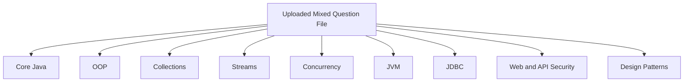
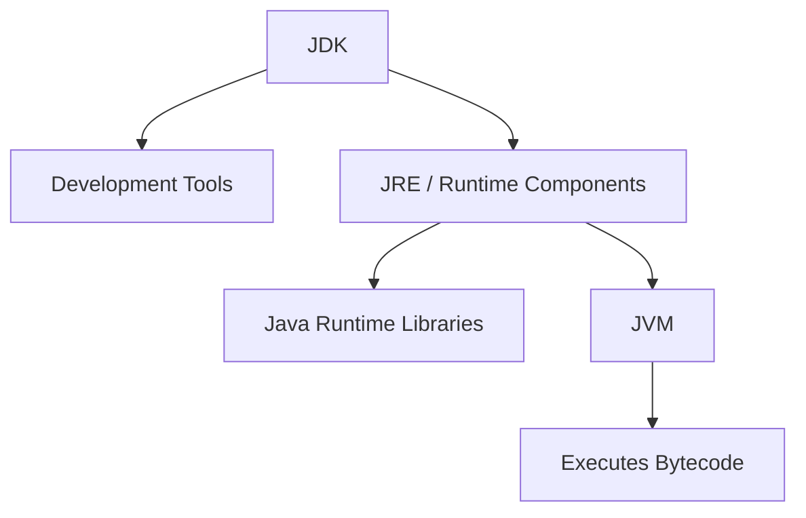
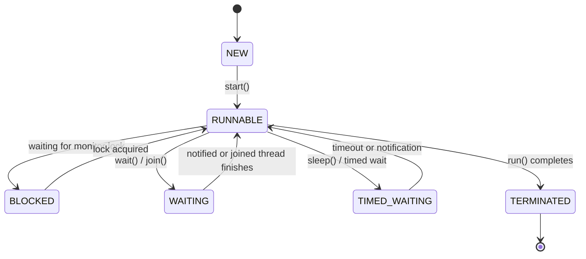
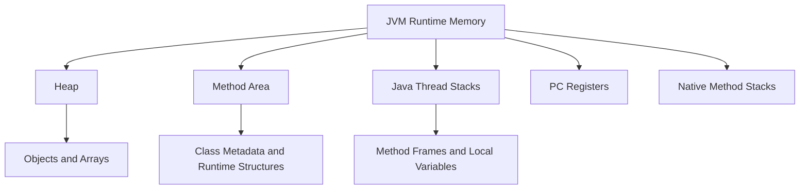

I treated the uploaded markdown as the next interview-preparation file to clean and reorganize. It currently combines Core Java, OOP, Collections, Streams, Concurrency, JVM, JDBC, REST security, design patterns, and web fundamentals in one file, with several duplicates and inaccurate answers.

# Recommended Repository Split

```text
java/
├── 01-core-java/
│   ├── basic-questions.md
│   ├── oop/
│   │   └── basic-questions.md
│   ├── generics/
│   │   └── basic-questions.md
│   └── serialization/
│       └── basic-questions.md
├── 02-collections/
│   ├── basic-questions.md
│   ├── maps/
│   │   └── basic-questions.md
│   ├── sets/
│   │   └── basic-questions.md
│   └── sorting/
│       └── basic-questions.md
├── 03-streams/
│   └── basic-questions.md
├── 04-concurrency/
│   └── basic-questions.md
├── 05-jvm/
│   └── basic-questions.md
├── 06-database/
│   └── jdbc-basic-questions.md
├── 07-web/
│   └── basic-questions.md
├── 08-api-security/
│   └── basic-questions.md
└── 09-design-patterns/
    └── basic-questions.md
```



---

# `01-core-java/basic-questions.md`

## Question 1: What is Java?

Java is a high-level, class-based, strongly typed, general-purpose programming language.

Java source code is compiled into bytecode, which runs on a Java Virtual Machine. This allows the same compiled application to run on different operating systems that provide a compatible JVM.

```java
public class HelloWorld {

    public static void main(String[] args) {
        System.out.println("Hello, Java!");
    }
}
```

---

## Question 2: What are the main features of Java?

Important Java features include:

- Platform independence
- Object-oriented programming
- Automatic memory management
- Strong type checking
- Exception handling
- Multithreading support
- Rich standard library
- Runtime optimization through JIT compilation
- Security features such as bytecode verification
- Support for distributed and network applications

Java is not completely object-oriented because it has primitive types such as `int`, `char`, and `boolean`.

---

## Question 3: Why is Java platform-independent?

Java source code is compiled into platform-independent bytecode.

```text
Java source code
      ↓ javac
Java bytecode
      ↓ JVM
Native machine instructions
```

Each operating system has its own JVM implementation, but every compatible JVM understands the same bytecode.

This is commonly described as:

> Write Once, Run Anywhere.

The JVM is platform-specific, while Java bytecode is platform-independent.

---

## Question 4: What is the difference between Java and JavaScript?

| Java                                              | JavaScript                                        |
| ------------------------------------------------- | ------------------------------------------------- |
| General-purpose programming language              | General-purpose scripting/programming language    |
| Statically typed                                  | Dynamically typed                                 |
| Uses JVM bytecode                                 | Commonly executed by a JavaScript engine          |
| Class-based object model                          | Prototype-based object model                      |
| Common in backend, enterprise and Android systems | Common in browsers, frontend and Node.js backends |
| Usually compiled before execution                 | Parsed and JIT-compiled by modern engines         |

JavaScript is not limited to browsers. It can also run on servers through environments such as Node.js.

Despite their names, Java and JavaScript are different languages.

---

## Question 5: What is the difference between JDK, JRE, and JVM?

| Component | Purpose                                                                  |
| --------- | ------------------------------------------------------------------------ |
| JVM       | Executes Java bytecode                                                   |
| JRE       | Provides the JVM and runtime libraries required to run Java applications |
| JDK       | Provides development tools, runtime components and the JVM               |

The JDK contains tools such as:

- `javac` — compiler
- `java` — application launcher
- `javadoc` — documentation generator
- `jar` — archive tool
- `jdb` — debugger
- `jlink` and `jpackage` — runtime and packaging tools



Modern Java distributions do not always provide a separate end-user JRE download, but the conceptual distinction remains useful in interviews.

---

## Question 6: What is the purpose of the `main()` method?

For a traditional Java application, `main()` is the entry point used by the Java launcher.

```java
public static void main(String[] args) {
    System.out.println("Application started");
}
```

Explanation:

- `public`: the launcher must be able to access it.
- `static`: it can be called without creating an object.
- `void`: it does not return a value.
- `main`: recognized entry-point name.
- `String[] args`: contains command-line arguments.

Example:

```bash
java Application development production
```

```java
System.out.println(args[0]); // development
System.out.println(args[1]); // production
```

Framework-based applications may have different runtime entry mechanisms internally, but the Java launcher convention remains important.

---

## Question 7: Can a Java application run without a `main()` method?

A class launched directly using the traditional `java ClassName` command normally requires a valid `main()` method.

Older Java versions allowed static initialization code to execute before the launcher reported that `main()` was missing. This was not a proper replacement for a program entry point.

Modern Java applications may be started indirectly through:

- Application servers
- Servlet containers
- Testing frameworks
- JavaFX launchers
- Build tools
- Framework bootstrap code

However, some component in the runtime still provides an entry mechanism.

---

## Question 8: What are access modifiers in Java?

Java provides four access levels:

| Modifier        | Same class | Same package |       Subclass outside package | Everywhere |
| --------------- | ---------: | -----------: | -----------------------------: | ---------: |
| `private`       |        Yes |           No |                             No |         No |
| Package-private |        Yes |          Yes |                             No |         No |
| `protected`     |        Yes |          Yes | Yes, through inheritance rules |         No |
| `public`        |        Yes |          Yes |                            Yes |        Yes |

Package-private access is used when no access modifier is declared:

```java
class OrderValidator {
}
```

Example:

```java
public class Account {

    private double balance;

    protected void validate() {
    }

    public double getBalance() {
        return balance;
    }
}
```

Access modifiers support encapsulation and reduce unnecessary coupling.

---

## Question 9: What is a package in Java?

A package is a namespace used to organize related Java types.

A package can contain:

- Classes
- Interfaces
- Enums
- Records
- Annotation interfaces
- Exceptions

```java
package com.example.orders;
```

Benefits include:

- Avoiding naming conflicts
- Organizing source code
- Supporting package-level access
- Improving maintainability
- Creating modular application structures

Recommended naming convention:

```text
com.company.project.feature
```

Package names normally use lowercase letters.

---

## Question 10: How do you import classes and packages?

Import a specific class:

```java
import java.util.ArrayList;
```

Import all accessible types in one package:

```java
import java.util.*;
```

A wildcard import does not import subpackages.

This:

```java
import java.util.*;
```

does not import:

```java
java.util.concurrent.ExecutorService
```

The `java.lang` package is imported automatically:

```java
String value = "Java";
System.out.println(value);
```

No explicit import is needed for `String`, `Object`, `Math`, or `System`.

There is no “default package import.” The unnamed or default package is a separate concept and should generally be avoided in production projects.

---

## Question 11: What is a static import?

A static import allows static members to be referenced without qualifying them with the class name.

```java
import static java.lang.Math.PI;
import static java.lang.Math.sqrt;
```

```java
double radius = 10;
double area = PI * radius * radius;
double root = sqrt(25);
```

Static imports should be used carefully because excessive use can make it unclear where a member comes from.

---

## Question 12: What does the `instanceof` operator do?

`instanceof` checks whether an object is compatible with a class or interface type.

```java
if (animal instanceof Dog) {
    Dog dog = (Dog) animal;
    dog.bark();
}
```

Modern pattern matching can combine the test and cast:

```java
if (animal instanceof Dog dog) {
    dog.bark();
}
```

If the reference is `null`, `instanceof` returns `false`.

```java
Object value = null;

System.out.println(value instanceof String); // false
```

---

## Question 13: What is an enum?

An enum defines a fixed set of named constants.

```java
public enum OrderStatus {
    CREATED,
    CONFIRMED,
    CANCELLED
}
```

Usage:

```java
OrderStatus status = OrderStatus.CREATED;
```

Java enums can contain fields, constructors and methods:

```java
public enum Priority {

    LOW(1),
    MEDIUM(2),
    HIGH(3);

    private final int level;

    Priority(int level) {
        this.level = level;
    }

    public int getLevel() {
        return level;
    }
}
```

Enums are safer than using unrelated strings or integer constants.

---

## Question 14: What are annotations?

Annotations provide metadata about Java program elements.

Built-in examples:

```java
@Override
@Deprecated
@SuppressWarnings("unchecked")
```

Custom annotation:

```java
import java.lang.annotation.Retention;
import java.lang.annotation.RetentionPolicy;

@Retention(RetentionPolicy.RUNTIME)
public @interface Audited {
}
```

Usage:

```java
@Audited
public void transferMoney() {
}
```

Annotations are widely used by frameworks for:

- Dependency injection
- Validation
- Transaction management
- ORM mapping
- Security
- REST endpoint mapping
- Testing

---

## Question 15: What is immutability?

An immutable object cannot have its observable state changed after construction.

Example:

```java
public final class Money {

    private final long amount;
    private final String currency;

    public Money(long amount, String currency) {
        this.amount = amount;
        this.currency = currency;
    }

    public long getAmount() {
        return amount;
    }

    public String getCurrency() {
        return currency;
    }
}
```

Guidelines:

- Make fields `private` and `final`.
- Initialize all state in the constructor.
- Do not expose mutator methods.
- Prevent subclass-based mutation where appropriate.
- Defensively copy mutable input and output values.

Examples of immutable Java types include:

- `String`
- Wrapper classes
- `LocalDate`
- Many records, depending on their fields

Immutability improves predictability and thread safety.

---

## Question 16: What is reflection?

Reflection allows code to inspect classes, fields, constructors, methods and annotations at runtime.

```java
Class<?> type = String.class;

System.out.println(type.getName());

for (var method : type.getDeclaredMethods()) {
    System.out.println(method.getName());
}
```

Reflection is used by:

- Spring dependency injection
- Hibernate and JPA
- Serialization libraries
- Test frameworks
- Dependency injection containers
- Plugin systems

Trade-offs include:

- Reduced compile-time safety
- More difficult refactoring
- Possible access-control issues
- Performance overhead
- Complications for native images and modular applications

---

## Question 17: What are Java modules?

The Java Platform Module System was introduced in Java 9.

A module groups related packages and explicitly declares:

- Which modules it depends on
- Which packages it exposes

Example `module-info.java`:

```java
module com.example.orders {
    requires java.sql;

    exports com.example.orders.api;
}
```

Benefits include:

- Stronger encapsulation
- Explicit dependency declarations
- Smaller custom runtime images
- More reliable application configuration

Modules are especially useful for large applications and Java platform internals, though many Spring projects still primarily use Maven or Gradle modules.

---

## Question 18: What is a native method?

A native method is implemented in a language other than Java, commonly C or C++.

```java
public native int performNativeCalculation(int value);
```

Native methods are accessed through technologies such as JNI.

Use cases include:

- Operating-system integration
- Existing native libraries
- Hardware access
- Performance-sensitive specialized code

Native code reduces portability and introduces additional safety and deployment concerns.

---

## Question 19: What is recursion?

Recursion occurs when a method calls itself directly or indirectly.

```java
static int factorial(int number) {
    if (number <= 1) {
        return 1;
    }

    return number * factorial(number - 1);
}
```

A recursive algorithm requires:

1. A base case
2. Progress toward the base case

Missing or unreachable base cases may cause `StackOverflowError`.

Recursion is not dependent on post-increment or decrement operators.

---

## Question 20: Is Java pass-by-value or pass-by-reference?

Java is always pass-by-value.

For primitives, the primitive value is copied.

```java
static void increment(int value) {
    value++;
}
```

For objects, the reference value is copied.

```java
static void update(StringBuilder builder) {
    builder.append(" updated");
}
```

The caller and parameter may refer to the same object, so mutation is visible. Reassigning the parameter changes only the method’s local copy.

---

# `01-core-java/oop/basic-questions.md`

## Question 1: What is method overriding?

Method overriding occurs when a subclass provides its own implementation of an inherited instance method.

```java
class Animal {

    public void move() {
        System.out.println("Animal moves");
    }
}

class Dog extends Animal {

    @Override
    public void move() {
        System.out.println("Dog runs");
    }
}
```

```java
Animal animal = new Dog();
animal.move(); // Dog runs
```

Rules include:

- Same method name
- Same parameter list
- Same or covariant return type
- Access level cannot be made more restrictive
- Checked exceptions cannot be broadened
- Static, private and final methods are not overridden

Runtime method dispatch selects the implementation based on the actual object type.

---

## Question 2: What is method hiding?

Method hiding occurs when a subclass declares a static method with the same signature as a static method in its parent class.

```java
class Parent {

    static void display() {
        System.out.println("Parent");
    }
}

class Child extends Parent {

    static void display() {
        System.out.println("Child");
    }
}
```

```java
Parent reference = new Child();
reference.display(); // Parent
```

Static methods are selected using the reference or class type, not through runtime polymorphism.

| Method overriding             | Method hiding                         |
| ----------------------------- | ------------------------------------- |
| Instance methods              | Static methods                        |
| Runtime dispatch              | Compile-time selection                |
| Based on actual object type   | Based on reference/class type         |
| Supports runtime polymorphism | Does not provide runtime polymorphism |

Method hiding should not be described as normal method overriding.

---

## Question 3: What is a Has-A relationship?

A Has-A relationship means one object contains or refers to another object.

```java
class Engine {
}

class Car {

    private final Engine engine;

    Car(Engine engine) {
        this.engine = engine;
    }
}
```

### Composition

The contained object’s lifecycle strongly depends on the container.

```java
class House {

    private final Room room = new Room();
}
```

### Aggregation

The contained object can exist independently.

```java
class Team {

    private final List<Player> players;

    Team(List<Player> players) {
        this.players = players;
    }
}
```

Both represent object relationships, but composition generally indicates stronger ownership.

---

## Question 4: Is Java purely object-oriented?

Java is strongly object-oriented but is not considered purely object-oriented because it provides primitive types:

```java
int value = 10;
boolean active = true;
```

Java also supports static members and other constructs that do not require object instances.

The absence of operator overloading or class-based multiple inheritance is not the primary reason Java is not considered purely object-oriented.

---

# `01-core-java/serialization/basic-questions.md`

## Question 1: What are serialization and deserialization?

Serialization converts an object’s state into a byte representation.

Deserialization reconstructs an object from that representation.

```java
class User implements Serializable {

    private static final long serialVersionUID = 1L;

    private String username;
}
```

Serialization may be useful for:

- Legacy object persistence
- Inter-process communication
- Session storage
- Caching

Java native serialization should be used cautiously because of:

- Security risks
- Versioning complexity
- Tight coupling to Java classes
- Poor interoperability

Modern distributed systems often prefer JSON, Protocol Buffers, Avro or other explicit formats.

---

## Question 2: What is the purpose of `clone()`?

`Object.clone()` creates a field-by-field copy of an object, normally producing a shallow copy.

Using it requires `Cloneable`; otherwise, `CloneNotSupportedException` is thrown.

```java
class Person implements Cloneable {

    private String name;

    @Override
    public Person clone() {
        try {
            return (Person) super.clone();
        } catch (CloneNotSupportedException exception) {
            throw new AssertionError(exception);
        }
    }
}
```

Limitations include:

- Shallow-copy behavior
- Awkward `Cloneable` contract
- Constructor bypass
- Complexity with mutable fields and inheritance

Copy constructors or factory methods are generally clearer:

```java
public Person(Person source) {
    this.name = source.name;
}
```

A method that manually creates a new object is not automatically an override of `Object.clone()` unless it follows the correct contract.

---

# `01-core-java/generics/basic-questions.md`

## Question 1: What are generics?

Generics allow classes, interfaces and methods to operate on types while preserving compile-time type safety.

```java
List<String> names = new ArrayList<>();

names.add("Alice");
// names.add(10); // Compilation error
```

Generic class:

```java
class Box<T> {

    private T value;

    void set(T value) {
        this.value = value;
    }

    T get() {
        return value;
    }
}
```

Benefits include:

- Compile-time type checking
- Reduced explicit casting
- Reusable algorithms
- Safer collection APIs

---

## Question 2: What is type erasure?

Java generics are primarily implemented using type erasure.

At compilation, generic type information is used for type checking, after which most type parameters are erased to their bounds.

Conceptually:

```java
List<String> names;
List<Integer> numbers;
```

both use the same runtime `List` class.

Consequences include:

- Cannot use primitive types directly as generic arguments.
- Cannot normally create `new T()`.
- Cannot create generic arrays such as `new T[10]`.
- Cannot overload methods only by generic argument differences.
- Runtime checks cannot usually distinguish `List<String>` from `List<Integer>`.

The compiler may insert casts and bridge methods to maintain type safety.

---

# `02-collections/basic-questions.md`

## Question 1: What is a `HashMap`?

`HashMap` stores key-value mappings.

```java
Map<String, Integer> scores = new HashMap<>();

scores.put("Alice", 90);
scores.put("Bob", 85);

Integer score = scores.get("Alice");
```

Important characteristics:

- Keys are unique.
- A new value replaces the existing value for the same key.
- Allows one `null` key and multiple `null` values.
- Does not guarantee iteration order.
- Average lookup and insertion are approximately `O(1)`.
- It is not thread-safe.

Prefer declaring the interface type:

```java
Map<String, Integer> scores = new HashMap<>();
```

---

## Question 2: What do `put()` and `get()` do?

`put()` stores a key-value pair:

```java
Integer previous = map.put("one", 1);
```

It returns the previous value associated with the key, or `null` if there was no mapping.

`get()` retrieves the value:

```java
Integer value = map.get("one");
```

It returns `null` when:

- The key is absent, or
- The key is explicitly mapped to `null`

Use `containsKey()` when that distinction matters.

```java
if (map.containsKey("one")) {
    System.out.println(map.get("one"));
}
```

---

## Question 3: What does `HashMap.remove()` return?

```java
Integer removed = map.remove("one");
```

`remove(key)` returns the previous value associated with the key, or `null`.

The overload:

```java
boolean removed = map.remove("one", 1);
```

returns `true` only when the matching key-value pair was removed.

These two overloads should not be described as returning the same type.

---

## Question 4: What is a `HashSet`?

`HashSet` stores unique elements using hashing.

```java
Set<String> names = new HashSet<>();

names.add("Alice");
names.add("Bob");
names.add("Alice");
```

The second `"Alice"` is not added.

Characteristics:

- Does not allow duplicate elements
- Allows one `null` element
- Does not guarantee order
- Average `add()`, `remove()` and `contains()` are approximately `O(1)`
- Depends on correct `equals()` and `hashCode()` implementations

`HashSet.add()` returns:

- `true` if the set changed
- `false` if an equal element already existed

---

## Question 5: What is a `LinkedList`?

Java’s `LinkedList` is a doubly linked list implementing both `List` and `Deque`.

```java
Deque<String> queue = new LinkedList<>();

queue.addLast("A");
queue.addLast("B");
queue.removeFirst();
```

Characteristics:

- Maintains insertion order
- Allows duplicates and `null`
- Fast operations at known ends
- Slow indexed access: `O(n)`
- Higher memory overhead than `ArrayList`

For stack and queue operations, `ArrayDeque` is usually preferred unless `null` elements or specific linked-list behavior are required.

---

## Question 6: What is a `TreeSet`?

`TreeSet` stores unique elements in sorted order.

It is implemented using a balanced red-black tree.

```java
Set<Integer> values = new TreeSet<>();

values.add(30);
values.add(10);
values.add(20);

System.out.println(values); // [10, 20, 30]
```

Characteristics:

- Unique elements
- Natural or comparator-based ordering
- `O(log n)` add, remove and contains operations
- Normally does not allow `null` with natural ordering
- Implements `NavigableSet`

---

## Question 7: What does `contains()` do?

`contains()` checks whether a collection contains an element according to its equality or ordering rules.

```java
boolean present = names.contains("Alice");
```

For hash-based collections, it depends on `hashCode()` and `equals()`.

For sorted collections, behavior may depend on `compareTo()` or a `Comparator`.

---

## Question 8: What does `isEmpty()` do?

`isEmpty()` returns whether the collection contains no elements.

```java
if (names.isEmpty()) {
    System.out.println("No names available");
}
```

It is clearer than:

```java
if (names.size() == 0) {
}
```

---

## Question 9: What does `size()` do?

`size()` returns the number of elements in a collection or mappings in a map.

```java
int numberOfNames = names.size();
int numberOfMappings = map.size();
```

The implementation is not required to calculate size in exactly the same internal way for every collection type.

---

## Question 10: What does `clear()` return?

`clear()` removes all elements or mappings.

```java
names.clear();
map.clear();
```

It returns `void`, not `boolean`.

---

## Question 11: What is an iterator?

An `Iterator` traverses elements of a collection.

```java
Iterator<String> iterator = names.iterator();

while (iterator.hasNext()) {
    String name = iterator.next();

    if (name.isBlank()) {
        iterator.remove();
    }
}
```

Main methods:

- `hasNext()`
- `next()`
- `remove()` — optional operation
- `forEachRemaining()`

A `Map` is not directly a `Collection`. Iterate over its views:

```java
for (Map.Entry<String, Integer> entry : map.entrySet()) {
    System.out.println(entry.getKey() + ": " + entry.getValue());
}
```

---

## Question 12: What is fail-fast iteration?

A fail-fast iterator may throw `ConcurpZEAWYtiB6bJ16NuLbGCc6CZ6jJdKfb63` when it detects that a collection has been structurally modified outside the iterator during iteration.

Incorrect:

```java
for (String name : names) {
    if (name.isBlank()) {
        names.remove(name);
    }
}
```

Safer:

```java
Iterator<String> iterator = names.iterator();

while (iterator.hasNext()) {
    if (iterator.next().isBlank()) {
        iterator.remove();
    }
}
```

Fail-fast behavior is a best-effort bug-detection mechanism, not a thread-safety guarantee.

Concurrent collections provide different consistency guarantees and do not necessarily use fail-fast iterators.

---

# `02-collections/sorting/basic-questions.md`

## Question 1: What does `equals()` do?

`equals()` determines logical equality.

The default `Object.equals()` compares identity, but classes can override it.

```java
String first = new String("Java");
String second = new String("Java");

System.out.println(first == second);      // false
System.out.println(first.equals(second)); // true
```

When overriding `equals()`, follow these properties:

- Reflexive
- Symmetric
- Transitive
- Consistent
- Returns false for `null`

---

## Question 2: What does `hashCode()` do?

`hashCode()` returns an integer used by hash-based collections to select a bucket.

```java
int hash = "Hello".hashCode();
System.out.println(hash);
```

It does not have to be globally unique.

Contract:

```text
If a.equals(b) is true,
a.hashCode() must equal b.hashCode().
```

The reverse is not required. Unequal objects may have the same hash code.

Always override `hashCode()` when overriding `equals()`.

---

## Question 3: What does `compareTo()` do?

`compareTo()` defines a type’s natural ordering through `Comparable`.

```java
int result = first.compareTo(second);
```

Meaning:

- Negative: first comes before second
- Zero: considered equal for ordering
- Positive: first comes after second

Example:

```java
public class Employee
        implements Comparable<Employee> {

    private final int id;

    public Employee(int id) {
        this.id = id;
    }

    @Override
    public int compareTo(Employee other) {
        return Integer.compare(this.id, other.id);
    }
}
```

Avoid subtraction:

```java
return this.id - other.id;
```

because it may overflow.

---

## Question 4: What is the difference between `Comparable` and `Comparator`?

| `Comparable<T>`                   | `Comparator<T>`                      |
| --------------------------------- | ------------------------------------ |
| Defines natural ordering          | Defines external/custom ordering     |
| Method: `compareTo(T other)`      | Method: `compare(T first, T second)` |
| Implemented by the compared class | Separate object or lambda            |
| Usually one natural order         | Multiple custom orders possible      |
| Package: `java.lang`              | Package: `java.util`                 |

Example comparator:

```java
Comparator<Student> byNameThenAge =
        Comparator.comparing(Student::getName)
                  .thenComparingInt(Student::getAge);
```

```java
students.sort(byNameThenAge);
```

`Comparator` is a functional interface whose primary abstract method is `compare()`. It is not necessary to implement `equals()`.

---

# `03-streams/basic-questions.md`

## Question 1: What is the Stream API?

The Stream API processes data declaratively through pipelines.

```java
List<String> result = names.stream()
        .filter(name -> !name.isBlank())
        .map(String::toUpperCase)
        .sorted()
        .toList();
```

A stream:

- Does not store data
- Usually does not modify the source
- Is lazily evaluated
- Can normally be consumed only once
- Supports sequential and parallel processing

---

## Question 2: What is the difference between intermediate and terminal operations?

### Intermediate operations

Intermediate operations return another stream and are lazy.

Examples:

- `filter()`
- `map()`
- `flatMap()`
- `sorted()`
- `distinct()`
- `limit()`

### Terminal operations

Terminal operations produce a result or side effect and trigger processing.

Examples:

- `collect()`
- `toList()`
- `reduce()`
- `count()`
- `forEach()`
- `findFirst()`

```java
long count = names.stream()
        .filter(name -> name.startsWith("A"))
        .count();
```

`filter()` is intermediate, while `count()` is terminal.

---

## Question 3: What is the difference between `reduce()` and `collect()`?

`reduce()` combines stream elements into one value.

```java
int total = numbers.stream()
        .reduce(0, Integer::sum);
```

Use it for immutable scalar-style reduction:

- Sum
- Product
- Minimum
- Maximum
- Concatenated immutable value

`collect()` performs mutable reduction into a container.

```java
Map<String, List<Employee>> byDepartment =
        employees.stream()
                 .collect(Collectors.groupingBy(
                         Employee::getDepartment
                 ));
```

Use it for:

- Lists
- Sets
- Maps
- Grouping
- Partitioning
- Joining
- Statistics

Do not mutate an external shared collection from a parallel stream. Use a proper collector.

---

# `04-concurrency/basic-questions.md`

## Question 1: What is a thread?

A thread is an independent path of execution within a process.

Threads in the same process share:

- Heap memory
- Static variables
- Open process resources

Each thread has its own:

- Stack
- Program counter
- Execution state

Java applications begin with at least one main thread.

---

## Question 2: How do you create and start a thread?

### Using `Runnable`

```java
Runnable task = () ->
        System.out.println(
                Thread.currentThread().getName()
        );

Thread thread = new Thread(task);
thread.start();
```

### Using an executor

```java
ExecutorService executor =
        Executors.newFixedThreadPool(4);

executor.submit(task);
executor.shutdown();
```

Prefer task-based abstractions such as `Runnable`, `Callable`, executors or virtual threads over extending `Thread` in production code.

Calling `run()` directly does not start a new thread:

```java
thread.run();   // Runs on current thread
thread.start(); // Starts a new thread
```

---

## Question 3: What are Java thread states?

`Thread.State` defines six states:

1. `NEW`
2. `RUNNABLE`
3. `BLOCKED`
4. `WAITING`
5. `TIMED_WAITING`
6. `TERMINATED`



Java does not define a separate `RUNNING` value in `Thread.State`. `RUNNABLE` includes both ready-to-run and currently executing states.

---

## Question 4: What is synchronization?

Synchronization coordinates access to shared mutable state.

```java
public synchronized void increment() {
    count++;
}
```

Equivalent lock target:

```java
public void increment() {
    synchronized (this) {
        count++;
    }
}
```

Synchronization provides:

- Mutual exclusion
- Memory visibility
- Happens-before relationships

It should protect invariants, not merely individual variables.

`volatile` provides visibility and ordering but does not provide mutual exclusion. Therefore, volatile alone is not a general synchronization mechanism.

---

## Question 5: What is a synchronized block?

A synchronized block protects only a selected critical section.

```java
private final Object lock = new Object();

public void process() {
    prepareData();

    synchronized (lock) {
        updateSharedState();
    }

    publishResult();
}
```

Benefits over synchronizing an entire method include:

- Smaller lock scope
- Less contention
- Explicit lock ownership
- Improved concurrency

Static synchronization locks the `Class` object:

```java
public static synchronized int nextId() {
    return ++counter;
}
```

This synchronizes on:

```java
CurrentClass.class
```

---

## Question 6: What is deadlock?

Deadlock occurs when threads wait indefinitely for locks held by one another.

```text
Thread A holds Lock 1 and waits for Lock 2
Thread B holds Lock 2 and waits for Lock 1
```

Prevention techniques:

- Acquire locks in a consistent global order.
- Avoid unnecessary nested locking.
- Keep lock scopes small.
- Use `tryLock()` with timeouts where appropriate.
- Avoid calling unknown external code while holding locks.
- Prefer higher-level concurrency utilities.
- Analyze thread dumps during production incidents.

Deadlock is not caused by `synchronized` itself. It is caused by incorrect lock coordination.

---

## Question 7: What do `wait()`, `notify()` and `notifyAll()` do?

These methods coordinate threads waiting on an object monitor.

- `wait()` releases the monitor and suspends the current thread.
- `notify()` wakes one waiting thread.
- `notifyAll()` wakes all waiting threads.

They must be called while holding the same object’s monitor:

```java
synchronized (lock) {
    while (!condition) {
        lock.wait();
    }

    consume();
}
```

Producer:

```java
synchronized (lock) {
    produce();
    condition = true;
    lock.notifyAll();
}
```

Always check conditions in a loop because of:

- Spurious wakeups
- Competition between awakened threads
- Conditions changing before lock reacquisition

For most producer-consumer problems, prefer `BlockingQueue`.

---

## Question 8: What is the difference between concurrency and parallelism?

**Concurrency** means multiple tasks make progress during overlapping time periods.

**Parallelism** means multiple tasks execute simultaneously on different processing units.

A single-core system can support concurrency through task switching but cannot execute CPU instructions from multiple threads at the exact same instant.

Parallelism is one possible way to achieve concurrency.

---

## Question 9: What is happens-before?

Happens-before is a Java Memory Model relationship that guarantees visibility and ordering between actions.

Examples include:

- An unlock happens-before a later lock on the same monitor.
- A volatile write happens-before a later volatile read of the same variable.
- `Thread.start()` happens-before actions in the started thread.
- Actions in a thread happen-before another thread successfully returns from `join()`.

Without a happens-before relationship, one thread is not guaranteed to observe another thread’s writes correctly.

---

## Question 10: What is CAS?

CAS means Compare-And-Set or Compare-And-Swap.

It atomically performs logic equivalent to:

```text
If current value equals expected value:
    replace it with new value
otherwise:
    report failure
```

Example:

```java
AtomicInteger counter = new AtomicInteger();

counter.compareAndSet(0, 1);
counter.incrementAndGet();
```

CAS is used by:

- Atomic classes
- Concurrent collections
- Lock-free algorithms

Trade-offs include:

- Retrying under contention
- ABA problems
- Complexity for multi-variable invariants

---

## Question 11: What is the difference between `execute()` and `submit()`?

Both are used with executors.

### `execute()`

```java
executor.execute(task);
```

- Accepts `Runnable`
- Returns `void`
- Uncaught task exceptions are handled through the worker thread’s exception mechanism

### `submit()`

```java
Future<?> future = executor.submit(task);
```

- Accepts `Runnable` or `Callable`
- Returns a `Future`
- Supports result retrieval and cancellation
- Task exceptions are captured and rethrown from `Future.get()` as `ExecutionException`

```java
Future<Integer> future =
        executor.submit(() -> 42);

int result = future.get();
```

A common production mistake is using `submit()` and never inspecting the returned `Future`, causing task failures to be overlooked.

---

# `05-jvm/basic-questions.md`

## Question 1: What is a JIT compiler?

The Just-In-Time compiler is part of the JVM execution system.

It identifies frequently executed bytecode and compiles it into optimized native machine code at runtime.

Benefits include:

- Faster repeated execution
- Runtime profiling
- Method inlining
- Dead-code elimination
- Escape analysis
- Speculative optimization

The JVM may initially interpret code and later compile frequently used sections.

---

## Question 2: What is the difference between an interpreter and a JIT compiler?

| Interpreter                                  | JIT compiler                         |
| -------------------------------------------- | ------------------------------------ |
| Executes bytecode instruction by instruction | Compiles bytecode into native code   |
| Low startup cost                             | Compilation adds runtime cost        |
| Usually slower for repeated code             | Faster for frequently executed code  |
| Begins execution immediately                 | Optimizes based on runtime profiling |

Modern JVMs combine interpretation and JIT compilation.

---

## Question 3: What are JVM runtime memory areas?

The JVM specification defines runtime data areas including:

- Heap
- Method area
- Java stacks
- Program counter registers
- Native method stacks



The exact physical implementation is JVM-specific.

For example, HotSpot commonly uses Metaspace for class metadata, but “Metaspace” and the JVM specification’s method area are not perfectly identical concepts.

---

## Question 4: What is garbage collection?

Garbage collection automatically reclaims memory occupied by objects that are no longer reachable.

```java
Object value = new Object();
value = null;
```

The object may become eligible for garbage collection, but collection is not immediate or guaranteed at a specific time.

Calls such as:

```java
System.gc();
Runtime.getRuntime().gc();
```

only request or suggest that the JVM perform garbage collection. They do not force it.

Garbage collectors manage memory, not arbitrary external resources such as:

- Files
- Database connections
- Sockets
- Locks

Use explicit cleanup or try-with-resources for those resources.

---

## Question 5: How would you investigate high CPU usage in a JVM?

A production investigation could include:

1. Confirm the Java process consuming CPU.
2. Identify high-CPU operating-system thread IDs.
3. Convert native thread IDs to the format used in JVM thread dumps.
4. Capture several thread dumps over time.
5. Locate matching Java threads.
6. Inspect hot stack traces and thread states.
7. Record Java Flight Recorder data.
8. Check garbage-collection CPU usage.
9. Use profilers or async-profiler where allowed.
10. Correlate findings with traffic, deployments and logs.

Common causes include:

- Infinite or expensive loops
- Busy waiting
- Excessive serialization
- Regex backtracking
- High garbage-collection activity
- Lock contention
- Excessive retries
- Inefficient algorithms
- Unexpected traffic

One thread dump is only a snapshot. Multiple samples are usually required.

---

# `06-database/jdbc-basic-questions.md`

## Question 1: What is JDBC?

JDBC is the standard Java API for interacting with relational databases.

Typical workflow:

```java
try (
        Connection connection =
                dataSource.getConnection();

        PreparedStatement statement =
                connection.prepareStatement(
                        "SELECT name FROM users WHERE id = ?"
                )
) {
    statement.setLong(1, userId);

    try (ResultSet resultSet =
                 statement.executeQuery()) {

        if (resultSet.next()) {
            return resultSet.getString("name");
        }
    }
}
```

Main interfaces include:

- `DataSource`
- `Connection`
- `PreparedStatement`
- `CallableStatement`
- `ResultSet`

Production applications should normally:

- Use a connection pool
- Use `PreparedStatement`
- Use try-with-resources
- Manage transactions explicitly
- Avoid manually loading modern JDBC drivers unless required by legacy environments

The old “load driver, connect, execute, close” sequence is conceptually useful but incomplete for modern applications.

---

# `08-api-security/basic-questions.md`

## Question 1: How would you secure a REST API end to end?

A secure REST API requires multiple controls:

### Transport security

- HTTPS/TLS
- Secure certificates
- Redirect or reject plain HTTP
- Appropriate TLS versions and ciphers

### Authentication

- OAuth 2.0 or OpenID Connect
- Short-lived access tokens
- Validated JWT signatures and claims
- Secure API keys for suitable machine clients

### Authorization

- Role or permission checks
- Resource-level ownership checks
- Least privilege
- Deny-by-default policies

### Input and output security

- Request validation
- Parameterized SQL queries
- Safe serialization
- File-upload restrictions
- Controlled error responses

### Abuse protection

- Rate limiting
- Request-size limits
- Timeouts
- Quotas
- Bot or anomaly detection where needed

### Operational security

- Secret management
- Audit logging
- Dependency scanning
- Patch management
- Security headers
- Monitoring and alerting
- Correlation IDs

Authentication alone does not secure an API. Every request must also be authorized for the specific operation and resource.

---

# `09-design-patterns/basic-questions.md`

## Question 1: What are design patterns?

Design patterns are reusable descriptions of solutions to recurring software design problems.

They are not complete code templates and should not be applied without understanding the problem.

Common categories include:

### Creational

- Factory Method
- Abstract Factory
- Builder
- Singleton

### Structural

- Adapter
- Decorator
- Facade
- Proxy

### Behavioral

- Strategy
- Observer
- Template Method
- Command
- Chain of Responsibility

Examples in Java and Spring:

- Strategy: interchangeable validation or payment algorithms
- Factory: object creation based on configuration
- Proxy: Spring AOP and transactional proxies
- Builder: constructing complex immutable objects
- Observer: application events and listeners

---

# `07-web/basic-questions.md`

## Question 1: What is a web application?

A web application is software accessed through web protocols, typically HTTP or HTTPS.

It commonly includes:

- Browser or client interface
- Web server or API server
- Business logic
- Databases
- Caches
- Authentication and authorization
- External integrations

Web applications may provide:

- Server-rendered HTML
- Client-side applications
- REST APIs
- GraphQL APIs
- WebSocket communication

---

## Question 2: What is a web resource?

A web resource is any resource addressable through a URI.

Examples include:

- HTML documents
- CSS files
- JavaScript files
- Images
- JSON API responses
- Downloadable files
- Dynamically generated pages

Static resources are served without application-specific regeneration for every request.

Dynamic resources are generated or customized by server-side application logic.

Frameworks such as Angular or React are not individual static web-resource programs. They are frontend application frameworks whose built assets may be served as static files.

---

# Questions to Remove or Relocate

## Remove Question 83: “What is program?”

> A program is a collection of instructions.

This is too elementary and adds little Java interview value.

---

## Remove Question 86

The content begins in the middle of an explanation:

```text
Enhancement becomes more easy without effecting enduser...
```

It has no valid question or context and should be deleted unless its missing preceding content can be recovered.

---

## Replace Question 96

Original:

```text
What is Type of Datastructure in java?
```

This is incomplete. Replace it with:

```markdown
## What are the main data-structure categories available in Java?

- Arrays
- Lists
- Sets
- Queues and deques
- Maps
- Heaps
- Trees
- Graphs implemented by applications
- Concurrent collections
```

Place this in the Collections theory file rather than Core Java basic questions.

---

# Duplicate Questions to Merge

| Original questions    | Keep as                        |
| --------------------- | ------------------------------ |
| 1, 12 and 74          | What is Java?                  |
| 1, 13 and 75          | Features of Java               |
| 4, 15, 16 and 82      | Access modifiers               |
| 5, 19, 20 and 91      | Packages and imports           |
| 3 and 85              | `main()` method                |
| 18 and 87             | Method overriding              |
| 23 and 26             | `equals()`                     |
| 30–33                 | `HashMap` fundamentals         |
| 34–37                 | `HashSet` fundamentals         |
| 38–40                 | `LinkedList` fundamentals      |
| 41–42                 | `TreeSet` fundamentals         |
| 54, 56, 57 and 60     | Threads and lifecycle          |
| 55, 58, 59, 98 and 99 | Synchronization                |
| 61, 62 and 100        | Deadlock                       |
| 68 and 69             | JDK, JRE and JVM               |
| 78 and 70             | Interpreter and JIT            |
| 101 and 102           | Web applications and resources |

This reorganization preserves the useful content while removing repetition, correcting errors, and keeping each interview file focused on one topic.
