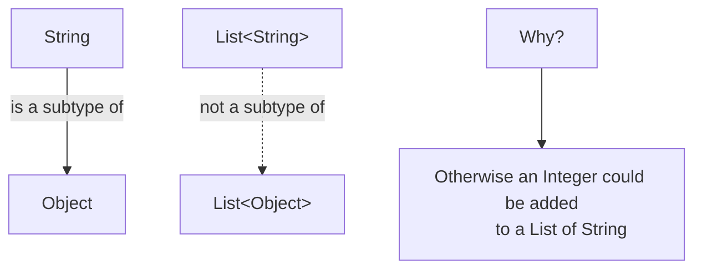
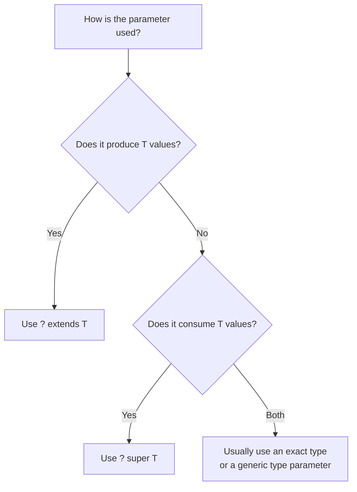

# Generics, Bounded Types, and Wildcards

## 1. Definition

Generics allow classes, interfaces, methods, and records to operate on parameterized types while preserving compile-time type safety.

```java
List<String> names = new ArrayList<>();
List<Integer> numbers = new ArrayList<>();
```

The same `List` implementation works with different element types without requiring a separate list class for each type.

Generic types are declared using type parameters:

```java
class Box<T> {

    private T value;

    void set(T value) {
        this.value = value;
    }

    T get() {
        return value;
    }
}
```

Usage:

```java
Box<String> messageBox = new Box<>();
messageBox.set("Hello");

String message = messageBox.get();
```

Common type-parameter naming conventions include:

| Parameter | Typical meaning |
| --------- | --------------- |
| `T`       | Type            |
| `E`       | Element         |
| `K`       | Key             |
| `V`       | Value           |
| `N`       | Number          |
| `R`       | Result          |
| `ID`      | Identifier      |

---

## 2. Why Generics Exist

Before generics, collections commonly stored values as `Object`:

```java
List values = new ArrayList();

values.add("Java");
values.add(100);
```

Retrieving an element required an explicit cast:

```java
String language = (String) values.get(0);
```

An incorrect cast failed at runtime:

```java
String value = (String) values.get(1);
// ClassCastException
```

Generics move many of these errors to compile time:

```java
List<String> languages = new ArrayList<>();

languages.add("Java");
// languages.add(100); // Compilation error
```

### Benefits

- Compile-time type safety
- Fewer explicit casts
- Reusable algorithms and data structures
- Clearer API contracts
- Better IDE completion and refactoring support
- Earlier detection of type-related defects

---

## 3. Generic Classes and Interfaces

### Generic class

```java
public class Repository<T, ID> {

    private final Map<ID, T> store = new HashMap<>();

    public void save(ID id, T entity) {
        store.put(id, entity);
    }

    public Optional<T> findById(ID id) {
        return Optional.ofNullable(store.get(id));
    }

    public void deleteById(ID id) {
        store.remove(id);
    }
}
```

Usage:

```java
Repository<User, Long> userRepository =
        new Repository<>();

userRepository.save(
        1L,
        new User("Alice")
);

Optional<User> user =
        userRepository.findById(1L);
```

### Generic interface

```java
public interface Converter<S, T> {

    T convert(S source);
}
```

Implementation:

```java
public class UserToDtoConverter
        implements Converter<User, UserDto> {

    @Override
    public UserDto convert(User user) {
        return new UserDto(
                user.getId(),
                user.getName()
        );
    }
}
```

---

## 4. Generic Methods

A method can declare its own type parameter independently of its containing class.

```java
public static <T> T first(List<T> values) {
    if (values.isEmpty()) {
        throw new IllegalArgumentException(
                "The list must not be empty"
        );
    }

    return values.get(0);
}
```

Usage:

```java
String firstName =
        first(List.of("Alice", "Bob"));

Integer firstNumber =
        first(List.of(10, 20, 30));
```

The type-parameter declaration appears before the return type:

```java
public static <T> T methodName(T value)
```

---

# Bounded Type Parameters

## 5. What Is a Bounded Type Parameter?

A bounded type parameter restricts the types that can be supplied.

```java
class NumberBox<T extends Number> {

    private final T value;

    NumberBox(T value) {
        this.value = value;
    }

    double doubleValue() {
        return value.doubleValue();
    }
}
```

Valid:

```java
NumberBox<Integer> integers =
        new NumberBox<>(10);

NumberBox<Double> doubles =
        new NumberBox<>(10.5);
```

Invalid:

```java
// NumberBox<String> text =
//         new NumberBox<>("Java");
```

Although the keyword is `extends`, it applies to both:

- Class inheritance
- Interface implementation

```java
<T extends Comparable<T>>
```

---

## 6. Multiple Bounds

A type parameter may have more than one bound:

```java
<T extends BaseClass & InterfaceOne & InterfaceTwo>
```

Example:

```java
public static <
        T extends Number & Comparable<T>
> T maximum(T first, T second) {

    return first.compareTo(second) >= 0
            ? first
            : second;
}
```

Usage:

```java
Integer result = maximum(10, 20);
```

Rules:

- At most one class bound is allowed.
- The class bound must appear first.
- Any remaining bounds must be interfaces.

Valid:

```java
<T extends Number
        & Comparable<T>
        & Serializable>
```

---

# Generic Invariance

## 7. Why Is `List<String>` Not a Subtype of `List<Object>`?

Java generics are invariant.

Even though:

```text
String is a subtype of Object
```

this does not mean:

```text
List<String> is a subtype of List<Object>
```

Consider what would happen if it were allowed:

```java
List<String> strings =
        new ArrayList<>();

List<Object> objects = strings; // Not allowed

objects.add(100);
```

The original `List<String>` would now contain an `Integer`, violating type safety.



Wildcards provide controlled flexibility when different parameterized types must be accepted.

---

# Wildcards

## 8. What Is a Wildcard?

The wildcard `?` represents an unknown type.

```java
List<?> values;
```

This means:

> A list of some specific type, but the exact type is unknown here.

A `List<?>` can refer to:

```java
List<String>
List<Integer>
List<Customer>
```

You can safely read values as `Object`:

```java
void printValues(List<?> values) {
    for (Object value : values) {
        System.out.println(value);
    }
}
```

You generally cannot add non-null values because the actual element type is unknown:

```java
void modify(List<?> values) {
    // values.add("Java"); // Compilation error
    values.add(null);      // Allowed, but rarely useful
}
```

---

## 9. Upper-Bounded Wildcards: `? extends T`

An upper-bounded wildcard accepts lists whose element type is `T` or a subtype of `T`.

```java
void printNumbers(
        List<? extends Number> numbers
) {
    for (Number number : numbers) {
        System.out.println(number);
    }
}
```

Accepted arguments:

```java
List<Integer> integers =
        List.of(1, 2, 3);

List<Double> doubles =
        List.of(1.5, 2.5);

printNumbers(integers);
printNumbers(doubles);
```

The method can safely read each element as `Number`.

```java
Number value = numbers.get(0);
```

However, it cannot safely add a specific subtype:

```java
void addNumber(
        List<? extends Number> numbers
) {
    // numbers.add(10);   // Not allowed
    // numbers.add(2.5);  // Not allowed
}
```

The actual list might be a `List<Double>`, a `List<Integer>`, or another `Number` subtype.

### Important correction

`? extends T` is often described as “read-only,” but that is a simplification.

You can still perform operations such as:

```java
numbers.clear();
numbers.remove(0);
numbers.add(null);
```

The real restriction is:

> You cannot safely add a non-null value of a specific subtype because the exact element type is unknown.

---

## 10. Lower-Bounded Wildcards: `? super T`

A lower-bounded wildcard accepts lists whose element type is `T` or one of its supertypes.

```java
void addIntegers(
        List<? super Integer> values
) {
    values.add(1);
    values.add(2);
}
```

Accepted arguments:

```java
List<Integer> integers =
        new ArrayList<>();

List<Number> numbers =
        new ArrayList<>();

List<Object> objects =
        new ArrayList<>();

addIntegers(integers);
addIntegers(numbers);
addIntegers(objects);
```

You can safely add `Integer` values:

```java
values.add(100);
```

When reading, the only universally safe type is `Object`:

```java
Object value = values.get(0);
```

You cannot assume the returned value is an `Integer`, because the list may contain other values allowed by its actual declared type.

### Important correction

`? super T` is often described as “write-only,” but this is also a simplification.

You can read from it, but the result is only safely known as `Object`.

---

# PECS

## 11. Producer Extends, Consumer Super

PECS is a guideline for selecting wildcard bounds:

> **Producer Extends, Consumer Super**

- Use `? extends T` when a structure produces values for your method.
- Use `? super T` when a structure consumes values from your method.



### Producer example

```java
double sum(
        List<? extends Number> numbers
) {
    double total = 0;

    for (Number number : numbers) {
        total += number.doubleValue();
    }

    return total;
}
```

The list produces `Number` values.

### Consumer example

```java
void addDefaults(
        List<? super Integer> target
) {
    target.add(10);
    target.add(20);
}
```

The list consumes `Integer` values.

### Producer and consumer example

The standard library’s `Collections.copy()` demonstrates both:

```java
public static <T> void copy(
        List<? super T> destination,
        List<? extends T> source
)
```

- `source` produces `T`, so it uses `extends`.
- `destination` consumes `T`, so it uses `super`.

Example:

```java
List<Integer> source =
        List.of(1, 2, 3);

List<Number> destination =
        new ArrayList<>(
                List.of(0, 0, 0)
        );

Collections.copy(destination, source);
```

---

## 12. Exact Type vs Wildcard

Use an exact type when the method both reads and writes the same type:

```java
void replaceFirst(
        List<String> values,
        String replacement
) {
    String original = values.get(0);
    values.set(0, replacement);
}
```

Use `? extends T` when only subtype-compatible reading is required:

```java
double average(
        List<? extends Number> values
)
```

Use `? super T` when writing `T` values is the main requirement:

```java
void populate(
        List<? super Integer> values
)
```

Use a generic method when relationships between multiple parameters must be expressed:

```java
static <T> void transfer(
        List<? extends T> source,
        List<? super T> destination
) {
    destination.addAll(source);
}
```

---

# Type Erasure

## 13. What Is Type Erasure?

Java implements most generics through type erasure.

The compiler uses generic type information for type checking and then erases most parameterized type details from generated bytecode.

For example:

```java
List<String> names =
        new ArrayList<>();

List<Integer> numbers =
        new ArrayList<>();
```

Both objects have the same runtime class:

```java
System.out.println(
        names.getClass() == numbers.getClass()
); // true
```

At runtime, both are instances of:

```text
java.util.ArrayList
```

### Conceptual transformation

Source code:

```java
class Box<T> {

    private T value;

    T get() {
        return value;
    }
}
```

Conceptually becomes similar to:

```java
class Box {

    private Object value;

    Object get() {
        return value;
    }
}
```

When a bound exists:

```java
class NumberBox<T extends Number> {

    private T value;
}
```

the erased type is approximately `Number`, not `Object`.

### Important nuance

It is not perfectly accurate to say that all generic information disappears.

Some generic metadata remains in class files and can be inspected through reflection:

```java
Field field =
        MyClass.class.getDeclaredField("names");

System.out.println(
        field.getGenericType()
);
```

However, ordinary runtime objects do not retain enough information to distinguish:

```java
new ArrayList<String>()
new ArrayList<Integer>()
```

---

## 14. Bridge Methods

The compiler may generate synthetic bridge methods to preserve polymorphism after erasure.

```java
class Parent<T> {

    T get() {
        return null;
    }
}

class Child extends Parent<String> {

    @Override
    String get() {
        return "value";
    }
}
```

After type erasure, `Parent.get()` effectively returns `Object`, while `Child.get()` returns `String`.

The compiler creates a bridge method conceptually similar to:

```java
Object get() {
    return get();
}
```

This preserves overriding behavior in the bytecode.

---

# Generic Restrictions

## 15. Why Can’t You Create `new T()`?

This does not compile:

```java
class Factory<T> {

    T create() {
        return new T();
    }
}
```

Because of type erasure, the runtime does not know which constructor should be invoked.

### Solution: pass a factory

```java
class Factory<T> {

    private final Supplier<T> supplier;

    Factory(Supplier<T> supplier) {
        this.supplier = supplier;
    }

    T create() {
        return supplier.get();
    }
}
```

Usage:

```java
Factory<User> factory =
        new Factory<>(User::new);

User user = factory.create();
```

A class token can also be used when reflection is appropriate:

```java
class ReflectiveFactory<T> {

    private final Class<T> type;

    ReflectiveFactory(Class<T> type) {
        this.type = type;
    }

    T create() {
        try {
            return type.getDeclaredConstructor()
                       .newInstance();
        } catch (ReflectiveOperationException exception) {
            throw new IllegalStateException(
                    "Cannot create " + type.getName(),
                    exception
            );
        }
    }
}
```

---

## 16. Why Can’t You Create Generic Arrays?

This does not compile:

```java
T[] values = new T[10];
```

Arrays are:

- Reified: they know their component type at runtime.
- Covariant: `String[]` is a subtype of `Object[]`.

Generics are:

- Mostly erased at runtime.
- Invariant.

Combining these rules would make runtime type checking unsafe.

### Array example

```java
Object[] values = new String[2];

values[0] = "Java";
values[1] = 100; // ArrayStoreException
```

The array knows at runtime that its component type is `String`.

A generic `T[]` cannot reliably perform the same runtime check because `T` is erased.

### Preferred solution

Use a collection:

```java
List<T> values = new ArrayList<>();
```

When an array is unavoidable, a class token can be supplied:

```java
static <T> T[] createArray(
        Class<T> type,
        int length
) {
    @SuppressWarnings("unchecked")
    T[] array = (T[]) Array.newInstance(
            type,
            length
    );

    return array;
}
```

---

## 17. Why Can’t You Use `instanceof List<String>`?

This is illegal:

```java
if (value instanceof List<String>) {
}
```

At runtime, the JVM cannot normally distinguish `List<String>` from `List<Integer>`.

Use:

```java
if (value instanceof List<?>) {
}
```

You can then inspect individual elements when necessary:

```java
if (value instanceof List<?> list) {
    for (Object element : list) {
        System.out.println(element);
    }
}
```

---

## 18. Why Can’t Generic Types Use Primitive Arguments?

This is invalid:

```java
List<int> numbers;
```

Generic type arguments must be reference types.

Use wrapper classes:

```java
List<Integer> numbers =
        new ArrayList<>();
```

Autoboxing converts between `int` and `Integer`:

```java
numbers.add(10);      // int → Integer
int value = numbers.get(0); // Integer → int
```

Boxing can introduce memory and allocation overhead in performance-sensitive workloads.

---

## 19. Why Can’t a Static Field Use a Class Type Parameter?

This is illegal:

```java
class Cache<T> {

    // static T value;
}
```

A static field belongs to the class itself, while `T` belongs to a particular parameterized use of that class.

These could coexist:

```java
Cache<String>
Cache<Integer>
```

There would be only one static field, so the JVM could not assign it both types safely.

A static method may declare its own type parameter:

```java
class Utils {

    static <T> T identity(T value) {
        return value;
    }
}
```

---

## 20. Generic Method Overloading and Erasure

These methods cannot coexist:

```java
void process(List<String> values) {
}

void process(List<Integer> values) {
}
```

After erasure, both signatures become approximately:

```java
void process(List values)
```

This causes a name clash.

Use different method names or a common generic abstraction.

---

# Wildcard Capture

## 21. What Is Wildcard Capture?

Consider:

```java
void swapFirstTwo(List<?> values) {
    // Cannot directly call a generic swap implementation
    // using the unknown type in some scenarios.
}
```

A helper method can capture the unknown wildcard type:

```java
void swapFirstTwo(List<?> values) {
    swap(values, 0, 1);
}

private <T> void swap(
        List<T> values,
        int first,
        int second
) {
    T temporary = values.get(first);

    values.set(
            first,
            values.get(second)
    );

    values.set(
            second,
            temporary
    );
}
```

The compiler assigns a temporary captured type to the wildcard and uses it consistently inside the helper method.

---

# Production Example

## 22. Generic Repository

```java
public interface Repository<T, ID> {

    T save(T entity);

    Optional<T> findById(ID id);

    List<T> findAll();

    void deleteById(ID id);
}
```

Domain-specific repository:

```java
public interface UserRepository
        extends Repository<User, Long> {

    Optional<User> findByEmail(String email);
}
```

Service:

```java
public class UserService {

    private final Repository<User, Long> repository;

    public UserService(
            Repository<User, Long> repository
    ) {
        this.repository = repository;
    }

    public User findRequired(long id) {
        return repository.findById(id)
                .orElseThrow(() ->
                        new UserNotFoundException(id)
                );
    }
}
```

Generics ensure:

- Only `User` entities are saved.
- User IDs use `Long`.
- `findById()` returns `Optional<User>`.
- Incorrect types are rejected at compile time.

---

## 23. How Spring Data JPA Uses Generics

Spring Data repository interfaces use type parameters to connect an entity type with its identifier type.

Conceptually:

```java
public interface JpaRepository<T, ID> {

    Optional<T> findById(ID id);

    List<T> findAll();

    T save(T entity);

    void deleteById(ID id);
}
```

Application repository:

```java
public interface OrderRepository
        extends JpaRepository<Order, UUID> {

    List<Order> findByStatus(
            OrderStatus status
    );
}
```

Here:

- `T` becomes `Order`.
- `ID` becomes `UUID`.

Therefore:

```java
Optional<Order> order =
        orderRepository.findById(orderId);
```

The repository cannot accidentally save an unrelated entity type:

```java
// orderRepository.save(customer);
// Compilation error
```

Spring uses the declared generic type metadata, reflection, proxies, and repository configuration to determine the managed entity and identifier types.

---

# Common Mistakes

## 24. Treating `? extends T` as Completely Read-Only

This statement is too broad:

> `? extends T` is read-only.

More accurately:

> It safely produces values as `T`, but does not allow adding a specific non-null subtype.

Operations such as removal and clearing may still be allowed.

---

## 25. Treating `? super T` as Completely Write-Only

You can read from it:

```java
Object value = list.get(0);
```

You simply cannot assume a more specific result type than `Object`.

---

## 26. Using Raw Types

Avoid:

```java
List values = new ArrayList();
```

This disables important generic type checking.

Prefer:

```java
List<String> values =
        new ArrayList<>();
```

Raw types mainly exist for backward compatibility with pre-generics Java code.

---

## 27. Overusing Wildcards in Return Types

Avoid unnecessarily exposing wildcard return types:

```java
List<? extends User> findUsers();
```

Callers may find the result difficult to use.

Prefer:

```java
List<User> findUsers();
```

Wildcards are usually more useful in method parameters than return types.

---

## 28. Using `Object` Instead of a Type Parameter

Less safe:

```java
Object first(Object value) {
    return value;
}
```

Type-safe:

```java
<T> T identity(T value) {
    return value;
}
```

The generic method preserves the relationship between input and output types.

---

## 29. Assuming Generic Types Exist Fully at Runtime

This will not work:

```java
if (list instanceof List<String>) {
}
```

Use `List<?>` or provide explicit runtime type information through `Class<T>`, `Type`, or framework-specific type tokens.

---

## 30. Confusing Bounds with Wildcards

Type parameter:

```java
<T extends Number>
```

This declares a named type that can be reused throughout the method or class.

Wildcard:

```java
List<? extends Number>
```

This represents one unknown subtype of `Number`.

Use a named type parameter when relationships between several arguments or return values need to be expressed.

Example:

```java
static <T> T choose(T first, T second)
```

Use a wildcard when the exact subtype does not need a name:

```java
static double sum(
        List<? extends Number> values
)
```

---

# Trade-Offs

| Advantages                                  | Limitations                              |
| ------------------------------------------- | ---------------------------------------- |
| Compile-time type safety                    | Wildcard syntax can be complex           |
| Reusable APIs and algorithms                | Most type arguments are erased           |
| Fewer explicit casts                        | Cannot directly instantiate `T`          |
| Better IDE and refactoring support          | Cannot create `new T[]`                  |
| Clear relationships between types           | Cannot use primitive type arguments      |
| Foundation of collection and framework APIs | Some runtime type checks are unavailable |
| Supports flexible bounded APIs              | Complex bounds may reduce readability    |

---

# Interview Questions

## Question 1: What is type erasure?

Type erasure is the process by which the compiler removes most generic type parameters from executable runtime types after using them for compile-time checks. Type variables are replaced by their bounds, casts may be inserted, and bridge methods may be generated.

---

## Question 2: What is the difference between `? extends T` and `? super T`?

`? extends T` represents an unknown subtype of `T` and is suitable when values are primarily read as `T`. `? super T` represents an unknown supertype of `T` and is suitable when `T` values need to be inserted.

---

## Question 3: What does PECS mean?

PECS means:

> Producer Extends, Consumer Super.

Use `extends` when the parameter produces values and `super` when it consumes values.

---

## Question 4: Why is `List<String>` not a subtype of `List<Object>`?

Because Java generics are invariant. Allowing that assignment would make it possible to insert non-string objects into a list declared to contain only strings.

---

## Question 5: Why can’t Java create `new T()`?

Because type erasure means the runtime generally does not know the concrete type represented by `T` or which constructor to invoke. A `Supplier<T>` or `Class<T>` can be provided instead.

---

## Question 6: Why can’t Java create generic arrays?

Arrays retain their component type at runtime, while generic type parameters are mostly erased. Creating generic arrays would undermine the runtime array type checks that protect array safety.

---

## Question 7: Can generic type information ever be read through reflection?

Some generic declaration metadata remains in class files and can be inspected through APIs such as `getGenericType()`. However, ordinary runtime objects do not normally retain concrete type arguments such as `String` in `new ArrayList<String>()`.

---

## Question 8: What is the difference between a bounded type parameter and a bounded wildcard?

A bounded type parameter gives the unknown type a reusable name:

```java
<T extends Number>
```

A bounded wildcard represents an unnamed unknown type:

```java
<? extends Number>
```

Use a type parameter when the same type relationship appears in several method arguments or the return type.

---

## Question 9: How does Spring Data JPA use generics?

Interfaces such as `JpaRepository<T, ID>` use `T` for the entity type and `ID` for its identifier type. Extending `JpaRepository<Order, UUID>` creates a repository API whose save, lookup, and delete methods are type-safe for `Order` entities and `UUID` identifiers.

---

# Short Interview Answer

> Generics provide compile-time type safety and reusable APIs without creating a separate implementation for every type. Java generics are invariant, so `List<String>` is not a subtype of `List<Object>`. For wildcard APIs, I follow PECS: `? extends T` for producers and `? super T` for consumers. Because Java implements generics mainly through type erasure, concrete type arguments are usually unavailable at runtime, which prevents operations such as `new T()`, `new T[]`, and `instanceof List<String>`.

---

## Related Topics

- [Collections Framework](../02-collections/list-set-map.md)
- [Comparable and Comparator](../02-collections/sorting.md)
- [Java Reflection](reflection.md)
- [Type Erasure](type-erasure.md)
- [Spring Data JPA](../06-spring/spring-data-jpa.md)
- [Java Streams](../03-streams/README.md)
