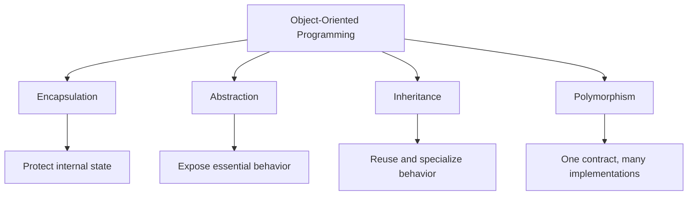
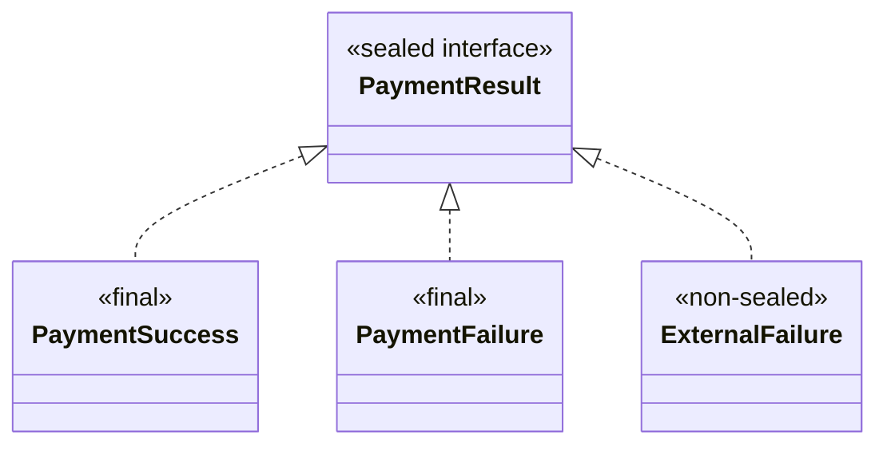
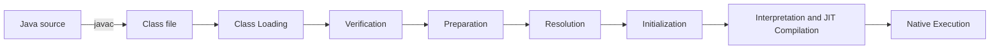
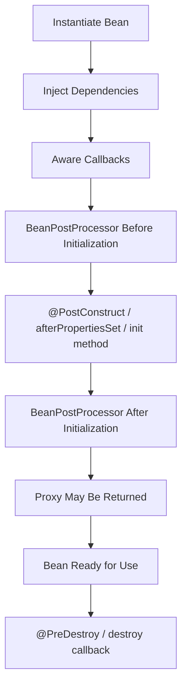

# `01-core-java/oop/basic-questions.md`

## Question 1: What is Object-Oriented Programming?

Object-Oriented Programming is a programming approach that organizes software around **objects**.

An object combines:

- State, represented by fields
- Behavior, represented by methods
- Identity, which distinguishes it from other objects

```java
public class BankAccount {

    private BigDecimal balance;

    public void deposit(BigDecimal amount) {
        balance = balance.add(amount);
    }
}
```

OOP helps model responsibilities, relationships, and behavior using classes, interfaces, and objects.

---

## Question 2: What are the four pillars of OOP?

The four main OOP principles are:

1. Encapsulation
2. Abstraction
3. Inheritance
4. Polymorphism



### Encapsulation

Groups state and behavior while controlling access to internal data.

### Abstraction

Exposes essential operations while hiding implementation details.

### Inheritance

Allows one class to derive behavior and state from another class.

### Polymorphism

Allows code to interact through a common type while different objects provide different behavior.

---

## Question 3: What is a class?

A class is a user-defined type that describes the state and behavior of its objects.

```java
public class Employee {

    private long id;
    private String name;

    public void work() {
        System.out.println(name + " is working");
    }
}
```

A class may contain:

- Fields
- Methods
- Constructors
- Nested types
- Initialization blocks

A class is more than a collection of variables and methods; it defines a type, its invariants, and its responsibilities.

---

## Question 4: What is an object?

An object is a runtime instance of a class.

```java
Employee employee = new Employee();
```

The variable `employee` contains a reference to the created object.

An object normally has:

- Identity
- State
- Behavior

Objects do not have to represent physical real-world entities. They can also represent concepts such as:

- A transaction
- A configuration
- A validation rule
- A database connection
- A scheduled task

---

## Question 5: What is the difference between a class and an object?

| Class                               | Object                                  |
| ----------------------------------- | --------------------------------------- |
| Defines a type                      | Is an instance of that type             |
| Describes fields and behavior       | Contains runtime state                  |
| Declared using `class`              | Commonly created using `new`            |
| One class can create many objects   | Each object has its own identity        |
| Class metadata is loaded by the JVM | Object data normally exists on the heap |

```java
class Car {
    private String registrationNumber;
}

Car first = new Car();
Car second = new Car();
```

`first` and `second` are different objects created from the same class.

It is inaccurate to say that a class occupies no memory. The JVM maintains metadata for loaded classes.

---

## Question 6: How can objects be created in Java?

The most common approach is the `new` operator:

```java
Customer customer = new Customer();
```

Objects may also be created through:

- Static factory methods
- Reflection
- Deserialization
- Cloning
- Dependency-injection frameworks
- Library or framework factories

### Static factory example

```java
Customer customer = Customer.create("Alice");
```

### Reflection example

```java
Customer customer =
        Customer.class
                .getDeclaredConstructor()
                .newInstance();
```

Avoid the deprecated `Class.newInstance()` method. Use `Constructor.newInstance()` instead.

---

## Question 7: What is a constructor?

A constructor initializes a newly created object.

```java
public class Customer {

    private final String name;

    public Customer(String name) {
        this.name = name;
    }
}
```

Constructor characteristics:

- Has the same name as the class
- Has no return type
- Runs during object creation
- Can be overloaded
- Is not inherited
- Can call another constructor using `this()`
- Can call a superclass constructor using `super()`

A constructor is not an ordinary method, even though its syntax is similar.

---

## Question 8: What is the difference between a constructor and a method?

| Constructor                                | Method                              |
| ------------------------------------------ | ----------------------------------- |
| Initializes an object                      | Performs behavior                   |
| Same name as the class                     | Can have any valid identifier       |
| Has no return type                         | May return a value or `void`        |
| Called during object creation              | Called explicitly or by a framework |
| Cannot be inherited                        | Can be inherited                    |
| Can be overloaded                          | Can be overloaded and overridden    |
| Cannot be `static`, `final`, or `abstract` | May use applicable modifiers        |

---

## Question 9: What is the difference between a default constructor, a no-argument constructor, and a parameterized constructor?

### Default constructor

A default constructor is generated by the compiler only when the programmer declares no constructor.

```java
class Product {
}
```

The compiler conceptually provides:

```java
Product() {
    super();
}
```

### User-defined no-argument constructor

```java
class Product {

    Product() {
        System.out.println("Product created");
    }
}
```

This is a no-argument constructor, but it is not compiler-generated.

### Parameterized constructor

```java
class Product {

    private final String name;

    Product(String name) {
        this.name = name;
    }
}
```

Once any constructor is explicitly declared, Java no longer automatically creates the default constructor.

---

## Question 10: What is constructor overloading?

Constructor overloading means declaring multiple constructors with different parameter lists.

```java
public class User {

    private final String name;
    private final String email;

    public User(String name) {
        this(name, null);
    }

    public User(String name, String email) {
        this.name = name;
        this.email = email;
    }
}
```

The constructors must differ in:

- Number of parameters
- Parameter types
- Parameter order

Return types cannot distinguish constructors because constructors have no return type.

---

## Question 11: What is the `this` keyword?

`this` refers to the current object.

### Distinguishing a field from a parameter

```java
public Customer(String name) {
    this.name = name;
}
```

### Calling another constructor

```java
public Customer() {
    this("Unknown");
}
```

### Passing the current object

```java
validator.validate(this);
```

A call to `this()` must be the first statement in a constructor.

`this` cannot be used in a static context because static members do not belong to a particular object.

---

## Question 12: What is the `super` keyword?

`super` refers to the superclass portion of the current object.

It can be used to:

- Call a superclass constructor
- Access a superclass method
- Access a hidden superclass field

```java
class Employee extends Person {

    Employee(String name) {
        super(name);
    }

    @Override
    public void display() {
        super.display();
        System.out.println("Employee details");
    }
}
```

A call to `super()` must be the first statement in a constructor.

A constructor may begin with either `this()` or `super()`, but not both directly.

---

## Question 13: What is inheritance?

Inheritance allows a subclass to derive accessible behavior and state from a superclass.

```java
class Animal {

    public void eat() {
        System.out.println("Eating");
    }
}

class Dog extends Animal {

    public void bark() {
        System.out.println("Barking");
    }
}
```

```java
Dog dog = new Dog();
dog.eat();
dog.bark();
```

Important points:

- Constructors are not inherited.
- Private members are not directly accessible by subclasses.
- Java classes support single class inheritance.
- Every class except `Object` has a superclass.
- Inheritance represents an **Is-A** relationship.

Use inheritance only when the subclass can safely substitute for the parent type.

---

## Question 14: What types of inheritance does Java support?

### Single inheritance

```text
Animal → Dog
```

### Multilevel inheritance

```text
Animal → Mammal → Dog
```

### Hierarchical inheritance

```text
       Animal
       /    \
     Dog    Cat
```

### Multiple inheritance through interfaces

```java
class SmartPhone
        implements Camera, MusicPlayer {
}
```

A Java class cannot extend multiple classes:

```java
// Invalid
class C extends A, B {
}
```

However, a class can implement multiple interfaces.

Hybrid inheritance can be modeled using a combination of class inheritance and interfaces.

---

## Question 15: Why does Java not support multiple class inheritance?

Multiple class inheritance can create ambiguity when two parent classes define the same method or state.

```text
ParentA ──┐
          ├── Child
ParentB ──┘
```

If both parents define `display()`, the child would need rules for deciding which implementation to inherit.

Java avoids this complexity for classes and supports multiple inheritance of type through interfaces.

Interfaces can still produce default-method conflicts, but Java requires the implementing class to resolve them explicitly.

---

## Question 16: What is polymorphism?

Polymorphism means one common type can represent objects with different implementations.

```java
interface PaymentProcessor {
    void process();
}

class CardProcessor implements PaymentProcessor {

    @Override
    public void process() {
        System.out.println("Processing card payment");
    }
}

class BankTransferProcessor implements PaymentProcessor {

    @Override
    public void process() {
        System.out.println("Processing bank transfer");
    }
}
```

```java
PaymentProcessor processor =
        new CardProcessor();

processor.process();
```

Types of polymorphism commonly discussed in Java:

- Compile-time polymorphism through overloading
- Runtime polymorphism through overriding

---

## Question 17: What is method overloading?

Method overloading means declaring methods with the same name but different parameter lists.

```java
class Calculator {

    int add(int first, int second) {
        return first + second;
    }

    double add(double first, double second) {
        return first + second;
    }

    int add(int first, int second, int third) {
        return first + second + third;
    }
}
```

Overloading is resolved by the compiler using:

- Number of arguments
- Argument types
- Argument order
- Applicable conversions

Changing only the return type is not sufficient:

```java
// Invalid
int find() {
    return 1;
}

// Invalid: same parameter list
String find() {
    return "one";
}
```

---

## Question 18: What is method overriding?

Method overriding occurs when a subclass provides a new implementation of an inherited instance method.

```java
class Animal {

    public void makeSound() {
        System.out.println("Animal sound");
    }
}

class Dog extends Animal {

    @Override
    public void makeSound() {
        System.out.println("Woof");
    }
}
```

```java
Animal animal = new Dog();
animal.makeSound(); // Woof
```

The actual object type determines the overridden implementation executed at runtime.

### Important overriding rules

- Same method name and parameter types
- Same or covariant return type
- Visibility cannot be reduced
- Broader checked exceptions cannot be introduced
- `final` methods cannot be overridden
- Private methods are not inherited and therefore are not overridden
- Static methods are hidden, not overridden

Use `@Override` to let the compiler verify the method.

---

## Question 19: What is the difference between overloading and overriding?

| Overloading                                   | Overriding                                       |
| --------------------------------------------- | ------------------------------------------------ |
| Same method name, different parameters        | Same inherited method signature                  |
| Usually within one class                      | Requires inheritance or interface implementation |
| Resolved at compile time                      | Dispatched at runtime                            |
| Return type may differ when parameters differ | Same or covariant return type                    |
| Static methods can be overloaded              | Static methods cannot be overridden              |
| Inheritance not required                      | Inheritance or interface contract required       |

---

## Question 20: Can `main()` be overloaded or overridden?

### Overloading

Yes, `main()` can be overloaded:

```java
public static void main(String[] args) {
    main(10);
}

public static void main(int value) {
    System.out.println(value);
}
```

The Java launcher uses the recognized entry-point signature, normally:

```java
public static void main(String[] args)
```

### Overriding

No. Static methods are not overridden.

A subclass can declare another static `main()` method, but that is method hiding, not runtime overriding.

---

## Question 21: What is encapsulation?

Encapsulation means grouping state and behavior inside a type while controlling how external code interacts with that state.

```java
public class BankAccount {

    private BigDecimal balance =
            BigDecimal.ZERO;

    public void deposit(BigDecimal amount) {
        if (amount.signum() <= 0) {
            throw new IllegalArgumentException(
                    "Amount must be positive"
            );
        }

        balance = balance.add(amount);
    }

    public BigDecimal getBalance() {
        return balance;
    }
}
```

Encapsulation is not simply generating getters and setters for every field.

This exposes internal state too freely:

```java
public void setBalance(BigDecimal balance) {
    this.balance = balance;
}
```

A stronger design exposes meaningful operations such as:

- `deposit()`
- `withdraw()`
- `activate()`
- `cancel()`

Benefits include:

- Protecting invariants
- Reducing coupling
- Hiding implementation details
- Improving maintainability
- Controlling state changes

---

## Question 22: What is abstraction?

Abstraction exposes essential behavior while hiding unnecessary implementation details.

```java
interface NotificationSender {
    void send(Notification notification);
}
```

Callers use the abstraction:

```java
notificationSender.send(notification);
```

They do not need to know whether the implementation uses:

- Email
- SMS
- Firebase
- Kafka
- A third-party API

Abstraction can be implemented with:

- Interfaces
- Abstract classes
- Encapsulated concrete classes
- Well-designed APIs

Interfaces do not automatically provide “100% abstraction.” Modern interfaces may contain default, static, and private methods with implementations.

---

## Question 23: What is an abstract class?

An abstract class is a class that cannot be instantiated directly.

```java
abstract class Shape {

    private final String name;

    protected Shape(String name) {
        this.name = name;
    }

    public abstract double area();

    public String getName() {
        return name;
    }
}
```

Subclass:

```java
class Circle extends Shape {

    private final double radius;

    Circle(double radius) {
        super("Circle");
        this.radius = radius;
    }

    @Override
    public double area() {
        return Math.PI * radius * radius;
    }
}
```

An abstract class may contain:

- Abstract methods
- Concrete methods
- Constructors
- Instance fields
- Static fields and methods
- Methods with different access levels

An abstract class may contain zero abstract methods.

An abstract method is not automatically `public`; it may also be `protected` or package-private.

---

## Question 24: What is an interface?

An interface defines a contract that implementing classes agree to satisfy.

```java
public interface PaymentProcessor {

    PaymentResult process(PaymentRequest request);
}
```

Implementation:

```java
public class CardPaymentProcessor
        implements PaymentProcessor {

    @Override
    public PaymentResult process(
            PaymentRequest request
    ) {
        return new PaymentResult(true);
    }
}
```

Modern interfaces may contain:

- Abstract instance methods
- Default methods
- Static methods
- Private instance methods
- Private static methods
- Constants

Interface fields are implicitly:

```java
public static final
```

Interfaces cannot contain normal per-object instance fields or constructors.

---

## Question 25: What types of methods can an interface contain?

### Abstract method

```java
void execute();
```

Implicitly:

```java
public abstract void execute();
```

### Default method

```java
default void log() {
    System.out.println("Executing");
}
```

### Static method

```java
static PaymentProcessor defaultProcessor() {
    return new DefaultPaymentProcessor();
}
```

### Private instance method

```java
private void validate() {
}
```

### Private static method

```java
private static void logConfiguration() {
}
```

Private interface methods are used to share implementation logic among default or static methods. They are not inherited by implementing classes.

---

## Question 26: Can an interface contain private methods?

Yes.

```java
interface Auditable {

    default void audit(String message) {
        validate(message);
        System.out.println(message);
    }

    private void validate(String message) {
        if (message == null || message.isBlank()) {
            throw new IllegalArgumentException(
                    "Message is required"
            );
        }
    }
}
```

Private interface methods:

- Must have a body
- Cannot be abstract
- Cannot be called by implementing classes
- Are used internally by default or private methods

---

## Question 27: Can a class implement multiple interfaces?

Yes.

```java
class SmartDevice
        implements Camera, MusicPlayer, GPS {
}
```

This provides multiple inheritance of contracts.

A class may also extend one class and implement multiple interfaces:

```java
class SmartDevice
        extends ElectronicDevice
        implements Camera, GPS {
}
```

---

## Question 28: What happens when two interfaces provide the same default method?

Consider:

```java
interface First {

    default void display() {
        System.out.println("First");
    }
}

interface Second {

    default void display() {
        System.out.println("Second");
    }
}
```

A class implementing both must resolve the conflict:

```java
class Combined implements First, Second {

    @Override
    public void display() {
        First.super.display();
        Second.super.display();
    }
}
```

The class may also provide a completely new implementation:

```java
@Override
public void display() {
    System.out.println("Combined");
}
```

Java does not silently choose one conflicting default implementation.

---

## Question 29: What is the difference between an abstract class and an interface?

| Abstract class                             | Interface                                                 |
| ------------------------------------------ | --------------------------------------------------------- |
| Represents a base class                    | Defines a contract or capability                          |
| Can contain instance state                 | Cannot contain normal instance fields                     |
| Can have constructors                      | Cannot have constructors                                  |
| Can contain abstract and concrete methods  | Can contain abstract, default, static and private methods |
| Methods can use different access modifiers | Abstract methods are public                               |
| A class extends only one class             | A class implements multiple interfaces                    |
| Useful for closely related classes         | Useful for independent implementations                    |
| Can contain non-final instance fields      | Fields are public static final constants                  |

### Use an abstract class when

- Implementations share state.
- Common constructor logic is needed.
- Protected helper methods are useful.
- Types form a strong hierarchical relationship.

### Use an interface when

- Defining a capability or contract
- Multiple implementations may be unrelated
- Multiple contracts are needed
- Loose coupling is important

---

## Question 30: What is composition?

Composition means building a class using other objects rather than inheriting their implementation.

```java
class OrderService {

    private final PaymentProcessor paymentProcessor;
    private final InventoryService inventoryService;

    OrderService(
            PaymentProcessor paymentProcessor,
            InventoryService inventoryService
    ) {
        this.paymentProcessor = paymentProcessor;
        this.inventoryService = inventoryService;
    }
}
```

This is a Has-A relationship:

```text
OrderService has a PaymentProcessor
OrderService has an InventoryService
```

---

## Question 31: What is the difference between composition and inheritance?

| Composition                          | Inheritance                                 |
| ------------------------------------ | ------------------------------------------- |
| Has-A relationship                   | Is-A relationship                           |
| Reuses behavior through delegation   | Reuses inherited implementation             |
| Can change collaborators more easily | Relationship is fixed in the type hierarchy |
| Lower coupling                       | Often stronger coupling                     |
| Supports multiple collaborators      | Class can extend only one superclass        |
| Usually easier to test               | May expose parent implementation details    |
| Preferred for behavior reuse         | Best for true substitutable specialization  |

### Composition example

```java
class ReportService {

    private final ReportFormatter formatter;

    ReportService(ReportFormatter formatter) {
        this.formatter = formatter;
    }
}
```

### Inheritance example

```java
abstract class Shape {
    abstract double area();
}

class Circle extends Shape {
    // Genuine specialized Shape
}
```

A common guideline is:

> Prefer composition over inheritance unless the subtype relationship is genuine and substitutable.

---

## Question 32: What are nested and inner classes?

A nested class is declared inside another class.

```java
class Outer {

    static class StaticNested {
    }

    class Inner {
    }
}
```

### Static nested class

- Does not require an enclosing object
- Cannot directly access enclosing instance members
- Is associated with the enclosing class

```java
Outer.StaticNested nested =
        new Outer.StaticNested();
```

### Non-static member inner class

- Requires an enclosing object
- Can directly access enclosing instance members

```java
Outer outer = new Outer();
Outer.Inner inner = outer.new Inner();
```

Other forms include:

- Local classes
- Anonymous classes

Older material often says that inner classes cannot declare static members. Modern Java permits static members in inner classes, although static nested classes remain a distinct and usually clearer construct.

---

## Question 33: What does `getClass()` do?

`getClass()` is a final method inherited from `Object`. It returns the runtime class of an object.

```java
Object value = "Java";

Class<?> runtimeType = value.getClass();

System.out.println(runtimeType.getName());
// java.lang.String
```

It is useful for:

- Reflection
- Framework metadata
- Diagnostics
- Runtime type inspection

A class’s static synchronized methods synchronize using the corresponding `Class` object, but this is not the main purpose of `getClass()`.

---

## Question 34: What is a marker interface?

A marker interface is an interface with no declared methods that communicates metadata about a class.

Examples include:

```java
Serializable
Cloneable
Remote
```

Example:

```java
class UserSession implements Serializable {
}
```

Marker interfaces allow APIs or runtime mechanisms to detect a capability using the type system:

```java
if (object instanceof Serializable) {
    // Object declares serialization capability
}
```

Annotations are often used for metadata today, but marker interfaces remain useful when type relationships or `instanceof` checks are required.

---

## Question 35: What is a record?

A record is a compact syntax for defining a data-oriented class.

```java
public record CustomerDto(
        long id,
        String name,
        String email
) {
}
```

The compiler generates:

- Private final component fields
- A canonical constructor
- Accessor methods
- `equals()`
- `hashCode()`
- `toString()`

Usage:

```java
CustomerDto customer =
        new CustomerDto(
                1L,
                "Alice",
                "alice@example.com"
        );

System.out.println(customer.name());
```

Records are useful for:

- DTOs
- API response models
- Configuration values
- Immutable messages
- Compound return values
- Value-oriented domain objects

Records are shallowly immutable. A record component may still refer to a mutable object:

```java
public record Team(List<String> members) {
}
```

The `members` list can still be mutated unless it is defensively copied.

---

## Question 36: When should a record be used instead of a normal class?

Use a record when:

- The primary purpose is carrying data.
- Equality should be based on component values.
- The type should be concise and shallowly immutable.
- Custom inheritance is not required.

Use a normal class when:

- Mutable lifecycle state is required.
- The class has complex internal invariants.
- Framework restrictions require a no-argument constructor.
- Identity is more important than value equality.
- The type must extend another application class.

Records can implement interfaces but cannot extend another class.

---

## Question 37: What is a sealed class?

A sealed class or interface restricts which types may directly extend or implement it.

```java
public sealed interface PaymentResult
        permits PaymentSuccess,
                PaymentFailure {
}
```

Permitted implementations:

```java
public final class PaymentSuccess
        implements PaymentResult {
}

public final class PaymentFailure
        implements PaymentResult {
}
```

A permitted subtype must normally be declared as one of:

- `final`
- `sealed`
- `non-sealed`

Example:

```java
public non-sealed class ExternalFailure
        implements PaymentResult {
}
```

Sealed types are useful for modeling closed hierarchies such as:

- Payment results
- Commands
- Events
- Expression trees
- State machines
- Domain outcomes

---

## Question 38: What problem do sealed classes solve?

Without sealing, any external class may extend a public non-final class or implement a public interface.

Sealed types let the designer explicitly control the hierarchy.

Benefits include:

- Stronger domain modeling
- Known set of permitted subtypes
- Safer refactoring
- Better exhaustive pattern matching
- Prevention of unauthorized extensions



---

# Move to `02-collections/advanced-questions.md`

## What happens when a mutable object is used as a `HashMap` key?

`HashMap` uses the key’s hash code to choose a bucket.

If a field used by `hashCode()` or `equals()` changes after insertion, the map may search a different bucket and fail to find the key.

```java
final class UserKey {

    private String username;

    UserKey(String username) {
        this.username = username;
    }

    void setUsername(String username) {
        this.username = username;
    }

    @Override
    public boolean equals(Object object) {
        if (this == object) {
            return true;
        }

        if (!(object instanceof UserKey other)) {
            return false;
        }

        return Objects.equals(
                username,
                other.username
        );
    }

    @Override
    public int hashCode() {
        return Objects.hash(username);
    }
}
```

```java
UserKey key = new UserKey("alice");

Map<UserKey, String> map =
        new HashMap<>();

map.put(key, "data");

key.setUsername("bob");

System.out.println(map.get(key)); // May return null
```

The entry remains inside the map but may become effectively unreachable through normal lookup.

Use immutable keys:

```java
public record UserKey(String username) {
}
```

---

## What is the Java Collections Framework?

The Java Collections Framework provides interfaces and implementations for storing and processing groups of objects.

Main element-based interfaces:

```text
Iterable
└── Collection
    ├── List
    ├── Set
    │   ├── SortedSet
    │   └── NavigableSet
    └── Queue
        └── Deque
```

`Map` is part of the framework but does not extend `Collection` because it stores key-value mappings.

Common implementations include:

| Interface        | Implementations                             |
| ---------------- | ------------------------------------------- |
| `List`           | `ArrayList`, `LinkedList`                   |
| `Set`            | `HashSet`, `LinkedHashSet`, `TreeSet`       |
| `Queue`          | `PriorityQueue`                             |
| `Deque`          | `ArrayDeque`, `LinkedList`                  |
| `Map`            | `HashMap`, `LinkedHashMap`, `TreeMap`       |
| Concurrent types | `ConcurrentHashMap`, `CopyOnWriteArrayList` |

---

## What is the purpose of `Iterator`?

`Iterator` traverses a collection one element at a time.

```java
Iterator<String> iterator =
        names.iterator();

while (iterator.hasNext()) {
    String name = iterator.next();

    if (name.isBlank()) {
        iterator.remove();
    }
}
```

Main operations:

- `hasNext()`
- `next()`
- Optional `remove()`
- `forEachRemaining()`

A `Map` is not directly iterable through `Iterator`. Iterate over a map view:

```java
Iterator<Map.Entry<String, Integer>> iterator =
        map.entrySet().iterator();
```

---

# Move to `01-core-java/functional-programming/basic-questions.md`

## What is `Optional`?

`Optional<T>` represents a value that may or may not be present.

```java
Optional<User> user =
        repository.findById(userId);
```

Usage:

```java
User requiredUser = user.orElseThrow(
        () -> new UserNotFoundException(userId)
);
```

`Optional` does not prevent all `NullPointerException`s.

Recommended uses:

- Method return values where absence is valid
- Fluent transformation of optional results

Usually avoid using `Optional` for:

- Entity fields
- DTO fields
- Method parameters
- Collection elements
- Serialization models

Do not return `null` from a method declared to return `Optional`.

---

## What is a functional interface?

A functional interface has exactly one abstract method.

```java
@FunctionalInterface
public interface Validator<T> {

    boolean isValid(T value);
}
```

It may still contain:

- Default methods
- Static methods
- Private methods
- Methods inherited from `Object`

Examples include:

- `Runnable`
- `Callable`
- `Function<T, R>`
- `Consumer<T>`
- `Supplier<T>`
- `Predicate<T>`
- `Comparator<T>`

Usage with a lambda:

```java
Predicate<String> nonBlank =
        value -> value != null
                && !value.isBlank();
```

---

## What is the role of default methods in interfaces?

Default methods allow interfaces to add behavior without requiring every existing implementation to immediately implement the new method.

```java
interface Logger {

    void log(String message);

    default void logError(String message) {
        log("ERROR: " + message);
    }
}
```

Common uses:

- Backward-compatible interface evolution
- Shared convenience behavior
- Adapter methods

Default methods do not make interfaces equivalent to abstract classes because interfaces still cannot hold ordinary instance state.

---

## When should a normal loop be preferred over a stream?

Prefer a normal loop when:

- The algorithm requires complex control flow.
- `break`, `continue`, or early return is important.
- Checked exceptions are involved.
- Multiple variables change during iteration.
- Performance profiling shows stream overhead matters.
- Debugging each step is easier imperatively.
- The operation includes many side effects.

Loop example:

```java
for (Order order : orders) {
    if (!order.isValid()) {
        continue;
    }

    if (order.isPriority()) {
        return order;
    }
}
```

Prefer streams when the operation is a clear transformation pipeline:

```java
List<String> names = users.stream()
        .filter(User::isActive)
        .map(User::getName)
        .sorted()
        .toList();
```

Streams are not automatically faster or better than loops.

---

# Move to `05-jvm/class-loading.md`

## What happens after `javac` compiles a `.java` file?



### Compilation

`javac` compiles Java source into one or more `.class` files.

### Loading

A class loader locates the class bytes and creates the corresponding JVM class representation.

### Linking

Linking includes:

1. Verification
2. Preparation
3. Resolution

### Initialization

Static fields and static initialization blocks are executed.

### Execution

The JVM may initially interpret bytecode and later JIT-compile frequently executed methods into optimized native instructions.

---

## What does a `.class` file contain?

A class file contains more than bytecode instructions.

It may include:

- Magic number and class-file version
- Constant pool
- Class and superclass information
- Interface information
- Fields
- Methods
- Bytecode
- Exception tables
- Generic-signature metadata
- Runtime annotation metadata
- Debugging information
- Bootstrap method information
- Module, record, nest and sealed-class attributes where applicable

---

## What is the class-loading lifecycle?

The lifecycle consists of:

1. Loading
2. Linking
   - Verification
   - Preparation
   - Resolution

3. Initialization
4. Use
5. Unloading, when the defining class loader becomes unreachable

### Verification

Checks that class-file structure and bytecode are valid.

### Preparation

Allocates class-level storage and assigns default values to static fields.

### Resolution

Converts symbolic references into direct runtime references.

### Initialization

Executes static field initializers and static blocks.

```java
class Configuration {

    static int timeout = loadTimeout();

    static {
        System.out.println("Configuration initialized");
    }
}
```

---

## What are the main built-in class loaders?

Modern Java commonly uses:

1. Bootstrap class loader
2. Platform class loader
3. Application or system class loader

### Bootstrap class loader

Loads core platform classes.

### Platform class loader

Loads platform modules and libraries that are not loaded by the bootstrap loader.

### Application class loader

Loads application classes from the configured class path or module path.

The old **extension class loader** and `jre/lib/ext` mechanism were removed from modern Java and replaced conceptually by the platform class loader and module system.

---

# Move to `06-spring/dependency-injection.md`

## What is the difference between `@Component` and `@Bean`?

### `@Component`

Placed on a class discovered through component scanning.

```java
@Component
public class PaymentValidator {
}
```

Specialized component stereotypes include:

- `@Service`
- `@Repository`
- `@Controller`
- `@RestController`

Use `@Component` when:

- You control the class.
- Automatic component scanning is suitable.
- The class naturally belongs to the application.

### `@Bean`

Placed on a method inside a configuration class.

```java
@Configuration
public class ApplicationConfiguration {

    @Bean
    public Clock applicationClock() {
        return Clock.systemUTC();
    }
}
```

Use `@Bean` when:

- Configuring a third-party class
- Construction requires custom logic
- Selecting among implementations
- Explicit configuration improves clarity
- Bean creation depends on configuration values

| `@Component`                          | `@Bean`                                     |
| ------------------------------------- | ------------------------------------------- |
| Applied to a class                    | Applied to a factory method                 |
| Discovered through scanning           | Declared explicitly                         |
| Best for application-owned components | Best for custom or third-party construction |
| Less creation control                 | Full creation control                       |

---

## Why prefer constructor injection?

```java
@Service
public class OrderService {

    private final OrderRepository repository;
    private final PaymentService paymentService;

    public OrderService(
            OrderRepository repository,
            PaymentService paymentService
    ) {
        this.repository = repository;
        this.paymentService = paymentService;
    }
}
```

Constructor injection is preferred because it:

- Makes dependencies explicit
- Supports `final` fields
- Prevents partially initialized objects
- Makes unit testing easier
- Works without reflection-based field mutation
- Reveals excessive dependencies
- Supports immutable service design

Field injection hides dependencies and makes direct unit construction more difficult.

---

# Move to `06-spring/bean-lifecycle.md`

## How are Spring beans created?

A simplified singleton bean lifecycle is:



Typical stages:

1. Bean definition is discovered.
2. Bean is instantiated.
3. Dependencies and properties are injected.
4. Aware callbacks are invoked where applicable.
5. `BeanPostProcessor` runs before initialization.
6. Initialization callbacks run.
7. `BeanPostProcessor` runs after initialization.
8. The bean may be wrapped in a proxy.
9. The bean is available to the application.
10. Destruction callbacks run when the context closes.

Common lifecycle annotations:

```java
@PostConstruct
public void initialize() {
}

@PreDestroy
public void cleanup() {
}
```

Prototype beans do not receive automatic destruction callbacks from the container after being handed to the caller.

---

# Move to `08-design-patterns/singleton.md`

## What is a singleton?

A singleton restricts a class to one instance within a particular class-loader context.

Avoid the non-thread-safe implementation from the source:

```java
if (instance == null) {
    instance = new Singleton();
}
```

Two threads can create separate objects concurrently.

### Initialization-on-demand holder

```java
public final class ApplicationRegistry {

    private ApplicationRegistry() {
    }

    private static class Holder {
        private static final ApplicationRegistry INSTANCE =
                new ApplicationRegistry();
    }

    public static ApplicationRegistry getInstance() {
        return Holder.INSTANCE;
    }
}
```

### Enum singleton

```java
public enum ApplicationRegistry {
    INSTANCE
}
```

An enum singleton provides simple thread-safe initialization and protects against ordinary serialization-based duplication.

A singleton is not automatically one instance across:

- Multiple JVMs
- Multiple containers
- Multiple pods
- Multiple class loaders

---

# Move to `08-design-patterns/solid.md`

## What are the SOLID principles?

### Single Responsibility Principle

A class should have one coherent responsibility and one primary reason to change.

### Open/Closed Principle

Software should be open for extension but closed for unnecessary modification.

### Liskov Substitution Principle

A subtype must safely replace its parent type without breaking expected behavior.

### Interface Segregation Principle

Clients should not depend on methods they do not use.

### Dependency Inversion Principle

High-level policy should depend on abstractions rather than concrete infrastructure.

---

## What is the Liskov Substitution Principle?

The Liskov Substitution Principle states that an instance of a subtype should be usable wherever its parent type is expected without violating the parent contract.

A subtype must not unexpectedly:

- Reject valid parent inputs
- Weaken parent guarantees
- Change documented behavior incompatibly
- Throw unsupported-operation exceptions for expected behavior

Problematic design:

```java
class Bird {
    void fly() {
    }
}

class Penguin extends Bird {

    @Override
    void fly() {
        throw new UnsupportedOperationException();
    }
}
```

Better:

```java
interface Bird {
}

interface FlyingBird extends Bird {
    void fly();
}

class Penguin implements Bird {
}

class Eagle implements FlyingBird {

    @Override
    public void fly() {
    }
}
```

Inheritance provides reuse and polymorphism only when the subtype is behaviorally substitutable.

---

# Move to `08-design-patterns/factory.md`

## What is the Factory pattern?

A factory encapsulates object-creation decisions.

```java
public interface NotificationSender {
    void send(String message);
}
```

Implementations:

```java
public class EmailSender
        implements NotificationSender {

    @Override
    public void send(String message) {
        System.out.println("Email: " + message);
    }
}

public class SmsSender
        implements NotificationSender {

    @Override
    public void send(String message) {
        System.out.println("SMS: " + message);
    }
}
```

Factory:

```java
public final class NotificationSenderFactory {

    private NotificationSenderFactory() {
    }

    public static NotificationSender create(
            NotificationType type
    ) {
        return switch (type) {
            case EMAIL -> new EmailSender();
            case SMS -> new SmsSender();
        };
    }
}
```

Usage:

```java
NotificationSender sender =
        NotificationSenderFactory.create(
                NotificationType.EMAIL
        );

sender.send("Order confirmed");
```

The factory:

- Hides construction details
- Centralizes implementation selection
- Reduces direct coupling to concrete classes

In dependency-injection applications, constructor injection and framework configuration often replace manual static factories.

---

# Move to `07-database/jdbc-resultset.md`

## What types of `ResultSet` are available?

JDBC defines three primary cursor types:

### `TYPE_FORWARD_ONLY`

The cursor moves forward only.

### `TYPE_SCROLL_INSENSITIVE`

The cursor can move forward and backward but generally does not reflect later database changes.

### `TYPE_SCROLL_SENSITIVE`

The cursor can move in both directions and may reflect later database changes, depending on the driver.

Example:

```java
Statement statement =
        connection.createStatement(
                ResultSet.TYPE_SCROLL_INSENSITIVE,
                ResultSet.CONCUR_READ_ONLY
        );
```

Concurrency modes include:

- `CONCUR_READ_ONLY`
- `CONCUR_UPDATABLE`

Support depends on the JDBC driver and database.

---

# Move to `09-legacy-web/jsp.md`

## What are the JSP implicit objects?

JSP traditionally provides nine implicit objects:

| Object        | Type or purpose                       |
| ------------- | ------------------------------------- |
| `request`     | `HttpServletRequest`                  |
| `response`    | `HttpServletResponse`                 |
| `out`         | `JspWriter`                           |
| `session`     | `HttpSession`                         |
| `application` | `ServletContext`                      |
| `config`      | `ServletConfig`                       |
| `pageContext` | `PageContext`                         |
| `page`        | Current servlet instance              |
| `exception`   | `Throwable`, available on error pages |

JSP is now mainly associated with legacy server-rendered Java applications. Modern Spring applications commonly use REST APIs, Thymeleaf, or separate frontend frameworks.

---

# Duplicate Questions to Merge

| Original questions   | Consolidated question                                  |
| -------------------- | ------------------------------------------------------ |
| 1, 8 and 9           | OOP and its four pillars                               |
| 2, 21 and 57         | Constructors                                           |
| 3, 17, 22, 31 and 59 | Overloading vs overriding                              |
| 4, 14, 67–69         | Inheritance                                            |
| 5, 16 and 66         | Polymorphism                                           |
| 6, 18 and 56         | Encapsulation                                          |
| 7 and 71             | Nested and inner classes                               |
| 10, 13 and 49        | Class and object                                       |
| 11 and 50            | Object                                                 |
| 15 and 65            | `super`                                                |
| 19, 26 and 54        | Abstract classes                                       |
| 20 and 55            | Abstraction                                            |
| 23, 25 and 53        | Interfaces                                             |
| 24 and 30            | Abstract class vs interface                            |
| 27                   | `getClass()`                                           |
| 32                   | Composition vs inheritance                             |
| 52                   | Singleton                                              |
| 58                   | Constructor overloading                                |
| 60–63                | Overloading/hiding of `main`, static and final methods |
| 64                   | `this`                                                 |
| 70                   | Marker interface                                       |

---

# Incorrect or Outdated Statements Removed

The optimized version removes or corrects these claims:

- Constructors are inherited.
- A default constructor is any constructor with no parameters.
- Interfaces contain only abstract methods.
- Interfaces cannot contain implementations.
- Interfaces cannot contain private methods.
- Abstract classes contain only instance variables.
- Abstract methods in abstract classes are automatically public.
- Encapsulation requires getters and setters for every field.
- Inner classes can never contain static members.
- Java supports multiple class inheritance through interface default methods.
- A class occupies no memory.
- `getClass()` primarily exists for locking.
- Wrapper classes should generally be created through constructors.
- The extension class loader and `rt.jar` describe modern Java class loading.
- A `.class` file contains only bytecode.
- `Optional` prevents `NullPointerException`.
- Streams should always replace loops.
- The basic non-synchronized lazy singleton is thread-safe.
- A class may extend another class when declared `final`.

The unrelated exception-handling and import questions should remain in their existing Core Java topic files rather than being repeated inside OOP.
