# Scenario-Based Java and Low-Level Design Questions

## 1. SOLID Violation: Identify the Problems and Refactor the Design

### Scenario

You find the following service:

```java
public class OrderService {

    public void placeOrder(Order order) {
        if (order.getPaymentType().equals("CARD")) {
            // Process card payment
        } else if (order.getPaymentType().equals("BANK")) {
            // Process bank transfer
        }

        // Save order directly using JDBC

        // Send email

        // Generate PDF invoice

        // Write audit log
    }
}
```

### Problems

This class violates several SOLID principles.

| Principle | Violation                                                                             |
| --------- | ------------------------------------------------------------------------------------- |
| SRP       | Payment, persistence, notifications, invoicing, and auditing are handled by one class |
| OCP       | Adding a new payment type requires modifying `OrderService`                           |
| LSP       | May appear later if payment implementations cannot satisfy a shared contract          |
| ISP       | Large service dependencies may force clients to depend on behavior they do not need   |
| DIP       | High-level order logic depends directly on JDBC, email, and PDF implementations       |

### Refactored contracts

```java
public interface PaymentProcessor {
    boolean supports(PaymentType type);

    PaymentResult process(PaymentRequest request);
}
```

```java
public interface OrderRepository {
    Order save(Order order);
}
```

```java
public interface NotificationSender {
    void sendOrderConfirmation(Order order);
}
```

```java
public interface InvoiceGenerator {
    Invoice generate(Order order);
}
```

```java
public interface AuditPublisher {
    void publish(OrderAuditEvent event);
}
```

### Refactored service

```java
public final class OrderService {

    private final List<PaymentProcessor> paymentProcessors;
    private final OrderRepository orderRepository;
    private final NotificationSender notificationSender;
    private final InvoiceGenerator invoiceGenerator;
    private final AuditPublisher auditPublisher;

    public OrderService(
            List<PaymentProcessor> paymentProcessors,
            OrderRepository orderRepository,
            NotificationSender notificationSender,
            InvoiceGenerator invoiceGenerator,
            AuditPublisher auditPublisher
    ) {
        this.paymentProcessors = List.copyOf(paymentProcessors);
        this.orderRepository = orderRepository;
        this.notificationSender = notificationSender;
        this.invoiceGenerator = invoiceGenerator;
        this.auditPublisher = auditPublisher;
    }

    public Order placeOrder(OrderRequest request) {
        PaymentProcessor processor = paymentProcessors.stream()
                .filter(candidate ->
                        candidate.supports(request.paymentType()))
                .findFirst()
                .orElseThrow(() ->
                        new UnsupportedPaymentTypeException(
                                request.paymentType()
                        )
                );

        processor.process(request.payment());

        Order order = Order.create(request);
        Order savedOrder = orderRepository.save(order);

        invoiceGenerator.generate(savedOrder);
        notificationSender.sendOrderConfirmation(savedOrder);
        auditPublisher.publish(
                OrderAuditEvent.created(savedOrder)
        );

        return savedOrder;
    }
}
```

### Result

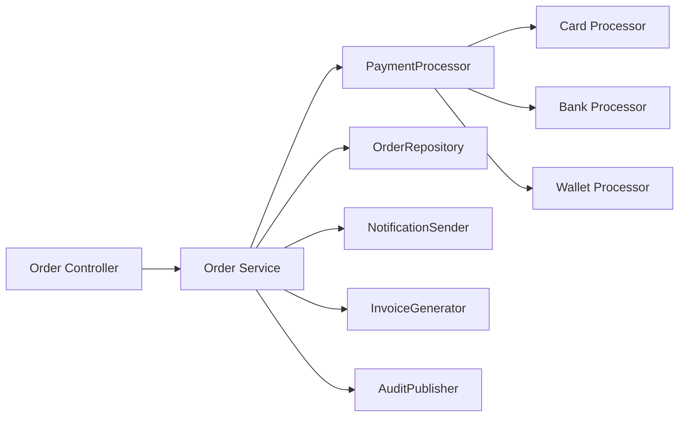

The design now supports extension by adding a new `PaymentProcessor` implementation without modifying the core order workflow.

### Interview approach

When reviewing SOLID violations:

1. Identify how many reasons the class has to change.
2. Separate business policy from infrastructure.
3. Extract stable contracts.
4. Inject implementations through constructors.
5. Avoid creating abstractions with only one imaginary future use.
6. Verify that every subtype can honor the parent contract.
7. Keep interfaces focused on their clients.

---

# 2. Design a Plugin System

## Requirement

Allow developers to add new functionality without modifying core application code.

Examples include:

- Payment methods
- File parsers
- Notification providers
- Report exporters
- Authentication mechanisms
- Business-rule extensions

## Core plugin contract

```java
public interface Plugin {

    String id();

    String version();

    void initialize(PluginContext context);

    void start();

    void stop();
}
```

Feature-specific contract:

```java
public interface DocumentExporter extends Plugin {

    boolean supports(ExportFormat format);

    byte[] export(Document document);
}
```

Implementations:

```java
public final class PdfExporter
        implements DocumentExporter {

    @Override
    public String id() {
        return "pdf-exporter";
    }

    @Override
    public String version() {
        return "1.0.0";
    }

    @Override
    public void initialize(PluginContext context) {
        // Read plugin configuration
    }

    @Override
    public void start() {
    }

    @Override
    public void stop() {
    }

    @Override
    public boolean supports(ExportFormat format) {
        return format == ExportFormat.PDF;
    }

    @Override
    public byte[] export(Document document) {
        return generatePdf(document);
    }
}
```

## Plugin registry

```java
public final class PluginRegistry {

    private final Map<String, Plugin> plugins =
            new ConcurrentHashMap<>();

    public void register(Plugin plugin) {
        Plugin previous = plugins.putIfAbsent(
                plugin.id(),
                plugin
        );

        if (previous != null) {
            throw new DuplicatePluginException(
                    plugin.id()
            );
        }
    }

    public Optional<Plugin> find(String id) {
        return Optional.ofNullable(plugins.get(id));
    }

    public Collection<Plugin> all() {
        return List.copyOf(plugins.values());
    }

    public void unregister(String id) {
        Plugin plugin = plugins.remove(id);

        if (plugin != null) {
            plugin.stop();
        }
    }
}
```

## Plugin discovery

Possible discovery approaches include:

### Java `ServiceLoader`

Provider interface:

```java
public interface DocumentExporter {
    byte[] export(Document document);
}
```

Discovery:

```java
ServiceLoader<DocumentExporter> loader =
        ServiceLoader.load(DocumentExporter.class);

for (DocumentExporter exporter : loader) {
    registry.register(exporter);
}
```

Provider module:

```java
module pdf.exporter {
    requires core.application;

    provides DocumentExporter
            with PdfDocumentExporter;
}
```

### Spring discovery

```java
@Component
public final class PdfExporter
        implements DocumentExporter {
}
```

Spring can inject all implementations:

```java
public ExportService(
        List<DocumentExporter> exporters
) {
    this.exporters = List.copyOf(exporters);
}
```

### External JAR loading

For dynamically installed plugins:

- Maintain a plugin directory.
- Load plugin JARs using isolated class loaders.
- Validate plugin metadata.
- Check API compatibility.
- Register implementations.
- Unload the class loader when removing the plugin.

## Architecture

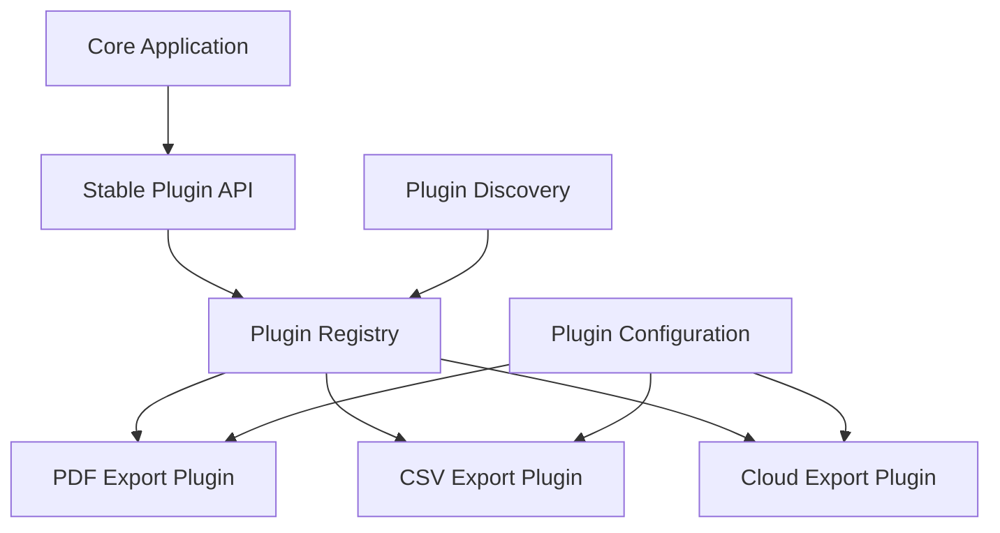

## Important concerns

- Version compatibility
- Plugin lifecycle
- Dependency isolation
- Configuration
- Security permissions
- Failure isolation
- Timeouts
- Resource cleanup
- Duplicate plugin IDs
- Hot loading and unloading
- Observability
- Backward compatibility of the plugin API

## Interview-ready answer

> I would define a small, stable plugin contract, discover implementations through dependency injection, `ServiceLoader`, or isolated class loaders, and register them in a plugin registry. Core code depends only on the contract. I would also design lifecycle hooks, version compatibility, failure isolation, configuration, observability, and resource cleanup because loading classes is only one part of a production plugin system.

---

# 3. Design an Immutable Class

## Scenario

Design an immutable `Money` class suitable for a payment system.

```java
public final class Money {

    private final BigDecimal amount;
    private final Currency currency;

    public Money(
            BigDecimal amount,
            Currency currency
    ) {
        this.amount = normalize(
                Objects.requireNonNull(
                        amount,
                        "Amount is required"
                )
        );

        this.currency = Objects.requireNonNull(
                currency,
                "Currency is required"
        );
    }

    public BigDecimal amount() {
        return amount;
    }

    public Currency currency() {
        return currency;
    }

    public Money add(Money other) {
        requireSameCurrency(other);

        return new Money(
                amount.add(other.amount),
                currency
        );
    }

    public Money subtract(Money other) {
        requireSameCurrency(other);

        return new Money(
                amount.subtract(other.amount),
                currency
        );
    }

    private void requireSameCurrency(Money other) {
        Objects.requireNonNull(other, "Money is required");

        if (!currency.equals(other.currency)) {
            throw new IllegalArgumentException(
                    "Currency mismatch"
            );
        }
    }

    private static BigDecimal normalize(
            BigDecimal amount
    ) {
        return amount.stripTrailingZeros();
    }

    @Override
    public boolean equals(Object object) {
        if (this == object) {
            return true;
        }

        if (!(object instanceof Money other)) {
            return false;
        }

        return amount.compareTo(other.amount) == 0
                && currency.equals(other.currency);
    }

    @Override
    public int hashCode() {
        return Objects.hash(
                amount.stripTrailingZeros(),
                currency
        );
    }

    @Override
    public String toString() {
        return amount + " " + currency;
    }
}
```

## Immutability rules

1. Make the class `final`, or otherwise prevent unsafe subclassing.
2. Make fields `private` and `final`.
3. Initialize all fields during construction.
4. Do not expose setters.
5. Validate constructor arguments.
6. Do not expose mutable internal objects.
7. Defensively copy mutable inputs and outputs.
8. Return new objects for state-changing operations.
9. Avoid allowing `this` to escape during construction.

## Defensive copy example

```java
public final class Team {

    private final List<String> members;

    public Team(List<String> members) {
        this.members = List.copyOf(members);
    }

    public List<String> members() {
        return members;
    }
}
```

Incorrect:

```java
public Team(List<String> members) {
    this.members = members;
}
```

The caller could later modify the original list.

## Record alternative

```java
public record Money(
        BigDecimal amount,
        Currency currency
) {
    public Money {
        Objects.requireNonNull(amount);
        Objects.requireNonNull(currency);
    }
}
```

A record is only shallowly immutable. Mutable components still require defensive copying.

---

# 4. Apply Singleton in a Distributed System

## Key distinction

A Java singleton guarantees, at most, one instance per class loader inside one JVM.

```text
One singleton != one instance across the cluster
```

In a deployment with five pods:

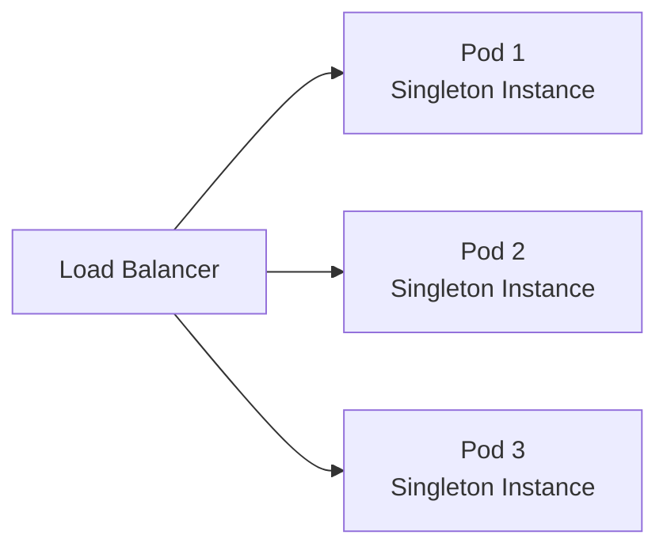

There are three instances, not one.

## Local singleton

```java
public enum ConfigurationRegistry {
    INSTANCE;
}
```

This is appropriate for process-local stateless configuration or utilities.

## Distributed single-owner requirement

When only one node should execute a task, use distributed coordination:

- Database lock
- Redis lock
- ZooKeeper
- etcd
- Kubernetes leader election
- Consul session
- Message-queue partition ownership
- Cloud-managed scheduler

## Database-lock example

```java
public interface DistributedLock {

    Optional<LockHandle> tryAcquire(
            String lockName,
            Duration leaseTime
    );
}
```

```java
public void executeScheduledJob() {
    distributedLock
            .tryAcquire(
                    "daily-settlement",
                    Duration.ofMinutes(10)
            )
            .ifPresent(lock -> {
                try (lock) {
                    settlementService.settle();
                }
            });
}
```

## Required distributed-lock properties

- Unique owner token
- Lease expiry
- Renewal mechanism
- Fencing token where stale owners are dangerous
- Safe release by the owner only
- Clock assumptions
- Failure recovery
- Idempotent task behavior

## Better question to ask

Do we truly need a distributed singleton, or do we need:

- Idempotency?
- Leader election?
- Exclusive resource ownership?
- One execution per schedule?
- One consumer per partition?
- A globally consistent sequence?

These requirements have different solutions.

## Interview-ready answer

> A Java singleton is scoped to one JVM or class loader, so it does not create a cluster-wide singleton. For distributed exclusivity, I would use leader election or a distributed lock with leases, owner tokens, and ideally fencing tokens. I would also make the operation idempotent because distributed locks cannot eliminate every failure window.

---

# 5. Factory vs Builder Pattern

## Factory

A factory decides **which object or implementation to create**.

```java
public final class PaymentProcessorFactory {

    public PaymentProcessor create(
            PaymentType type
    ) {
        return switch (type) {
            case CARD -> new CardPaymentProcessor();
            case BANK_TRANSFER ->
                    new BankTransferProcessor();
            case WALLET ->
                    new WalletPaymentProcessor();
        };
    }
}
```

Use a factory when:

- Object creation depends on a type or configuration.
- The caller should not know the concrete class.
- Creation logic must be centralized.
- Multiple implementations share a contract.

## Builder

A builder assembles **one complex object with many optional fields**.

```java
Order order = Order.builder()
        .customerId(customerId)
        .deliveryAddress(address)
        .priority(true)
        .discountCode("WELCOME10")
        .addItem(firstItem)
        .addItem(secondItem)
        .build();
```

Builder implementation:

```java
public final class Order {

    private final long customerId;
    private final Address deliveryAddress;
    private final boolean priority;
    private final String discountCode;
    private final List<OrderItem> items;

    private Order(Builder builder) {
        this.customerId = builder.customerId;
        this.deliveryAddress = builder.deliveryAddress;
        this.priority = builder.priority;
        this.discountCode = builder.discountCode;
        this.items = List.copyOf(builder.items);
    }

    public static Builder builder() {
        return new Builder();
    }

    public static final class Builder {

        private long customerId;
        private Address deliveryAddress;
        private boolean priority;
        private String discountCode;
        private final List<OrderItem> items =
                new ArrayList<>();

        public Builder customerId(long customerId) {
            this.customerId = customerId;
            return this;
        }

        public Builder deliveryAddress(
                Address deliveryAddress
        ) {
            this.deliveryAddress = deliveryAddress;
            return this;
        }

        public Builder priority(boolean priority) {
            this.priority = priority;
            return this;
        }

        public Builder discountCode(
                String discountCode
        ) {
            this.discountCode = discountCode;
            return this;
        }

        public Builder addItem(OrderItem item) {
            items.add(item);
            return this;
        }

        public Order build() {
            validate();
            return new Order(this);
        }

        private void validate() {
            if (customerId <= 0) {
                throw new IllegalStateException(
                        "Customer ID is required"
                );
            }

            if (items.isEmpty()) {
                throw new IllegalStateException(
                        "At least one item is required"
                );
            }
        }
    }
}
```

## Comparison

| Factory                               | Builder                                   |
| ------------------------------------- | ----------------------------------------- |
| Chooses what implementation to create | Constructs a complex object step by step  |
| Usually returns a shared interface    | Usually returns one concrete type         |
| Hides implementation selection        | Avoids telescoping constructors           |
| Input is often type/configuration     | Input is often multiple object properties |
| Useful for polymorphic creation       | Useful for readable object construction   |

They can be combined:

```java
PaymentRequest request =
        PaymentRequest.builder()
                .amount(amount)
                .currency(currency)
                .customerId(customerId)
                .build();

PaymentProcessor processor =
        paymentProcessorFactory.create(type);
```

---

# 6. Design a Pluggable Architecture

A pluggable architecture is a broader design than simply loading plugins. It ensures business workflows can be extended through stable extension points.

## Example: document-processing pipeline

```java
public interface DocumentParser {
    boolean supports(DocumentType type);

    ParsedDocument parse(byte[] content);
}
```

```java
public interface DocumentValidator {
    ValidationResult validate(
            ParsedDocument document
    );
}
```

```java
public interface DocumentProcessor {
    boolean supports(DocumentType type);

    ProcessingResult process(
            ParsedDocument document
    );
}
```

Orchestrator:

```java
public final class DocumentService {

    private final List<DocumentParser> parsers;
    private final List<DocumentValidator> validators;
    private final List<DocumentProcessor> processors;

    public DocumentService(
            List<DocumentParser> parsers,
            List<DocumentValidator> validators,
            List<DocumentProcessor> processors
    ) {
        this.parsers = List.copyOf(parsers);
        this.validators = List.copyOf(validators);
        this.processors = List.copyOf(processors);
    }

    public ProcessingResult process(
            DocumentType type,
            byte[] content
    ) {
        DocumentParser parser = findParser(type);
        ParsedDocument document = parser.parse(content);

        for (DocumentValidator validator : validators) {
            ValidationResult result =
                    validator.validate(document);

            if (!result.valid()) {
                throw new DocumentValidationException(
                        result.errors()
                );
            }
        }

        DocumentProcessor processor =
                findProcessor(type);

        return processor.process(document);
    }

    private DocumentParser findParser(
            DocumentType type
    ) {
        return parsers.stream()
                .filter(parser ->
                        parser.supports(type))
                .findFirst()
                .orElseThrow(() ->
                        new UnsupportedDocumentTypeException(type)
                );
    }

    private DocumentProcessor findProcessor(
            DocumentType type
    ) {
        return processors.stream()
                .filter(processor ->
                        processor.supports(type))
                .findFirst()
                .orElseThrow(() ->
                        new UnsupportedDocumentTypeException(type)
                );
    }
}
```

## Design principles

- Stable extension interfaces
- Dependency inversion
- Explicit registration
- Configuration-driven activation
- Isolated implementation failures
- Versioned contracts
- Independent testing
- No central `switch` statement for every extension
- Metrics by plugin or implementation
- Safe defaults when no plugin is available

---

# 7. Design a Retry Mechanism Using Design Patterns

## Requirements

A retry mechanism should support:

- Maximum attempts
- Retryable exception classification
- Exponential backoff
- Jitter
- Time limits
- Cancellation
- Observability
- Idempotency
- Circuit-breaker integration

## Retry policy

```java
public interface RetryPolicy {

    boolean shouldRetry(
            int attempt,
            Throwable failure
    );

    Duration delayBeforeAttempt(int nextAttempt);
}
```

Exponential-backoff implementation:

```java
public final class ExponentialBackoffPolicy
        implements RetryPolicy {

    private final int maximumAttempts;
    private final Duration initialDelay;
    private final Duration maximumDelay;
    private final Set<Class<? extends Throwable>>
            retryableExceptions;

    public ExponentialBackoffPolicy(
            int maximumAttempts,
            Duration initialDelay,
            Duration maximumDelay,
            Set<Class<? extends Throwable>>
                    retryableExceptions
    ) {
        this.maximumAttempts = maximumAttempts;
        this.initialDelay = initialDelay;
        this.maximumDelay = maximumDelay;
        this.retryableExceptions =
                Set.copyOf(retryableExceptions);
    }

    @Override
    public boolean shouldRetry(
            int attempt,
            Throwable failure
    ) {
        return attempt < maximumAttempts
                && retryableExceptions.stream()
                .anyMatch(type ->
                        type.isInstance(failure));
    }

    @Override
    public Duration delayBeforeAttempt(
            int nextAttempt
    ) {
        long multiplier =
                1L << Math.max(0, nextAttempt - 2);

        Duration calculated =
                initialDelay.multipliedBy(multiplier);

        Duration capped =
                calculated.compareTo(maximumDelay) > 0
                        ? maximumDelay
                        : calculated;

        long jitter =
                ThreadLocalRandom.current()
                        .nextLong(
                                Math.max(
                                        1,
                                        capped.toMillis() / 4
                                )
                        );

        return capped.plusMillis(jitter);
    }
}
```

## Retry executor

```java
public final class RetryExecutor {

    private final RetryPolicy policy;
    private final Sleeper sleeper;
    private final RetryListener listener;

    public RetryExecutor(
            RetryPolicy policy,
            Sleeper sleeper,
            RetryListener listener
    ) {
        this.policy = policy;
        this.sleeper = sleeper;
        this.listener = listener;
    }

    public <T> T execute(
            CheckedSupplier<T> operation
    ) {
        int attempt = 1;

        while (true) {
            try {
                return operation.get();
            } catch (Throwable failure) {
                listener.onFailure(attempt, failure);

                if (!policy.shouldRetry(
                        attempt,
                        failure
                )) {
                    throw new RetryExhaustedException(
                            attempt,
                            failure
                    );
                }

                attempt++;

                Duration delay =
                        policy.delayBeforeAttempt(attempt);

                listener.onRetry(attempt, delay);
                sleeper.sleep(delay);
            }
        }
    }
}
```

## Patterns involved

| Pattern         | Use                                          |
| --------------- | -------------------------------------------- |
| Strategy        | Different retry and backoff policies         |
| Decorator       | Add retry around an existing client          |
| Template Method | Fixed retry workflow with customizable steps |
| Observer        | Retry listener for logging and metrics       |
| Circuit Breaker | Stop retrying an unhealthy dependency        |
| Command         | Represent the operation being retried        |

## Decorator example

```java
public final class RetryingPaymentGateway
        implements PaymentGateway {

    private final PaymentGateway delegate;
    private final RetryExecutor retryExecutor;

    public RetryingPaymentGateway(
            PaymentGateway delegate,
            RetryExecutor retryExecutor
    ) {
        this.delegate = delegate;
        this.retryExecutor = retryExecutor;
    }

    @Override
    public PaymentResponse charge(
            PaymentRequest request
    ) {
        return retryExecutor.execute(
                () -> delegate.charge(request)
        );
    }
}
```

## Critical production warning

Do not retry every failure.

Usually retry:

- Connection reset
- Temporary service unavailability
- Rate limits with suitable delay
- Selected timeouts
- Optimistic-lock conflicts

Usually do not retry:

- Invalid input
- Authentication failure
- Authorization failure
- Non-idempotent operation without an idempotency key
- Permanent business rejection

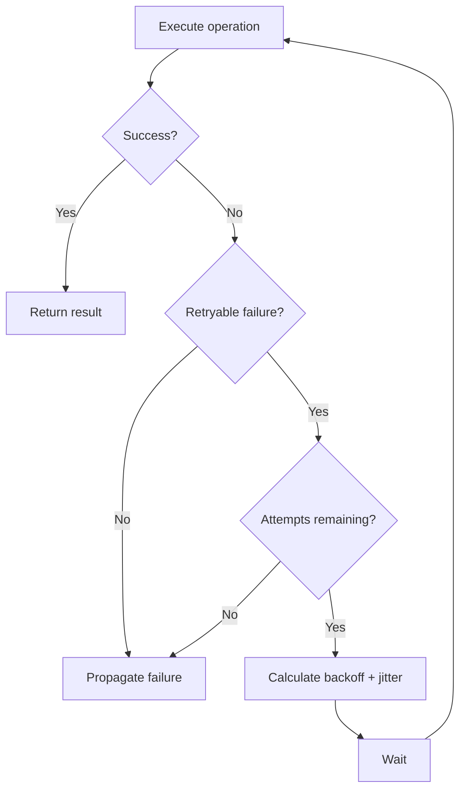

---

# 8. Ensure Safe Publication of Objects

Safe publication ensures other threads observe a fully constructed object and its initialized state.

## Unsafe publication

```java
public final class ConfigurationHolder {

    static Configuration configuration;

    static void initialize() {
        configuration = new Configuration();
    }
}
```

Without a happens-before relationship, another thread may not be guaranteed to observe the correctly initialized state.

## Safe techniques

### Static initialization

```java
public final class ConfigurationHolder {

    private static final Configuration INSTANCE =
            new Configuration();

    public static Configuration getInstance() {
        return INSTANCE;
    }
}
```

Class initialization provides safe publication.

### Final fields

```java
public final class Configuration {

    private final String endpoint;
    private final int timeout;

    public Configuration(
            String endpoint,
            int timeout
    ) {
        this.endpoint = endpoint;
        this.timeout = timeout;
    }
}
```

Final fields receive special visibility guarantees when the constructor does not allow `this` to escape.

### Volatile reference

```java
private volatile Configuration configuration;

public void update(Configuration configuration) {
    this.configuration = configuration;
}
```

### Synchronization

```java
private Configuration configuration;

public synchronized void update(
        Configuration configuration
) {
    this.configuration = configuration;
}

public synchronized Configuration get() {
    return configuration;
}
```

### Concurrent collections

```java
private final ConcurrentMap<String, Configuration>
        configurations = new ConcurrentHashMap<>();
```

Publishing through properly implemented concurrent collections establishes required visibility.

## Do not let `this` escape during construction

Incorrect:

```java
public class Listener {

    public Listener(EventBus eventBus) {
        eventBus.register(this);
    }
}
```

Another thread may access the object before construction completes.

Better:

```java
public class Listener {

    private Listener() {
    }

    public static Listener create(
            EventBus eventBus
    ) {
        Listener listener = new Listener();
        eventBus.register(listener);
        return listener;
    }
}
```

## Interview-ready answer

> I safely publish objects through static initialization, volatile references, synchronized blocks, locks, concurrent collections, or other happens-before relationships. I prefer immutable objects with final fields and ensure `this` does not escape during construction. Merely assigning an object to a normal shared field is not enough for thread-safe publication.

---

# Low-Level Design Interview Framework

Before designing any system, clarify:

1. Functional requirements
2. Actors
3. Core use cases
4. Capacity assumptions
5. Concurrency requirements
6. Persistence needs
7. Failure cases
8. Extensibility expectations
9. Out-of-scope features
10. Required consistency

Then present:

```text
Requirements
    ↓
Domain objects
    ↓
Interfaces and responsibilities
    ↓
Relationships
    ↓
Critical workflow
    ↓
Concurrency and consistency
    ↓
Patterns and SOLID justification
    ↓
Edge cases and extensions
```

---

# 9. Design a Concurrent HashMap From Scratch

## Scope clarification

A production-grade `ConcurrentHashMap` is extremely complex. In an interview, design a simplified concurrent hash map and explain its limitations.

## Requirements

- Concurrent reads
- Concurrent writes to different buckets
- Atomic `putIfAbsent`
- Collision handling
- Resize support
- Visibility guarantees
- Avoid one global lock where possible

## Simplified design: striped locking

```java
public interface ConcurrentMapStore<K, V> {

    V get(K key);

    V put(K key, V value);

    V putIfAbsent(K key, V value);

    V remove(K key);

    int size();
}
```

Node:

```java
final class Node<K, V> {

    final K key;
    volatile V value;
    Node<K, V> next;

    Node(
            K key,
            V value,
            Node<K, V> next
    ) {
        this.key = key;
        this.value = value;
        this.next = next;
    }
}
```

Map:

```java
public final class StripedConcurrentMap<K, V>
        implements ConcurrentMapStore<K, V> {

    private volatile Node<K, V>[] buckets;
    private final ReentrantLock[] locks;
    private final AtomicInteger size =
            new AtomicInteger();

    @SuppressWarnings("unchecked")
    public StripedConcurrentMap(
            int bucketCount,
            int stripeCount
    ) {
        this.buckets =
                (Node<K, V>[]) new Node[bucketCount];

        this.locks =
                new ReentrantLock[stripeCount];

        for (int index = 0;
             index < stripeCount;
             index++) {

            locks[index] = new ReentrantLock();
        }
    }

    @Override
    public V get(K key) {
        Objects.requireNonNull(key);

        Node<K, V>[] currentBuckets = buckets;
        int bucketIndex =
                bucketIndex(key, currentBuckets.length);

        Node<K, V> current =
                currentBuckets[bucketIndex];

        while (current != null) {
            if (current.key.equals(key)) {
                return current.value;
            }

            current = current.next;
        }

        return null;
    }

    @Override
    public V put(K key, V value) {
        Objects.requireNonNull(key);
        Objects.requireNonNull(value);

        int hash = spread(key.hashCode());
        ReentrantLock lock =
                locks[hash % locks.length];

        lock.lock();

        try {
            Node<K, V>[] currentBuckets =
                    buckets;

            int bucketIndex =
                    hash % currentBuckets.length;

            Node<K, V> current =
                    currentBuckets[bucketIndex];

            while (current != null) {
                if (current.key.equals(key)) {
                    V previous = current.value;
                    current.value = value;
                    return previous;
                }

                current = current.next;
            }

            currentBuckets[bucketIndex] =
                    new Node<>(
                            key,
                            value,
                            currentBuckets[bucketIndex]
                    );

            size.incrementAndGet();
            return null;
        } finally {
            lock.unlock();
        }
    }

    @Override
    public V putIfAbsent(K key, V value) {
        Objects.requireNonNull(key);
        Objects.requireNonNull(value);

        int hash = spread(key.hashCode());
        ReentrantLock lock =
                locks[hash % locks.length];

        lock.lock();

        try {
            int index =
                    hash % buckets.length;

            Node<K, V> current = buckets[index];

            while (current != null) {
                if (current.key.equals(key)) {
                    return current.value;
                }

                current = current.next;
            }

            buckets[index] = new Node<>(
                    key,
                    value,
                    buckets[index]
            );

            size.incrementAndGet();
            return null;
        } finally {
            lock.unlock();
        }
    }

    @Override
    public V remove(K key) {
        throw new UnsupportedOperationException(
                "Implementation omitted"
        );
    }

    @Override
    public int size() {
        return size.get();
    }

    private int bucketIndex(
            K key,
            int length
    ) {
        return spread(key.hashCode()) % length;
    }

    private int spread(int hash) {
        return (hash ^ (hash >>> 16))
                & Integer.MAX_VALUE;
    }
}
```

## Major design challenges

### Resizing

Resizing cannot simply replace the bucket array while writes continue without coordination.

Options:

- Acquire all stripe locks during resize.
- Use a dedicated resize lock.
- Incrementally migrate buckets.
- Mark migrated buckets with forwarding nodes.
- Allow threads to help with transfer.

### Visibility

- Bucket array reference should be safely published.
- Updated values need visibility.
- Structural changes need locking or CAS.
- Readers must not observe partially linked nodes.

### Deadlocks

If acquiring multiple stripe locks:

- Always acquire them in the same order.
- Release in reverse order.

### Hash flooding

Long chains degrade performance. A production implementation may transform heavily populated buckets into balanced trees.

### Iteration

Decide whether iterators are:

- Snapshot-based
- Weakly consistent
- Fail-fast
- Fully locked

Production concurrent maps usually prefer weakly consistent iteration.

## Interview statement

> I would not claim this simplified implementation replaces `ConcurrentHashMap`. The difficult areas are safe resizing, lock-free reads, atomic compound operations, iteration consistency, and contention management.

---

# 10. Design a Restaurant Reservation System

## Requirements

- Search restaurants
- View tables and time slots
- Reserve a table
- Cancel a reservation
- Prevent double booking
- Support party size
- Support table combinations
- Notify customers
- Maintain reservation status

## Core model

```java
public record TimeSlot(
        Instant start,
        Instant end
) {
}
```

```java
public final class Restaurant {

    private final RestaurantId id;
    private final String name;
    private final List<DiningTable> tables;
}
```

```java
public final class DiningTable {

    private final TableId id;
    private final int capacity;
    private final TableType type;
}
```

```java
public final class Reservation {

    private final ReservationId id;
    private final RestaurantId restaurantId;
    private final CustomerId customerId;
    private final List<TableId> tableIds;
    private final TimeSlot timeSlot;
    private final int partySize;
    private ReservationStatus status;
}
```

## Services

```java
public interface AvailabilityService {

    List<TableOption> findAvailableTables(
            RestaurantId restaurantId,
            TimeSlot timeSlot,
            int partySize
    );
}
```

```java
public interface ReservationService {

    Reservation reserve(
            ReservationRequest request
    );

    void cancel(ReservationId reservationId);
}
```

## Class relationship

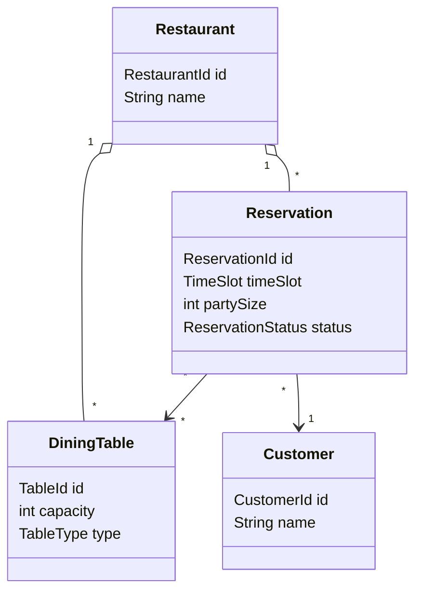

## Preventing double booking

Use a database transaction and locking strategy:

- Unique constraint on table and overlapping slot model where possible
- Pessimistic row lock during allocation
- Optimistic version field
- Temporary reservation hold with expiration
- Recheck availability before confirmation

Workflow:

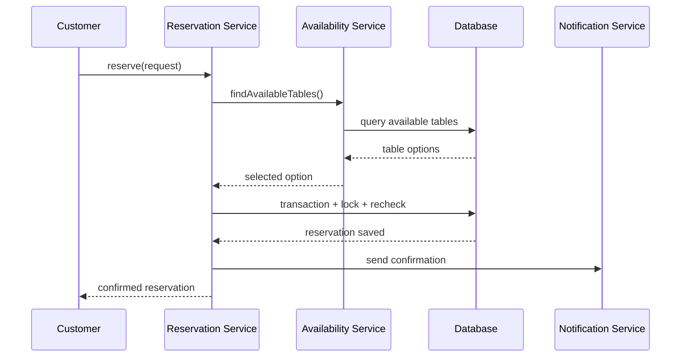

## Edge cases

- Concurrent bookings
- Reservation hold expiration
- Late arrival
- No-show
- Restaurant closure
- Table maintenance
- Time-zone conversion
- Cancellation policy
- Merging and splitting tables
- Overbooking policy

---

# 11. Design a Parking Lot System

## Requirements

- Multiple floors
- Different vehicle types
- Different spot types
- Ticket generation
- Spot allocation
- Fee calculation
- Payment
- Exit processing
- Real-time availability

## Core abstractions

```java
public interface ParkingSpot {

    SpotId id();

    boolean canFit(Vehicle vehicle);

    boolean isAvailable();

    void occupy(Vehicle vehicle);

    void release();
}
```

```java
public sealed interface Vehicle
        permits Car, Motorcycle, Truck {

    String registrationNumber();
}
```

```java
public interface SpotAllocationStrategy {

    Optional<ParkingSpot> selectSpot(
            Vehicle vehicle,
            Collection<ParkingSpot> availableSpots
    );
}
```

```java
public interface PricingStrategy {

    Money calculate(
            ParkingTicket ticket,
            Instant exitTime
    );
}
```

## Main services

```java
public final class ParkingLotService {

    private final SpotRepository spotRepository;
    private final TicketRepository ticketRepository;
    private final SpotAllocationStrategy allocationStrategy;
    private final PricingStrategy pricingStrategy;

    public ParkingTicket enter(Vehicle vehicle) {
        ParkingSpot spot = allocationStrategy
                .selectSpot(
                        vehicle,
                        spotRepository.availableSpots()
                )
                .orElseThrow(
                        NoParkingSpotAvailableException::new
                );

        spot.occupy(vehicle);
        spotRepository.save(spot);

        ParkingTicket ticket =
                ParkingTicket.open(
                        vehicle,
                        spot.id(),
                        Instant.now()
                );

        return ticketRepository.save(ticket);
    }

    public Money calculateFee(
            TicketId ticketId,
            Instant exitTime
    ) {
        ParkingTicket ticket =
                ticketRepository.findRequired(ticketId);

        return pricingStrategy.calculate(
                ticket,
                exitTime
        );
    }
}
```

## Diagram

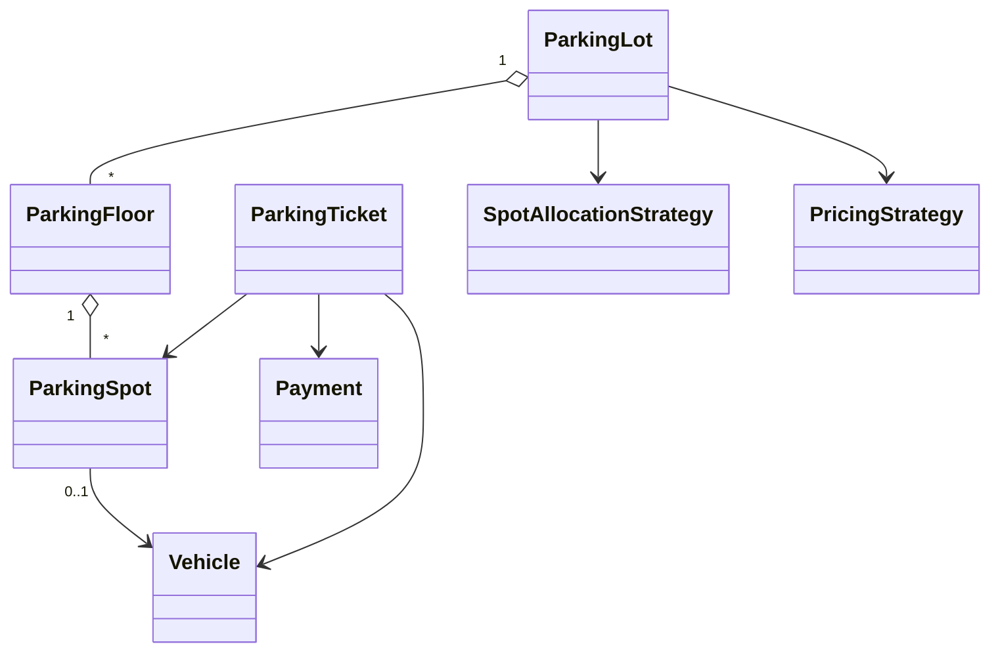

## Patterns

- Strategy for spot allocation
- Strategy for pricing
- Factory for vehicle or spot creation
- State pattern for ticket lifecycle
- Repository for persistence
- Observer/events for availability display

## Thread safety

Spot allocation must be atomic. Two entrance gates must not allocate the same spot.

Possible approaches:

- Database row locking
- Atomic compare-and-set on spot status
- Per-floor locks
- Central allocation service
- Partition allocation responsibility by floor

---

# 12. Design a Rate Limiter

## Requirements

- Limit requests by user, API key, IP, or tenant
- Configurable capacity
- Thread-safe
- Low latency
- Support distributed deployment
- Return retry information

## Contract

```java
public interface RateLimiter {

    RateLimitDecision allow(
            RateLimitKey key,
            int permits
    );
}
```

```java
public record RateLimitDecision(
        boolean allowed,
        long remainingPermits,
        Duration retryAfter
) {
}
```

## Token bucket

```java
public final class TokenBucketRateLimiter
        implements RateLimiter {

    private final long capacity;
    private final double refillTokensPerNanos;
    private final ConcurrentMap<RateLimitKey, Bucket>
            buckets = new ConcurrentHashMap<>();

    public TokenBucketRateLimiter(
            long capacity,
            long refillTokens,
            Duration refillPeriod
    ) {
        this.capacity = capacity;
        this.refillTokensPerNanos =
                (double) refillTokens
                        / refillPeriod.toNanos();
    }

    @Override
    public RateLimitDecision allow(
            RateLimitKey key,
            int permits
    ) {
        Bucket bucket = buckets.computeIfAbsent(
                key,
                ignored -> new Bucket(
                        capacity,
                        System.nanoTime()
                )
        );

        return bucket.tryConsume(
                permits,
                capacity,
                refillTokensPerNanos
        );
    }
}
```

Bucket:

```java
final class Bucket {

    private double tokens;
    private long lastRefillNanos;

    Bucket(
            double tokens,
            long lastRefillNanos
    ) {
        this.tokens = tokens;
        this.lastRefillNanos =
                lastRefillNanos;
    }

    synchronized RateLimitDecision tryConsume(
            int requested,
            long capacity,
            double refillRate
    ) {
        long now = System.nanoTime();
        long elapsed = now - lastRefillNanos;

        tokens = Math.min(
                capacity,
                tokens + elapsed * refillRate
        );

        lastRefillNanos = now;

        if (tokens >= requested) {
            tokens -= requested;

            return new RateLimitDecision(
                    true,
                    (long) tokens,
                    Duration.ZERO
            );
        }

        double missing = requested - tokens;

        long waitNanos =
                (long) Math.ceil(
                        missing / refillRate
                );

        return new RateLimitDecision(
                false,
                (long) tokens,
                Duration.ofNanos(waitNanos)
        );
    }
}
```

## Algorithms

| Algorithm              | Characteristics                                |
| ---------------------- | ---------------------------------------------- |
| Fixed window           | Simple but permits bursts at window boundaries |
| Sliding log            | Accurate but memory-intensive                  |
| Sliding window counter | Good approximation with moderate cost          |
| Token bucket           | Allows controlled bursts                       |
| Leaky bucket           | Smooth output rate                             |

## Distributed implementation

For multiple instances, local memory is insufficient when the limit must be global.

Use:

- Redis atomic Lua script
- Database atomic update
- Dedicated rate-limit service
- API gateway rate limiter

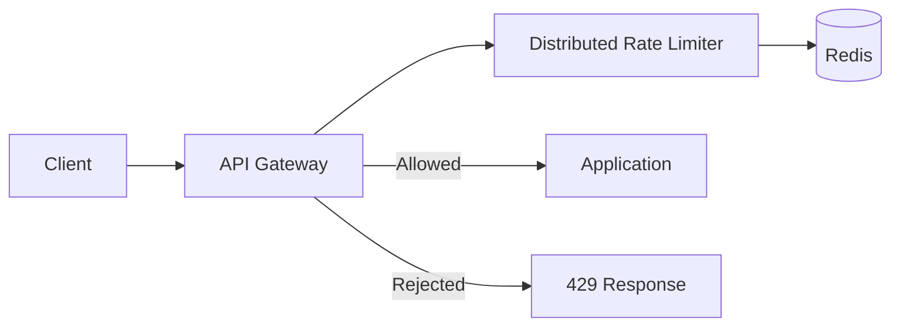

## Design-pattern explanation

- Strategy selects the algorithm.
- Factory creates limiters from configuration.
- Repository abstracts distributed state.
- Decorator adds limiting around services.
- Observer emits metrics.

---

# 13. Deep vs Shallow Cloning

## Shallow copy

A shallow copy duplicates the top-level object but shares nested mutable objects.

```java
public final class Employee {

    private String name;
    private Address address;

    public Employee shallowCopy() {
        Employee copy = new Employee();
        copy.name = this.name;
        copy.address = this.address;

        return copy;
    }
}
```

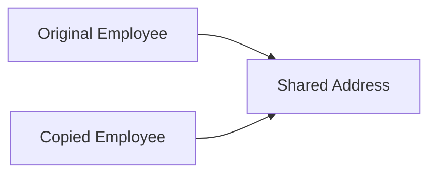

Changing the address through either employee affects both.

## Deep copy

A deep copy duplicates nested mutable state.

```java
public Employee deepCopy() {
    Employee copy = new Employee();

    copy.name = this.name;
    copy.address = new Address(
            this.address.getStreet(),
            this.address.getCity()
    );

    return copy;
}
```

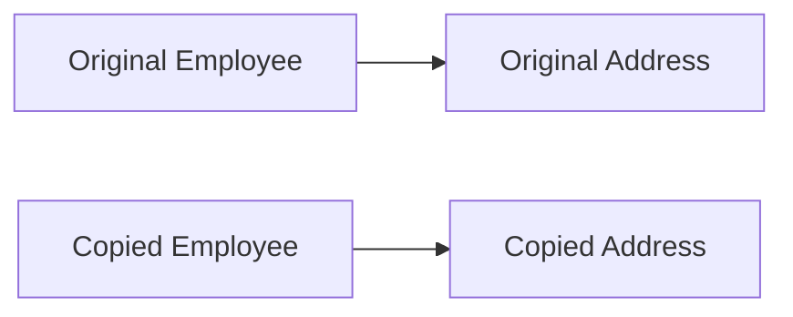

## When it matters

Deep copying matters when:

- Snapshots must remain independent.
- Mutable graphs are edited separately.
- Undo/redo history is stored.
- Events require immutable historical state.
- Security boundaries require isolation.
- Concurrent components must not share mutable state.

Shallow copying is often sufficient when nested values are immutable.

## Preferred alternatives

- Immutable objects
- Copy constructors
- Factory methods
- Records with defensive copying
- Explicit mapping
- Serialization only when justified

Avoid relying on `Object.clone()` for complex object graphs because the default behavior is shallow and the contract is awkward.

---

# 14. Design a Vending Machine

## Requirements

- Display products
- Accept money
- Select product
- Dispense product
- Return change
- Cancel transaction
- Handle out-of-stock products
- Handle insufficient funds
- Support maintenance and restocking

## State pattern

Typical states:

- Idle
- Money inserted
- Product selected
- Dispensing
- Out of service

```java
public interface VendingMachineState {

    void insertMoney(
            VendingMachine machine,
            Money amount
    );

    void selectProduct(
            VendingMachine machine,
            ProductCode code
    );

    void cancel(VendingMachine machine);

    void dispense(VendingMachine machine);
}
```

Context:

```java
public final class VendingMachine {

    private VendingMachineState state;
    private Money insertedAmount;
    private final Inventory inventory;
    private final CashStore cashStore;
    private Product selectedProduct;

    public VendingMachine(
            Inventory inventory,
            CashStore cashStore
    ) {
        this.inventory = inventory;
        this.cashStore = cashStore;
        this.state = new IdleState();
        this.insertedAmount = Money.zero();
    }

    public void insertMoney(Money amount) {
        state.insertMoney(this, amount);
    }

    public void selectProduct(ProductCode code) {
        state.selectProduct(this, code);
    }

    public void cancel() {
        state.cancel(this);
    }

    public void dispense() {
        state.dispense(this);
    }

    void transitionTo(
            VendingMachineState nextState
    ) {
        this.state = nextState;
    }
}
```

## Domain classes

```java
public record Product(
        ProductCode code,
        String name,
        Money price
) {
}
```

```java
public interface Inventory {

    Optional<Product> find(ProductCode code);

    boolean isAvailable(ProductCode code);

    void decrement(ProductCode code);

    void restock(
            ProductCode code,
            int quantity
    );
}
```

```java
public interface ChangeCalculator {

    List<MoneyDenomination> calculateChange(
            Money change,
            CashStore availableCash
    );
}
```

## Class diagram

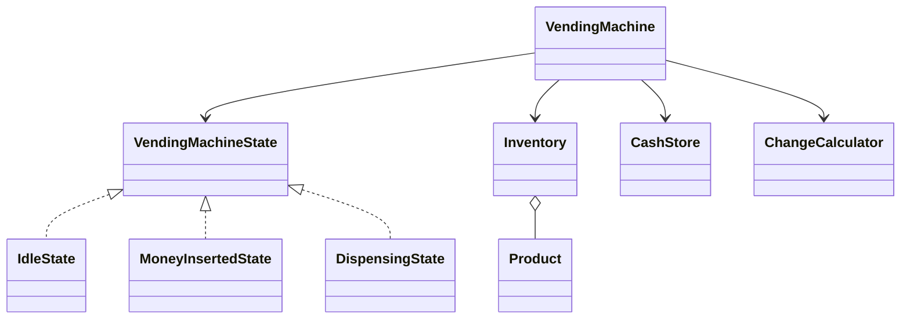

## Workflow

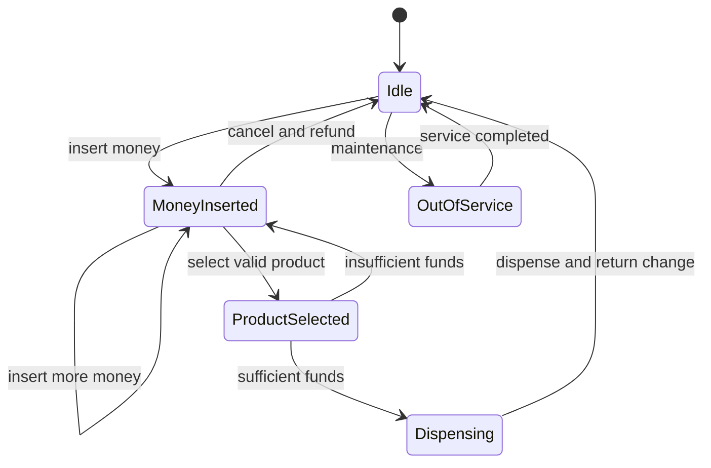

## Design patterns

- State pattern for machine behavior
- Strategy for change calculation
- Repository or inventory abstraction
- Factory for state or product construction where needed
- Observer/event publishing for maintenance alerts

## Concurrency

A physical vending machine normally processes one customer transaction at a time, so a machine-level lock or serialized event loop is reasonable.

A distributed vending backend would require transaction identifiers, idempotency, and inventory reservation.

---

# SOLID Questions the Interviewer May Challenge

## Why is each dependency an interface?

Do not answer “because SOLID says so.”

Use an interface when:

- Multiple implementations exist.
- The dependency crosses an architectural boundary.
- Testing requires substitution.
- The implementation is volatile.
- The caller should depend on a narrow contract.

A stable internal value object may not need an interface.

## Why not put every operation in one service?

Because unrelated responsibilities change for different reasons and create coupling. However, splitting every three-line method into a separate class also creates unnecessary complexity.

## Why use composition?

Because collaborators can vary independently and the owning class does not inherit behavior it cannot satisfy.

## Why use inheritance anywhere?

Because some domains have genuine subtype relationships with shared contracts and stable common behavior.

## Why is an immutable object thread-safe?

Its state cannot change after safe construction and publication. This avoids races caused by mutation, though referenced objects must also be immutable or safely encapsulated.

## Why is `ConcurrentHashMap` insufficient for every operation?

Individual methods are thread-safe, but multi-step workflows may not be atomic:

```java
if (!map.containsKey(key)) {
    map.put(key, value);
}
```

Use:

```java
map.putIfAbsent(key, value);
```

or:

```java
map.computeIfAbsent(
        key,
        ignored -> createValue()
);
```

## Why not retry indefinitely?

Infinite retries increase load, delay failures, and can create retry storms. Retries require limits, backoff, jitter, classification, and idempotency.

---

# Short Interview Answers

## Plugin architecture

> I define stable extension contracts, discover implementations through dependency injection, `ServiceLoader`, or isolated class loaders, and register them in a lifecycle-aware registry. Core workflows depend only on the contracts.

## Immutable class

> I make the class final, fields private and final, validate during construction, make defensive copies of mutable data, expose no mutators, and return new objects for state changes.

## Distributed singleton

> A Java singleton is only one instance per JVM or class loader. Cluster-wide exclusivity requires leader election or distributed locking, combined with leases, fencing where needed, and idempotent operations.

## Factory vs Builder

> Factory chooses which implementation or object type to create. Builder incrementally constructs one complex object with many optional or validated properties.

## Retry design

> I model retry behavior as a strategy and apply it through a decorator. The design includes bounded attempts, exception classification, exponential backoff, jitter, metrics, cancellation, and idempotency.

## Safe publication

> I publish shared objects through static initialization, volatile fields, synchronization, locks, or concurrent collections. I prefer immutable objects with final fields and prevent `this` from escaping during construction.
