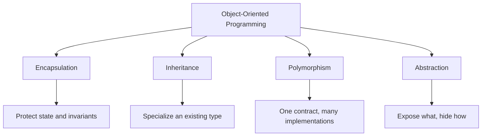
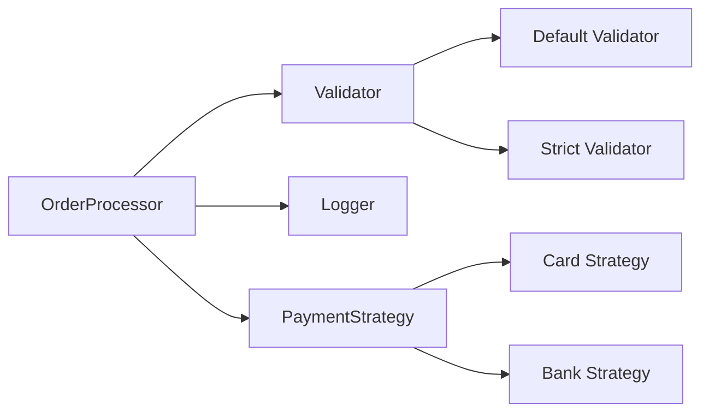
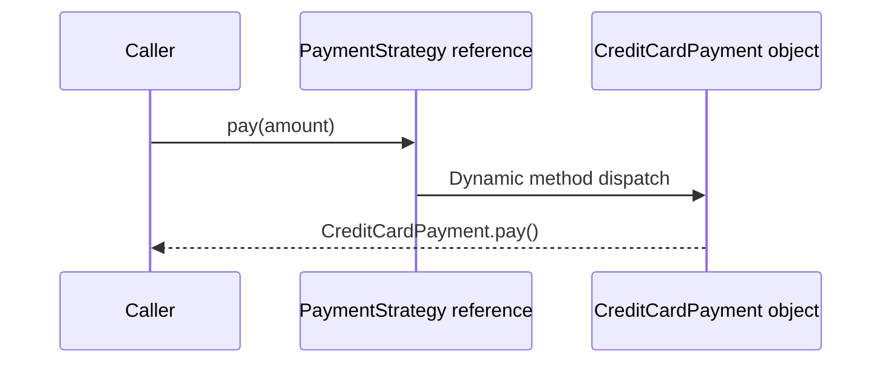

# OOP in Java: Encapsulation, Inheritance, Polymorphism, and Abstraction

## 1. Definition

Object-Oriented Programming organizes software around objects that combine **state**, **behavior**, and **identity**.

Its four main principles are:

- **Encapsulation** — protecting internal state and exposing controlled operations.
- **Inheritance** — creating a specialized class from an existing superclass.
- **Polymorphism** — allowing one common type to represent objects with different runtime behavior.
- **Abstraction** — exposing essential capabilities while hiding implementation details.



---

## 2. Why OOP Exists

These principles help large systems remain maintainable.

### Encapsulation

Limits how state can be modified, reducing unintended side effects.

### Inheritance

Supports specialization and runtime polymorphism when a genuine **Is-A** relationship exists.

### Polymorphism

Allows callers to depend on a common contract rather than concrete implementations.

### Abstraction

Separates high-level business rules from low-level technical details.

For example, a payment service can depend on:

```java
PaymentStrategy
```

instead of directly depending on:

```java
CreditCardPaymentStrategy
```

This makes implementations easier to replace, test, and extend.

---

# Encapsulation

## 3. What Is Encapsulation?

Encapsulation groups state and behavior inside a class while controlling how external code interacts with that state.

```java
import java.math.BigDecimal;
import java.util.Objects;

public final class BankAccount {

    private BigDecimal balance;

    public BankAccount(BigDecimal initialBalance) {
        Objects.requireNonNull(
                initialBalance,
                "Initial balance is required"
        );

        if (initialBalance.signum() < 0) {
            throw new IllegalArgumentException(
                    "Initial balance cannot be negative"
            );
        }

        this.balance = initialBalance;
    }

    public void deposit(BigDecimal amount) {
        validatePositiveAmount(amount);
        balance = balance.add(amount);
    }

    public void withdraw(BigDecimal amount) {
        validatePositiveAmount(amount);

        if (amount.compareTo(balance) > 0) {
            throw new IllegalStateException(
                    "Insufficient balance"
            );
        }

        balance = balance.subtract(amount);
    }

    public BigDecimal getBalance() {
        return balance;
    }

    private void validatePositiveAmount(
            BigDecimal amount
    ) {
        Objects.requireNonNull(
                amount,
                "Amount is required"
        );

        if (amount.signum() <= 0) {
            throw new IllegalArgumentException(
                    "Amount must be positive"
            );
        }
    }
}
```

The object protects its own rules:

- Balance cannot start below zero.
- Deposits must be positive.
- Withdrawals cannot exceed the balance.
- External code cannot directly assign an arbitrary balance.

### Encapsulation is not just getters and setters

This design is weak:

```java
public void setBalance(BigDecimal balance) {
    this.balance = balance;
}
```

It allows callers to bypass business rules.

A stronger API exposes meaningful operations:

```java
deposit(amount);
withdraw(amount);
freeze();
close();
```

### Benefits

- Protects invariants
- Reduces coupling
- Hides implementation details
- Centralizes validation
- Makes changes safer
- Improves testability

---

# Abstraction

## 4. What Is Abstraction?

Abstraction exposes the behavior a caller needs without exposing implementation details.

```java
public interface PaymentStrategy {

    PaymentResult pay(BigDecimal amount);
}
```

The caller only needs to understand the contract:

```java
PaymentResult result =
        paymentStrategy.pay(amount);
```

It does not need to know whether the implementation uses:

- A card gateway
- A bank API
- A digital wallet
- A test double
- An offline payment mechanism

### Implementations

```java
public final class CreditCardPayment
        implements PaymentStrategy {

    @Override
    public PaymentResult pay(
            BigDecimal amount
    ) {
        System.out.println(
                "Processing credit-card payment"
        );

        return PaymentResult.success();
    }
}
```

```java
public final class BankTransferPayment
        implements PaymentStrategy {

    @Override
    public PaymentResult pay(
            BigDecimal amount
    ) {
        System.out.println(
                "Processing bank transfer"
        );

        return PaymentResult.success();
    }
}
```

Abstraction is achieved through more than interfaces. It can also come from:

- Abstract classes
- Encapsulated concrete classes
- Public APIs
- Service boundaries
- Modules

---

# Inheritance

## 5. What Is Inheritance?

Inheritance allows a subclass to extend a superclass.

```java
public abstract class Notification {

    private final String recipient;

    protected Notification(String recipient) {
        this.recipient = recipient;
    }

    public String getRecipient() {
        return recipient;
    }

    public abstract void send(String message);
}
```

```java
public final class EmailNotification
        extends Notification {

    public EmailNotification(String recipient) {
        super(recipient);
    }

    @Override
    public void send(String message) {
        System.out.println(
                "Sending email to " +
                getRecipient() +
                ": " +
                message
        );
    }
}
```

Important points:

- A Java class can extend only one direct superclass.
- Constructors are not inherited.
- Private superclass members are not directly accessible by the subclass.
- Final classes cannot be extended.
- Final methods cannot be overridden.
- Inheritance should represent a valid **Is-A** relationship.

```text
EmailNotification is a Notification
```

Inheritance should not be used only because two classes contain similar code.

---

## 6. Types of Inheritance Supported in Java

### Single inheritance

```text
Animal → Dog
```

### Multilevel inheritance

```text
Animal → Mammal → Dog
```

### Hierarchical inheritance

```text
       Animal
       /    \
     Dog    Cat
```

### Multiple inheritance of type through interfaces

```java
public final class SmartDevice
        implements Camera, GPS, MusicPlayer {
}
```

Java does not allow a class to extend multiple classes:

```java
// Invalid
class Device extends Camera, GPS {
}
```

Interfaces allow multiple contracts without inheriting multiple superclass states.

---

# Polymorphism

## 7. What Is Polymorphism?

Polymorphism allows a common reference type to represent different concrete implementations.

```java
PaymentStrategy strategy =
        new CreditCardPayment();

strategy.pay(new BigDecimal("100.00"));
```

The variable type is:

```java
PaymentStrategy
```

The runtime object is:

```java
CreditCardPayment
```

Java executes the overridden method belonging to the runtime object.

### Example

```java
public final class PaymentService {

    private final PaymentStrategy strategy;

    public PaymentService(
            PaymentStrategy strategy
    ) {
        this.strategy = strategy;
    }

    public PaymentResult process(
            BigDecimal amount
    ) {
        return strategy.pay(amount);
    }
}
```

The same service works with different implementations:

```java
PaymentService cardService =
        new PaymentService(
                new CreditCardPayment()
        );

PaymentService transferService =
        new PaymentService(
                new BankTransferPayment()
        );
```

This is runtime polymorphism.

---

## 8. Compile-Time vs Runtime Polymorphism

### Method overloading

Overloading uses the same method name with different parameter lists.

```java
public class Calculator {

    int add(int first, int second) {
        return first + second;
    }

    double add(
            double first,
            double second
    ) {
        return first + second;
    }
}
```

The compiler selects the appropriate method from the declared argument types.

### Method overriding

Overriding occurs when a subclass or implementation provides a new implementation of an inherited method.

```java
class Parent {

    void display() {
        System.out.println("Parent");
    }
}

class Child extends Parent {

    @Override
    void display() {
        System.out.println("Child");
    }
}
```

```java
Parent value = new Child();
value.display(); // Child
```

### Comparison

| Overloading                                  | Overriding                                       |
| -------------------------------------------- | ------------------------------------------------ |
| Same name, different parameters              | Same inherited signature                         |
| Compile-time selection                       | Runtime dispatch                                 |
| Inheritance not required                     | Inheritance or interface implementation required |
| Static methods can be overloaded             | Static methods are hidden, not overridden        |
| Return type alone cannot distinguish methods | Return type must be the same or covariant        |

---

# Interface vs Abstract Class

## 9. When Should You Use an Interface?

Use an interface when:

- Unrelated classes should share a contract.
- Multiple implementations are expected.
- A class must support multiple capabilities.
- Callers should depend on behavior rather than state.
- Loose coupling and dependency injection are priorities.

```java
public interface PaymentStrategy {
    PaymentResult pay(BigDecimal amount);
}
```

Modern interfaces may contain:

- Abstract methods
- Default methods
- Static methods
- Private methods
- Constants

They cannot contain ordinary per-object instance state or constructors.

---

## 10. When Should You Use an Abstract Class?

Use an abstract class when related subclasses share:

- Instance state
- Constructor logic
- Protected helper methods
- Common algorithm structure
- Partial implementation

```java
public abstract class BaseNotifier {

    public final void send(String message) {
        validate(message);
        log(message);
        doSend(message);
    }

    protected abstract void doSend(
            String message
    );

    private void validate(String message) {
        if (message == null ||
                message.isBlank()) {

            throw new IllegalArgumentException(
                    "Message must not be blank"
            );
        }
    }

    private void log(String message) {
        System.out.println(
                "Sending: " + message
        );
    }
}
```

Subclass:

```java
public final class EmailNotifier
        extends BaseNotifier {

    @Override
    protected void doSend(String message) {
        System.out.println(
                "Email sent: " + message
        );
    }
}
```

This is an example of the Template Method pattern.

---

## 11. Interface vs Abstract Class

| Interface                                        | Abstract class                                    |
| ------------------------------------------------ | ------------------------------------------------- |
| Defines a capability or contract                 | Defines a shared base type                        |
| Supports multiple implementation contracts       | A class can extend only one superclass            |
| No ordinary instance state                       | Can contain instance fields                       |
| No constructors                                  | Can contain constructors                          |
| Abstract methods are public                      | Abstract methods may have different access levels |
| Can contain default, static, and private methods | Can contain normal concrete methods               |
| Suitable for unrelated implementations           | Suitable for closely related subclasses           |
| Common for dependency injection                  | Common for shared template behavior               |

It is slightly inaccurate to describe interfaces as “pure contracts.” Modern interfaces may include implementation through default, static, and private methods. Their major limitation is the absence of ordinary instance state.

---

# Composition Over Inheritance

## 12. What Is Composition?

Composition means that one class receives or owns collaborator objects and delegates work to them.

```java
public final class OrderProcessor {

    private final OrderValidator validator;
    private final ApplicationLogger logger;

    public OrderProcessor(
            OrderValidator validator,
            ApplicationLogger logger
    ) {
        this.validator = validator;
        this.logger = logger;
    }

    public void process(Order order) {
        validator.validate(order);

        logger.log(
                "Processing order " +
                order.getId()
        );
    }
}
```

This creates Has-A relationships:

```text
OrderProcessor has an OrderValidator
OrderProcessor has an ApplicationLogger
```

---

## 13. Why Is Composition Often Preferred?

Composition usually offers:

- Lower coupling
- Easier unit testing
- Runtime implementation replacement
- Smaller focused classes
- No fragile superclass dependency
- Freedom to combine multiple behaviors
- Clearer dependency relationships



With composition, collaborators can be replaced independently.

```java
OrderProcessor processor =
        new OrderProcessor(
                new StrictOrderValidator(),
                new StructuredLogger()
        );
```

---

## 14. When Is Inheritance Appropriate?

Inheritance remains appropriate when:

- A true Is-A relationship exists.
- The subtype preserves the superclass contract.
- Runtime substitution is valid.
- Shared behavior is stable.
- The hierarchy is shallow and understandable.

Good example:

```text
Circle is a Shape
```

Questionable example:

```text
OrderProcessor is a Logger
```

The second relationship likely exists only for code reuse and should use composition instead.

---

# Polymorphism at the JVM Level

## 15. How Does Runtime Method Dispatch Work?

Consider:

```java
PaymentStrategy strategy =
        new CreditCardPayment();

strategy.pay(amount);
```

The compiler confirms that `PaymentStrategy` declares `pay()`.

At runtime, the JVM examines the actual object and invokes the implementation supplied by `CreditCardPayment`.

Conceptually:



Typical bytecode invocation instructions include:

| Instruction       | Common purpose                                                |
| ----------------- | ------------------------------------------------------------- |
| `invokevirtual`   | Instance methods using virtual dispatch                       |
| `invokeinterface` | Interface method calls                                        |
| `invokestatic`    | Static methods                                                |
| `invokespecial`   | Constructors, private methods, and certain superclass calls   |
| `invokedynamic`   | Dynamically linked operations such as many lambda expressions |

The JIT compiler may optimize polymorphic calls through techniques such as:

- Method inlining
- Devirtualization
- Inline caching
- Speculative optimization

The logical behavior must remain equivalent even when the JVM optimizes the call.

---

# Production Example: Strategy and Dependency Injection

## 16. Payment Strategy

```java
public interface PaymentStrategy {

    boolean supports(PaymentType type);

    PaymentResult pay(PaymentRequest request);
}
```

Implementations:

```java
@Component
public final class CardPaymentStrategy
        implements PaymentStrategy {

    @Override
    public boolean supports(PaymentType type) {
        return type == PaymentType.CARD;
    }

    @Override
    public PaymentResult pay(
            PaymentRequest request
    ) {
        return PaymentResult.success();
    }
}
```

```java
@Component
public final class BankPaymentStrategy
        implements PaymentStrategy {

    @Override
    public boolean supports(PaymentType type) {
        return type ==
                PaymentType.BANK_TRANSFER;
    }

    @Override
    public PaymentResult pay(
            PaymentRequest request
    ) {
        return PaymentResult.success();
    }
}
```

Service using constructor injection:

```java
@Service
public final class PaymentService {

    private final List<PaymentStrategy> strategies;

    public PaymentService(
            List<PaymentStrategy> strategies
    ) {
        this.strategies =
                List.copyOf(strategies);
    }

    public PaymentResult process(
            PaymentRequest request
    ) {
        PaymentStrategy strategy =
                strategies.stream()
                        .filter(candidate ->
                                candidate.supports(
                                        request.type()
                                )
                        )
                        .findFirst()
                        .orElseThrow(() ->
                                new UnsupportedPaymentTypeException(
                                        request.type()
                                )
                        );

        return strategy.pay(request);
    }
}
```

This design demonstrates:

- Abstraction through `PaymentStrategy`
- Polymorphism through multiple implementations
- Encapsulation inside each strategy
- Composition inside `PaymentService`
- Dependency inversion through constructor injection

---

# Common Mistakes

## 17. Using Inheritance Only for Code Reuse

Problematic:

```java
class OrderService extends Logger {
}
```

An `OrderService` is not logically a `Logger`.

Prefer:

```java
class OrderService {

    private final Logger logger;
}
```

---

## 18. Creating Deep Inheritance Hierarchies

```text
BaseService
  → AuditedService
    → ValidatedService
      → TransactionalService
        → OrderService
```

Deep hierarchies make it difficult to determine:

- Which implementation executes
- Which fields are shared
- Which methods may be overridden
- Which superclass assumptions exist

Prefer shallow hierarchies and composed collaborators.

---

## 19. Exposing Every Field Through Setters

```java
account.setBalance(
        new BigDecimal("-500")
);
```

This breaks encapsulation by allowing invalid state.

Prefer domain behavior:

```java
account.withdraw(amount);
```

---

## 20. Assuming Every Interface Is Implementation-Free

Modern interfaces may contain:

```java
default void execute() {
}

static Service create() {
    return new DefaultService();
}

private void validate() {
}
```

They still cannot hold ordinary instance state.

---

## 21. Confusing Overloading and Overriding

Overloading:

```java
send(String message);
send(String message, Priority priority);
```

Overriding:

```java
class EmailSender extends Sender {

    @Override
    void send(String message) {
    }
}
```

---

## 22. Violating Substitutability

Problematic:

```java
class Bird {

    void fly() {
    }
}

class Penguin extends Bird {

    @Override
    void fly() {
        throw new UnsupportedOperationException();
    }
}
```

A `Penguin` cannot satisfy the expected `Bird.fly()` contract.

Better design:

```java
interface Bird {
}

interface FlyingBird extends Bird {
    void fly();
}

class Penguin implements Bird {
}

class Eagle implements FlyingBird {

    @Override
    public void fly() {
    }
}
```

---

# Trade-Offs

| Approach       | Advantages                                            | Limitations                                  |
| -------------- | ----------------------------------------------------- | -------------------------------------------- |
| Interface      | Loose coupling, multiple contracts, easy substitution | No ordinary instance state                   |
| Abstract class | Shared state and implementation                       | Single class inheritance                     |
| Inheritance    | Runtime polymorphism and specialization               | Strong coupling and fragile hierarchies      |
| Composition    | Flexibility, testability, replaceable behavior        | More collaborating objects and delegation    |
| Encapsulation  | Protects invariants and limits change impact          | Requires deliberate API design               |
| Abstraction    | Simplifies callers and separates concerns             | Poor abstractions can add unnecessary layers |

---

# Interview Questions

## Question 1: What is the difference between an interface and an abstract class?

An interface is best for defining a capability shared by potentially unrelated classes. An abstract class is best when related subclasses share state, constructor logic, or common implementation.

---

## Question 2: What is the difference between overloading and overriding?

Overloading uses the same method name with different parameter lists and is resolved at compile time. Overriding replaces inherited instance behavior and is dispatched according to the runtime object type.

---

## Question 3: Why is composition often preferred over inheritance?

Composition reduces coupling and allows behavior to be replaced independently. Inheritance creates a stronger relationship and should be reserved for genuine, behaviorally substitutable Is-A relationships.

---

## Question 4: Can interfaces contain implementations?

Yes. Interfaces can contain default, static, private instance, and private static methods. They cannot contain ordinary instance fields or constructors.

---

## Question 5: What is runtime polymorphism?

Runtime polymorphism occurs when a superclass or interface reference points to a subtype object and an overridden method is selected using the actual runtime type.

---

## Question 6: What is the difference between abstraction and encapsulation?

Abstraction hides unnecessary implementation complexity from callers. Encapsulation protects an object’s internal state and controls how that state may be changed.

---

## Question 7: What is dynamic method dispatch?

Dynamic method dispatch is the JVM mechanism that selects an overridden instance method based on the runtime object rather than only the declared reference type.

---

## Question 8: When should inheritance be used?

Use inheritance when the subtype is genuinely a specialization of the parent and can replace the parent without breaking its contract.

---

# Short Interview Answer

> Encapsulation protects state through controlled behavior, abstraction exposes what an object does without revealing how, inheritance models genuine Is-A relationships, and polymorphism lets a common interface represent multiple runtime implementations. I normally use interfaces and composition for flexible service design, and use abstract classes or inheritance only when subclasses share stable implementation or state and remain fully substitutable for the parent.

---

## Related Topics

- [SOLID Principles](../07-design-patterns/solid.md)
- [Design Patterns](../07-design-patterns/patterns.md)
- [Spring Dependency Injection](../06-spring/spring-core.md)
- [Generics](../01-core-java/generics/README.md)
- [Java Collections Framework](../02-collections/README.md)
