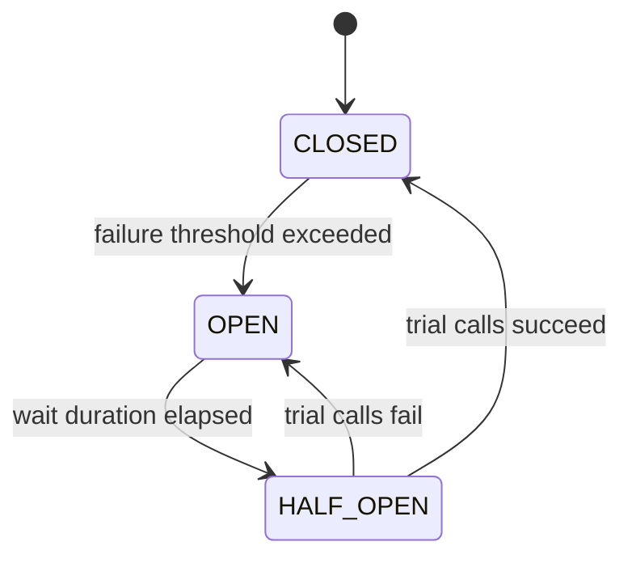
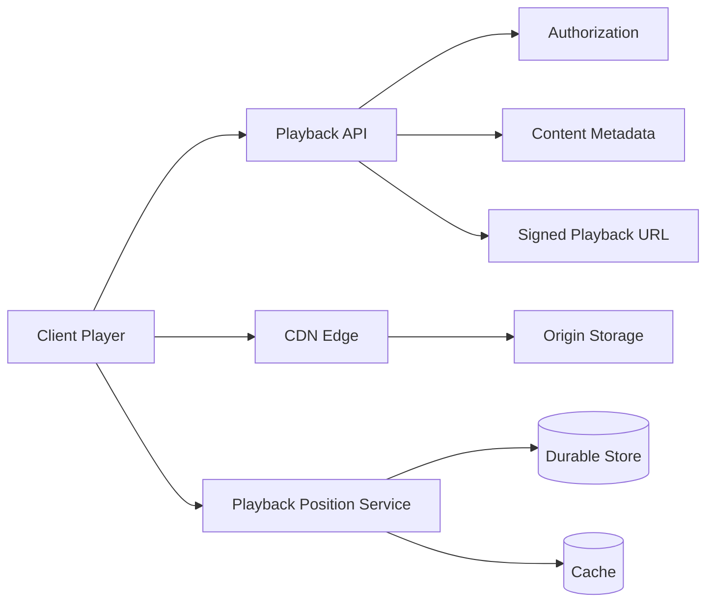

# Java Backend Interview Question Bank — Cleaned and Reorganized

The uploaded file contains a strong collection of Java, Spring, concurrency, DSA, database, messaging, low-level design, and system-design questions. However, several sections are repeated multiple times, and some technical claims are oversimplified or misleading. The following structure consolidates the useful material into a repository-ready interview curriculum.

---

# Recommended Repository Structure

```text
interview-preparation/
├── 01-core-java/
│   ├── README.md
│   ├── language-features.md
│   ├── collections.md
│   ├── exceptions.md
│   ├── concurrency.md
│   ├── jvm-memory.md
│   └── coding-questions.md
├── 02-spring/
│   ├── spring-core.md
│   ├── spring-boot.md
│   ├── transactions.md
│   ├── spring-data-jpa.md
│   ├── spring-security.md
│   └── rest-api.md
├── 03-microservices/
│   ├── communication.md
│   ├── resilience.md
│   ├── distributed-transactions.md
│   └── observability.md
├── 04-messaging/
│   ├── kafka.md
│   └── rabbitmq.md
├── 05-databases/
│   ├── sql.md
│   ├── indexing.md
│   ├── transactions.md
│   ├── pagination.md
│   └── caching.md
├── 06-dsa/
│   ├── arrays-and-strings.md
│   ├── linked-lists.md
│   ├── trees-and-graphs.md
│   ├── dynamic-programming.md
│   ├── heaps.md
│   └── cache-design.md
├── 07-low-level-design/
│   ├── notification-system.md
│   ├── rate-limiter.md
│   ├── vending-machine.md
│   ├── parking-lot.md
│   └── cricket-scoreboard.md
├── 08-system-design/
│   ├── payment-system.md
│   ├── video-streaming.md
│   ├── chat-application.md
│   ├── url-shortener.md
│   ├── notification-platform.md
│   ├── ride-hailing.md
│   ├── ecommerce-checkout.md
│   ├── job-scheduler.md
│   ├── metrics-platform.md
│   └── alert-monitoring.md
├── 09-production-debugging/
│   ├── high-cpu.md
│   ├── memory-leaks.md
│   ├── server-crashes.md
│   └── thread-and-heap-dumps.md
└── 10-behavioral/
    └── hiring-manager-questions.md
```

---

# 1. Core Java — Canonical Interview Questions

## Language and OOP

1. Is Java pass-by-value or pass-by-reference?
2. Why is `String` immutable?
3. What is the String Pool?
4. What is the difference between an interface and an abstract class?
5. What is the difference between method overloading and overriding?
6. When should composition be preferred over inheritance?
7. What are records, and when should they be used instead of classes?
8. What are sealed classes, and what problem do they solve?
9. What is an effectively final variable?
10. What is `var`, and where can it be used?
11. Explain Java 8, Java 11, Java 17, and Java 21 features used in production.
12. Explain SOLID principles using a real service design.

---

## Collections

1. How does `HashMap` work internally?
2. How does `ConcurrentHashMap` differ from `HashMap` internally?
3. Compare `HashMap`, `ConcurrentHashMap`, and `Hashtable`.
4. Why must `equals()` and `hashCode()` follow a contract?
5. What happens when a mutable object is used as a `HashMap` key?
6. How would you sort a map by key?
7. How would you sort a map by value?
8. What is the difference between `Comparable` and `Comparator`?
9. What is fail-fast iteration?
10. What does the commonly used term “fail-safe iterator” mean?
11. What happens when a `HashMap` contains one million entries and performance degrades?
12. How are collisions handled in modern `HashMap` implementations?
13. When would a bucket be transformed from a linked structure into a tree?
14. What is the difference between `ArrayList` and `LinkedList`?
15. Explain immutable collections and unmodifiable collection views.

---

## Exceptions

1. What is the Java exception hierarchy?
2. What is the difference between checked and unchecked exceptions?
3. What are the advantages and disadvantages of checked exceptions?
4. What is the difference between `throw` and `throws`?
5. What is multi-catch?
6. Why is try-with-resources preferred over manual cleanup?
7. What are suppressed exceptions?
8. What is the difference between `Exception` and `Error`?
9. How would you design custom business exceptions?
10. When should an exception be caught, wrapped, or propagated?

---

## Generics

1. What is type erasure?
2. Why is `List<String>` not a subtype of `List<Object>`?
3. What does PECS mean?
4. What is the difference between `? extends T` and `? super T`?
5. Why can Java not create `new T()`?
6. Why can Java not create generic arrays directly?
7. What are bounded type parameters?
8. What are bridge methods?
9. How does Spring Data use `Repository<T, ID>`?
10. Why can generic methods clash after type erasure?

---

# 2. Java Concurrency

## Threading Fundamentals

1. What is the difference between a process and a thread?
2. What is the difference between `Runnable` and `Callable`?
3. What is the difference between calling `run()` and `start()`?
4. What are the Java thread states?
5. What is a daemon thread?
6. What is the difference between `wait()` and `sleep()`?
7. What are `wait()`, `notify()`, and `notifyAll()`?
8. What is a race condition?
9. What is deadlock?
10. How do you detect and prevent deadlocks?

---

## Java Memory Model

1. What is the Java Memory Model?
2. What is a happens-before relationship?
3. What is safe publication?
4. What does `volatile` guarantee?
5. What does `volatile` not guarantee?
6. What is the difference between `volatile` and `synchronized`?
7. What are atomic variables?
8. What is compare-and-set?
9. Why is `count++` not atomic?
10. What is false sharing?
11. What is lock contention?
12. What is the difference between optimistic and pessimistic locking?

---

## Executors and Asynchronous Programming

1. Why use `ExecutorService` instead of creating threads manually?
2. What is the difference between `execute()` and `submit()`?
3. What is `Future`?
4. What is `CompletableFuture`?
5. How are exceptions handled in `CompletableFuture` pipelines?
6. What is a `BlockingQueue`?
7. Where would a bounded `BlockingQueue` be used?
8. What is thread-pool starvation?
9. How do you select a thread-pool size?
10. How do you shut down an executor correctly?

---

## Virtual Threads

1. What is a virtual thread?
2. How does a virtual thread differ from a platform thread?
3. When do virtual threads improve scalability?
4. When do virtual threads provide little or no benefit?
5. What is virtual-thread pinning?
6. Should virtual threads be pooled?
7. How do virtual threads affect connection-pool sizing?
8. What happens when millions of virtual threads compete for ten database connections?

### Interview-ready explanation

> Virtual threads reduce the cost of maintaining large numbers of blocking tasks. They are particularly useful for request-per-thread applications dominated by network or database waiting. They do not make CPU-bound code faster, remove downstream capacity limits, or eliminate the need for backpressure.

---

## `ThreadLocal`

1. What is `ThreadLocal`?
2. Where is it used?
3. Why can it cause memory leaks in thread pools?
4. Why must `remove()` usually be called in `finally`?
5. Does a `ThreadLocal` value automatically propagate to executor threads?
6. When should an explicit method parameter be preferred?

---

# 3. JVM and Memory Management

## JVM Fundamentals

1. Explain JDK, JRE, and JVM.
2. What happens after `javac` compiles source code?
3. What does a `.class` file contain?
4. Explain loading, linking, and class initialization.
5. What are the bootstrap, platform, and application class loaders?
6. What is JIT compilation?
7. What is the difference between interpretation and JIT compilation?

---

## JVM Memory

1. Explain heap, thread stacks, Metaspace, code cache, and native memory.
2. What causes `StackOverflowError`?
3. What causes `OutOfMemoryError`?
4. How can Java leak memory despite garbage collection?
5. What is the difference between shallow size and retained size?
6. What are GC roots?
7. What is a class-loader leak?
8. How can `ThreadLocal` retain application objects?

---

## Garbage Collection

1. How does Java garbage collection work?
2. What is reachability analysis?
3. What are young- and old-generation collections?
4. What is stop-the-world?
5. What is compaction?
6. What is a concurrent garbage collector?
7. What is the difference between G1 and ZGC?
8. When might G1 be preferred?
9. When might ZGC be preferred?
10. What information do GC logs provide?
11. What does allocation rate mean?
12. What is the live-set size?

### G1 vs ZGC interview summary

| G1                                           | ZGC                                                                 |
| -------------------------------------------- | ------------------------------------------------------------------- |
| General-purpose collector                    | Low-pause collector                                                 |
| Balances throughput and pause targets        | Targets very short pause times                                      |
| Widely suitable for moderate and large heaps | Particularly useful for large heaps and latency-sensitive workloads |
| Usually simpler operational default          | May use additional CPU or memory depending on workload              |
| Requires measurement and tuning              | Also requires workload measurement                                  |

The correct choice depends on:

- Heap size
- Allocation rate
- Pause-time objectives
- Throughput objectives
- CPU budget
- Application latency requirements

---

## Debugging `OutOfMemoryError`

1. Read the exact error variant.
2. Enable automatic heap dumps.
3. Capture GC logs or JFR data.
4. Inspect class histograms.
5. Analyze retained objects and GC-root paths.
6. Check unbounded caches, queues, sessions, and static maps.
7. Investigate native memory and thread counts.
8. Reproduce under a controlled workload.
9. Fix the retention cause.
10. Increase memory only when the live set legitimately requires it.

Useful commands:

```bash
jcmd <pid> GC.heap_info
jcmd <pid> GC.class_histogram
jcmd <pid> Thread.print
jcmd <pid> VM.native_memory summary
```

---

# 4. Spring and Spring Boot

## Spring Core

1. What is Spring?
2. Why is Spring used?
3. What is inversion of control?
4. What is dependency injection?
5. How does autowiring work?
6. Why is constructor injection preferred?
7. What is the difference between `@Component`, `@Service`, and `@Repository`?
8. What is the difference between `@Component` and `@Bean`?
9. What happens during the Spring bean lifecycle?
10. What is a `BeanPostProcessor`?
11. How do Spring proxies work?

---

## Spring Boot

1. What is the difference between Spring and Spring Boot?
2. What happens internally during Spring Boot startup?
3. What is auto-configuration?
4. How does conditional configuration work?
5. What are Spring profiles?
6. What is externalized configuration?
7. What is Actuator?
8. What should a readiness endpoint verify?
9. What should a liveness endpoint verify?
10. How do you diagnose slow application startup?

---

## Transactions

1. How does `@Transactional` work internally?
2. Why can self-invocation bypass transactional advice?
3. What is the difference between `REQUIRED` and `REQUIRES_NEW`?
4. What is transaction propagation?
5. What is transaction isolation?
6. What causes `LazyInitializationException`?
7. Why does catching an exception sometimes prevent rollback?
8. Which exceptions trigger rollback by default?
9. How should external API calls be handled relative to database transactions?
10. Why should transactions generally remain short?

### Important correction

This statement is too absolute:

> Self-invocation means the transaction never starts.

More accurately:

> In the common proxy-based Spring transaction model, a call from one method to another method on the same object does not pass through the proxy. Therefore, transactional advice declared only on the internally called method may not be applied.

---

## REST APIs

1. What is REST?
2. What is a RESTful API?
3. What is the difference between REST and SOAP?
4. What is the difference between HTTP and HTTPS?
5. How should request validation be implemented?
6. How should API errors be represented?
7. How does `@RestControllerAdvice` work?
8. What is idempotency?
9. How do idempotency keys protect payment requests?
10. How should APIs be versioned?
11. What are safe and idempotent HTTP methods?
12. How should pagination be designed?
13. How do cursor and offset pagination differ?
14. How do you secure a REST API end to end?

---

## HTTP Clients

1. Compare `RestTemplate`, `WebClient`, and newer synchronous clients.
2. When should blocking I/O be used?
3. When is WebFlux appropriate?
4. What is backpressure?
5. Why should WebClient not be selected merely because it is newer?
6. How do timeouts, connection pools, retries, and circuit breakers interact?

---

# 5. Database and JPA

## Transactions and Consistency

1. What are ACID properties?
2. Explain ACID using a bank transfer.
3. What are dirty reads, non-repeatable reads, and phantom reads?
4. What is lost update?
5. How does optimistic locking prevent lost updates?
6. How does pessimistic locking work?
7. What is an isolation level?
8. When should eventual consistency be accepted?

---

## JPA and Hibernate

1. What is the N+1 query problem?
2. How do you detect N+1 queries?
3. How do fetch joins solve N+1?
4. What is the difference between eager and lazy loading?
5. What is the first-level cache?
6. What is the second-level cache?
7. What is dirty checking?
8. What is an entity lifecycle?
9. How do batch fetching and pagination interact?
10. Why can fetching multiple collections create Cartesian-product problems?

---

## Indexing

1. How does a database index work?
2. When does an index improve performance?
3. When does an index hurt performance?
4. Why does composite-index column order matter?
5. What is a covering index?
6. Why might a low-cardinality index be ineffective?
7. Why must query execution plans be inspected?
8. What is the difference between `EXPLAIN` and runtime analysis?
9. Why do too many indexes slow writes?
10. How do indexes affect update and delete operations?

---

## Connection Pooling

1. Why use a database connection pool?
2. How does HikariCP work?
3. What happens when the pool is exhausted?
4. How should a connection timeout be selected?
5. Why should pool size not simply match request-thread count?
6. How do database capacity and query latency influence pool size?
7. What metrics should be monitored?

Important metrics:

- Active connections
- Idle connections
- Pending acquisition requests
- Acquisition time
- Query latency
- Database CPU
- Lock waits
- Transaction duration

### Important correction

The following is not a universal sizing formula:

```text
CPU cores × 2 + disk spindles
```

It may be used as historical intuition in specific contexts, but production sizing must be validated against:

- Database limits
- Workload concurrency
- Query latency
- Transaction duration
- CPU and I/O saturation
- Number of application instances

---

# 6. Kafka and Messaging

## Kafka

1. What is a Kafka topic?
2. What is a partition?
3. How does a partition key affect ordering?
4. What is a consumer group?
5. What happens when a consumer crashes?
6. What is an offset?
7. When should an offset be committed?
8. What is at-least-once delivery?
9. What is idempotent consumption?
10. How do retries and dead-letter topics work?
11. How do you preserve ordering?
12. What is consumer lag?
13. How should poison messages be handled?
14. What is the transactional outbox pattern?
15. Why can duplicate messages occur?

### Topic vs queue nuance

Kafka topics are not traditional destructive-consumption queues. Records remain according to retention policy and can be read by multiple consumer groups.

However, within one consumer group, partitions are distributed among consumers in a queue-like work-sharing model.

---

## Kafka vs RabbitMQ

| Kafka                             | RabbitMQ                                        |
| --------------------------------- | ----------------------------------------------- |
| Distributed append-only log       | Message broker                                  |
| Retention-based storage           | Often acknowledgement-based delivery            |
| Strong event-streaming model      | Strong routing and work-queue model             |
| Partition-based ordering          | Queue/exchange routing                          |
| Consumer groups replay records    | Consumers usually process routed messages       |
| Good for event streams and replay | Good for commands, work queues, complex routing |

Choose based on delivery semantics, replay needs, routing, operational constraints, and ordering requirements—not popularity.

---

# 7. Resilience Patterns

## Timeouts

Every remote operation should have a bounded wait time.

Questions:

1. What happens without a timeout?
2. Should connection and read timeouts be separate?
3. How do timeouts propagate through a call chain?
4. What is a deadline budget?

---

## Retries

1. Which failures should be retried?
2. Which failures should never be retried?
3. Why use exponential backoff?
4. Why add jitter?
5. What is a retry storm?
6. Why is idempotency required?
7. Where should retries be placed?
8. How do retry and transaction boundaries interact?

---

## Circuit Breaker

States:



Questions:

1. What problem does a circuit breaker solve?
2. What is the difference between a circuit breaker and a retry?
3. What metrics determine when it opens?
4. What is a slow-call threshold?
5. What should happen while the circuit is open?
6. How should fallback behavior be designed?

A circuit breaker does not automatically “recover gracefully.” Recovery depends on meaningful fallback behavior, capacity planning, monitoring, and downstream health.

---

# 8. DSA and Coding Question Bank

## Arrays and Strings

1. Two Sum and its variants
2. Find all pairs with a target sum
3. Find all triplets with a target sum
4. Move zeros to the end
5. Find duplicate strings
6. Check whether two strings are anagrams
7. Longest substring without repeating characters
8. Longest common prefix
9. Maximum subarray sum
10. Missing number in a consecutive array
11. Best time to buy and sell stock
12. Trapping rain water
13. Palindrome validation
14. Reverse-add palindrome
15. Generate all permutations of a string

---

## Linked Lists and Heaps

1. Detect a cycle in a linked list
2. Merge K sorted linked lists
3. Implement LRU cache
4. Implement LFU cache
5. Find the median from a data stream
6. Find the Kth-largest element in a stream
7. Design a priority-based task scheduler

---

## Trees and Graphs

1. Lowest common ancestor
2. Detect a duplicate subtree
3. Detect a cycle in a directed graph
4. Course-schedule dependency problem
5. Word Ladder
6. Dijkstra’s shortest-path algorithm
7. BFS vs DFS
8. Disjoint-set union
9. Detect anomalies in a financial graph
10. Discuss graph traversal with ten million nodes

---

## Dynamic Programming

1. Longest increasing subsequence
2. Coin change
3. Combination Sum II
4. Maximum subarray
5. Task scheduling
6. Memoization vs tabulation

---

## Java Stream Coding

Given an array:

1. Remove odd numbers.
2. Multiply each remaining number by a constant.
3. Return the sum.

```java
int result = Arrays.stream(values)
        .filter(value -> value % 2 == 0)
        .map(value -> value * multiplier)
        .sum();
```

Follow-up questions:

- Is a stream clearer than a loop here?
- Does parallel execution help?
- How are empty inputs handled?
- Can integer overflow occur?

---

# 9. Low-Level Design Questions

## Notification Service

Requirements:

- Email, SMS, and push delivery
- User preferences
- Priority-based processing
- Retry with exponential backoff
- Dead-letter handling
- Delivery status
- Provider fallback
- Template management
- Rate limiting

Suggested contracts:

```java
public interface NotificationChannel {
    ChannelType type();

    DeliveryResult send(Notification notification);
}
```

```java
public interface RetryPolicy {
    boolean shouldRetry(int attempt, Throwable failure);

    Duration nextDelay(int attempt);
}
```

Useful patterns:

- Strategy
- Factory
- Decorator
- Observer
- Repository
- Circuit breaker

---

## Cricket Scoreboard

Core objects:

```text
Match
Team
Player
Innings
Over
Ball
DeliveryOutcome
Scorecard
```

Important rules:

- Valid ball vs extra
- Strike rotation
- Wides and no-balls
- Wickets
- Four and six counts
- Balls faced
- Overs
- Target calculation
- Match completion

The core logic should be isolated from console input/output.

---

## Alert Monitoring System

Supported rule types:

```text
SIMPLE_COUNT
FIXED_BUCKET
SLIDING_WINDOW
```

Core abstractions:

```java
public interface AlertRule {
    boolean evaluate(EventWindow window);
}
```

```java
public interface WindowStrategy {
    EventWindow add(Event event);
}
```

Key challenges:

- Out-of-order events
- Duplicate events
- Time synchronization
- High-cardinality dimensions
- Distributed counters
- Alert deduplication
- Notification suppression
- Recovery after restart

---

# 10. System Design Question Bank

## High-priority designs

1. Payment-processing platform
2. Distributed rate limiter
3. Notification platform
4. Chat application
5. URL shortener
6. Video-streaming platform
7. E-commerce checkout
8. Ride-hailing application
9. Search autocomplete
10. Metrics and SLO platform
11. Distributed job scheduler
12. Transaction feed
13. Alert-monitoring platform
14. Stack Overflow-like system
15. News aggregator

---

# Video-Streaming Design — Corrected Architecture



## Main components

### Content ingestion

- Upload source video
- Validate content
- Transcode into multiple resolutions and bitrates
- Package into segmented formats
- Store manifests and segments in object storage
- Distribute through a CDN

### Playback

- Authenticate and authorize user
- Return manifest or signed playback location
- Client selects appropriate quality
- Client downloads segments from CDN
- Playback position is updated asynchronously

### Peak-release preparation

- Precompute manifests
- Prewarm CDN caches where useful
- Autoscale control-plane APIs
- Increase origin capacity
- Load-test authentication and playback-token services
- Apply request coalescing
- Protect downstream databases

### Failure considerations

- CDN region failure
- Origin overload
- Authentication outage
- Playback-position write failure
- Cache stampede
- Partial transcoding
- Device compatibility
- Traffic spikes

### Important corrections

Avoid unsupported universal claims such as:

```text
CDN handles exactly 95% of traffic.
Redis playback position is never lost.
The origin is never touched.
```

More accurate statements:

- A CDN should serve the majority of video bytes.
- Playback progress may use a cache plus durable persistence.
- Cache misses, invalidations, or uncached content can reach the origin.
- Exact hit rates depend on workload and architecture.

---

# 11. Production Debugging Questions

## High CPU

1. Identify the Java process.
2. Identify high-CPU native threads.
3. Capture multiple thread dumps.
4. Match native thread IDs to Java threads.
5. Record Java Flight Recorder data.
6. Inspect garbage-collection CPU.
7. Look for infinite loops, hot methods, retries, regex issues, and serialization overhead.

---

## High Memory

1. Check heap usage after major collections.
2. Inspect heap-region and native-memory metrics.
3. Capture a heap dump.
4. Analyze retained size and dominator trees.
5. Inspect caches, queues, sessions, listeners, and thread-local state.
6. Compare multiple snapshots.
7. Review allocation rate and object lifetime.

---

## Server Crash

Investigate:

- Application logs
- JVM fatal-error logs
- Container termination reason
- Exit code
- Operating-system OOM killer
- Kubernetes events
- Core dump
- Recent deployment
- Health-check failures
- Native-library crashes
- Disk exhaustion
- File-descriptor exhaustion

Linux examples:

```bash
journalctl -u application-service
dmesg | grep -i -E "oom|killed process"
free -h
df -h
top
pidstat
```

Container and Kubernetes examples:

```bash
docker inspect <container>
docker logs <container>

kubectl describe pod <pod>
kubectl logs <pod> --previous
kubectl get events --sort-by=.metadata.creationTimestamp
```

---

# 12. Hiring Manager Questions

1. Walk me through the most complex system you built.
2. What technical decision had the greatest impact?
3. Describe a production incident you investigated.
4. How did you improve reliability?
5. How do you handle architectural disagreements?
6. Tell me about a design that did not work.
7. How do you balance delivery speed and technical quality?
8. How do you mentor or support other developers?
9. How do you prioritize technical debt?
10. What part of a system did you own end to end?

A strong answer should cover:

```text
Context
→ Responsibility
→ Constraints
→ Decision
→ Trade-offs
→ Implementation
→ Measured result
→ Lessons learned
```

---

# Technical Corrections to the Source Material

## Virtual threads

Original-style claim:

> Virtual threads do not block under load.

Correct version:

> Virtual threads can logically block, but the JVM can unmount them from carrier threads during many supported blocking operations. They do not remove database, CPU, memory, socket, or downstream capacity limits.

---

## HikariCP sizing

Original-style claim:

> Default size ten is almost always wrong.

Correct version:

> Ten may be suitable or unsuitable depending on query latency, database capacity, application replicas, workload concurrency, and transaction duration. Pool sizing must be measured.

---

## `volatile`

Original-style claim:

> `volatile` forces every read from main memory instead of thread cache.

Better explanation:

> `volatile` establishes Java Memory Model visibility and ordering guarantees. The implementation should not be explained as a literal mandatory fetch from physical main memory on every read.

---

## Fail-safe iterators

“Fail-safe” is a common interview term but is not an official Java Collections Framework classification.

A clearer explanation:

> Concurrent or snapshot-based iterators may continue during modifications according to their consistency model, rather than throwing `ConcurpZEAWYtiB6bJ16NuLbGCc6CZ6jJdKfb63`.

---

## Redis durability

Original-style claim:

> Redis playback position is never lost.

Correct version:

> Redis may be used as a fast cache or state store, but durability depends on persistence mode, replication, acknowledgement policy, failover behavior, and whether a durable database also stores the data.

---

## Kafka partition key

Original-style claim:

> The partition key determines the throughput ceiling.

Better explanation:

> Partition count, key distribution, record size, broker capacity, consumer parallelism, replication, and processing latency together influence throughput. A poor key can create hot partitions and reduce effective parallelism.

---

## `@Transactional`

Original-style claim:

> Self-invocation always means the transaction does not start.

Better explanation:

> Self-invocation can bypass proxy-based advice when the transaction annotation is only on the internally invoked method. Behavior depends on where the transaction boundary is declared and the proxying mechanism.

---

# Priority-Based Study Plan

## Tier 1 — Must Know

- `HashMap` and `ConcurrentHashMap`
- `equals()` and `hashCode()`
- Java Memory Model
- `volatile`, synchronization, and atomics
- Executors and `BlockingQueue`
- GC and memory-leak investigation
- Spring dependency injection
- `@Transactional`
- REST validation and exception handling
- SQL indexing and transaction isolation
- Kafka ordering, retries, and idempotency
- Payment system
- Rate limiter
- Notification system
- LRU cache
- Sliding window
- BFS and DFS

## Tier 2 — Strong Mid-Level

- Virtual threads
- CompletableFuture
- G1 vs ZGC
- ThreadLocal leaks
- JPA N+1
- Optimistic locking
- Outbox pattern
- Saga pattern
- Circuit breakers
- Connection-pool sizing
- Distributed caching
- Chat system
- URL shortener
- Video streaming

## Tier 3 — Senior-Level Depth

- Distributed consistency
- Fencing tokens
- Backpressure
- Partition rebalancing
- Cache stampede prevention
- High-cardinality metrics
- Multi-region failover
- Adaptive bitrate pipeline
- Exactly-once business outcomes
- Failure-mode analysis
- Capacity estimation
- Cost and operational trade-offs

---

# Root Interview README

```markdown
# Java Backend Interview Preparation

This repository covers:

- Core Java and JVM internals
- Collections and concurrency
- Spring Boot and JPA
- Kafka and distributed messaging
- SQL and database design
- Production debugging
- DSA and coding
- Low-level design
- High-level system design
- Behavioral interviews

## Answering Framework

For each technical question:

1. Define the concept.
2. Explain why it exists.
3. Describe how it works.
4. Give a practical example.
5. Discuss trade-offs.
6. Mention a production failure mode.
7. Finish with a concise interview answer.

For system-design questions:

1. Clarify requirements.
2. Estimate scale.
3. Define APIs and data models.
4. Draw the high-level architecture.
5. Explain critical workflows.
6. Identify bottlenecks.
7. Discuss consistency.
8. Discuss failure handling.
9. Explain observability.
10. Present trade-offs and alternatives.
```

This version removes repeated blocks, promotional wording, unsupported scale claims, and absolute statements while preserving the strongest interview topics from the uploaded bank.
