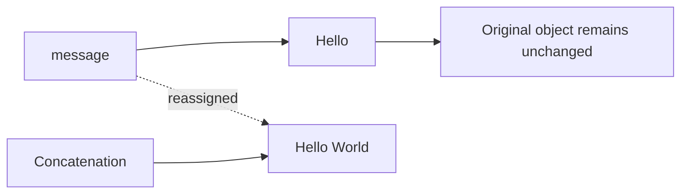

# Advanced Questions — `String`, `StringBuilder`, and `StringBuffer`

## Question 1: What is the difference between `String`, `StringBuilder`, and `StringBuffer`?

All three represent character sequences, but they differ mainly in **mutability**, **synchronization**, and intended use.

| Feature                   | `String`                                  | `StringBuilder`                 | `StringBuffer`                      |
| ------------------------- | ----------------------------------------- | ------------------------------- | ----------------------------------- |
| Mutability                | Immutable                                 | Mutable                         | Mutable                             |
| Thread safety             | Safe to share because state cannot change | Not thread-safe                 | Individual methods are synchronized |
| String Pool               | Literals may be pooled                    | Not pooled                      | Not pooled                          |
| Repeated modifications    | Produces new string results               | Efficient for repeated changes  | Efficient but synchronized          |
| Typical use               | Text values, identifiers, keys            | Building text within one thread | Legacy/shared mutable text          |
| Introduced                | Java 1.0                                  | Java 5                          | Java 1.0                            |
| Implements `CharSequence` | Yes                                       | Yes                             | Yes                                 |
| Implements `Appendable`   | No                                        | Yes                             | Yes                                 |

---

# `String`

## 1. Why is `String` immutable?

After a `String` object is created, its contents cannot be changed.

```java
String message = "Hello";
message = message + " World";
```

The original `"Hello"` object remains unchanged. Concatenation produces another string, and `message` is reassigned to the new result.



Immutability provides:

- Safe sharing between threads
- Stable hash codes
- Safe use as `HashMap` keys
- String Pool reuse
- Predictable behavior
- Protection against unexpected modification

---

## 2. Are string modifications always inefficient?

Not necessarily.

This is clear and normally appropriate:

```java
String fullName = firstName + " " + lastName;
```

The compiler and JVM optimize many simple concatenations.

Compile-time constants can be combined during compilation:

```java
String message = "Hello" + " " + "Java";
```

This can effectively become:

```java
String message = "Hello Java";
```

The concern arises mainly with repeated concatenation, especially inside loops.

```java
String result = "";

for (String value : values) {
    result = result + value;
}
```

Each iteration may create an intermediate string and copy existing content.

Prefer:

```java
StringBuilder result = new StringBuilder();

for (String value : values) {
    result.append(value);
}

String finalResult = result.toString();
```

### Practical rule

- Use `String` for fixed values and simple expressions.
- Use `StringBuilder` for repeated or conditional construction.
- Do not replace every `+` operation with a builder without evidence.

---

# `StringBuilder`

## 3. What is `StringBuilder`?

`StringBuilder` is a mutable character sequence.

```java
StringBuilder builder = new StringBuilder();

builder.append("Hello");
builder.append(' ');
builder.append("World");

String result = builder.toString();
```

Output:

```text
Hello World
```

The builder modifies its internal storage rather than producing a new `String` after every append.

---

## 4. Common `StringBuilder` operations

```java
StringBuilder builder =
        new StringBuilder("Java");
```

### Append

```java
builder.append(" Programming");
```

### Insert

```java
builder.insert(4, " Language");
```

### Replace

```java
builder.replace(0, 4, "Kotlin");
```

### Delete

```java
builder.delete(0, 7);
```

### Reverse

```java
builder.reverse();
```

### Access a character

```java
char value = builder.charAt(0);
```

### Change a character

```java
builder.setCharAt(0, 'J');
```

### Convert to an immutable string

```java
String value = builder.toString();
```

---

## 5. What are length and capacity?

A builder maintains:

- **Length**: the current number of characters
- **Capacity**: the amount of internal storage available before expansion

```java
StringBuilder builder =
        new StringBuilder(100);

System.out.println(builder.length());   // 0
System.out.println(builder.capacity()); // 100
```

Appending increases the length:

```java
builder.append("Java");

System.out.println(builder.length()); // 4
```

When the content exceeds the current capacity, the builder allocates a larger internal storage area and copies its content.

For a predictable large output, an initial capacity can reduce resizing:

```java
StringBuilder builder =
        new StringBuilder(10_000);
```

This should be used only when a reasonable size estimate is available.

---

## 6. Is `StringBuilder` thread-safe?

No.

If multiple threads modify the same builder without synchronization, results can be corrupted or unpredictable.

```java
StringBuilder builder =
        new StringBuilder();

Runnable task = () -> {
    for (int index = 0; index < 1_000; index++) {
        builder.append('A');
    }
};
```

Running the same task concurrently against that shared builder is unsafe.

### Safe usage through thread confinement

The normal solution is to keep each builder local to one method or thread:

```java
public String createMessage(List<String> values) {
    StringBuilder builder =
            new StringBuilder();

    for (String value : values) {
        builder.append(value).append('\n');
    }

    return builder.toString();
}
```

Because `builder` is local and not shared, synchronization is unnecessary.

### Interview-ready answer

> `StringBuilder` is a mutable, non-synchronized character sequence. It is generally the preferred option for repeated string construction when the builder is confined to one thread.

---

# `StringBuffer`

## 7. What is `StringBuffer`?

`StringBuffer` is a mutable character sequence whose public mutation methods are synchronized.

```java
StringBuffer buffer =
        new StringBuffer();

buffer.append("Hello");
buffer.append(" World");

String result = buffer.toString();
```

It offers methods similar to `StringBuilder`, including:

- `append()`
- `insert()`
- `delete()`
- `replace()`
- `reverse()`
- `charAt()`
- `setCharAt()`

---

## 8. Does `StringBuffer` make every workflow thread-safe?

No.

`StringBuffer` makes individual method calls synchronized, but multiple calls do not automatically form one atomic operation.

Consider:

```java
if (buffer.length() > 0) {
    buffer.deleteCharAt(
            buffer.length() - 1
    );
}
```

Each method is synchronized separately:

1. `length()`
2. Another thread may modify the buffer.
3. `length()` is called again.
4. `deleteCharAt()` executes.

The complete check-and-delete sequence is not atomic.

Use external synchronization when the whole operation must be protected:

```java
synchronized (buffer) {
    if (buffer.length() > 0) {
        buffer.deleteCharAt(
                buffer.length() - 1
        );
    }
}
```

Even then, all code accessing the buffer must follow the same locking protocol.

### Better design

Instead of sharing one mutable text buffer, prefer:

- Thread-local builders
- Local method variables
- Immutable `String` results
- A queue of independent messages
- Explicit synchronization around a larger state object

---

# `StringBuilder` vs `StringBuffer`

## 9. What is the main difference?

| Feature                           | `StringBuilder`                     | `StringBuffer`                               |
| --------------------------------- | ----------------------------------- | -------------------------------------------- |
| Mutable                           | Yes                                 | Yes                                          |
| Method synchronization            | No                                  | Yes                                          |
| Thread-safe individual operations | No                                  | Yes                                          |
| Compound-operation atomicity      | No                                  | No, unless externally synchronized           |
| Typical performance               | Usually faster when thread-confined | Usually slower due to locking                |
| Recommended default               | Yes                                 | No                                           |
| Typical usage                     | Local string construction           | Legacy APIs or genuinely shared mutable text |

### Example using `StringBuilder`

```java
public String buildSql(
        List<String> columns
) {
    StringBuilder sql =
            new StringBuilder("SELECT ");

    for (int index = 0;
         index < columns.size();
         index++) {

        if (index > 0) {
            sql.append(", ");
        }

        sql.append(columns.get(index));
    }

    sql.append(" FROM users");

    return sql.toString();
}
```

---

## 10. Is `StringBuffer` always slower?

Not necessarily in every isolated benchmark or runtime situation.

Actual performance depends on:

- JVM optimizations
- Contention
- Number of operations
- Escape analysis
- Allocation patterns
- Workload size

However, `StringBuilder` avoids synchronization overhead and is normally the better choice when the object is confined to one thread.

The important design decision is not merely:

> Which class is fastest?

It is:

> Is this mutable character sequence shared between threads, and should it be shared at all?

---

# Equality Behavior

## 11. How do `equals()` methods behave?

`String` overrides `equals()` to compare content:

```java
String first = new String("Java");
String second = new String("Java");

System.out.println(
        first.equals(second)
); // true
```

`StringBuilder` and `StringBuffer` do not provide the same content-based equality behavior as `String`. Their inherited equality behavior compares object identity.

```java
StringBuilder first =
        new StringBuilder("Java");

StringBuilder second =
        new StringBuilder("Java");

System.out.println(
        first.equals(second)
); // false
```

To compare builder content, convert it to strings:

```java
boolean equal =
        first.toString()
             .contentEquals(second);
```

Or:

```java
boolean equal =
        first.toString()
             .equals(second.toString());
```

`String.contentEquals()` can compare against a character sequence:

```java
boolean equal =
        "Java".contentEquals(first);
```

---

# Passing Mutable Character Sequences

## 12. What happens when a builder is passed to a method?

Java passes the reference value by value, but both the caller and method can refer to the same mutable object.

```java
static void appendSuffix(
        StringBuilder builder
) {
    builder.append("-processed");
}
```

```java
StringBuilder value =
        new StringBuilder("order");

appendSuffix(value);

System.out.println(value);
// order-processed
```

Mutation is visible to the caller.

Reassigning the parameter is different:

```java
static void replaceBuilder(
        StringBuilder builder
) {
    builder =
            new StringBuilder("replacement");
}
```

```java
StringBuilder value =
        new StringBuilder("original");

replaceBuilder(value);

System.out.println(value);
// original
```

The reassignment changes only the method’s local parameter.

---

# Production Examples

## 13. Building a CSV line

```java
public String toCsvLine(
        List<String> values
) {
    StringBuilder builder =
            new StringBuilder();

    for (int index = 0;
         index < values.size();
         index++) {

        if (index > 0) {
            builder.append(',');
        }

        builder.append(
                escapeCsv(values.get(index))
        );
    }

    return builder.toString();
}
```

---

## 14. Building log messages

Avoid performing expensive string construction when the relevant logging level is disabled.

Instead of manually constructing large messages unconditionally:

```java
String message =
        new StringBuilder()
                .append("Processing order ")
                .append(order.getId())
                .append(" for customer ")
                .append(order.getCustomerId())
                .toString();

log.debug(message);
```

Prefer parameterized logging:

```java
log.debug(
        "Processing order {} for customer {}",
        order.getId(),
        order.getCustomerId()
);
```

This is clearer and allows the logging framework to avoid unnecessary formatting when debug logging is disabled.

---

## 15. Building SQL queries

A builder may help assemble dynamic SQL:

```java
StringBuilder sql =
        new StringBuilder(
                "SELECT id, name FROM users WHERE 1 = 1"
        );

if (status != null) {
    sql.append(" AND status = ?");
}

if (createdAfter != null) {
    sql.append(" AND created_at >= ?");
}
```

Dynamic values must still be supplied through `PreparedStatement` parameters.

Do not append untrusted input directly:

```java
sql.append(
        " AND username = '" +
        username +
        "'"
);
```

That creates an SQL-injection risk.

---

# Common Mistakes

## 16. Repeated string concatenation in a loop

Avoid:

```java
String result = "";

for (int index = 0; index < 10_000; index++) {
    result += index;
}
```

Prefer:

```java
StringBuilder result =
        new StringBuilder();

for (int index = 0; index < 10_000; index++) {
    result.append(index);
}

String text = result.toString();
```

---

## 17. Sharing one `StringBuilder` as a static field

Unsafe:

```java
public class MessageFormatter {

    private static final StringBuilder BUILDER =
            new StringBuilder();

    public static String format(Message message) {
        BUILDER.setLength(0);
        BUILDER.append(message.id());
        BUILDER.append(':');
        BUILDER.append(message.content());

        return BUILDER.toString();
    }
}
```

Multiple threads can corrupt the shared builder.

Prefer a local builder:

```java
public static String format(Message message) {
    return new StringBuilder()
            .append(message.id())
            .append(':')
            .append(message.content())
            .toString();
}
```

Or use direct concatenation when the expression is simple:

```java
return message.id()
        + ":"
        + message.content();
```

---

## 18. Assuming `StringBuffer` solves all concurrency problems

This is unsafe as a compound operation:

```java
if (!buffer.isEmpty()) {
    buffer.deleteCharAt(
            buffer.length() - 1
    );
}
```

Synchronized methods do not make an entire multi-call workflow atomic.

---

## 19. Forgetting to call `toString()`

A builder is not itself a `String`.

```java
StringBuilder builder =
        new StringBuilder("Java");

// String value = builder; // Compilation error
```

Convert explicitly:

```java
String value = builder.toString();
```

---

## 20. Reusing a builder without clearing it

```java
StringBuilder builder =
        new StringBuilder();

builder.append("First");
String first = builder.toString();

builder.append("Second");
String second = builder.toString();
```

`second` becomes:

```text
FirstSecond
```

Reset the logical length:

```java
builder.setLength(0);
```

Then reuse it:

```java
builder.append("Second");
```

Builder reuse is useful only when it improves clarity or measured performance. A new local builder is often simpler.

---

## 21. Using `StringBuffer` automatically in multithreaded applications

A multithreaded application does not imply that every local object needs synchronization.

This is safe:

```java
public String formatOrder(Order order) {
    StringBuilder builder =
            new StringBuilder();

    builder.append(order.getId());
    builder.append('-');
    builder.append(order.getStatus());

    return builder.toString();
}
```

Even when many threads call the method, each invocation creates its own builder.

Thread safety depends on whether the **same instance** is shared, not whether the application has multiple threads.

---

# Complexity

For appending `n` characters:

| Approach                                     | Typical behavior                              |
| -------------------------------------------- | --------------------------------------------- |
| Repeated immutable concatenation in a loop   | May repeatedly copy existing content          |
| `StringBuilder.append()`                     | Amortized efficient append                    |
| `StringBuffer.append()`                      | Similar storage behavior plus synchronization |
| One simple `String` concatenation expression | Often optimized by compiler/JVM               |

`StringBuilder` grows its internal storage as necessary, so an occasional append may trigger allocation and copying. Across many appends, growth is designed to be amortized efficiently.

---

# Interview Questions

## Question 1: Why is `String` immutable but `StringBuilder` mutable?

`String` is designed as a safe reusable value type suitable for pooling, sharing, hashing, and use across threads. `StringBuilder` is designed as a temporary mutable buffer for efficient text construction.

---

## Question 2: Why is `StringBuilder` normally faster than `StringBuffer`?

`StringBuilder` does not synchronize its methods, so it avoids locking overhead when used by one thread. Actual performance should still be measured for important workloads.

---

## Question 3: Is `StringBuffer` fully thread-safe?

Its individual public methods are synchronized, but a sequence of calls is not automatically atomic. Compound operations may require external synchronization.

---

## Question 4: When should you use `StringBuilder`?

Use it when constructing text through repeated, conditional, or loop-based modifications within one thread.

---

## Question 5: When should you use `StringBuffer`?

Use it only when the same mutable character sequence genuinely needs synchronized access across threads or when required by a legacy API. Prefer avoiding shared mutable buffers where possible.

---

## Question 6: Do `StringBuilder` and `StringBuffer` compare content with `equals()`?

No. They retain identity-based equality behavior. Convert to `String` or use `String.contentEquals()` for content comparison.

---

## Question 7: Why can simple string concatenation still be acceptable?

The compiler and JVM optimize many simple concatenation expressions. A builder is mainly beneficial for repeated concatenation, especially in loops or complex conditional construction.

---

## Question 8: What is the difference between length and capacity?

Length is the current number of characters. Capacity is the available internal storage before another expansion is required.

---

# Short Interview Answer

> `String` is immutable and suitable for fixed text, pooled literals, map keys, and safe sharing. `StringBuilder` and `StringBuffer` are mutable character sequences used for repeated modifications. `StringBuilder` is normally preferred because it is unsynchronized and efficient when confined to one thread. `StringBuffer` synchronizes individual methods, but compound operations may still require external synchronization. Simple string concatenation is fine, while repeated concatenation in loops is a strong use case for `StringBuilder`.

---

# Repository Cleanup

Questions 1 and 2 substantially overlap. Keep one comprehensive comparison question and convert the second into a focused concurrency question.

```text
advanced-questions.md
├── string-vs-stringbuilder-vs-stringbuffer
├── stringbuilder-vs-stringbuffer
├── stringbuffer-compound-operation-atomicity
├── builder-length-vs-capacity
├── equality-behavior
└── string-concatenation-performance
```
