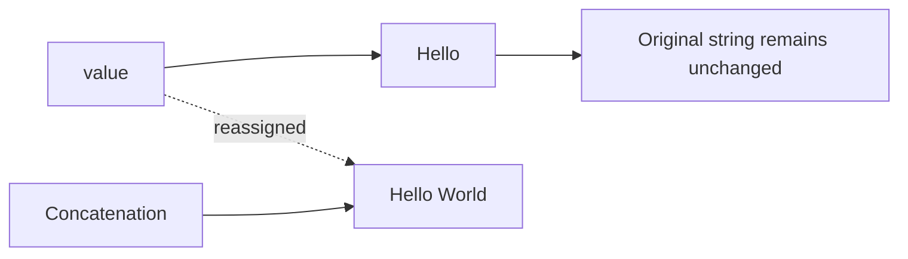
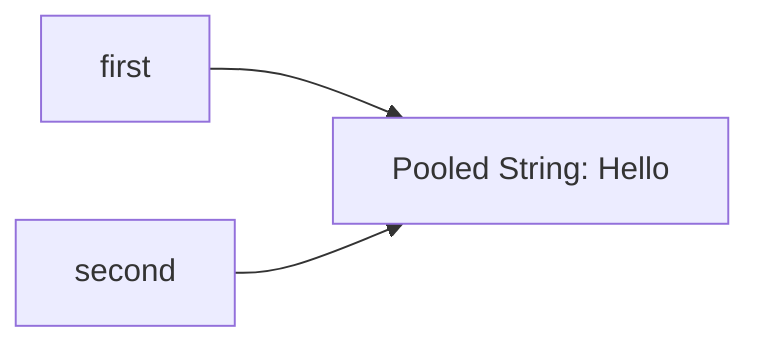
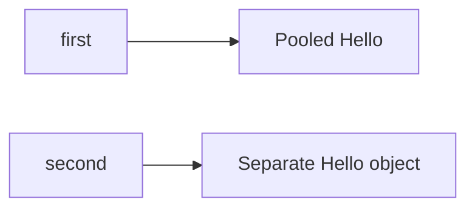

# Basic Questions — Java Strings and `toString()`

## Question 1: What is the purpose of the `toString()` method in Java?

The `toString()` method returns a textual representation of an object.

It is declared in the `Object` class, so every Java class inherits it.

```java
public String toString()
```

### Default implementation

The default implementation in `Object` produces a value similar to:

```text
fully.qualified.ClassName@hexadecimalHashCode
```

Example:

```text
com.example.Person@4e25154f
```

Conceptually, `Object.toString()` behaves like:

```java
getClass().getName()
        + "@"
        + Integer.toHexString(hashCode());
```

The value after `@` is the hexadecimal form of the value returned by `hashCode()`. It is not guaranteed to be the object's memory address.

---

### Overriding `toString()`

Classes commonly override `toString()` to provide useful debugging and logging information.

```java
public final class Person {

    private final String name;
    private final int age;

    public Person(String name, int age) {
        this.name = name;
        this.age = age;
    }

    @Override
    public String toString() {
        return "Person{" +
                "name='" + name + '\'' +
                ", age=" + age +
                '}';
    }
}
```

Usage:

```java
Person person = new Person("John Doe", 30);

System.out.println(person);
```

Output:

```text
Person{name='John Doe', age=30}
```

Java automatically calls `toString()` in situations such as:

```java
System.out.println(person);

String message = "Created person: " + person;

String value = String.valueOf(person);
```

---

### Production considerations

A good `toString()` should:

- Include useful identifying state
- Be easy to read
- Avoid expensive operations
- Avoid changing object state
- Avoid exposing sensitive information
- Avoid causing infinite recursion in bidirectional relationships

Do not expose secrets:

```java
@Override
public String toString() {
    return "User{" +
            "username='" + username + '\'' +
            ", password='" + password + '\'' +
            '}';
}
```

Prefer:

```java
@Override
public String toString() {
    return "User{" +
            "username='" + username + '\'' +
            '}';
}
```

### Interview-ready answer

> `toString()` returns a string representation of an object. It is inherited from `Object`, whose default implementation returns the class name followed by the hexadecimal hash code. Classes override it to provide meaningful debugging and logging output.

---

## Question 2: What is a Java `String`?

A Java string is an object of the `java.lang.String` class that represents a sequence of UTF-16 code units.

```java
String message = "Hello, Java!";
```

`String` is:

- Immutable
- Final
- Serializable
- Comparable
- A `CharSequence`

Its declaration conceptually includes interfaces such as:

```java
public final class String
        implements Serializable,
                   Comparable<String>,
                   CharSequence {
}
```

Because `java.lang` is imported automatically, no explicit import is required.

---

### String literal

```java
String language = "Java";
```

### Empty string

```java
String empty = "";
```

### `null` reference

```java
String value = null;
```

An empty string and `null` are different:

```java
"".length();     // 0
null.length();   // NullPointerException
```

---

### String immutability

Once a `String` object is created, its content cannot be changed.

```java
String value = "Hello";
value = value + " World";
```

This does not modify the original `"Hello"` object. A new string is produced, and `value` is reassigned to it.



### Interview-ready answer

> A Java `String` is an immutable object representing a sequence of UTF-16 code units. String operations do not modify the existing object; operations that change content return a new string.

---

## Question 3: How do you create strings in Java?

### Using a string literal

This is the preferred approach:

```java
String message = "Hello World";
```

String literals can be reused through the String Pool.

---

### Using the constructor

```java
String message = new String("Hello World");
```

This is usually unnecessary because it explicitly creates a distinct `String` object.

Avoid:

```java
String name = new String("Alice");
```

Prefer:

```java
String name = "Alice";
```

---

### From a character array

```java
char[] characters = {'J', 'a', 'v', 'a'};

String language = new String(characters);
```

### From bytes

Always specify the character encoding:

```java
byte[] data = {72, 101, 108, 108, 111};

String text = new String(
        data,
        StandardCharsets.UTF_8
);
```

Avoid relying on the platform-default encoding when reading external data.

---

## Question 4: What are the commonly used `String` methods?

Given:

```java
String text = "Hello World";
```

### `length()`

Returns the number of UTF-16 code units.

```java
int length = text.length();

System.out.println(length); // 11
```

For basic Latin characters, this usually matches the expected character count. Some Unicode characters occupy two UTF-16 code units:

```java
String emoji = "😀";

System.out.println(emoji.length()); // 2
```

Count Unicode code points:

```java
int count = emoji.codePointCount(
        0,
        emoji.length()
);

System.out.println(count); // 1
```

---

### `charAt()`

Returns the `char` at a zero-based index.

```java
char firstCharacter = text.charAt(0);

System.out.println(firstCharacter); // H
```

An invalid index throws `StringIndexOutOfBoundsException`.

---

### `substring()`

Returns a portion of the string.

```java
String result = text.substring(0, 5);

System.out.println(result); // Hello
```

The start index is inclusive and the end index is exclusive:

```text
substring(startInclusive, endExclusive)
```

---

### `indexOf()`

Returns the first matching index.

```java
int index = text.indexOf('o');

System.out.println(index); // 4
```

It returns `-1` when no match exists:

```java
System.out.println(text.indexOf('z')); // -1
```

---

### `lastIndexOf()`

Returns the final matching index.

```java
int index = text.lastIndexOf('o');

System.out.println(index); // 7
```

---

### `contains()`

Checks whether a sequence occurs in the string.

```java
boolean containsWorld =
        text.contains("World");

System.out.println(containsWorld); // true
```

---

### `startsWith()` and `endsWith()`

```java
System.out.println(
        text.startsWith("Hello")
); // true

System.out.println(
        text.endsWith("World")
); // true
```

---

### `replace()`

Returns a new string containing replacements.

```java
String result = text.replace('o', 'a');

System.out.println(result); // Hella Warld
```

Replacing a sequence:

```java
String result =
        text.replace("World", "Java");

System.out.println(result); // Hello Java
```

`replace()` performs literal replacement. `replaceAll()` uses a regular expression.

---

### `toUpperCase()` and `toLowerCase()`

```java
System.out.println(
        text.toUpperCase()
); // HELLO WORLD

System.out.println(
        text.toLowerCase()
); // hello world
```

For machine-readable values, specify a locale when case conversion must be predictable:

```java
String normalized =
        text.toLowerCase(Locale.ROOT);
```

---

### `trim()` and `strip()`

```java
String value = "  Java  ";

System.out.println(value.trim());
System.out.println(value.strip());
```

`strip()` is Unicode-aware, while `trim()` checks a narrower range of characters.

Related methods include:

```java
value.stripLeading();
value.stripTrailing();
```

---

### `isEmpty()` and `isBlank()`

```java
String empty = "";
String spaces = "   ";

System.out.println(empty.isEmpty()); // true
System.out.println(spaces.isEmpty()); // false

System.out.println(spaces.isBlank()); // true
```

- `isEmpty()` checks whether `length() == 0`.
- `isBlank()` checks whether the string is empty or contains only whitespace.

---

### `split()`

Splits a string using a regular expression.

```java
String csv = "Alice,Bob,Carol";

String[] names = csv.split(",");
```

Be careful because the argument is a regex:

```java
String version = "1.2.3";

String[] parts =
        version.split("\\.");
```

---

### `join()`

```java
String result = String.join(
        ", ",
        "Alice",
        "Bob",
        "Carol"
);

System.out.println(result);
// Alice, Bob, Carol
```

---

## Question 5: How do you compare strings?

### Using `equals()`

`equals()` compares string content.

```java
String first = new String("Java");
String second = new String("Java");

System.out.println(
        first.equals(second)
); // true
```

### Using `==`

`==` compares references.

```java
System.out.println(first == second);
// false
```

The two references point to distinct objects even though their content is equal.

---

### Null-safe comparison

This may throw `NullPointerException`:

```java
input.equals("ACTIVE");
```

Safer when comparing with a known constant:

```java
"ACTIVE".equals(input);
```

Or use:

```java
Objects.equals(first, second);
```

---

### Case-insensitive comparison

```java
"java".equalsIgnoreCase("JAVA");
// true
```

For security-sensitive identifiers, protocol tokens, or locale-dependent text, case-handling rules should be selected deliberately rather than assuming all comparisons are equivalent.

### Interview-ready answer

> Use `equals()` to compare string content and `==` to compare whether two references point to the same object. For nullable values, `Objects.equals()` provides a null-safe content comparison.

---

## Question 6: Why is `String` immutable?

String immutability supports correctness, security, sharing, and performance.

### 1. Safe sharing

The same string can be safely shared between different parts of an application because no caller can alter its contents.

```java
String applicationName = "Order Service";
```

---

### 2. Thread safety

Immutable values can be read by multiple threads without synchronization.

```java
private static final String SERVICE_NAME =
        "Payment Service";
```

The state of the string itself cannot be changed after construction.

---

### 3. String Pool safety

String literals may share the same pooled instance:

```java
String first = "Java";
String second = "Java";
```

If strings were mutable, changing the value through one reference could affect other code using the same pooled object.

---

### 4. Stable hash codes

Strings are commonly used as keys in hash-based collections.

```java
Map<String, Integer> scores =
        new HashMap<>();

scores.put("Alice", 95);
```

A key’s equality and hash code must remain stable while it is stored. String immutability ensures its content-based hash does not change.

---

### 5. Security and trusted values

Strings are used for:

- File paths
- URLs
- Database connection information
- Class names
- Configuration properties
- Authorization values

Immutability prevents the same string object from being modified after validation.

However, highly sensitive secrets such as passwords may be better represented with mutable arrays when controlled clearing is required:

```java
char[] password = readPassword();

try {
    authenticate(password);
} finally {
    Arrays.fill(password, '\0');
}
```

A `String` cannot be manually cleared because it is immutable.

---

### 6. Reuse and optimization

Because strings cannot change, the JVM can safely:

- Reuse interned strings
- Cache a string’s hash code
- Share string instances
- Apply compiler and runtime optimizations

### Interview-ready answer

> `String` is immutable so it can be safely shared, pooled, used across threads, and used as a stable hash-based collection key. Immutability also supports security and runtime optimizations because a validated or cached string cannot later change.

---

## Question 7: What is the String Pool?

The String Pool is a JVM-managed table of canonical string instances.

When Java encounters a string literal, it can reuse an existing pooled string with the same content.

```java
String first = "Hello";
String second = "Hello";

System.out.println(first == second);
// true
```

Both variables refer to the same pooled instance.



---

### Literal vs `new String()`

```java
String first = "Hello";
String second = new String("Hello");

System.out.println(first == second);
// false

System.out.println(first.equals(second));
// true
```

Conceptually:



The literal is pooled, while `new String("Hello")` explicitly creates a distinct `String` object.

---

### Using `intern()`

`intern()` returns the canonical pooled representation of a string.

```java
String first = "Hello";

String second =
        new String("Hello").intern();

System.out.println(first == second);
// true
```

If an equal pooled string exists, `intern()` returns it. Otherwise, a canonical representation is added to the pool and returned.

---

### Should `intern()` be used manually?

Usually, no.

It may be useful when:

- An application contains extremely large numbers of repeated strings.
- Memory profiling confirms duplication is a significant problem.
- The set of values is controlled and understood.

Risks include:

- Extra lookup overhead
- Retaining many unique strings
- Increased complexity
- Poor results when most strings are different

Manual interning should be driven by measurement rather than used by default.

### Interview-ready answer

> The String Pool stores canonical string instances so equal literals can share one object. Literals are normally pooled, while `new String()` creates a separate object. Calling `intern()` returns the pooled canonical instance.

---

## Question 8: What happens during string concatenation?

### Compile-time constant concatenation

The compiler can combine constant literals:

```java
String value = "Hello" + " " + "Java";
```

This may be compiled as the single constant:

```java
String value = "Hello Java";
```

---

### Runtime concatenation

```java
String name = "Alice";
String message = "Hello " + name;
```

The compiler and runtime use optimized string-concatenation mechanisms. Conceptually, concatenation produces a new string because `String` is immutable.

---

### Repeated concatenation in a loop

Avoid:

```java
String result = "";

for (String value : values) {
    result = result + value;
}
```

This may create many intermediate strings.

Prefer:

```java
StringBuilder builder =
        new StringBuilder();

for (String value : values) {
    builder.append(value);
}

String result = builder.toString();
```

Or use:

```java
String result = String.join("", values);
```

For stream processing:

```java
String result = values.stream()
        .collect(Collectors.joining());
```

---

# Common Mistakes

## 1. Comparing strings with `==`

Incorrect:

```java
if (username == "admin") {
}
```

Correct:

```java
if ("admin".equals(username)) {
}
```

---

## 2. Ignoring returned string values

Incorrect:

```java
String name = "alice";

name.toUpperCase();

System.out.println(name); // alice
```

Correct:

```java
name = name.toUpperCase();

System.out.println(name); // ALICE
```

String methods do not modify the original object.

---

## 3. Using `new String()` unnecessarily

Avoid:

```java
String language =
        new String("Java");
```

Prefer:

```java
String language = "Java";
```

---

## 4. Logging sensitive fields through `toString()`

Avoid including:

- Passwords
- Access tokens
- Session identifiers
- Private keys
- Full payment-card data
- Sensitive personal information

---

## 5. Assuming `length()` always counts visible characters

```java
String emoji = "😀";

System.out.println(emoji.length()); // 2
```

`length()` counts UTF-16 code units.

---

## 6. Assuming pooled equality makes `==` valid

This may return `true`:

```java
String first = "Java";
String second = "Java";

System.out.println(first == second);
```

But this does not make `==` suitable for content comparison. Object creation, runtime concatenation, and external input can produce distinct references.

Always use `equals()` for content.

---

## 7. Confusing `replace()` and `replaceAll()`

```java
text.replace(".", "-");
```

performs literal replacement.

```java
text.replaceAll(".", "-");
```

uses `.` as a regular expression meaning any character.

Literal dot with regex:

```java
text.replaceAll("\\.", "-");
```

---

# Quick Comparison

| Feature                | `String`               | `StringBuilder`             | `StringBuffer`                              |
| ---------------------- | ---------------------- | --------------------------- | ------------------------------------------- |
| Mutable                | No                     | Yes                         | Yes                                         |
| Thread-safe operations | Safe because immutable | No                          | Synchronized                                |
| Typical use            | Text values and keys   | Building text in one thread | Legacy/shared mutable text                  |
| Repeated modification  | Creates new results    | Efficient                   | Efficient but synchronization adds overhead |
| Stored in String Pool  | Literals may be        | No                          | No                                          |

---

# Short Interview Answers

## What is `toString()`?

> `toString()` returns a textual representation of an object. The default implementation returns the class name and hexadecimal hash code, while application classes commonly override it for meaningful debugging and logging output.

## What is a Java string?

> A Java `String` is an immutable sequence of UTF-16 code units represented by `java.lang.String`.

## Why is `String` immutable?

> Immutability makes strings safe to share, thread-safe, suitable for pooling, secure against unexpected mutation, and reliable as hash-based collection keys.

## What is the String Pool?

> The String Pool stores canonical string instances so identical literals can share the same object. `intern()` returns the canonical pooled representation.

## `==` vs `equals()` for strings

> `==` compares references, while `equals()` compares character content. Use `equals()` for value comparison.
