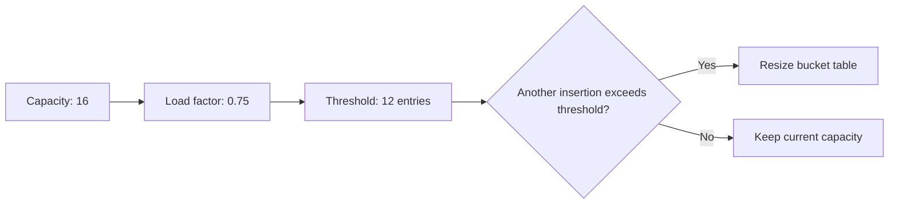

The uploaded collection notes are already well organized, but they contain one corrupted exception name and end with four unanswered `HashMap`/`Hashtable` questions. The completed sections below preserve the original structure while correcting those gaps.

# Additional Collections Questions

## Question 20: What is the difference between `HashMap` and `Hashtable`?

Both store key-value mappings using hashing, but they differ in synchronization, null handling, API design, and modern usage.

| Feature                | `HashMap`                      | `Hashtable`                                                                    |
| ---------------------- | ------------------------------ | ------------------------------------------------------------------------------ |
| Thread-safe            | No                             | Individual public methods are synchronized                                     |
| Concurrent performance | Requires external coordination | Usually poor because one object-level lock protects operations                 |
| `null` key             | Allows one                     | Not allowed                                                                    |
| `null` values          | Allows multiple                | Not allowed                                                                    |
| Iterator               | Usually fail-fast              | Supports legacy `Enumeration`; collection-view iterators are usually fail-fast |
| Introduced             | Java 1.2 Collections Framework | Java 1.0 legacy API                                                            |
| Base type              | Implements `Map`               | Extends legacy `Dictionary` and implements `Map`                               |
| Recommended use        | Normal non-concurrent maps     | Generally avoid in new code                                                    |
| Concurrent alternative | `ConcurrentHashMap`            | `ConcurrentHashMap`                                                            |

### `HashMap`

```java
Map<String, Integer> scores = new HashMap<>();

scores.put("Alice", 90);
scores.put(null, 0);
scores.put("Unknown", null);
```

Use `HashMap` when:

- The map is confined to one thread.
- The map is immutable after safe publication.
- Synchronization is handled externally.

### `Hashtable`

```java
Map<String, Integer> scores = new Hashtable<>();

scores.put("Alice", 90);
```

These operations throw `NullPointerException`:

```java
scores.put(null, 0);
scores.put("Unknown", null);
```

### Why not use `Hashtable` for modern concurrent code?

Although its individual methods are synchronized, compound operations may still be unsafe.

```java
if (!table.containsKey(key)) {
    table.put(key, value);
}
```

Another thread can insert the key between `containsKey()` and `put()`.

Prefer an atomic `ConcurrentHashMap` operation:

```java
map.putIfAbsent(key, value);
```

or:

```java
map.computeIfAbsent(
        key,
        ignored -> createValue()
);
```

### Interview-ready answer

> `HashMap` is unsynchronized and allows one null key and multiple null values. `Hashtable` is a legacy synchronized map that rejects null keys and values. For modern concurrent code, I use `ConcurrentHashMap` because it provides better concurrency and atomic compound operations.

---

## Question 21: Why does `Hashtable` not allow `null` keys or values?

`Hashtable` treats `null` as invalid for both keys and values.

```java
Hashtable<String, Integer> table =
        new Hashtable<>();

table.put(null, 10);       // NullPointerException
table.put("Java", null);   // NullPointerException
```

### Null key

Hash-based lookup requires calculating a key's hash code.

Legacy `Hashtable` does not define special handling for a null key, so attempting to insert one results in `NullPointerException`.

### Null value

Methods such as `get()` return `null` when no mapping exists:

```java
Integer value = table.get("missing");
```

If null values were also supported, the result would be ambiguous:

- The key is absent.
- The key exists and is mapped to `null`.

Modern `HashMap` resolves this ambiguity using `containsKey()`:

```java
if (map.containsKey(key)) {
    Integer value = map.get(key);
}
```

However, `Hashtable` retains its original legacy contract and rejects null values.

### Comparison

| Map                 |    Null key | Null value |
| ------------------- | ----------: | ---------: |
| `HashMap`           |         One |   Multiple |
| `LinkedHashMap`     |         One |   Multiple |
| `Hashtable`         |          No |         No |
| `ConcurrentHashMap` |          No |         No |
| `TreeMap`           | Normally no |        Yes |

### Interview-ready answer

> `Hashtable` rejects null keys and values as part of its legacy contract. A null key cannot be hashed by its implementation, and allowing null values would make `get()` ambiguous because null is also used to indicate that no mapping exists.

---

## Question 22: What is the load factor in `HashMap`?

The load factor controls how full a `HashMap` may become before its internal table is resized.

```java
Map<String, Integer> map =
        new HashMap<>(16, 0.75f);
```

In this constructor:

- `16` is the requested initial capacity.
- `0.75f` is the load factor.

The resize threshold is conceptually:

```text
threshold = capacity × load factor
```

For capacity `16` and load factor `0.75`:

```text
threshold = 16 × 0.75 = 12
```

When the number of entries exceeds the threshold, the map normally expands its internal bucket table.



### Why is load factor needed?

It balances two competing concerns.

#### Lower load factor

Example:

```java
new HashMap<>(16, 0.50f);
```

Advantages:

- Fewer collisions
- Shorter bucket chains
- Potentially faster lookup

Disadvantages:

- More unused bucket space
- More memory consumption
- Earlier resizing

#### Higher load factor

Example:

```java
new HashMap<>(16, 1.0f);
```

Advantages:

- Better bucket-space utilization
- Less memory used for the bucket table

Disadvantages:

- More collisions
- More elements per bucket
- Potentially slower lookup

### Important nuance

The load factor is based on the number of mappings relative to bucket capacity. It is not a direct measurement of how evenly entries are distributed.

A poor `hashCode()` implementation can still create severe collisions even when the load factor is low.

### Interview-ready answer

> The load factor determines when `HashMap` resizes. The resize threshold is approximately the internal capacity multiplied by the load factor. Lower values reduce collisions but use more memory, while higher values save bucket space but may increase collision cost.

---

## Question 23: What does the default `HashMap` load factor of `0.75` mean?

The default load factor is:

```java
0.75f
```

It means that resizing is normally triggered when the number of entries exceeds approximately 75% of the current internal bucket capacity.

For example:

```text
Capacity: 16
Load factor: 0.75
Threshold: 12
```

After the threshold is exceeded, the internal bucket array is generally expanded and existing entries are redistributed according to the new capacity.

### Why `0.75`?

It provides a practical balance between:

- Memory usage
- Collision probability
- Lookup performance
- Resize frequency

It is not a rule that the table must always remain exactly 75% full. It is a threshold used to decide when resizing should occur.

### Capacity is not the same as size

```java
Map<String, Integer> map = new HashMap<>();
```

- **Size** is the number of key-value mappings.
- **Capacity** is the number of buckets in the internal table.
- **Threshold** is the size at which resizing is triggered.

```text
size       = stored mappings
capacity   = internal bucket count
threshold  = capacity × load factor
```

### Presizing a large map

When the approximate number of mappings is known, choose a suitable initial capacity to avoid repeated resizing.

```java
int expectedMappings = 10_000;

Map<String, User> users =
        new HashMap<>(
                (int) Math.ceil(
                        expectedMappings / 0.75
                )
        );
```

A small safety margin may be appropriate because actual internal capacity is adjusted according to implementation rules.

Do not set a very large initial capacity without evidence, because it may waste memory and make iteration more expensive.

### Interview-ready answer

> A default load factor of `0.75` means the map normally resizes after its size exceeds about 75% of the current bucket capacity. It is a compromise between memory usage and collision performance.

---

# Corrections to Existing Questions

## Corrupted iterator exception name

The `ConcurrentHashMap` section currently contains a corrupted identifier:

```text
ConcurpZELkorMwhkkpShF5PvT8YnqRCupnLTNG
```

It should be:

```java
ConcurpZEAWYtiB6bJ16NuLbGCc6CZ6jJdKfb63
```

Corrected statement:

> `ConcurrentHashMap` iterators are weakly consistent. They can continue while the map is modified and do not throw `ConcurpZEAWYtiB6bJ16NuLbGCc6CZ6jJdKfb63` merely because concurrent updates occur.

---

## `HashMap` concurrent behavior

Replace “undefined behavior” with a more precise explanation:

> Concurrent unsynchronized access to a `HashMap`, especially when writes are involved, is not thread-safe. It can cause lost updates, stale reads, inconsistent results, or structural corruption.

---

## `HashSet` null wording

A `HashSet` supports one `null` element because it is backed by a `HashMap` and stores set elements as map keys.

```java
Set<String> values = new HashSet<>();

values.add(null);
values.add(null);

System.out.println(values.size()); // 1
```

---

## Custom collection mandatory methods

The exact required methods depend on the selected abstraction:

| Starting type           | Minimum typical implementation                            |
| ----------------------- | --------------------------------------------------------- |
| `Collection<E>`         | All abstract `Collection` operations                      |
| `AbstractCollection<E>` | `iterator()` and `size()`                                 |
| `AbstractList<E>`       | `get()` and `size()`                                      |
| `AbstractSet<E>`        | `iterator()` and `size()`                                 |
| `AbstractMap<K,V>`      | `entrySet()`                                              |
| `AbstractQueue<E>`      | `offer()`, `peek()`, `poll()`, `iterator()`, and `size()` |

Modification methods may intentionally throw `UnsupportedOperationException`.

---

# Suggested File Placement

```text
java/
└── 02-collections/
    ├── README.md
    ├── basic-questions.md
    ├── advanced-questions.md
    ├── map/
    │   ├── hashmap.md
    │   ├── hashtable.md
    │   ├── concurrent-hashmap.md
    │   └── treemap.md
    ├── set/
    │   ├── hashset.md
    │   └── treeset.md
    ├── list/
    │   ├── arraylist.md
    │   └── linkedlist.md
    ├── iteration/
    │   ├── iterator.md
    │   └── list-iterator.md
    └── streams/
        └── map-vs-flatmap.md
```

## Move out of the Collections file

These questions belong elsewhere:

| Question                         | Better location                             |
| -------------------------------- | ------------------------------------------- |
| Minor, major, and full GC        | `05-jvm/garbage-collection.md`              |
| Setting and getting thread names | `04-concurrency/threads/basic-questions.md` |
| `ResultSetMetaData`              | `06-database/jdbc/basic-questions.md`       |

The final Collections question set should end with `HashMap` capacity and load-factor questions rather than mixing JVM, threads, and JDBC into the same file.
