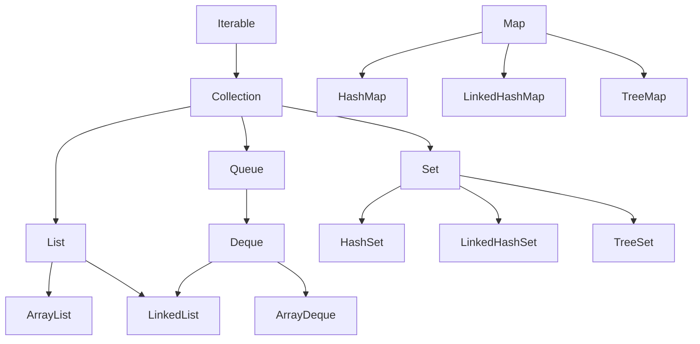

# Collections Framework: `List`, `Set`, `Map`, and `Queue`

## 1. Definition

The Java Collections Framework provides standard interfaces and implementations for storing, retrieving, and processing groups of objects.

The main abstractions are:

- **`List`** — an ordered sequence that allows duplicates.
- **`Set`** — a collection of unique elements.
- **`Queue`** — elements waiting to be processed, usually in a defined order.
- **`Deque`** — a double-ended queue supporting insertion and removal at both ends.
- **`Map`** — key-value associations with unique keys.

> `Map` is part of the Collections Framework, but it does not extend `Collection`.



---

## 2. Why Does the Collections Framework Exist?

Different use cases require different data structures.

For example:

- Fast indexed access requires an array-backed list.
- Unique membership checks require a set.
- Key-based lookup requires a map.
- FIFO processing requires a queue.
- Priority-based processing requires a heap-based queue.
- Sorted traversal requires a tree-based structure.

The framework allows application code to depend on an interface rather than a specific implementation:

```java
List<String> names = new ArrayList<>();
Set<String> permissions = new HashSet<>();
Map<Long, User> usersById = new HashMap<>();
Queue<Task> tasks = new ArrayDeque<>();
```

This makes it easier to replace an implementation when requirements change.

---

# Choosing the Right Collection

## 3. Common Implementations

| Implementation  | Characteristics                                   | Typical use                           |
| --------------- | ------------------------------------------------- | ------------------------------------- |
| `ArrayList`     | Ordered, duplicates allowed, fast indexed access  | General-purpose lists                 |
| `LinkedList`    | Doubly linked, implements `List` and `Deque`      | Occasional deque usage                |
| `HashSet`       | Unique elements, no guaranteed order              | Fast membership checks                |
| `LinkedHashSet` | Unique elements in insertion order                | Deduplication while preserving order  |
| `TreeSet`       | Unique elements in sorted order                   | Sorted data and range operations      |
| `HashMap`       | Key-value lookup, no guaranteed order             | General-purpose lookup tables         |
| `LinkedHashMap` | Key-value lookup with predictable iteration order | Ordered maps and simple LRU designs   |
| `TreeMap`       | Key-value mappings sorted by key                  | Range queries and sorted traversal    |
| `ArrayDeque`    | Efficient stack and double-ended queue            | FIFO queues and LIFO stacks           |
| `PriorityQueue` | Heap-based priority ordering                      | Scheduling and top-priority retrieval |

---

## 4. Practical Selection Guide

```text
Need indexed access?
    → ArrayList

Need unique values?
    → HashSet

Need unique values in insertion order?
    → LinkedHashSet

Need unique values in sorted order?
    → TreeSet

Need key-value lookup?
    → HashMap

Need key-value lookup with insertion order?
    → LinkedHashMap

Need sorted keys or range queries?
    → TreeMap

Need a FIFO queue or LIFO stack?
    → ArrayDeque

Need the next smallest or highest-priority item?
    → PriorityQueue
```

---

# `List`

## 5. `ArrayList`

`ArrayList` is backed by a dynamically resized array.

```java
List<String> languages = new ArrayList<>();

languages.add("Java");
languages.add("Go");
languages.add("Java");

System.out.println(languages.get(0)); // Java
```

Characteristics:

- Preserves positional order.
- Allows duplicates.
- Allows multiple `null` elements.
- Supports fast indexed access.
- Middle insertions and removals may shift elements.

### Complexity

| Operation           | Typical complexity |
| ------------------- | -----------------: |
| `get(index)`        |             `O(1)` |
| `set(index, value)` |             `O(1)` |
| `add(value)`        |   Amortized `O(1)` |
| `add(index, value)` |             `O(n)` |
| `remove(index)`     |             `O(n)` |
| `contains(value)`   |             `O(n)` |

---

## 6. `LinkedList`

`LinkedList` is a doubly linked list implementing both `List` and `Deque`.

```java
LinkedList<String> values = new LinkedList<>();

values.addFirst("A");
values.addLast("B");
values.removeFirst();
```

Characteristics:

- Indexed access requires traversal.
- Each element has additional node-link overhead.
- Poorer CPU-cache locality than `ArrayList`.
- Insertions and removals are efficient only after the correct node or iterator position has already been located.

### Important correction

It is misleading to say that `LinkedList` always provides fast middle insertion.

```java
list.add(index, value);
```

The list must first traverse to the requested index, making the overall operation `O(n)`.

### Practical recommendation

Use `ArrayList` for most general-purpose list requirements.

For queue and stack operations, `ArrayDeque` is normally preferable to `LinkedList`.

---

# `Set`

## 7. `HashSet`

`HashSet` stores unique elements using hashing.

```java
Set<String> permissionIds = new HashSet<>();

permissionIds.add("READ_USER");
permissionIds.add("DELETE_USER");
permissionIds.add("READ_USER");

System.out.println(permissionIds.size()); // 2
```

Characteristics:

- Does not allow duplicate elements.
- Uses `equals()` and `hashCode()` for uniqueness.
- Allows one `null`.
- Does not guarantee iteration order.
- Average `add()`, `remove()`, and `contains()` are `O(1)`.

Use it when membership testing is the primary requirement.

```java
if (permissionIds.contains("DELETE_USER")) {
    deleteUser();
}
```

---

## 8. `LinkedHashSet`

`LinkedHashSet` preserves insertion order while enforcing uniqueness.

```java
Set<String> values = new LinkedHashSet<>();

values.add("Java");
values.add("Go");
values.add("Python");

System.out.println(values);
// [Java, Go, Python]
```

Use it when:

- Duplicates must be removed.
- Original encounter order must be preserved.

```java
List<String> input =
        List.of("Java", "Go", "Java", "Python");

Set<String> unique =
        new LinkedHashSet<>(input);
```

---

## 9. `TreeSet`

`TreeSet` stores unique elements in sorted order.

```java
NavigableSet<Integer> numbers = new TreeSet<>();

numbers.add(30);
numbers.add(10);
numbers.add(20);

System.out.println(numbers);
// [10, 20, 30]
```

Characteristics:

- Uses natural ordering or a `Comparator`.
- Operations normally take `O(log n)`.
- Supports range and navigation operations.
- Usually rejects `null`.

```java
numbers.floor(25);    // 20
numbers.ceiling(25);  // 30
numbers.headSet(20);  // values below 20
numbers.tailSet(20);  // values from 20 onward
```

A `TreeSet` considers two values duplicates when comparison returns zero, even when `equals()` returns `false`.

---

# `Map`

## 10. `HashMap`

`HashMap` stores key-value mappings.

```java
Map<String, List<String>> permissionsByRole =
        new HashMap<>();

permissionsByRole
        .computeIfAbsent(
                "ADMIN",
                ignored -> new ArrayList<>()
        )
        .add("DELETE_USER");
```

Characteristics:

- Keys are unique.
- Values may be duplicated.
- Allows one `null` key.
- Allows multiple `null` values.
- Does not guarantee iteration order.
- Average key lookup is `O(1)`.
- Not thread-safe for concurrent mutation.

Useful methods include:

```java
map.putIfAbsent(key, value);
map.computeIfAbsent(key, mappingFunction);
map.computeIfPresent(key, remappingFunction);
map.merge(key, value, remappingFunction);
map.getOrDefault(key, defaultValue);
```

---

## 11. `LinkedHashMap`

`LinkedHashMap` preserves predictable iteration order.

```java
Map<String, Integer> scores =
        new LinkedHashMap<>();

scores.put("Alice", 90);
scores.put("Bob", 80);
scores.put("Carol", 95);
```

By default, it preserves insertion order.

It can also maintain access order:

```java
Map<String, User> cache =
        new LinkedHashMap<>(
                16,
                0.75f,
                true
        );
```

Access-order mode is useful for implementing a basic LRU-style cache, although production caches normally need additional features such as:

- Expiration
- Size limits
- Thread safety
- Metrics
- Loading behavior
- Distributed invalidation

---

## 12. `TreeMap`

`TreeMap` stores entries sorted by key.

```java
NavigableMap<Integer, String> users =
        new TreeMap<>();

users.put(30, "Carol");
users.put(10, "Alice");
users.put(20, "Bob");

System.out.println(users);
// {10=Alice, 20=Bob, 30=Carol}
```

Operations normally take `O(log n)`.

Navigation methods include:

```java
users.firstKey();
users.lastKey();
users.floorKey(25);
users.ceilingKey(25);
users.headMap(20);
users.tailMap(20);
users.subMap(10, true, 30, false);
```

Use `TreeMap` when:

- Keys must remain sorted.
- Range queries are required.
- Nearest-key lookups such as `floorKey()` or `ceilingKey()` are required.

---

# `Queue` and `Deque`

## 13. `ArrayDeque`

`ArrayDeque` is an efficient double-ended queue.

### FIFO queue

```java
Queue<Task> taskQueue = new ArrayDeque<>();

taskQueue.offer(new Task("send-email"));
taskQueue.offer(new Task("generate-report"));

Task next = taskQueue.poll();
```

### LIFO stack

```java
Deque<String> stack = new ArrayDeque<>();

stack.push("first");
stack.push("second");

String value = stack.pop(); // second
```

It is usually preferred over:

- The legacy `Stack` class
- `LinkedList` for ordinary queue and stack operations

Advantages:

- No legacy synchronization overhead
- Efficient operations at both ends
- Better memory locality than linked nodes
- Clear `Deque` API

`ArrayDeque` does not allow `null` elements because `null` is used by methods such as `poll()` and `peek()` to represent absence.

---

## 14. Queue Method Families

Queues provide alternative method groups.

| Operation    | Throws on failure | Returns special value |
| ------------ | ----------------- | --------------------- |
| Insert       | `add()`           | `offer()`             |
| Remove head  | `remove()`        | `poll()`              |
| Inspect head | `element()`       | `peek()`              |

Example:

```java
Queue<Task> queue = new ArrayDeque<>();

queue.offer(task);

Task next = queue.poll();

if (next != null) {
    process(next);
}
```

`offer()`, `poll()`, and `peek()` are often preferable when empty or full conditions are expected.

---

## 15. `PriorityQueue`

`PriorityQueue` retrieves elements according to their priority rather than insertion order.

```java
PriorityQueue<Job> jobs =
        new PriorityQueue<>(
                Comparator.comparingInt(Job::priority)
        );

jobs.offer(new Job("normal", 5));
jobs.offer(new Job("critical", 1));
jobs.offer(new Job("low", 10));

Job next = jobs.poll();
// priority 1
```

By default, the head is the **smallest** element according to natural ordering or the supplied comparator.

For highest numeric priority first:

```java
PriorityQueue<Job> jobs =
        new PriorityQueue<>(
                Comparator.comparingInt(Job::priority)
                          .reversed()
        );
```

### Complexity

| Operation             | Complexity |
| --------------------- | ---------: |
| `offer()`             | `O(log n)` |
| `poll()`              | `O(log n)` |
| `peek()`              |     `O(1)` |
| `contains()`          |     `O(n)` |
| Remove arbitrary item |     `O(n)` |

### Important limitation

Iterating over a `PriorityQueue` does not guarantee sorted traversal.

```java
for (Job job : jobs) {
    // Not guaranteed to be globally sorted
}
```

Only repeated `poll()` operations produce priority order.

`PriorityQueue` is not thread-safe. Use `PriorityBlockingQueue` when a concurrent priority queue is required.

---

# Production Examples

## 16. Role and Permission Lookup

```java
Map<String, Set<String>> permissionsByRole =
        new HashMap<>();

permissionsByRole
        .computeIfAbsent(
                "ADMIN",
                ignored -> new HashSet<>()
        )
        .add("DELETE_USER");

boolean allowed = permissionsByRole
        .getOrDefault(
                "ADMIN",
                Set.of()
        )
        .contains("DELETE_USER");
```

This design uses:

- `HashMap` for role lookup
- `HashSet` for fast permission membership checks

---

## 17. Job Scheduling

A scheduler may use a `PriorityQueue` when all jobs are held in one process.

```java
PriorityQueue<ScheduledJob> jobs =
        new PriorityQueue<>(
                Comparator.comparing(
                        ScheduledJob::executionTime
                )
        );
```

However, a production distributed scheduler additionally needs:

- Durable storage
- Multiple-worker coordination
- Atomic claiming
- Retry handling
- Failure recovery
- Clock and time-zone handling
- Idempotent execution
- Leader election or partition ownership

A local `PriorityQueue` alone is insufficient for a distributed scheduler.

---

## 18. Rate Limiting

A rate limiter might use collections such as:

```java
Map<ClientId, TokenBucket> buckets =
        new HashMap<>();
```

or:

```java
Map<ClientId, Deque<Instant>> requestWindows =
        new HashMap<>();
```

For a multithreaded service, these structures require concurrent coordination:

```java
ConcurrentMap<ClientId, TokenBucket> buckets =
        new ConcurrentHashMap<>();
```

For a distributed rate limiter, local collections are insufficient because each service instance would maintain independent state.

---

# Common Mistakes

## 19. Using the corrupted exception name

Replace:

```text
ConcurpZELkorMwhkkpShF5PvT8YnqRCupnLTNG
```

with:

```java
ConcurpZEAWYtiB6bJ16NuLbGCc6CZ6jJdKfb63
```

---

## 20. Modifying a fail-fast collection during enhanced iteration

Problematic:

```java
for (String value : values) {
    if (value.isBlank()) {
        values.remove(value);
    }
}
```

This may throw `ConcurpZEAWYtiB6bJ16NuLbGCc6CZ6jJdKfb63`.

Use the iterator’s removal operation:

```java
Iterator<String> iterator = values.iterator();

while (iterator.hasNext()) {
    String value = iterator.next();

    if (value.isBlank()) {
        iterator.remove();
    }
}
```

Or use:

```java
values.removeIf(String::isBlank);
```

### Important nuance

Fail-fast behavior is best-effort error detection. It is not:

- A thread-safety mechanism
- A guarantee that every illegal modification will be detected
- A replacement for synchronization

---

## 21. Expecting `HashMap` insertion order

Incorrect assumption:

```java
Map<String, Integer> map = new HashMap<>();
```

A `HashMap` does not guarantee insertion-order iteration.

Use:

```java
Map<String, Integer> map =
        new LinkedHashMap<>();
```

when insertion order is required.

---

## 22. Defaulting to `LinkedList` for queues

Avoid:

```java
Queue<Task> queue = new LinkedList<>();
```

Prefer:

```java
Queue<Task> queue = new ArrayDeque<>();
```

unless a particular `LinkedList` capability is genuinely required.

---

## 23. Using `PriorityQueue` as though it were fully sorted

Only the head has a priority guarantee.

```java
Job next = jobs.peek();
```

The iterator does not return every item in sorted order.

---

## 24. Using a mutable map key

Problematic:

```java
UserKey key = new UserKey("alice");
map.put(key, user);

key.setUsername("bob");

map.get(key); // May fail
```

Fields involved in `equals()` and `hashCode()` should not change while the key is stored.

Prefer immutable keys:

```java
public record UserKey(String username) {
}
```

---

## 25. Assuming concurrent collections make workflows atomic

This is not atomic:

```java
if (!map.containsKey(key)) {
    map.put(key, value);
}
```

Prefer:

```java
map.putIfAbsent(key, value);
```

Similarly, this can lose updates:

```java
map.put(key, map.get(key) + 1);
```

Prefer:

```java
map.merge(key, 1, Integer::sum);
```

---

# Trade-Offs

| Structure       | Best use                                   | Main weakness                           |
| --------------- | ------------------------------------------ | --------------------------------------- |
| `ArrayList`     | Indexed access and iteration               | Middle insertion/removal                |
| `LinkedList`    | Specialized linked-list or deque behavior  | Poor indexed access and memory overhead |
| `HashSet`       | Unique membership checks                   | No order guarantee                      |
| `LinkedHashSet` | Unique values in insertion order           | Additional memory                       |
| `TreeSet`       | Sorted unique values                       | `O(log n)` operations                   |
| `HashMap`       | General key-value lookup                   | No order guarantee                      |
| `LinkedHashMap` | Ordered map iteration                      | Additional memory                       |
| `TreeMap`       | Sorted keys and range queries              | `O(log n)` operations                   |
| `ArrayDeque`    | Stack and queue operations                 | No indexed access or `null` values      |
| `PriorityQueue` | Repeated highest/lowest-priority retrieval | No globally sorted iteration            |

---

# Interview Questions

## Question 1: `ArrayList` vs `LinkedList`—when would each win?

`ArrayList` usually wins for indexed access, iteration, memory efficiency, and append-heavy workloads. `LinkedList` may help when insertion or removal happens through an already-positioned iterator or when its `Deque` capabilities are specifically needed. For ordinary queues, `ArrayDeque` is usually better.

---

## Question 2: Why is `ArrayDeque` preferred over `Stack`?

`Stack` is a legacy synchronized class extending `Vector`. `ArrayDeque` provides a cleaner `Deque` API, avoids unnecessary synchronization in thread-confined use, and generally performs better.

---

## Question 3: What is fail-fast iteration?

A fail-fast iterator detects certain structural modifications made outside the iterator and may throw `ConcurpZEAWYtiB6bJ16NuLbGCc6CZ6jJdKfb63`. It is best-effort bug detection, not a concurrency guarantee.

---

## Question 4: When should `TreeMap` be used instead of `HashMap`?

Use `TreeMap` when sorted keys, nearest-key navigation, or range queries are required. Use `HashMap` for general lookup when ordering is unnecessary.

---

## Question 5: How does a `Set` ensure uniqueness?

`HashSet` uses `hashCode()` and `equals()`. `TreeSet` uses natural ordering or a comparator and considers comparison result zero to mean duplicate.

---

## Question 6: Why does `Map` not extend `Collection`?

`Collection` represents individual elements, while `Map` represents key-value associations. Their fundamental operations and contracts are different.

---

## Question 7: Which collection should be used for a thread-safe producer-consumer workflow?

Use a suitable `BlockingQueue`, such as:

```java
ArrayBlockingQueue
LinkedBlockingQueue
PriorityBlockingQueue
```

The exact implementation depends on capacity, ordering, and backpressure requirements.

---

# Short Interview Answer

> I choose a Java collection based on its access pattern. `ArrayList` is the normal default for ordered sequences, `HashSet` for unique membership, and `HashMap` for key-based lookup. I use `LinkedHashMap` when iteration order matters, `TreeMap` or `TreeSet` for sorted and range-based operations, `ArrayDeque` for stacks and queues, and `PriorityQueue` when the next item must be selected by priority. I also distinguish API guarantees from implementation details and use atomic concurrent operations when collections are shared between threads.

---

## Related Topics

- [HashMap Internals](hashmap-internals.md)
- [Advanced Collections Questions](advanced-questions.md)
- [Comparable vs Comparator](questions.md)
- [Concurrent Collections](../04-concurrency/concurrent-collections.md)
- [Generics](../01-core-java/generics/README.md)
