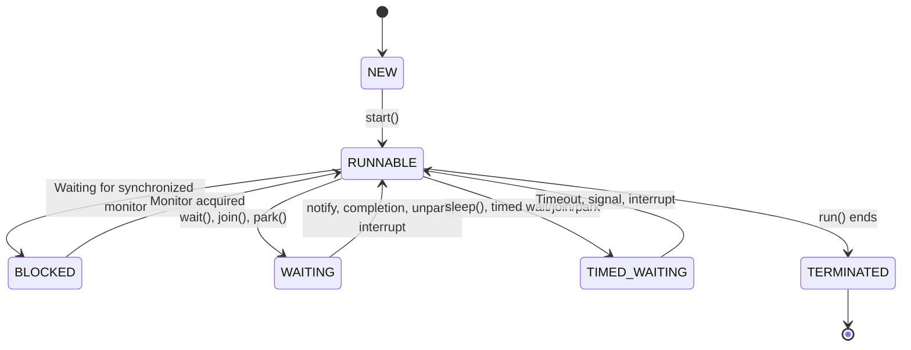

# Thread Lifecycle and the Java Memory Model

## 1. Definition

A Java thread moves through six states defined by `Thread.State`:

```text
NEW
RUNNABLE
BLOCKED
WAITING
TIMED_WAITING
TERMINATED
```

The **Java Memory Model**, or JMM, defines how threads interact through shared memory, including:

- When one thread’s writes become visible to another
- Which instruction reorderings are permitted
- What synchronization guarantees
- How objects can be safely published between threads

Thread lifecycle and the JMM are related but distinct:

- Thread states describe what a thread is currently doing.
- The JMM describes what shared-memory effects threads are allowed to observe.

---

# Thread Lifecycle

## 2. Java Thread States

| State           | Meaning                                                        |
| --------------- | -------------------------------------------------------------- |
| `NEW`           | Thread object created, but `start()` has not been called       |
| `RUNNABLE`      | Eligible to run or currently executing                         |
| `BLOCKED`       | Waiting to acquire an intrinsic monitor used by `synchronized` |
| `WAITING`       | Waiting indefinitely for another thread or condition           |
| `TIMED_WAITING` | Waiting for a limited period                                   |
| `TERMINATED`    | `run()` completed or ended because of an uncaught exception    |

> Java does not define a separate `RUNNING` state. A thread that is executing and one that is ready but waiting for CPU time are both reported as `RUNNABLE`.

---

## 3. Thread-State Diagram



This is a conceptual diagram. Exact transitions depend on the operation and JVM implementation.

---

## 4. `NEW`

A thread is `NEW` after construction and before `start()`.

```java
Thread worker = new Thread(
        () -> System.out.println("Working")
);

System.out.println(worker.getState()); // NEW
```

Calling `run()` directly does not start a new thread:

```java
worker.run();
```

It executes `run()` on the current thread like an ordinary method.

To create concurrent execution:

```java
worker.start();
```

A thread can be started only once. Calling `start()` again throws `IllegalThreadStateException`.

---

## 5. `RUNNABLE`

A thread is `RUNNABLE` when it is:

- Currently executing on a CPU
- Ready to execute but waiting for CPU scheduling
- Performing certain native operations

```java
Thread worker = new Thread(() -> {
    while (!Thread.currentThread().isInterrupted()) {
        performWork();
    }
});
```

`RUNNABLE` does not necessarily mean the thread is consuming CPU continuously.

For example, a thread dump may show some native socket operations as `RUNNABLE`, even though the thread is waiting at the operating-system level.

Therefore:

> Thread state alone is not enough. Always inspect the stack trace.

---

## 6. `BLOCKED`

A thread enters `BLOCKED` when it is waiting to acquire an intrinsic monitor held by another thread.

```java
private final Object lock = new Object();

public void update() {
    synchronized (lock) {
        performUpdate();
    }
}
```

If Thread A owns `lock`, Thread B attempting to enter the same block becomes `BLOCKED`.

### Important distinction

`BLOCKED` specifically means waiting for a monitor associated with `synchronized`.

A thread waiting for `ReentrantLock` commonly appears as:

- `WAITING`
- `TIMED_WAITING`

because explicit locks are generally implemented using parking mechanisms.

### Production interpretation

Many threads in `BLOCKED` on the same monitor may indicate:

- A large critical section
- Slow work while holding a lock
- One global lock protecting unrelated state
- Lock contention
- A deadlock

It does not automatically prove deadlock.

---

## 7. `WAITING`

A thread is `WAITING` when it waits indefinitely for another thread or coordination event.

Typical causes include:

```java
object.wait();
```

```java
thread.join();
```

```java
LockSupport.park();
```

It may also appear while waiting on:

- A condition
- A latch
- A barrier
- A blocking queue
- A future
- An idle executor work queue

Example:

```java
CountDownLatch ready = new CountDownLatch(1);

ready.await();
```

The thread remains waiting until another thread performs:

```java
ready.countDown();
```

### Production interpretation

Many `WAITING` threads are not necessarily a problem.

For example, idle executor workers may normally wait for tasks.

You must inspect:

- What they are waiting for
- How long they have been waiting
- Whether the wait is expected
- Whether work is accumulating elsewhere

---

## 8. `TIMED_WAITING`

A thread enters `TIMED_WAITING` when it waits for a maximum duration.

Examples:

```java
Thread.sleep(1_000);
```

```java
object.wait(1_000);
```

```java
thread.join(1_000);
```

```java
lock.tryLock(
        1,
        TimeUnit.SECONDS
);
```

```java
future.get(
        1,
        TimeUnit.SECONDS
);
```

A large number of threads in `TIMED_WAITING` may indicate:

- Backoff or retry logic
- Scheduled tasks
- Sleeping worker loops
- Remote-call timeouts
- Lock acquisition with timeout
- Normal periodic execution

Again, the stack trace determines whether this state is healthy.

---

## 9. `TERMINATED`

A thread becomes `TERMINATED` when its `run()` method finishes.

```java
Thread worker = new Thread(
        () -> System.out.println("Done")
);

worker.start();
worker.join();

System.out.println(
        worker.getState()
); // TERMINATED
```

A thread also terminates when an uncaught exception escapes `run()`.

```java
Thread worker = new Thread(() -> {
    throw new IllegalStateException("Failure");
});
```

The thread cannot be restarted after termination.

---

# Java Memory Model

## 10. Why Does the JMM Exist?

Modern systems optimize execution through:

- CPU registers
- CPU caches
- Out-of-order execution
- Compiler optimizations
- JIT compilation
- Runtime instruction reordering

Without defined memory rules, concurrent code would not have a portable interpretation across processors and JVM implementations.

The JMM defines observable behavior rather than requiring one specific hardware implementation.

Avoid treating the JMM as a literal model where:

```text
Every thread has a physical private copy of all variables
and synchronization copies everything to main memory
```

That explanation can be useful as a beginner analogy, but it is not an accurate description of all JVM and processor implementations.

---

## 11. Visibility Problem

Consider a shared stop flag:

```java
public final class Worker {

    private boolean running = true;

    public void stop() {
        running = false;
    }

    public void run() {
        while (running) {
            performWork();
        }
    }

    private void performWork() {
    }
}
```

One thread invokes `run()`, while another invokes `stop()`.

Because there is no synchronization relationship, the worker is not guaranteed to observe the update correctly.

The compiler or runtime may optimize repeated reads, and the program contains a data race.

---

## 12. Fix with `volatile`

```java
public final class Worker {

    private volatile boolean running = true;

    public void stop() {
        running = false;
    }

    public void run() {
        while (running) {
            performWork();
        }
    }

    private void performWork() {
    }
}
```

A write to a volatile variable happens-before a subsequent read of that same variable.

When the worker reads `false`, it also receives the visibility guarantees associated with that volatile write.

---

# Happens-Before

## 13. What Does Happens-Before Mean?

A happens-before relationship is a formal JMM ordering guarantee.

If action A happens-before action B:

1. A is ordered before B under the memory model.
2. The effects of A are visible to B.

It does not necessarily mean A occurred immediately before B according to wall-clock time.

---

## 14. Program-Order Rule

Within one thread, an earlier action happens-before later actions according to program order.

```java
value = 42;
ready = true;
```

Within that thread, the write to `value` happens-before the write to `ready`.

Program order by itself does not establish cross-thread visibility. A synchronization mechanism must connect the threads.

---

## 15. Monitor Rule

Releasing a monitor happens-before a later successful acquisition of the same monitor.

Writer:

```java
synchronized (lock) {
    sharedValue = 42;
}
```

Reader:

```java
synchronized (lock) {
    System.out.println(sharedValue);
}
```

The reader that later acquires the same monitor can observe the protected update.

Both threads must participate in the same locking protocol.

---

## 16. Volatile Rule

A write to a volatile variable happens-before a later read of that same variable.

```java
private int configurationVersion;
private volatile boolean ready;
```

Publisher:

```java
configurationVersion = 10;
ready = true;
```

Reader:

```java
if (ready) {
    System.out.println(configurationVersion);
}
```

When the reader observes `ready == true`, the preceding write to `configurationVersion` is also visible.

```text
Write configurationVersion
        ↓
Write volatile ready
        ↓ happens-before
Read volatile ready
        ↓
Read configurationVersion
```

---

## 17. Thread-Start Rule

Actions performed before `Thread.start()` happen-before actions in the started thread.

```java
List<String> values = new ArrayList<>();

values.add("published before start");

Thread worker = new Thread(() ->
        System.out.println(values)
);

worker.start();
```

The state prepared before `start()` is safely published to the new thread.

This does not mean later unsynchronized modifications to `values` are safe.

---

## 18. Thread-Join Rule

All actions performed by a thread happen-before another thread successfully detects its termination, such as through `join()`.

```java
private static int result;

public static void main(String[] args)
        throws InterruptedException {

    Thread worker = new Thread(() ->
            result = 42
    );

    worker.start();
    worker.join();

    System.out.println(result);
}
```

After `join()` returns, the main thread can observe the worker’s preceding actions.

---

## 19. Executor and `Future` Guarantees

Task submission also establishes memory-consistency guarantees.

```java
List<String> values = new ArrayList<>();
values.add("prepared");

Future<Integer> future =
        executor.submit(values::size);

int result = future.get();
```

Conceptually:

```text
Actions before task submission
        ↓ happens-before
Task execution
        ↓ happens-before
Successful result retrieval
```

This makes executors more than thread-management utilities; they also provide defined safe-handoff behavior.

---

## 20. Synchronizer Guarantees

High-level concurrency utilities also establish happens-before relationships.

Examples include:

- Actions before `CountDownLatch.countDown()` become visible after a corresponding successful `await()`.
- Adding an element to a concurrent queue establishes appropriate visibility when another thread removes it.
- Lock release happens-before a later acquisition.
- Actions before task submission become visible to the task.

This is one reason to prefer high-level utilities over custom polling loops.

---

# `volatile`, Synchronization, and Atomics

## 21. Comparison

| Mechanism       |                           Visibility | Atomic compound operations | Mutual exclusion |            Can block? |
| --------------- | -----------------------------------: | -------------------------: | ---------------: | --------------------: |
| Plain variable  | Not safely guaranteed across threads |                         No |               No |                    No |
| `volatile`      |                                  Yes |                         No |               No |                    No |
| Atomic class    |                                  Yes |   Supported atomic methods |  No monitor lock | Normally non-blocking |
| `synchronized`  |                                  Yes |    Entire critical section |              Yes |                   Yes |
| `ReentrantLock` |                                  Yes |    Entire critical section |              Yes |                   Yes |

### Important corrections

`volatile` is not “visibility only.” It also provides ordering guarantees.

`synchronized` should not automatically be called “the most expensive.” Its cost depends on:

- Contention
- Critical-section duration
- JVM optimizations
- Alternative implementation
- Required correctness

Atomic operations are also not automatically faster. Heavy CAS contention can produce repeated retries and wasted CPU.

---

## 22. Why `volatile` Does Not Fix `count++`

```java
private volatile int count;

public void increment() {
    count++;
}
```

`count++` performs:

```text
Read
→ calculate
→ write
```

The volatile reads and writes are visible, but the complete sequence is not atomic.

Two threads can still lose an update.

Use an atomic variable:

```java
private final AtomicInteger count =
        new AtomicInteger();

public void increment() {
    count.incrementAndGet();
}
```

Or synchronization:

```java
private int count;

public synchronized void increment() {
    count++;
}
```

---

## 23. Atomics Are Best for Independent State

```java
private final AtomicInteger activeRequests =
        new AtomicInteger();
```

This is suitable when one value can be updated independently.

When several fields form one invariant, one lock may be clearer:

```java
private final Object lock = new Object();

private int balance;
private int version;

public void withdraw(int amount) {
    synchronized (lock) {
        if (balance < amount) {
            throw new IllegalStateException(
                    "Insufficient balance"
            );
        }

        balance -= amount;
        version++;
    }
}
```

Two separate atomic variables would not automatically make that combined transition atomic.

---

# Production Use Cases

## 24. Shutdown Signal

```java
private volatile boolean shuttingDown;

public void requestShutdown() {
    shuttingDown = true;
}
```

This works when each volatile read or write represents the complete state transition.

For interruptible blocking tasks, interruption is often more appropriate:

```java
workerThread.interrupt();
```

---

## 25. Immutable Configuration Snapshot

```java
public record ApplicationConfig(
        int timeoutSeconds,
        int retryCount,
        boolean featureEnabled
) {
}
```

Publish a complete snapshot through one volatile reference:

```java
private volatile ApplicationConfig configuration;
```

Update:

```java
configuration =
        new ApplicationConfig(
                10,
                3,
                true
        );
```

Readers observe either the old complete snapshot or the new complete snapshot.

This is often safer than independently updating several volatile fields.

---

## 26. Spring Singleton Bean State

Spring service beans are commonly singleton-scoped. Mutable fields can therefore be shared by concurrent request threads.

Unsafe:

```java
@Service
public class PricingService {

    private BigDecimal currentDiscount;

    public Price calculate(Order order) {
        currentDiscount = loadDiscount(order);

        return apply(
                order,
                currentDiscount
        );
    }
}
```

Two requests can overwrite the same field.

Prefer local state:

```java
@Service
public class PricingService {

    public Price calculate(Order order) {
        BigDecimal discount =
                loadDiscount(order);

        return apply(order, discount);
    }
}
```

Stateless services are easier to use safely.

---

# Thread States in Production Debugging

## 27. Capture Thread Dumps

Useful commands include:

```bash
jcmd <pid> Thread.print -l
```

and:

```bash
jstack -l <pid>
```

Capture several dumps a few seconds apart.

One dump shows a snapshot. Repeated dumps reveal whether:

- Threads remain stuck
- Stack traces change
- Work is progressing slowly
- The same monitor remains contended
- Queue waits are accumulating

---

## 28. Interpret States Carefully

| Observed state                                 | Possible interpretation                                          |
| ---------------------------------------------- | ---------------------------------------------------------------- |
| Many `RUNNABLE` threads consuming CPU          | CPU saturation, busy loop, expensive computation                 |
| Many `RUNNABLE` threads in socket/native calls | I/O waiting may be represented as runnable                       |
| Many `BLOCKED` threads on one monitor          | Intrinsic-lock contention                                        |
| Many `WAITING` executor workers                | May simply be idle workers                                       |
| Many `WAITING` threads on futures              | Possible dependency bottleneck or starvation                     |
| Many `TIMED_WAITING` threads in sleep          | Retry, backoff, polling, or scheduled work                       |
| Growing executor queue                         | Arrival rate exceeds completion rate                             |
| Low CPU with increasing latency                | Blocking downstream resource, locks, queues, or connection pools |

Thread state is evidence, not a diagnosis by itself.

---

## 29. `BLOCKED` Does Not Automatically Mean Deadlock

Example:

```text
100 request threads are BLOCKED
on one application monitor
```

Possible explanations include:

- A valid but heavily contended lock
- A slow operation inside the synchronized block
- One thread temporarily holding the monitor
- A genuine deadlock

For deadlock, look for a circular dependency.

```text
Thread A owns Lock 1 and waits for Lock 2
Thread B owns Lock 2 and waits for Lock 1
```

---

## 30. `WAITING` Does Not Automatically Mean a Problem

Thread-pool workers may wait normally:

```text
WAITING on BlockingQueue.take()
```

That may simply mean no work is available.

By contrast:

```text
All workers WAITING on Future.join()
Queued dependent tasks cannot start
```

may indicate thread-pool starvation deadlock.

Inspect both:

- Thread stacks
- Executor queue metrics

---

## 31. Useful Production Metrics

Monitor:

- Thread count
- Peak thread count
- Executor active workers
- Executor queue depth
- Task queue-wait time
- Task execution time
- Rejected tasks
- Monitor contention
- Database connection wait
- HTTP connection-pool wait
- Kafka consumer lag
- Timeout and retry counts

Task latency should be separated into:

```text
Total task latency
=
queue-wait time
+
execution time
```

A task may execute quickly after waiting several seconds in a saturated queue.

---

# Refined Multithreading Lessons

## 32. Prefer Managed Task Execution

Instead of creating one platform thread for every short task:

```java
new Thread(task).start();
```

prefer a managed executor:

```java
executor.submit(task);
```

However, “never create raw threads” is too absolute.

A dedicated thread can still be appropriate for a specialized, long-lived component. For ordinary application tasks, executors usually provide better:

- Lifecycle management
- Naming
- Queuing
- Cancellation
- Resource control
- Observability

---

## 33. `CompletableFuture` Is Not Always Better Than `Future`

`CompletableFuture` is better when composition is required:

```java
loadUserAsync()
        .thenCompose(this::loadOrdersAsync)
        .thenApply(this::createSummary);
```

A plain `Future` can remain suitable when the requirement is simply:

```text
Submit one task
→ wait with timeout
→ obtain result
```

Choose based on the workflow rather than treating one API as universally superior.

---

## 34. Concurrent Utilities Are Not Automatically Lock-Free

Examples:

- `AtomicInteger` commonly uses CAS.
- `ConcurrentHashMap` combines CAS and localized synchronization.
- `ArrayBlockingQueue` uses locks and conditions.
- `CopyOnWriteArrayList` coordinates writes while copying its array.
- `ReentrantLock` is explicitly lock-based.

The correct question is not:

> Is this class lock-free?

It is:

> Does this utility’s contract match my concurrency requirement?

---

## 35. Deadlocks Require Discipline, Not Optimistic Percentages

Consistent lock ordering and timed lock acquisition are valuable, but no credible universal percentage can describe how many deadlocks they prevent.

Deadlock prevention also requires:

- Avoiding nested locks
- Keeping critical sections short
- Avoiding external calls while locked
- Reviewing callbacks
- Monitoring lock waits
- Testing failure and timeout paths

---

## 36. Virtual Threads Change Thread Cost, Not System Capacity

Virtual threads make thread-per-task blocking code practical for much higher concurrency.

They are useful for:

- Blocking HTTP calls
- JDBC operations
- File I/O
- Request-per-thread workflows

They do not increase:

- CPU cores
- Database connections
- Remote-service limits
- Memory capacity
- Rate limits

A large virtual-thread count can still overload downstream systems.

Use explicit limits such as:

```java
Semaphore databasePermits =
        new Semaphore(20);
```

---

# Common Mistakes

## 37. Assuming a Plain Flag Will Eventually Be Visible

```java
private boolean running = true;
```

There is no safe cross-thread visibility guarantee without proper synchronization.

Use:

```java
private volatile boolean running = true;
```

or interruption, locking, or another coordination mechanism.

---

## 38. Treating `volatile` as Mutual Exclusion

```java
private volatile int count;

count++;
```

Still unsafe.

---

## 39. Assuming `sleep()` Creates Visibility

```java
Thread.sleep(1_000);
```

Sleeping does not create an arbitrary happens-before relationship between threads.

A program that appears correct only because one thread sleeps is not correctly synchronized.

---

## 40. Reading and Writing Under Different Protocols

Writer:

```java
synchronized (lock) {
    value = 42;
}
```

Reader:

```java
System.out.println(value);
```

The reader does not participate in the same synchronization protocol.

Use the same lock, a volatile field, an atomic reference, or another safe-publication mechanism.

---

## 41. Holding Locks During Slow Work

```java
synchronized (lock) {
    databaseClient.call();
}
```

This can cause:

- Long lock waits
- Request serialization
- Thread-pool queue growth
- Cascading timeouts

Move slow work outside the critical section only when doing so preserves correctness.

---

## 42. Depending on Thread Priority

Thread priority is platform-dependent and should not be used as a correctness mechanism.

```java
thread.setPriority(Thread.MAX_PRIORITY);
```

It does not guarantee:

- Immediate execution
- Fair scheduling
- Starvation prevention
- Ordering

---

# Trade-Offs

| Mechanism             | Best suited for                       | Main limitation                              |
| --------------------- | ------------------------------------- | -------------------------------------------- |
| `volatile`            | Flags and safely published references | No compound atomicity                        |
| `synchronized`        | Structured critical sections          | Serializes contenders                        |
| `ReentrantLock`       | Timed or interruptible locking        | Manual unlock required                       |
| Atomic classes        | Independent state transitions         | Difficult multi-field invariants             |
| Immutable snapshot    | Read-heavy configuration state        | Updates create new objects                   |
| Concurrent collection | Shared data structures                | Compound workflows still require atomic APIs |
| Thread confinement    | Mutable state owned by one thread     | Ownership must be maintained                 |
| Message passing       | Reducing shared mutation              | Queueing and lifecycle complexity            |

---

# Interview Questions

## Question 1: What are the Java thread states?

> Java defines `NEW`, `RUNNABLE`, `BLOCKED`, `WAITING`, `TIMED_WAITING`, and `TERMINATED`. There is no separate `RUNNING` state; executing and ready-to-run threads are both represented as `RUNNABLE`.

## Question 2: What causes a thread to become `BLOCKED`?

> A thread becomes `BLOCKED` when it tries to acquire an intrinsic monitor used by `synchronized` and another thread currently owns that monitor.

## Question 3: What is the difference between `BLOCKED` and `WAITING`?

> `BLOCKED` specifically means waiting to enter a synchronized monitor. `WAITING` means waiting indefinitely for another event, such as notification, thread completion, a condition, a latch, or parked synchronization.

## Question 4: What is happens-before?

> Happens-before is the JMM relationship that guarantees ordering and visibility. If A happens-before B, then A’s effects are visible to B and are ordered before it.

## Question 5: Why is `volatile` insufficient for a counter?

> It makes reads and writes visible and ordered but does not make the read-modify-write sequence in `count++` atomic. Use an atomic variable or a lock.

## Question 6: Does `RUNNABLE` mean the thread is consuming CPU?

> Not necessarily. It may be running, ready for CPU scheduling, or inside certain native operations. The stack trace and CPU measurements are needed for diagnosis.

## Question 7: How does `Thread.start()` affect visibility?

> Actions before `start()` happen-before actions in the started thread, safely publishing the preceding state to it.

## Question 8: How does `Thread.join()` affect visibility?

> All actions performed by the worker happen-before another thread successfully returns from `join()` on that worker.

## Question 9: Is `synchronized` always slower than atomics?

> No. Performance depends on contention and workload. Atomics can suffer repeated CAS retries, while an uncontended or well-scoped synchronized block may be inexpensive and easier to verify.

## Question 10: How do you debug thread-state problems?

> I capture several thread dumps, group similar stack traces, identify locks or resources being awaited, and correlate them with executor, connection-pool, queue, and latency metrics. Thread state alone is not enough.

---

# Two-Minute Interview Cheat Sheet

```text
Java thread states:
NEW
RUNNABLE
BLOCKED
WAITING
TIMED_WAITING
TERMINATED

No RUNNING state.

BLOCKED:
Waiting for synchronized monitor.

WAITING:
Indefinite coordination wait.

TIMED_WAITING:
Sleep or wait with timeout.

Happens-before sources:
- Program order
- Monitor unlock → later lock
- Volatile write → later volatile read
- Thread.start()
- Thread.join()
- Executor submission and Future completion
- Concurrent synchronizers

volatile:
Visibility + ordering
Not compound atomicity

count++:
Read + modify + write
Not thread-safe

Production debugging:
Repeated thread dumps
+ stack traces
+ queue metrics
+ lock metrics
+ downstream pool metrics
```

# Short Interview Answer

> Java defines six thread states: `NEW`, `RUNNABLE`, `BLOCKED`, `WAITING`, `TIMED_WAITING`, and `TERMINATED`. The JMM defines when shared-memory effects become visible across threads. Visibility is established through happens-before relationships such as monitor unlock-to-lock, volatile write-to-read, thread start, thread join, task submission, and future completion. `volatile` provides visibility and ordering but not mutual exclusion, so compound operations such as `count++` require an atomic class or locking.

## Related Topics

- [Race Conditions](race-conditions.md)
- [ExecutorService](executor-service.md)
- [Synchronization](synchronization.md)
- [Volatile](volatile.md)
- [Java Memory Model](java-memory-model.md)
- [Thread Debugging](thread-debugging.md)
