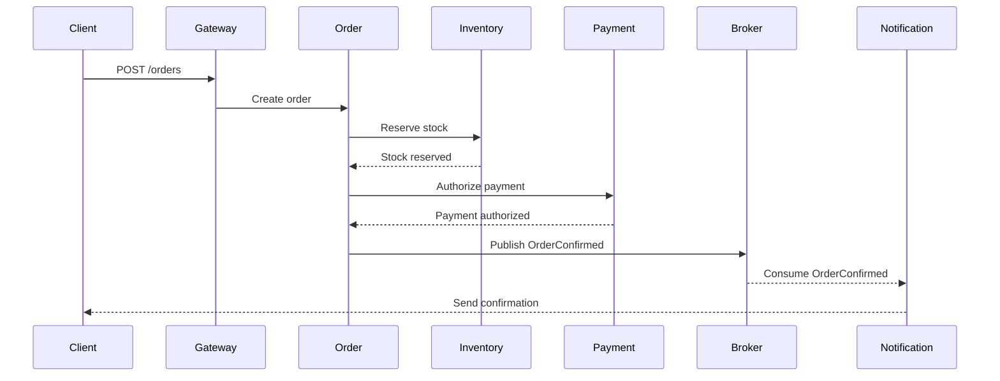
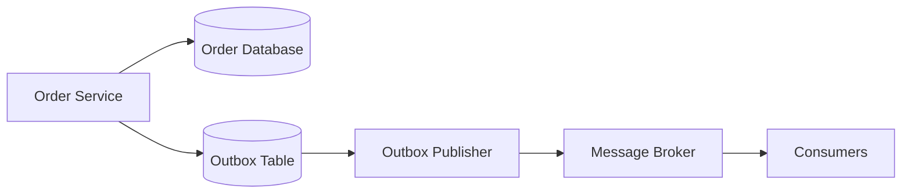

# Microservices Architecture

## 1. Overview

**Microservices architecture** structures an application as a collection of independently deployable services. Each service owns a focused business capability and communicates with other services through well-defined APIs or messages.

```text
Monolith
└── One deployable application
    ├── Order management
    ├── Inventory
    ├── Payments
    └── Notifications

Microservices
├── Order Service
├── Inventory Service
├── Payment Service
└── Notification Service
```

A microservice is not simply a small class, module, or REST controller. It is normally an independently deployable application with its own:

- Business responsibility
- Runtime process
- API or event contract
- Deployment lifecycle
- Operational monitoring
- Data ownership boundary

Services may use different technologies when justified, but excessive technology diversity can increase operational complexity.

---

# 2. Core Characteristics

## Independent deployment

A service can be built, tested, deployed, and rolled back without redeploying the entire application.

## Business capability alignment

Services are normally divided around business capabilities rather than technical layers.

Better:

```text
Order Service
Payment Service
Inventory Service
Customer Service
```

Less useful:

```text
Controller Service
Business Logic Service
Database Service
```

## Loose coupling

Services communicate through contracts rather than directly accessing each other’s internal classes or database tables.

## High cohesion

All logic belonging to one business capability should remain together.

## Decentralized data ownership

Each service normally owns its data.

```text
Order Service      → Order Database
Payment Service    → Payment Database
Inventory Service  → Inventory Database
```

Other services should access that data through APIs or events rather than directly updating another service’s tables.

## Failure isolation

A failure in one service should not automatically bring down the entire platform.

This requires:

- Timeouts
- Circuit breakers
- Bulkheads
- Bounded queues
- Backpressure
- Graceful degradation

---

# 3. Monolith vs Microservices

| Monolith                                      | Microservices                                     |
| --------------------------------------------- | ------------------------------------------------- |
| One deployable application                    | Multiple independently deployable services        |
| Simple local method calls                     | Network communication                             |
| One transaction can cover many modules        | Transactions are normally local to one service    |
| Easier initial development                    | Greater operational complexity                    |
| Centralized deployment                        | Independent deployment                            |
| Shared database is common                     | Database per service is preferred                 |
| Easier debugging                              | Requires distributed tracing and centralized logs |
| Scaling usually affects the whole application | Services can scale independently                  |
| Strong consistency is easier                  | Eventual consistency is common                    |

Microservices are not automatically better. They exchange development simplicity for deployment flexibility, independent scaling, and organizational autonomy.

---

# 4. Core Components of a Microservices Architecture

Not every system requires every component, but common infrastructure includes:

1. API Gateway
2. Service Registry and Service Discovery
3. Load Balancing
4. Centralized Configuration
5. Resilience Components
6. Messaging Infrastructure
7. Observability
8. Container or Runtime Orchestration
9. Workflow Coordination
10. Security and Identity Management

---

# 5. API Gateway

An API Gateway provides a controlled entry point for clients.

```text
Web application
Mobile application
Partner system
        ↓
     API Gateway
        ├── Order Service
        ├── Payment Service
        └── Inventory Service
```

Common responsibilities include:

- Request routing
- Authentication
- Coarse-grained authorization
- Rate limiting
- TLS termination
- Request and response transformation
- Correlation ID creation
- Logging
- Load balancing
- Circuit-breaker integration

## Important limitation

The gateway should not be the only authorization layer.

Each service should still validate:

- Token authenticity
- Required permissions
- Tenant boundaries
- Resource ownership
- Business rules

---

# 6. Service Registry and Service Discovery

A **service registry** stores the locations of available service instances.

```text
inventory-service
├── 10.0.1.20:8080
├── 10.0.1.21:8080
└── 10.0.1.22:8080
```

**Service discovery** is the process of finding one of those instances.

The two terms are related but not identical:

```text
Service Registry
→ Stores service-instance information

Service Discovery
→ Uses that information to locate a service
```

Discovery can be implemented through:

- Platform DNS
- Kubernetes Services
- Eureka
- Consul
- Cloud-provider service discovery

---

# 7. Load Balancing

Load balancing distributes requests across available service instances.

```text
Request
   ↓
Load Balancer
   ├── Inventory Instance 1
   ├── Inventory Instance 2
   └── Inventory Instance 3
```

## Server-side load balancing

A gateway or external load balancer selects the instance.

```text
Client
  ↓
Load balancer
  ↓
Service instance
```

## Client-side load balancing

The calling service obtains a list of instances and selects one.

```text
Order Service
  ↓ service discovery
Inventory instances
  ↓
Select one instance
```

A load balancer should avoid unhealthy instances, but discovery information may become stale. Clients still need timeouts and failure handling.

---

# 8. Centralized Configuration

A configuration service stores environment-specific configuration outside the service binaries.

```text
Configuration repository
        ↓
Config Server
        ├── Order Service
        ├── Payment Service
        └── Inventory Service
```

Typical centralized configuration includes:

- Service URLs
- Timeout values
- Feature switches
- Retry settings
- Logging levels
- Operational limits

Secrets such as passwords and private keys should generally be handled through a dedicated secrets-management system rather than stored as plain text in a configuration repository.

---

# 9. Messaging Infrastructure

Services can communicate synchronously or asynchronously.

## Synchronous communication

Examples:

- REST
- gRPC

```text
Order Service
    ↓ waits for response
Inventory Service
```

Advantages:

- Immediate response
- Simple request-response model

Risks:

- Temporal coupling
- Cascading latency
- Cascading failure
- Thread and connection consumption

## Asynchronous communication

Examples:

- Kafka
- RabbitMQ
- Cloud message queues

```text
Order Service
    ↓ publishes event
Message Broker
    ├── Inventory Consumer
    ├── Notification Consumer
    └── Analytics Consumer
```

Advantages:

- Loose temporal coupling
- Buffering during traffic spikes
- Independent consumers
- Improved failure isolation

Risks:

- Duplicate delivery
- Event ordering
- Eventual consistency
- Schema evolution
- More difficult debugging

---

# 10. Observability

Traditional application logs are not enough because one request may cross several services.

A microservices system normally needs:

## Centralized logging

Logs from every service are stored and searched centrally.

## Metrics

Examples:

- Request rate
- Error rate
- Latency
- CPU and memory
- Queue depth
- Consumer lag
- Circuit-breaker state
- Connection-pool usage

## Distributed tracing

Tracing follows one operation across multiple services.

```text
Trace ID: abc-123

API Gateway
└── Order Service
    ├── Database query
    ├── Inventory Service
    └── Payment Service
```

## Correlation IDs

Every log entry related to one request should contain a common identifier.

---

# 11. What Does “Microservices Orchestration” Mean?

The word **orchestration** is often used for several different concerns. They should be distinguished.

## 11.1 Infrastructure orchestration

Infrastructure orchestration manages the deployment and runtime of services.

Typical responsibilities include:

- Scheduling containers
- Restarting failed instances
- Scaling replicas
- Service networking
- Health checks
- Rolling updates
- Resource allocation
- Secret and configuration injection

Example platform:

```text
Kubernetes
├── Schedules containers
├── Restarts failed pods
├── Scales replicas
├── Performs rolling deployments
└── Provides service discovery
```

Infrastructure orchestration does not normally decide the business order in which payment, inventory, and shipping operations execute.

---

## 11.2 Business workflow orchestration

Business orchestration coordinates a multi-step business process.

Example:

```text
Create Order
    ↓
Reserve Inventory
    ↓
Authorize Payment
    ↓
Create Shipment
    ↓
Confirm Order
```

An orchestrator decides:

- Which step runs next
- How failures are retried
- Which compensation is executed
- How workflow state is persisted
- How timeouts are handled

Common implementation options include:

- A dedicated orchestration service
- Workflow engines
- Saga orchestrators
- Durable workflow platforms

---

## 11.3 Data and machine-learning orchestration

Data orchestration coordinates pipelines such as:

```text
Extract data
    ↓
Clean data
    ↓
Transform data
    ↓
Train model
    ↓
Evaluate model
    ↓
Deploy model
```

Typical responsibilities include:

- Task dependencies
- Scheduling
- Retries
- Data lineage
- Resource allocation
- Pipeline monitoring

This is related to microservices but is not the same as ordinary request-driven service orchestration.

---

# 12. Orchestration vs Choreography

These are two approaches for coordinating distributed workflows.

## Orchestration

A central coordinator tells participants what to do.

```text
Order Orchestrator
├── Tell Inventory Service to reserve
├── Tell Payment Service to authorize
└── Tell Shipping Service to create shipment
```

### Advantages

- Workflow is visible in one place.
- Execution order is clear.
- Compensation is easier to coordinate.
- Debugging is often simpler.

### Disadvantages

- Orchestrator can become highly coupled.
- It may become a central bottleneck.
- Too much business logic can accumulate in it.

---

## Choreography

Services react to events without one central workflow controller.

```text
OrderCreated
    ↓
Inventory Service reserves stock
    ↓ publishes InventoryReserved
Payment Service authorizes payment
    ↓ publishes PaymentAuthorized
Shipping Service creates shipment
```

### Advantages

- Loose coupling
- Natural event-driven design
- No central coordinator
- Services can evolve independently

### Disadvantages

- Workflow becomes distributed across services.
- Debugging is harder.
- Cyclic event dependencies may develop.
- Error and compensation paths can become unclear.

## Decision guideline

Use orchestration when:

- The workflow is complex.
- Steps have strict ordering.
- Compensation must be coordinated.
- Business visibility is important.

Use choreography when:

- Reactions are independent.
- The event flow is simple.
- Services do not require central coordination.
- Loose coupling is more important than centralized visibility.

---

# 13. Example: E-Commerce Order Workflow



Possible failures include:

- Inventory unavailable
- Payment timeout
- Duplicate request
- Broker unavailable
- Notification failure
- Service crash after database commit

These failures require distributed-system patterns rather than only local exception handling.

---

# 14. Idempotency

## Definition

An operation is idempotent when repeating it has the same intended effect as executing it once.

```text
Same request once
=
Same request multiple times
```

A response does not have to be identical for the operation to be idempotent. The important point is that the intended server-side effect is not duplicated.

## Example problem

A client sends a payment request but times out before receiving the response.

```text
Client sends payment
    ↓
Payment succeeds
    ↓
Response is lost
    ↓
Client retries
    ↓
Payment may be charged twice
```

## Idempotency key

```http
POST /payments
Idempotency-Key: payment-request-92736
```

Server-side approach:

```text
Receive idempotency key
        ↓
Already processed?
├── Yes → return stored result
└── No  → process request and store result
```

Example model:

```java
@Entity
@Table(
    name = "idempotency_record",
    uniqueConstraints = @UniqueConstraint(
        columnNames = "idempotency_key"
    )
)
public class IdempotencyRecord {

    @Id
    private Long id;

    private String idempotencyKey;

    private String operationStatus;

    private String responseReference;
}
```

The database uniqueness constraint protects against concurrent requests using the same key.

## Common uses

- Payments
- Order creation
- Reservation requests
- Message consumers
- Retryable API operations
- Webhook processing

---

# 15. Saga Pattern

## Definition

A Saga divides one distributed business transaction into multiple local transactions.

Each step commits independently. If a later step fails, compensating actions undo or offset earlier business effects.

```text
Step 1: Create order
Step 2: Reserve inventory
Step 3: Authorize payment
Step 4: Create shipment
```

Failure:

```text
Payment authorization fails
        ↓
Release inventory
        ↓
Cancel order
```

## Important nuance

A compensation is not always a perfect technical rollback.

For example:

```text
Payment charge
→ Refund payment
```

The refund is a new business transaction. It does not erase the historical fact that the original charge occurred.

## Saga approaches

### Orchestrated Saga

A coordinator tells participants which operation to perform.

### Choreographed Saga

Each service responds to events and emits the next event.

## Production concerns

- Idempotent steps
- Idempotent compensation
- Durable workflow state
- Timeout handling
- Duplicate events
- Retries
- Manual recovery
- Reconciliation

---

# 16. Circuit Breaker

## Definition

A circuit breaker prevents repeated calls to an unhealthy dependency.

```text
CLOSED
→ Requests are allowed.

OPEN
→ Requests fail fast.

HALF_OPEN
→ Limited trial requests are allowed.
```

## Example

```java
@CircuitBreaker(
    name = "inventoryService",
    fallbackMethod = "inventoryFallback"
)
public InventoryResponse getInventory(String productId) {
    return inventoryClient.getInventory(productId);
}

private InventoryResponse inventoryFallback(
        String productId,
        Exception exception
) {
    return InventoryResponse.unavailable(productId);
}
```

## Circuit breaker vs timeout

```text
Timeout
→ Limits one call's duration.

Circuit breaker
→ Stops repeated calls when failure thresholds are exceeded.
```

## Circuit breaker vs retry

```text
Retry
→ Tries the operation again.

Circuit breaker
→ Stops calls temporarily.
```

Retries should be:

- Limited
- Backed off
- Randomized with jitter
- Used only when the operation is safe to retry

---

# 17. Backpressure

## Definition

Backpressure prevents a fast producer from overwhelming a slow consumer.

Without backpressure:

```text
Producer: 10,000 messages/second
Consumer: 1,000 messages/second
        ↓
Queue grows continuously
        ↓
Memory, disk, or latency failure
```

With backpressure:

```text
Downstream becomes slow
        ↓
Upstream slows, buffers within a limit,
rejects, or sheds load
```

## Common strategies

- Bounded queues
- Consumer-controlled demand
- Rate limiting
- Request rejection
- Load shedding
- Batch processing
- Pausing message consumption
- Scaling consumers
- Limiting concurrent requests

## Example with a bounded executor

```java
@Bean
ThreadPoolTaskExecutor taskExecutor() {
    ThreadPoolTaskExecutor executor =
            new ThreadPoolTaskExecutor();

    executor.setCorePoolSize(10);
    executor.setMaxPoolSize(20);
    executor.setQueueCapacity(100);
    executor.setThreadNamePrefix("order-worker-");
    executor.initialize();

    return executor;
}
```

A bounded queue makes overload visible. An unbounded queue may hide overload until memory and latency become critical.

## Backpressure is not unlimited buffering

```text
Buffering
→ Delays overload.

Backpressure
→ Communicates or enforces capacity limits.
```

---

# 18. CAP Theorem

CAP applies to a distributed data system when a network partition occurs.

The three properties are:

## Consistency

Every successful read observes the latest committed write or an error.

This is closer to single-copy or linearizable consistency than the `C` in database ACID.

## Availability

Every request to a non-failing node receives a non-error response, although the response may not contain the newest data.

## Partition tolerance

The system continues operating despite lost or delayed communication between parts of the distributed system.

## Core statement

During a network partition, a distributed system cannot guarantee both strong consistency and availability for every operation.

```text
Network partition occurs
        ↓
Choose for affected operations:

Consistency
or
Availability
```

## CP-style decision

Reject or delay operations that cannot be confirmed consistently.

Example:

```text
Cannot verify current account balance
→ reject withdrawal
```

## AP-style decision

Continue serving requests, accepting that data may temporarily diverge.

Example:

```text
Recommendation service cannot reach one replica
→ serve slightly stale recommendations
```

## Common mistake

CAP does not mean:

```text
Always choose any two out of three.
```

Partition tolerance is usually unavoidable in a distributed system. The practical decision is how each operation behaves during a partition.

Different operations in the same system can make different choices.

---

# 19. Common Microservice Patterns

| Pattern              | Purpose                                                 |
| -------------------- | ------------------------------------------------------- |
| API Gateway          | Provide a controlled client entry point                 |
| Service Discovery    | Locate service instances                                |
| Circuit Breaker      | Stop repeated calls to failing dependencies             |
| Retry                | Reattempt temporary failures                            |
| Timeout              | Bound waiting time                                      |
| Bulkhead             | Isolate resources and failures                          |
| Saga                 | Coordinate distributed business transactions            |
| Transactional Outbox | Reliably publish an event after a local database change |
| Idempotent Consumer  | Prevent duplicate message effects                       |
| CQRS                 | Separate read and write models                          |
| Strangler Fig        | Incrementally replace a legacy application              |
| Database per Service | Give each service ownership of its data                 |
| Backend for Frontend | Provide client-specific backend APIs                    |
| Sidecar              | Run supporting functionality beside the service         |
| Backpressure         | Prevent downstream overload                             |

---

# 20. Transactional Outbox

## Problem

A service must update its database and publish an event.

```java
@Transactional
public void confirmOrder(Order order) {
    orderRepository.save(order);
    kafkaTemplate.send("orders", new OrderConfirmed(order.getId()));
}
```

Possible failure:

```text
Database commit succeeds
        ↓
Application crashes before event publication
        ↓
Other services never receive the event
```

## Outbox solution

Write both changes in one local transaction:

```text
Order table update
+
Outbox event insert
=
One database transaction
```

A separate publisher reads unsent outbox records and sends them to the broker.



Consumers must still be idempotent because the publisher may send the same event more than once.

---

# 21. Advantages of Microservices

- Independent deployment
- Independent scaling
- Better fault isolation
- Team autonomy
- Clear business boundaries
- Smaller deployable units
- Technology flexibility
- Easier gradual modernization
- Ability to optimize services differently

---

# 22. Disadvantages of Microservices

- Network latency
- Partial failures
- Eventual consistency
- Distributed transaction complexity
- Complex deployment
- More infrastructure
- Harder testing
- Harder debugging
- Contract versioning
- Duplicate operational code
- Greater security surface
- More expensive observability
- Requires mature DevOps practices

---

# 23. When Should You Use Microservices?

Microservices may be justified when:

- The system has clear business boundaries.
- Different components require independent scaling.
- Multiple teams need deployment independence.
- Release cycles differ significantly.
- Fault isolation provides real value.
- The organization can operate distributed systems.
- The domain has enough complexity to justify service boundaries.

---

# 24. When Should You Avoid Microservices?

Avoid or delay microservices when:

- The product is small or early stage.
- One small team owns the whole system.
- Domain boundaries are unclear.
- Deployment independence is not needed.
- Operational tooling is immature.
- The team lacks observability and automation.
- Strong multi-module transactions dominate the domain.

A **modular monolith** is often a better starting point:

```text
One deployable application
├── Clear module boundaries
├── Internal APIs
├── Independent domain packages
└── Simple local transactions
```

It can later be decomposed when concrete scaling or organizational needs appear.

---

# 25. Common Mistakes

## Splitting services by database table

```text
Customer Table Service
Address Table Service
Order Table Service
```

Services should normally represent business capabilities, not individual tables.

## Sharing one database freely

When every service directly accesses the same schema:

- Ownership becomes unclear.
- Deployments become coupled.
- Schema changes affect many services.
- Services are not independently evolvable.

## Creating too many tiny services

A service with almost no independent responsibility can produce unnecessary network and deployment overhead.

## Using synchronous calls for every interaction

Long synchronous chains produce cascading latency:

```text
Gateway
→ Service A
→ Service B
→ Service C
→ Service D
```

## Retrying every failure

Retrying an overloaded or permanently failing service can amplify the failure.

## Assuming messaging gives exactly-once business processing

Brokers may redeliver messages. Consumers must be idempotent.

## Treating Kubernetes as a business workflow engine

Kubernetes manages workloads and infrastructure. It does not automatically coordinate order, payment, and inventory business compensations.

## Using microservices without observability

Without centralized logs, metrics, traces, and alerts, production problems become difficult to diagnose.

---

# 26. Interview Questions and Answers

## Q1: What is microservices architecture?

> Microservices architecture decomposes an application into independently deployable services organized around business capabilities. Each service owns its logic and usually its data, and communicates with other services through APIs or asynchronous messages.

## Q2: What are the main challenges?

> The main challenges are network latency, partial failure, data consistency, distributed transactions, service discovery, observability, deployment complexity, security, contract evolution, and testing.

## Q3: How do services communicate?

> Services communicate synchronously through protocols such as REST or gRPC and asynchronously through brokers such as Kafka or RabbitMQ. I use synchronous communication when an immediate answer is required and asynchronous communication when decoupling, buffering, or independent processing is more important.

## Q4: What is service discovery?

> Service discovery allows a service to locate currently available instances of another service. A service registry or platform DNS stores or exposes instance information, and a load balancer selects an instance.

## Q5: What is orchestration?

> The term can refer to infrastructure orchestration, such as deploying and scaling containers, or business workflow orchestration, where a coordinator controls multi-service steps, retries, timeouts, and compensations. These are separate responsibilities.

## Q6: Orchestration vs choreography?

> Orchestration uses a central coordinator to control workflow steps. Choreography lets services react to events without one central controller. Orchestration gives clearer workflow visibility, while choreography provides looser coupling but can become difficult to trace.

## Q7: What is idempotency?

> Idempotency means repeating an operation produces no additional intended business effect. I commonly implement it using an idempotency key, a unique database constraint, and a stored operation result.

## Q8: What is a Saga?

> A Saga coordinates a distributed transaction as a sequence of local transactions. When a later step fails, compensating transactions reverse or offset previously completed business actions.

## Q9: What is a circuit breaker?

> A circuit breaker monitors dependency calls and opens when failure or slow-call thresholds are exceeded. While open, it fails fast instead of repeatedly calling the unhealthy dependency. It later permits trial calls in half-open state.

## Q10: What is backpressure?

> Backpressure protects a slow consumer from a faster producer by limiting demand, bounding queues, slowing producers, rejecting requests, or shedding load instead of allowing an unlimited backlog.

## Q11: Explain CAP theorem.

> CAP states that during a network partition, a distributed system cannot guarantee both strong consistency and availability for every operation. The system must decide whether an affected operation waits or fails to preserve consistency, or continues using potentially stale or divergent data.

## Q12: How do you handle distributed transactions?

> I use local database transactions inside each service and coordinate cross-service workflows using Saga, transactional outbox, idempotent consumers, compensating actions, retries, and reconciliation. I do not expect a normal Spring `@Transactional` annotation to cover multiple independent services.

## Q13: Why use a transactional outbox?

> It solves the dual-write problem between a database and a message broker. The business update and outbox record are committed together, and a separate publisher delivers the event. Consumers remain idempotent because duplicate publication can still occur.

## Q14: When would you choose a modular monolith?

> I choose a modular monolith when the product is early, the team is small, service boundaries are uncertain, and independent deployment or scaling is not yet required. It preserves clear domain boundaries without introducing distributed-system complexity prematurely.

---

# Short Interview Answer

> Microservices architecture divides a system into independently deployable services aligned with business capabilities. Each service normally owns its data and communicates through APIs or events. The architecture provides independent deployment, scaling, and fault isolation, but introduces network failures, eventual consistency, distributed transaction complexity, and observability requirements. I use timeouts, circuit breakers, bulkheads, backpressure, idempotency, Saga, and transactional outbox patterns to manage these challenges. I also distinguish infrastructure orchestration, such as Kubernetes managing containers, from business workflow orchestration, where a coordinator manages cross-service steps and compensations.
